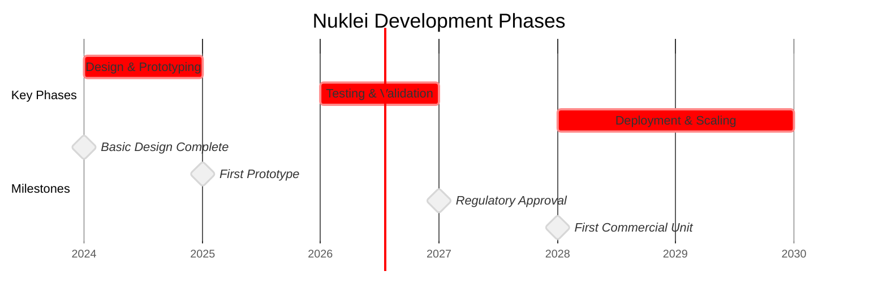

# Strategic Vision & Objectives

This directory contains detailed documentation on Nuklei's strategic vision, objectives, and implementation strategies for transforming the nuclear energy sector through open-source collaboration and advanced technologies.

## Core Documents

1. [Vision Statement](vision.md) - Our long-term aspirations and guiding principles
2. [Strategic Objectives](objectives.md) - Detailed breakdown of our 5-year goals and KPIs
3. [Technology Roadmap](technology-roadmap.md) - Technical pathways and innovation priorities
4. [Implementation Strategy](implementation.md) - Execution framework and governance
5. [Performance Metrics](metrics.md) - Measurement and evaluation framework

## Visual Overviews

### System Architecture

```mermaid
%%{init: {'theme': 'base', 'themeVariables': { 'primaryColor': '#f0f0f0'}}}%%
graph TD
    A[Reactor Core] -->|Heat| B[Primary HX]
    B -->|Heat| C[sCO₂ Power Cycle]
    C -->|Electricity| D[Grid]
    A -->|Decay Heat| E[Passive Cooling]
    G[Digital Twin] <-->|Data| H[I&C Systems]
    H <-->|Control| A
    I[Cybersecurity] --- H
    I --- G
    K[Operator] <-->|HMI| H
```

### Development Timeline

## Presentation

View our [Strategic Vision Presentation](presentation.md) for an executive overview of our roadmap and objectives.

## How to Use These Documents

- **For New Team Members**: Start with the [Vision Statement](vision.md) to understand our core mission
- **For Technical Contributors**: Review the [Technology Roadmap](technology-roadmap.md) for detailed technical directions
- **For Project Managers**: See [Implementation Strategy](implementation.md) for execution frameworks
- **For Stakeholders**: Check [Performance Metrics](metrics.md) for measurable outcomes

## Contributing

To contribute to the strategic direction of Nuklei:

1. Open an issue to discuss proposed changes
2. Submit a pull request with your modifications
3. Participate in our quarterly strategy reviews

## Related Documents

- [Main Project Roadmap](../nuklei_roadmap.md)
- [Technical Architecture](../technical-architecture/README.md)
- [Regulatory Compliance](../compliance/README.md)

## Diagram Source Files

- [System Architecture](./diagrams/system-architecture.mmd)
- [Technology Roadmap](./diagrams/technology-roadmap.mmd)
