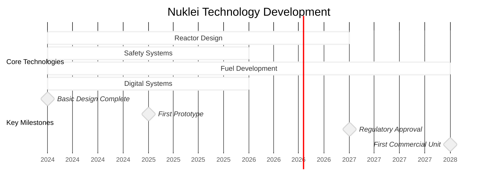
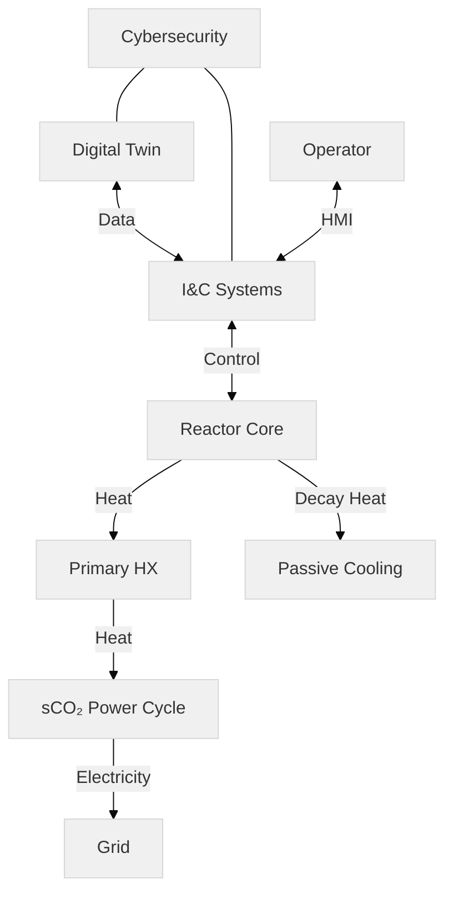

# Nuklei Strategic Vision
## 2024-2030 Roadmap

---

## Our Vision

> "To establish a global standard for safe, sustainable, and accessible nuclear energy solutions through open collaboration and technological innovation."

**Core Principles:**
- Open Innovation
- Safety & Security
- Sustainability
- Accessibility

---

## Technology Roadmap

---

## System Architecture

---

## Performance Targets

| Metric | 2025 | 2030 |
|--------|------|------|
| LCOE ($/MWh) | 80 | <60 |
| Construction (months) | - | <36 |
| Safety (CDF/ry) | 1E-5 | <1E-7 |
| Capacity Factor | - | >90% |
| Waste (m³/GWe-y) | 5 | <0.1 |

---

## Implementation Phases

1. **Foundation (2024-2025)**
   - Complete basic design
   - Establish supply chain
   - Deploy digital twin MVP

2. **Demonstration (2026-2027)**
   - First-of-a-kind unit
   - Regulatory engagement
   - Performance validation

3. **Deployment (2028-2030)**
   - Commercial operation
   - Fleet deployment
   - Global support network

---

## Get Involved

- **Contribute**: [GitHub Repository](https://github.com/nuklei)
- **Learn**: [Documentation](https://nuklei.org/docs)
- **Connect**: community@nuklei.org

---

# Thank You

Questions?
