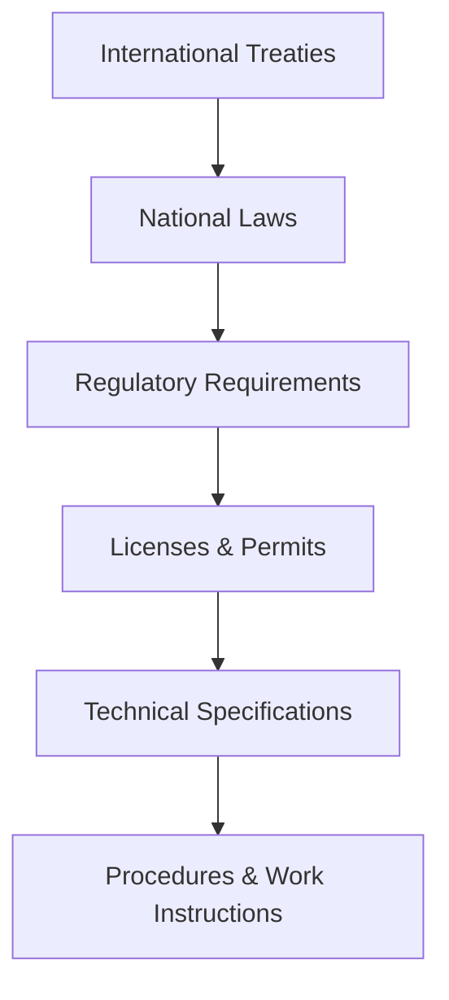

# Compliance Management System

This document outlines the framework for establishing and maintaining regulatory compliance throughout the lifecycle of nuclear facilities, from design through decommissioning.

## 1. Compliance Framework

### 1.1 Regulatory Hierarchy

### 1.2 Key Compliance Components

| Component | Description | Responsible | Frequency |
|-----------|-------------|-------------|-----------|
| **Regulatory Watch** | Monitor regulatory changes | Regulatory Affairs | Continuous |
| **Gap Analysis** | Identify compliance gaps | Compliance Team | Quarterly |
| **Action Tracking** | Implement corrective actions | Operations | Ongoing |
| **Verification** | Confirm compliance | QA/QC | Monthly |
| **Reporting** | Submit required reports | Documentation | As required |

## 2. Compliance Tools and Systems

### 2.1 Digital Compliance Management

#### 2.1.1 Document Control System
- **Features**:
  - Version control
  - Electronic signatures
  - Access controls
  - Audit trails
- **Requirements**:
  - 21 CFR Part 11 compliance
  - Role-based access
  - Automated retention

#### 2.1.2 Compliance Calendar
- **Tracking**:
  - Regulatory deadlines
  - Reporting requirements
  - License conditions
  - Training renewals

### 2.2 Risk-Based Compliance

#### 2.2.1 Risk Assessment Matrix

| Likelihood \ Impact | Minor | Moderate | Major | Severe |
|---------------------|-------|-----------|-------|--------|
| **Frequent** | Low | Medium | High | Critical |
| **Probable** | Low | Medium | High | Critical |
| **Occasional** | Low | Medium | High | High |
| **Remote** | Low | Low | Medium | High |

#### 2.2.2 Control Effectiveness
- **Rating Scale**: 1-5 (1=Poor, 5=Excellent)
- **Factors**:
  - Design adequacy
  - Implementation
  - Performance
  - Monitoring

## 3. Compliance Processes

### 3.1 Regulatory Change Management

1. **Identification**:
   - Regulatory scanning
   - Stakeholder notifications
   - Industry alerts

2. **Assessment**:
   - Impact analysis
   - Risk evaluation
   - Resource requirements

3. **Implementation**:
   - Procedure updates
   - Training
   - Documentation changes

### 3.2 Compliance Monitoring

#### 3.2.1 Key Performance Indicators

| KPI | Target | Frequency | Owner |
|-----|--------|-----------|-------|
| Regulatory Findings | 0 | Quarterly | QA |
| Corrective Actions | 100% on time | Monthly | Ops |
| Training Compliance | 100% | Monthly | HR |
| Documentation Accuracy | 99.9% | Quarterly | Doc Control |

#### 3.2.2 Audit Program
- **Types**:
  - Internal audits
  - Regulatory inspections
  - Third-party assessments
  - Management reviews

## 4. Documentation Requirements

### 4.1 Controlled Documents

| Document Type | Retention Period | Review Cycle |
|--------------|------------------|--------------|
| Quality Manual | Permanent | Annual |
| Procedures | 10 years | Biennial |
| Work Instructions | Current + 5 years | As needed |
| Training Records | Employment + 30 years | N/A |

### 4.2 Record Keeping
- **Electronic Records**:
  - Secure backup
  - Access controls
  - Version history
  - Digital signatures

## 5. Training and Competence

### 5.1 Training Matrix

| Role | Required Training | Frequency |
|------|-------------------|-----------|
| Reactor Operator | Initial + Annual Refresher | Annual |
| Health Physics | Initial + Biennial | 2 years |
| Maintenance | Job-specific | As needed |
| Management | Regulatory Update | Annual |

### 5.2 Competence Assessment
- **Methods**:
  - Written exams
  - Oral boards
  - Simulator evaluations
  - On-the-job observations

## 6. Non-Compliance Management

### 6.1 Deviation Process

1. **Identification**:
   - Self-identification
   - Internal reporting
   - Regulatory findings

2. **Evaluation**:
   - Immediate actions
   - Root cause analysis
   - Impact assessment

3. **Resolution**:
   - Corrective actions
   - Preventive actions
   - Effectiveness review

### 6.2 Enforcement Actions
- **Types**:
  - Notices of Violation
  - Civil penalties
  - Orders
  - License conditions

## 7. Continuous Improvement

### 7.1 Performance Indicators

| Area | Leading Indicators | Lagging Indicators |
|------|-------------------|-------------------|
| Safety | Near misses | Reportable events |
| Compliance | Open findings | Regulatory actions |
| Quality | Rework rates | Customer complaints |

### 7.2 Management Review
- **Inputs**:
  - Audit results
  - Performance data
  - Regulatory changes
  - Resource needs
- **Outputs**:
  - Improvement actions
  - Resource allocation
  - Policy updates

## 8. Technology Integration

### 8.1 Digital Tools
- **Compliance Management Software**:
  - Document control
  - Training tracking
  - Audit management
  - Action tracking

### 8.2 Data Analytics
- **Applications**:
  - Trend analysis
  - Predictive compliance
  - Risk modeling
  - Performance benchmarking

## 9. Emergency Preparedness

### 9.1 Regulatory Interface
- **Requirements**:
  - Emergency plans
  - Drills and exercises
  - Public notification
  - Regulatory reporting

### 9.2 Business Continuity
- **Elements**:
  - Backup systems
  - Alternate facilities
  - Data recovery
  - Staff relocation

## 10. International Best Practices

### 10.1 IAEA Guidance
- **GS-R-3**: Management System
- **GS-G-3.1**: Application of Management System
- **GS-G-3.5**: Management System Audits

### 10.2 Industry Standards
- **ISO 19443**: Nuclear Quality Management
- **ASME NQA-1**: Quality Assurance
- **INPO AP-913**: Equipment Reliability

## 11. Case Studies

### 11.1 Effective Compliance Programs
1. **Case Study A**: Digital Transformation
   - Challenge: Manual processes
   - Solution: Integrated CMS
   - Results: 40% efficiency gain

2. **Case Study B**: Regulatory Finding Resolution
   - Issue: Documentation gaps
   - Actions: Process redesign
   - Outcome: Zero repeat findings

## 12. Templates and Tools

### 12.1 Compliance Checklist
- [ ] Regulatory requirements identified
- [ ] Controls implemented
- [ ] Staff trained
- [ ] Documentation complete
- [ ] Verification completed

### 12.2 Gap Analysis Template
| Requirement | Status | Gap | Action Plan | Due Date |
|-------------|--------|-----|-------------|----------|
| Example 1 | Compliant | None | N/A | N/A |
| Example 2 | Partial | Training needed | Schedule training | 2024-07-01 |

## 13. Next Steps

1. Conduct initial compliance assessment
2. Implement tracking system
3. Train staff on requirements
4. Establish monitoring program
5. Schedule management review

## 14. Contact Information

For compliance inquiries, contact:
- **Nuklei Compliance Office**: compliance@nuklei.org
- **24/7 Compliance Hotline**: +1-800-XXX-XXXX
- **Whistleblower Portal**: [Secure Reporting](https://nuklei.org/report)
