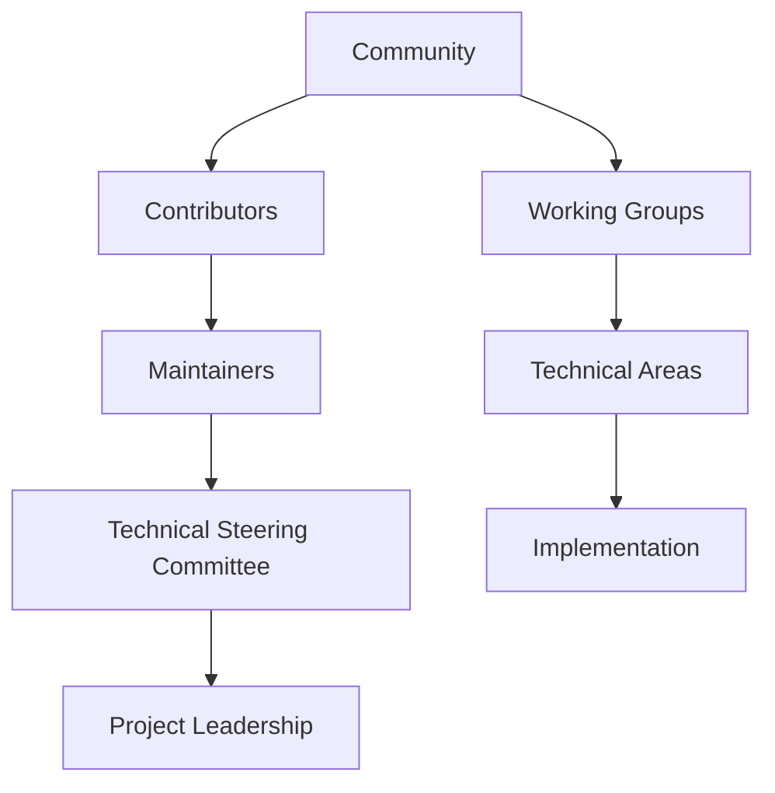
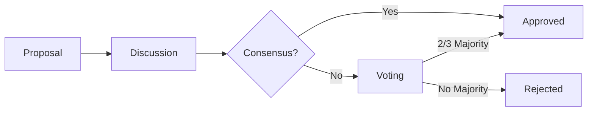

# Project Governance & Open-Source Model

This directory contains comprehensive documentation about the Nuklei project's governance structure, decision-making processes, and open-source collaboration model. These documents ensure transparency, community engagement, and effective project management.

## Core Documents

1. [Governance Model](governance-model.md) - Project structure and decision-making processes
2. [Roles & Responsibilities](roles-responsibilities.md) - Definitions of key roles and their duties
3. [Decision Making](decision-making.md) - How decisions are proposed, discussed, and ratified
4. [Community Guidelines](community-guidelines.md) - Code of conduct and community standards
5. [Release Process](release-process.md) - Versioning, branching, and release management
6. [Open Source Strategy](open-source-strategy.md) - Licensing and contribution guidelines

## Visual Overview

### Governance Structure

### Decision Making Flow

## Key Principles

1. **Transparency**: All decisions and discussions happen in the open
2. **Meritocracy**: Influence is earned through contribution
3. **Inclusivity**: Welcome diverse perspectives and backgrounds
4. **Accountability**: Clear roles and responsibilities
5. **Sustainability**: Long-term project health and growth

## Getting Involved

### For New Contributors
1. Read our [Contributing Guidelines](../../CONTRIBUTING.md)
2. Join our community channels
3. Start with "good first issue" labeled tasks
4. Attend community meetings

### For Organizations
1. Review our [Governance Model](governance-model.md)
2. Consider joining as a member organization
3. Participate in working groups
4. Support the project through contributions or sponsorship

## Related Documents

- [Main Project Roadmap](../../nuklei_roadmap.md)
- [Strategic Vision](../01_strategic-vision/README.md)
- [Regulatory & Legal](../02_regulatory-legal/README.md)
- [Code of Conduct](../../CODE_OF_CONDUCT.md)
- [Contributor License Agreement](../../CLA.md)

## Updates

- **Last Updated**: 2025-06-13
- **Next Review**: 2025-12-13

## Contact

For governance-related inquiries, please contact:
- **Governance Committee**: governance@nuklei.org
- **Community Manager**: community@nuklei.org
- **Technical Steering Committee**: tsc@nuklei.org
