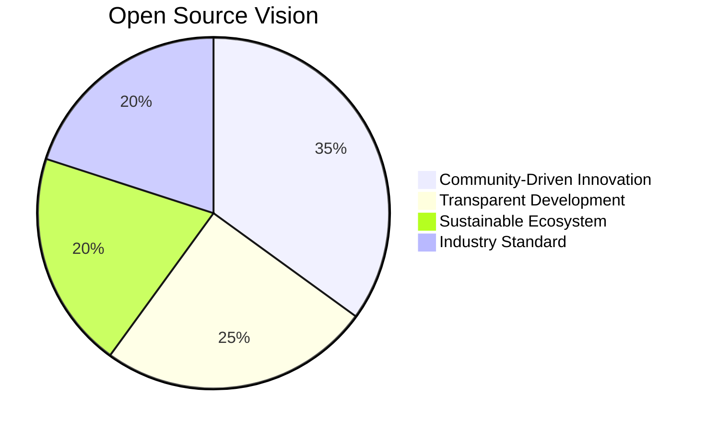
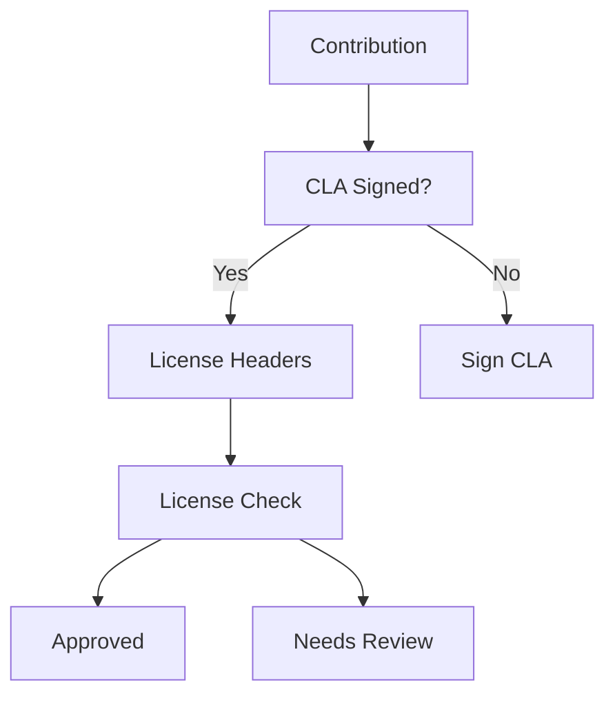
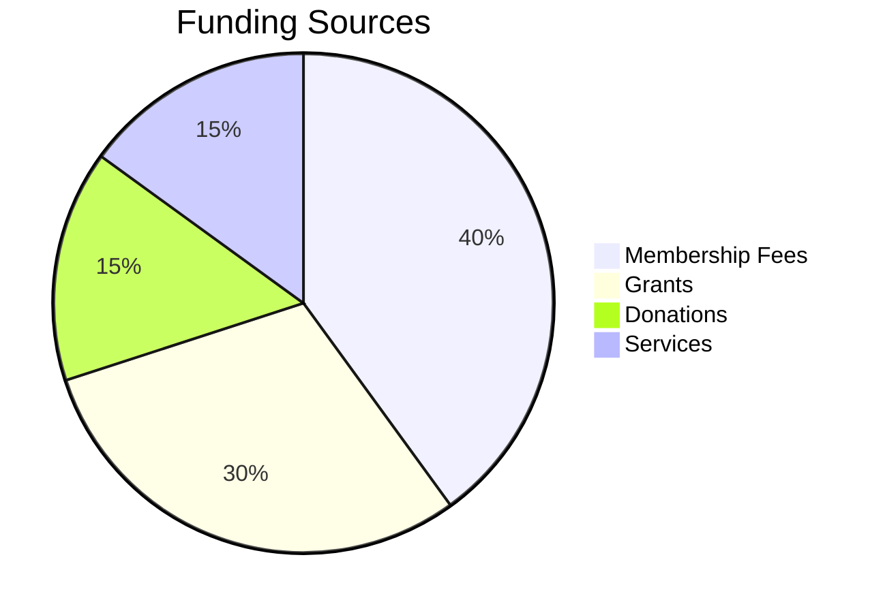
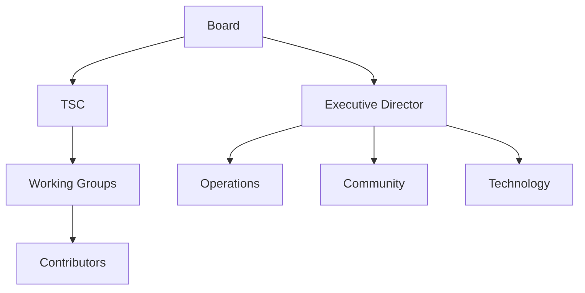
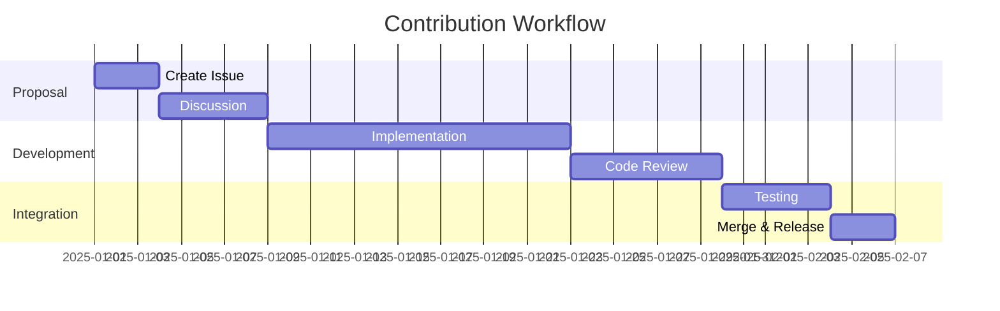
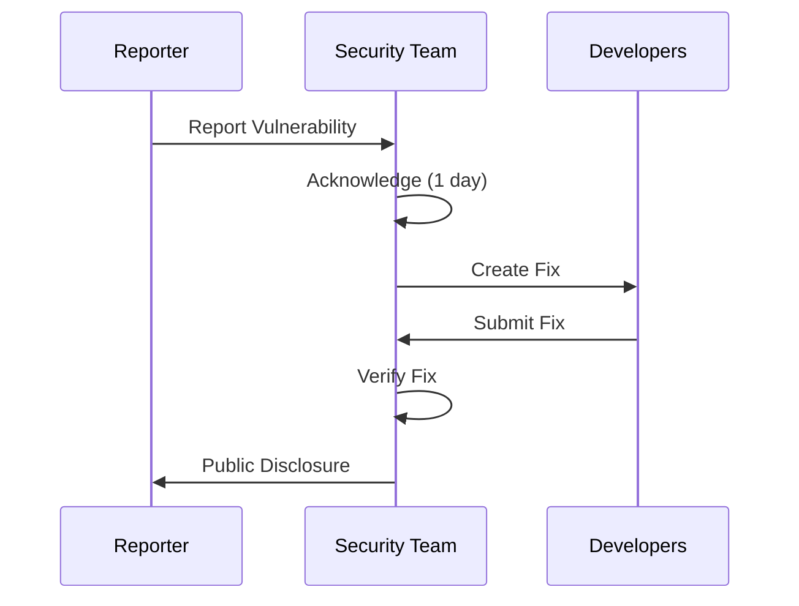
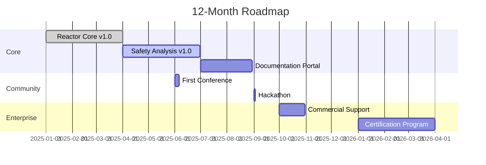

# Nuklei Open Source Strategy

This document outlines the open source strategy for the Nuklei project, including licensing, community building, and sustainability.

## 1. Executive Summary

### 1.1 Vision

### 1.2 Goals

1. **Community Growth**
   - 1000+ contributors by 2026
   - 50+ organizations contributing
   - 100+ production deployments

2. **Technical Excellence**
   - 90%+ test coverage
   - < 24h critical bug response
   - Monthly security audits

3. **Adoption**
   - Industry standard for nuclear simulations
   - Certification by regulatory bodies
   - Integration with major tools

## 2. Licensing Strategy

### 2.1 License Selection

| Component | License | Rationale |
|-----------|---------|------------|
| Core | Apache 2.0 | Permissive, business-friendly |
| Documentation | CC BY-SA 4.0 | Encourages sharing |
| Data | CC0 | Maximum reuse |
| Patents | Apache 2.0 | Protection for all |

### 2.2 Compliance Requirements

## 3. Community Building

### 3.1 Engagement Model

| Segment | Engagement | Channels |
|---------|------------|-----------|
| Developers | Code, Docs | GitHub, Forums |
| Researchers | Papers, Data | Conferences |
| Regulators | Compliance | Working Groups |
| Industry | Use Cases | Case Studies |

### 3.2 Growth Strategy

1. **Awareness**
   - Conference talks
   - Technical papers
   - Case studies

2. **Adoption**
   - Documentation
   - Tutorials
   - Reference implementations

3. **Contribution**
   - Good first issues
   - Mentorship programs
   - Hackathons

## 4. Sustainability Model

### 4.1 Funding Sources

### 4.2 Resource Allocation

| Area | % Budget | Key Activities |
|------|----------|----------------|
| Development | 50% | Core features, maintenance |
| Community | 20% | Events, documentation |
| Infrastructure | 15% | Hosting, tooling |
| Legal/Compliance | 10% | Licensing, governance |
| Marketing | 5% | Outreach, materials |

## 5. Governance Structure

### 5.1 Organizational Chart

### 5.2 Decision Rights

| Decision Type | Authority | Process |
|--------------|------------|----------|
| Technical | TSC | Lazy Consensus |
| Governance | Board | Vote |
| Membership | Board | Application |
| Budget | Executive Director | Approval |

## 6. Contribution Workflow

### 6.1 Process Flow

### 6.2 Quality Gates

| Stage | Requirements | Tools |
|-------|--------------|-------|
| Pre-commit | Code style, Linting | Prettier, ESLint |
| CI Build | Tests, Build | GitHub Actions |
| Code Review | 2+ Approvals | GitHub PRs |
| Security | Vulnerability Scan | Snyk, Dependabot |
| Performance | Benchmarks | Benchmark.js |

## 7. Intellectual Property

### 7.1 Copyright Management

- Individual copyright for contributions
- Project holds collective copyright
- CLA ensures proper licensing
- Copyright notices in all files

### 7.2 Trademark Policy

| Use Case | Permission Required | Guidelines |
|----------|---------------------|------------|
| Project Name | Yes | Must follow brand guidelines |
| Logo | Yes | No modifications |
| Derived Works | Case by case | Must be clearly distinguished |
| Merchandise | Yes | Licensed only |

## 8. Security Practices

### 8.1 Vulnerability Management

### 8.2 Security Controls

- Regular security audits
- Dependency scanning
- Secure coding guidelines
- Security training for maintainers
- Bug bounty program

## 9. Documentation Strategy

### 9.1 Documentation Levels

| Level | Audience | Format |
|-------|----------|--------|
| Getting Started | New Users | Tutorials |
| How-To Guides | Practitioners | Recipes |
| Reference | Power Users | API Docs |
| Explanation | All | Concepts |

### 9.2 Documentation Tools

| Purpose | Tool |
|---------|------|
| API Docs | OpenAPI |
| User Guides | MkDocs |
| Developer Docs | JSDoc |
| Diagrams | Mermaid |
| Versioning | Read the Docs |

## 10. Ecosystem Development

### 10.1 Integration Strategy

| Category | Strategy | Examples |
|----------|-----------|-----------|
| Upstream | Contribute back | Dependencies |
| Downstream | Support integrations | Plugins |
| Parallel | Collaborate | Standards |
| Competing | Differentiate | Features |

### 10.2 Partner Program

1. **Tiers**
   - Bronze: Basic support
   - Silver: Training
   - Gold: Custom development
   - Platinum: Strategic partnership

2. **Benefits**
   - Early access
   - Roadmap input
   - Joint marketing
   - Training credits

## 11. Metrics and KPIs

### 11.1 Community Health

| Metric | Target | Current |
|--------|--------|---------|
| Active Contributors | 100+ | 25 |
| Organizations | 50+ | 12 |
| PR Response Time | < 2 days | 3 days |
| Issue Resolution | 80% in 30d | 65% |

### 11.2 Project Velocity

- Monthly commits
- Release frequency
- Test coverage
- Bug resolution time
- Feature completion rate

## 12. Risk Management

### 12.1 Risk Assessment

| Risk | Impact | Probability | Mitigation |
|------|--------|-------------|-------------|
| Key Person Risk | High | Medium | Bus factor > 3 |
| License Violation | High | Low | Compliance checks |
| Security Breach | Critical | Medium | Regular audits |
| Funding Loss | High | Low | Diversified funding |

### 12.2 Contingency Plans

1. **Maintainer Burnout**
   - Rotate responsibilities
   - Mentorship program
   - Recognition program

2. **License Issues**
   - Regular compliance checks
   - Legal counsel
   - Contingency fund

## 13. Roadmap

### 13.1 12-Month Plan

### 13.2 Future Directions

- Quantum computing integration
- AI/ML for optimization
- Extended reality interfaces
- Advanced materials modeling

## 14. Contact

For open source strategy inquiries:
- **General**: info@nuklei.org
- **Legal**: legal@nuklei.org
- **Partnerships**: partners@nuklei.org
- **Security**: security@nuklei.org

## 15. Changelog

| Date | Version | Changes |
|------|---------|---------|
| 2025-06-13 | 1.0.0 | Initial version |

## 16. License

This document is licensed under [CC BY-SA 4.0](https://creativecommons.org/licenses/by-sa/4.0/).
