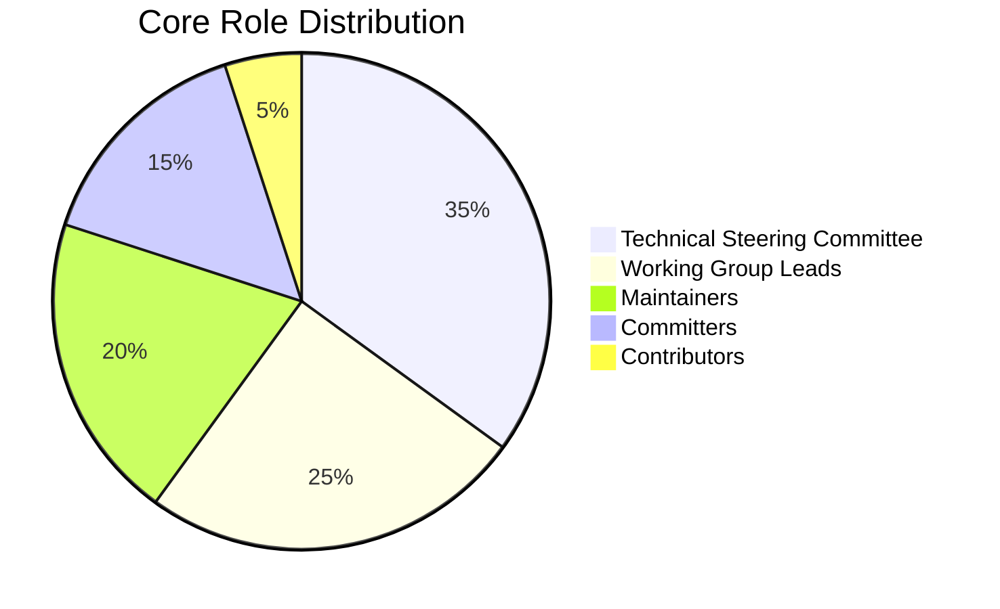
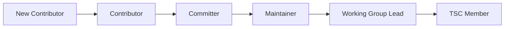

# Roles and Responsibilities

This document defines the various roles within the Nuklei project and their associated responsibilities, ensuring clarity in contributions and decision-making.

## 1. Role Types

### 1.1 Core Roles

### 1.2 Role Progression

## 2. Role Definitions

### 2.1 Technical Steering Committee (TSC)

#### 2.1.1 Composition
- 5-7 voting members
- 2-year staggered terms
- Maximum 2 consecutive terms

#### 2.1.2 Responsibilities
- Set technical direction and vision
- Approve project releases
- Manage security vulnerabilities
- Resolve technical disputes
- Oversee working groups
- Manage project resources

### 2.2 Working Group Leads

#### 2.2.1 Key Working Groups
1. **Reactor Design**
2. **Safety Analysis**
3. **Digital Systems**
4. **Regulatory Compliance**
5. **Documentation**

#### 2.2.2 Responsibilities
- Lead working group activities
- Coordinate with other working groups
- Report to TSC
- Mentor new contributors
- Ensure working group deliverables

### 2.3 Maintainers

#### 2.3.1 Code Maintainers
- Review and merge pull requests
- Manage release branches
- Ensure code quality
- Mentor contributors

#### 2.3.2 Documentation Maintainers
- Review documentation changes
- Maintain documentation standards
- Organize documentation structure
- Ensure accuracy and clarity

### 2.4 Committers

#### 2.4.1 Commit Access
- Direct push rights to repository
- Review and merge privileges
- Release preparation

#### 2.4.2 Responsibilities
- Review pull requests
- Triage issues
- Write and review tests
- Maintain CI/CD pipelines

### 2.5 Contributors

#### 2.5.1 Types of Contributions
- Code
- Documentation
- Testing
- Design
- Community support

#### 2.5.2 Recognition Levels

| Level | Requirements | Badge |
|-------|--------------|-------|
| **New** | First contribution | 🌱 |
| **Active** | 5+ contributions | 🚀 |
| **Core** | 20+ contributions | ⭐ |
| **Eminent** | 50+ contributions | 🌟 |

## 3. Role Requirements

### 3.1 Becoming a Committer

1. **Prerequisites**:
   - 5+ substantial contributions
   - Positive community standing
   - Demonstrated expertise

2. **Process**:
   - Nomination by existing committer
   - Discussion in TSC meeting
   - Vote by existing committers
   - 2/3 majority required

### 3.2 Becoming a Maintainer

1. **Prerequisites**:
   - 6+ months as committer
   - Demonstrated leadership
   - Deep technical knowledge

2. **Process**:
   - Nomination by TSC member
   - Community feedback
   - TSC vote
   - 2/3 majority required

### 3.3 TSC Membership

1. **Prerequisites**:
   - 1+ year as maintainer
   - Strategic vision
   - Conflict resolution skills

2. **Process**:
   - Call for nominations
   - Community discussion
   - Election by committers
   - Simple majority

## 4. Role Expectations

### 4.1 Time Commitment

| Role | Weekly Hours | Meeting Attendance |
|------|--------------|-------------------|
| TSC Member | 8-10 | Required |
| WG Lead | 6-8 | Required |
| Maintainer | 4-6 | Expected |
| Committer | 2-4 | Encouraged |
| Contributor | Variable | Optional |

### 4.2 Performance Metrics

1. **Activity**:
   - Code commits/reviews
   - Issue triage
   - Documentation updates

2. **Quality**:
   - Bug rates
   - Test coverage
   - Review quality

3. **Community**:
   - Mentorship
   - Documentation
   - Support

## 5. Role Transitions

### 5.1 Stepping Down

1. **Process**:
   - 30-day notice
   - Knowledge transfer
   - Successor identification

2. **Emeritus Status**:
   - Recognition of service
   - Continued access to resources
   - Invitation to alumni events

### 5.2 Inactivity Policy

| Role | Inactivity Period | Action |
|------|-------------------|--------|
| TSC Member | 3 months | Warning |
| WG Lead | 4 months | Rotation |
| Maintainer | 6 months | Review |
| Committer | 12 months | Archive |

## 6. Decision Making Authority

### 6.1 Decision Rights Matrix

| Decision Type | TSC | WG Leads | Maintainers | Committers |
|---------------|-----|----------|-------------|------------|
| Technical Direction | Approve | Recommend | Input | Input |
| Release Approval | Approve | Recommend | Input | Input |
| Feature Addition | Input | Approve | Recommend | Input |
| Bug Fix | Input | Input | Approve | Input |
| Documentation | Input | Input | Approve | Input |

### 6.2 Escalation Path

1. Working Group
2. TSC
3. Project Leadership
4. Foundation Board (if applicable)

## 7. Onboarding

### 7.1 New Contributor

1. Welcome email
2. Mentor assignment
3. Starter tasks
4. Onboarding sessions

### 7.2 New Maintainer

1. Access provisioning
2. Mentorship program
3. Shadowing period
4. Gradual responsibility increase

## 8. Recognition

### 8.1 Types of Recognition

- **Monthly Spotlight**: Featured contributor
- **Quarterly Awards**: Outstanding contributions
- **Annual Recognition**: Major milestones
- **Hall of Fame**: Long-term contributors

### 8.2 Benefits

| Level | Benefits |
|-------|----------|
| Contributor | Digital badge, Profile listing |
| Committer | Commit access, Voting rights |
| Maintainer | Merge rights, Leadership role |
| TSC | Strategic influence, Speaking opportunities |

## 9. Conflict Resolution

### 9.1 Process

1. Direct discussion
2. Mediation
3. TSC review
4. Foundation board (if needed)

### 9.2 Code of Conduct

All role holders must:
- Uphold the Code of Conduct
- Complete training
- Report violations
- Support enforcement

## 10. Contact

For role-related questions:
- **TSC Chair**: tsc-chair@nuklei.org
- **Community Manager**: community@nuklei.org
- **Working Group Leads**: wg-leads@nuklei.org
