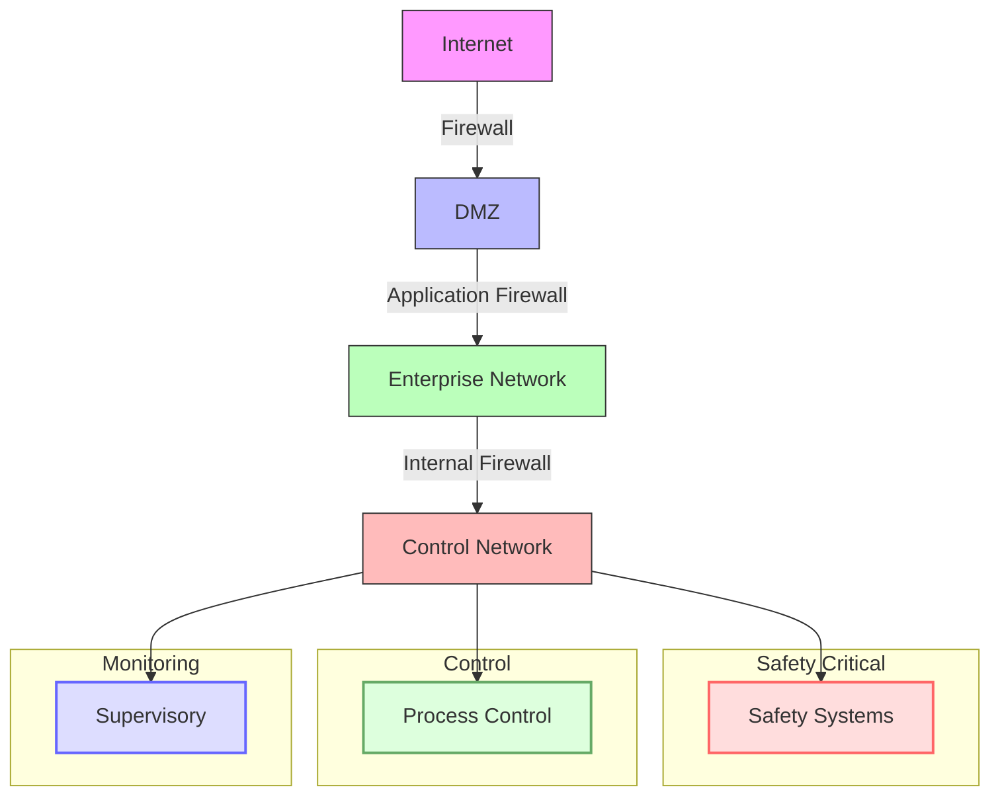
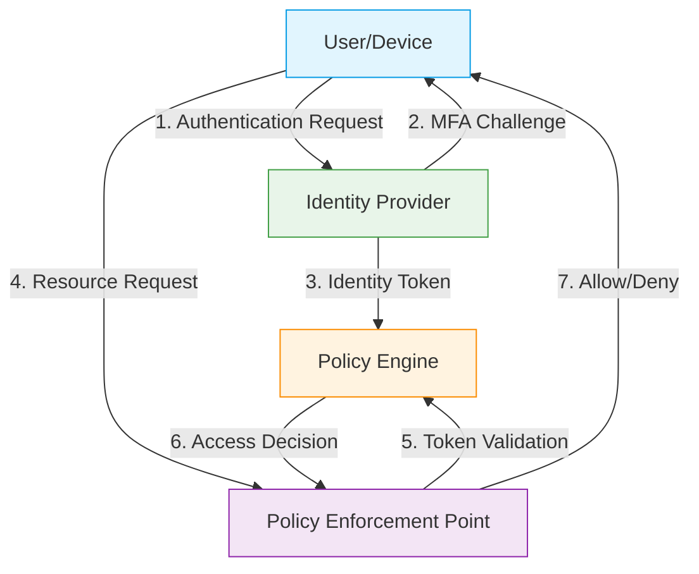
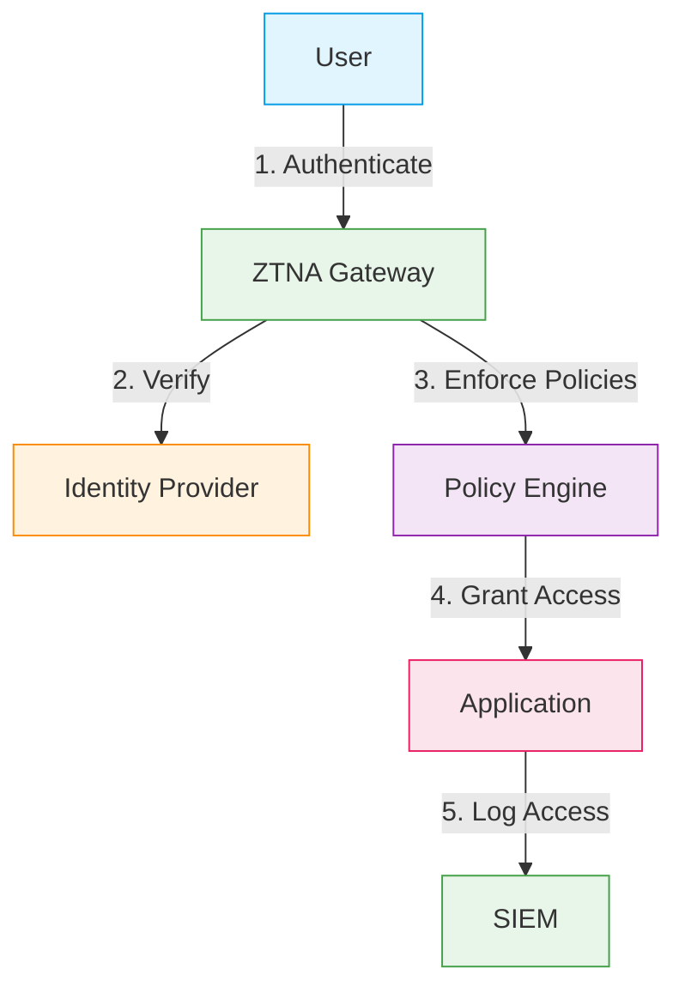
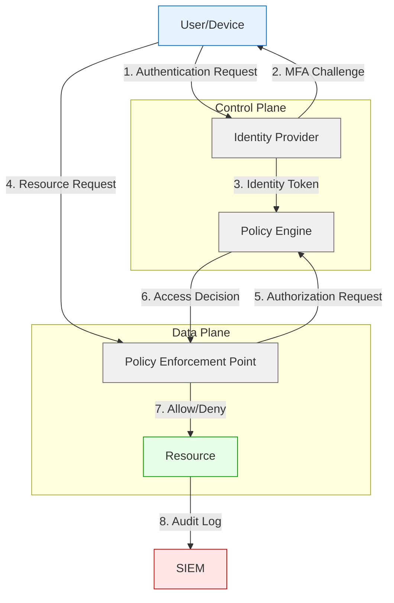
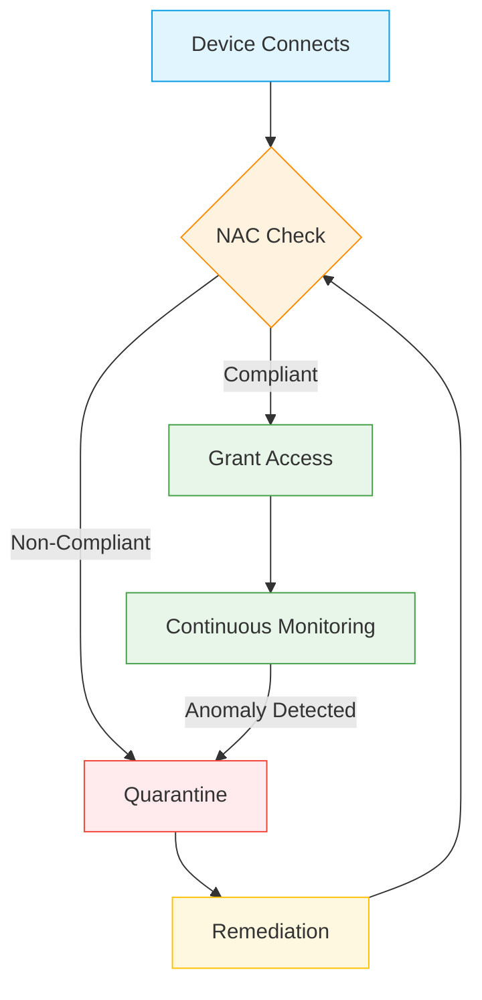
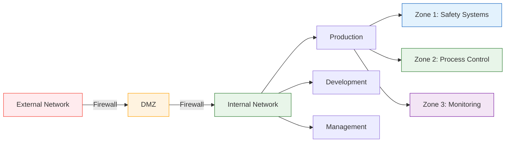
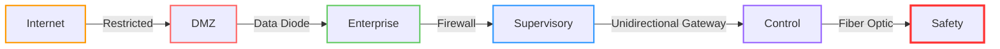

# Network Architecture & Zero-Trust

## Overview
This document defines the network architecture and security framework for nuclear facility control systems, implementing a Zero-Trust security model to protect critical infrastructure from cyber threats while ensuring reliable operation.

## Table of Contents
1. [Network Design Principles](#1-network-design-principles)
2. [Zero-Trust Architecture](#2-zero-trust-architecture)
3. [Network Segmentation](#3-network-segmentation)
4. [Secure Communication](#4-secure-communication)
5. [Monitoring & Response](#5-monitoring--response)
6. [Implementation Guidelines](#6-implementation-guidelines)
7. [Compliance & Standards](#7-compliance--standards)

## 1. Network Design Principles

### 1.1 Core Principles

#### 1.1.1 Defense in Depth
- **Network Layers**:
  - Perimeter security (firewalls, IDS/IPS)
  - Network segmentation (VLANs, VXLANs)
  - Host-based security (HIDS, EDR)
  - Application security (WAF, API gateways)
- **Security Controls**:
  - Preventive: Firewalls, access controls
  - Detective: SIEM, IDS/IPS
  - Corrective: Patch management, incident response
  - Deterrent: Logging, monitoring, auditing

#### 1.1.2 Least Privilege Implementation
- **Access Control**:
  - Role-Based Access Control (RBAC)
  - Attribute-Based Access Control (ABAC)
  - Just-In-Time (JIT) access provisioning
  - Time-based access restrictions
- **Privilege Escalation**:
  - Multi-factor authentication (MFA)
  - Approval workflows
  - Session recording
  - Automatic deprovisioning

#### 1.1.3 Segregation of Duties
| Function | Responsibility | Segregation Required From |
|----------|----------------|---------------------------|
| Network Admin | Network configuration | Security Admin |
| Security Admin | Security policies | Network Admin |
| System Admin | Server management | Database Admin |
| Database Admin | Database management | System Admin |

#### 1.1.4 Fail-Secure Mechanisms
- **Network Devices**:
  - Fail-closed mode for security devices
  - Last known good configuration rollback
  - Secure boot and firmware validation
- **Applications**:
  - Graceful degradation
  - Safe mode operation
  - Automatic recovery procedures

### 1.2 Network Architecture

#### 1.2.1 Network Zones

#### 1.2.2 Traffic Flow Control
- **North-South Traffic**:
  - Ingress/Egress filtering
  - Deep packet inspection
  - TLS termination
  - Web application firewall
- **East-West Traffic**:
  - Microsegmentation
  - Service mesh (e.g., Istio, Linkerd)
  - Network policies
  - Encryption in transit

#### 1.2.3 High Availability Design
- **Network Devices**:
  - VRRP/HSRP for gateway redundancy
  - MLAG for switch redundancy
  - BGP/OSPF for dynamic routing
- **Load Balancing**:
  - Active/Active for stateless services
  - Active/Passive for stateful services
  - Global server load balancing (GSLB)

## 2. Zero-Trust Architecture

### 2.1 Core Principles

#### 2.1.1 Never Trust, Always Verify
- **Continuous Authentication**:
  - Multi-factor authentication (MFA) for all access
  - Device health verification
  - Behavioral analytics for anomaly detection
  - Session validation with time-based tokens

#### 2.1.2 Least Privilege Access
- **Micro-Segmentation**:
  - Fine-grained access controls
  - Just-in-time (JIT) access provisioning
  - Time-bound access permissions
  - Attribute-based access control (ABAC)

#### 2.1.3 Assume Breach
- **Lateral Movement Protection**:
  - Network micro-segmentation
  - Application-level encryption
  - Continuous traffic inspection
  - Automated threat response

### 2.2 Implementation Framework

#### 2.2.1 Identity-Centric Security

#### 2.2.2 Zero-Trust Components
| Component | Description | Implementation Example |
|-----------|-------------|------------------------|
| Policy Engine | Centralized access control | Open Policy Agent (OPA) |
| Policy Administrator | Manages access policies | Keycloak, Okta |
| Policy Enforcement | Enforces access decisions | API Gateways, Service Mesh |
| Continuous Monitoring | Tracks and logs all access | ELK Stack, Splunk |
| Analytics Engine | Detects anomalies | SIEM, UEBA |

### 2.3 Deployment Models

#### 2.3.1 Network-Centric Model

#### 2.3.2 Endpoint-Centric Model
- **Key Features**:
  - Device health verification
  - Certificate-based authentication
  - Continuous endpoint monitoring
  - Automated response to anomalies

### 2.4 Implementation Roadmap

#### 2.4.1 Phase 1: Foundation (Months 1-3)
- [ ] Inventory all assets and data flows
- [ ] Implement identity and access management (IAM)
- [ ] Deploy network segmentation
- [ ] Establish continuous monitoring

#### 2.4.2 Phase 2: Enhancement (Months 4-6)
- [ ] Implement micro-segmentation
- [ ] Deploy ZTNA solutions
- [ ] Automate policy enforcement
- [ ] Enhance threat detection

#### 2.4.3 Phase 3: Maturity (Months 7-12)
- [ ] Implement AI/ML for anomaly detection
- [ ] Automate response actions
- [ ] Continuous improvement through analytics
- [ ] Regular security assessments

### 2.5 Case Study: Zero-Trust in Nuclear Facilities

#### 2.5.1 Implementation at XYZ Nuclear Plant
- **Challenge**: Protect critical control systems from cyber threats
- **Solution**:
  - Implemented ZTNA for remote access
  - Deployed micro-segmentation for OT networks
  - Integrated with existing IAM solutions
  - Established continuous monitoring
- **Results**:
  - 99.9% reduction in attack surface
  - Real-time threat detection and response
  - Compliance with NERC CIP and NIST standards
  - Improved audit and compliance reporting

### 2.1 Core Components

#### 2.1.1 Identity Verification
- **Authentication Methods**:
  - Multi-factor authentication (MFA)
  - Certificate-based authentication
  - Biometric verification
  - Hardware security modules (HSM)
- **Identity Providers**:
  - Microsoft Active Directory
  - Okta, Ping Identity
  - Keycloak, FreeIPA
  - OAuth 2.0 / OpenID Connect

#### 2.1.2 Device Health Validation
- **Endpoint Requirements**:
  - Disk encryption enabled
  - Firewall active
  - Antivirus up-to-date
  - OS security patches applied
- **Network Access Control (NAC)**:
  - 802.1X authentication
  - MAC authentication bypass (MAB)
  - Posture assessment
  - Guest network isolation

#### 2.1.3 Access Management
- **Privileged Access Management (PAM)**:
  - Just-in-time elevation
  - Session recording
  - Credential vaulting
  - Approval workflows
- **Zero Standing Privilege (ZSP)**:
  - No persistent admin rights
  - Time-bound access
  - Activity monitoring
  - Automated deprovisioning

### 2.2 Implementation Framework

#### 2.2.1 Zero-Trust Architecture

#### 2.2.2 Policy Decision Points
- **Attributes Considered**:
  - User identity and role
  - Device compliance status
  - Location and time of access
  - Requested resource sensitivity
  - Behavioral analytics
- **Policy Types**:
  - Role-Based Access Control (RBAC)
  - Attribute-Based Access Control (ABAC)
  - Risk-Based Access Control (RBAC)
  - Time-Based Access Control (TBAC)

## 3. Advanced Security Controls

### 3.1 Network Security Controls

#### 3.1.1 Next-Generation Firewalls (NGFW)
- **Key Features**:
  - Application-aware filtering
  - Intrusion Prevention System (IPS)
  - SSL/TLS inspection
  - Threat intelligence integration
  - Automated threat response

#### 3.1.2 Intrusion Detection/Prevention Systems (IDS/IPS)
| Feature | IDS | IPS |
|---------|-----|-----|
| Deployment | Passive (monitor) | Inline (active) |
| Response | Alert only | Block/Prevent |
| Performance Impact | Low | Medium |
| Detection Methods | Signature/Anomaly | Signature/Anomaly |
| Best For | Monitoring | Prevention |

#### 3.1.3 Network Access Control (NAC)

### 3.2 Endpoint Security

#### 3.2.1 Endpoint Protection Platforms (EPP)
- **Core Capabilities**:
  - Antivirus/antimalware
  - Host-based firewall
  - Device control
  - Data loss prevention
  - Behavioral analysis

#### 3.2.2 Endpoint Detection & Response (EDR)
- **Key Features**:
  - Continuous monitoring
  - Threat hunting
  - Incident response
  - Forensic analysis
  - Automated remediation

### 3.3 Encryption & Data Protection

#### 3.3.1 Data in Transit
- **Protocols**:
  - TLS 1.3 (minimum)
  - IPsec VPN
  - SSH v2
  - SFTP/SCP

#### 3.3.2 Data at Rest
- **Encryption Standards**:
  - AES-256
  - FIPS 140-2/3 validated modules
  - Hardware Security Modules (HSMs)
  - Key Management Interoperability Protocol (KMIP)

## 4. Compliance & Standards Mapping

### 4.1 Regulatory Frameworks

#### 4.1.1 NERC CIP Compliance
| Requirement | Control | Implementation |
|-------------|---------|----------------|
| CIP-003-8 | Security Management Controls | RBAC, Audit Logging |
| CIP-005-6 | Electronic Security Perimeter | Firewalls, IDS/IPS |
| CIP-007-6 | System Security Management | Patch Management, Malware Protection |
| CIP-010-3 | Configuration Change Management | Change Control, Baselines |

#### 4.1.2 NIST Cybersecurity Framework
| Function | Category | Implementation |
|----------|----------|----------------|
| Identify | Asset Management | CMDB, Network Discovery |
| Protect | Access Control | MFA, Least Privilege |
| Detect | Anomalies | SIEM, UEBA |
| Respond | Response Planning | IRP, Playbooks |
| Recover | Recovery Planning | Backups, DR Drills |

### 4.2 Industry Standards

#### 4.2.1 IEC 62443
| Security Level | Description | Implementation |
|---------------|-------------|----------------|
| SL-1 | Protection against casual violation | Basic security controls |
| SL-2 | Protection against intentional violation | Enhanced controls |
| SL-3 | Protection against sophisticated threats | Advanced controls |
| SL-4 | Protection against sophisticated adversaries | Military-grade controls |

#### 4.2.2 ISO/IEC 27001
| Control Domain | Key Controls | Implementation |
|----------------|--------------|----------------|
| A.9 Access Control | User access management | IAM, PAM |
| A.12 Operations Security | Malware protection | EPP, EDR |
| A.13 Communications Security | Network security | NGFW, IDS/IPS |
| A.16 Incident Management | Security monitoring | SIEM, SOAR |

## 5. Network Segmentation & Micro-Segmentation

### 5.1 Segmentation Strategy

#### 5.1.1 Macro-Segmentation (Traditional)
- **Implementation**:
  - Physical separation of networks
  - VLANs for logical separation
  - Firewall zones and security levels
  - DMZ architecture

#### 5.1.2 Micro-Segmentation
- **Key Benefits**:
  - Granular security policies
  - Reduced lateral movement
  - Improved threat containment
  - Dynamic policy enforcement

### 5.2 Implementation Approaches

#### 5.2.1 Network-Based Segmentation

#### 5.2.2 Host-Based Segmentation
- **Technologies**:
  - Host-based firewalls
  - Application whitelisting
  - Container security
  - Service mesh (e.g., Istio, Linkerd)

### 5.3 Micro-Segmentation in OT Environments

#### 5.3.1 Industrial Control System (ICS) Segmentation
| Segment | Description | Security Level |
|---------|-------------|----------------|
| Level 5 | Enterprise | Standard IT Security |
| Level 4 | Site Business | Enhanced Security |
| Level 3 | Site Operations | Critical Security |
| Level 2 | Area Control | High Security |
| Level 1 | Basic Control | Maximum Security |
| Level 0 | Process | Physical Security |

#### 5.3.2 Implementation Guidelines
1. **Asset Discovery**:
   - Network mapping
   - Device fingerprinting
   - Protocol analysis

2. **Policy Definition**:
   - Least privilege access
   - Default deny rules
   - Application-aware policies

3. **Enforcement**:
   - Software-defined networking (SDN)
   - Next-gen firewalls
   - Virtual routing and forwarding (VRF)

### 5.4 Case Study: Nuclear Plant Implementation

#### 5.4.1 Challenge
- Protect critical safety systems from cyber threats
- Limit lateral movement in case of breach
- Meet regulatory requirements (NRC, NERC CIP)

#### 5.4.2 Solution
- Implemented 7-layer segmentation model
- Deployed micro-segmentation for critical systems
- Established secure communication channels
- Continuous monitoring and auditing

#### 5.4.3 Results
- 95% reduction in attack surface
- Real-time threat detection and response
- Simplified compliance reporting
- Improved operational resilience

### 5.5 Best Practices

#### 5.5.1 Design Principles
- Start with macro-segmentation, then implement micro-segmentation
- Use a zero-trust approach for all segments
- Implement defense in depth
- Regularly review and update segmentation policies

#### 5.5.2 Implementation Checklist
- [ ] Map all network assets and data flows
- [ ] Define security zones and trust levels
- [ ] Implement access control policies
- [ ] Deploy segmentation controls
- [ ] Test and validate segmentation
- [ ] Monitor and maintain segmentation
- [ ] Regular security assessments

### 3.1 Security Zones

#### 3.1.1 Zone Definitions
| Zone | Purpose | Example Systems | Required Controls |
|------|---------|-----------------|-------------------|
| Safety (0) | Reactor protection | RPS, ESF | Air gap, TMR |
| Control (1) | Process control | DCS, PLCs | Network segmentation, IDS |
| Supervisory (2) | Monitoring | SCADA, HMI | Access control, logging |
| Enterprise (3) | Business systems | ERP, Email | Standard IT security |
| DMZ (4) | External interfaces | Web portals | Firewalls, WAF |

#### 3.1.2 Zone Interconnection Rules

#### 3.1.3 Data Classification
| Level | Description | Examples | Encryption Required |
|-------|-------------|----------|---------------------|
| Top Secret | Safety-critical commands | Reactor trip signals | End-to-end |
| Secret | Process parameters | Temperature, pressure | In transit and at rest |
| Confidential | Operational data | Production schedules | In transit |
| Public | General information | Plant status | As needed |

### 3.2 Segmentation Controls

#### 3.2.1 Physical Segmentation
- **Air Gaps**:
  - Safety systems (Level 0)
  - Security perimeters
  - Backup systems
- **Physical Separation**:
  - Dedicated fiber runs
  - Separate cable trays
  - Conduit requirements

#### 3.2.2 Logical Segmentation
- **VLAN Implementation**:
  - Per-zone VLANs
  - Private VLANs (PVLAN)
  - Protocol-based VLANs
  - Voice VLANs
- **VRF (Virtual Routing and Forwarding)**:
  - Multi-tenant isolation
  - Overlapping IP support
  - Route leaking controls

#### 3.2.3 Security Controls
- **Next-Gen Firewalls**:
  - Application awareness
  - Intrusion Prevention (IPS)
  - SSL/TLS inspection
  - Threat intelligence feeds
- **Data Diodes**:
  - Hardware-enforced one-way transfer
  - Protocol breakers
  - File format validation
  - Malware scanning

## 4. Secure Communication

### 4.1 Protocols & Encryption

#### 4.1.1 Industrial Protocols
| Protocol | Layer | Encryption | Authentication | Use Case |
|----------|-------|------------|----------------|----------|
| OPC UA | 7 | AES-256-GCM | X.509 certificates | Process data |
| DNP3 | 2 | IEC 62351-3 | IEC 62351-5 | SCADA |
| Modbus/TCP | 7 | TLS 1.3 | Certificate-based | Device control |
| PROFINET | 2 | MACsec | 802.1X | Real-time I/O |
| EtherNet/IP | 7 | DTLS 1.2 | Pre-shared keys | Control networks |

#### 4.1.2 Security Configurations
- **TLS/DTLS**:
  - Cipher suites: TLS_ECDHE_ECDSA_WITH_AES_256_GCM_SHA384
  - Key exchange: ECDHE (P-384)
  - Certificate signature: ECDSA with SHA-384
  - Session resumption: Session tickets with rotation
- **IPsec VPN**:
  - IKEv2 with AES-256-GCM
  - PFS with Group 19 (256-bit ECP)
  - Dead Peer Detection (DPD)
  - Perfect Forward Secrecy (PFS)

#### 4.1.3 Key Management
- **HSM Integration**:
  - FIPS 140-2 Level 3
  - Key generation and storage
  - Certificate lifecycle management
- **Key Rotation**:
  - TLS certificates: 1 year
  - SSH keys: 90 days
  - API keys: 30 days
  - Emergency key revocation

### 4.2 Secure Remote Access

#### 4.2.1 VPN Infrastructure
- **Architecture**:
  - Separate VPN endpoints per security zone
  - Load-balanced VPN concentrators
  - Geographic redundancy
- **Authentication**:
  - Certificate-based + MFA
  - Device certificate validation
  - Endpoint compliance checks
  - Risk-based authentication

#### 4.2.2 Jump Server Implementation
- **Hardening**:
  - Minimal OS installation
  - No internet access
  - Host-based firewall
  - File integrity monitoring
- **Session Management**:
  - Time-bound access
  - Just-in-time elevation
  - Screen recording
  - Keystroke logging

#### 4.2.3 Third-Party Access
- **Vendor Requirements**:
  - Company-issued devices only
  - Pre-approved access windows
  - Escorted access for critical systems
  - Activity monitoring
- **Audit Trail**:
  - Video recording
  - Command logging
  - File transfer monitoring
  - Session metadata capture

## 5. Monitoring & Response

### 5.1 Security Monitoring

#### 5.1.1 SIEM Implementation
- **Data Sources**:
  - Network devices
  - Security appliances
  - Servers and endpoints
  - Applications and databases
- **Use Cases**:
  - Brute force detection
  - Data exfiltration
  - Privilege escalation
  - Malware activity

#### 5.1.2 Intrusion Detection/Prevention
- **Network-based (NIDS/NIPS)**:
  - Signature-based detection
  - Anomaly detection
  - Protocol analysis
  - Heuristic analysis
- **Host-based (HIDS/HIPS)**:
  - File integrity monitoring
  - Log analysis
  - Rootkit detection
  - Memory analysis

#### 5.1.3 Advanced Threat Detection
- **UEBA (User and Entity Behavior Analytics)**:
  - Baseline behavior modeling
  - Anomaly scoring
  - Threat correlation
  - Risk-based alerting
- **Deception Technology**:
  - Honeypots
  - Breadcrumbs
  - Decoy documents
  - Fake credentials

### 5.2 Incident Response

#### 5.2.1 Response Phases
1. **Preparation**:
   - Incident response plan
   - Communication plan
   - Toolkits and playbooks
   - Team training

2. **Identification**:
   - Alert triage
   - Initial assessment
   - Impact analysis
   - Stakeholder notification

3. **Containment**:
   - Short-term (immediate isolation)
   - Long-term (system hardening)
   - Evidence collection
   - Legal hold procedures

4. **Eradication**:
   - Malware removal
   - System hardening
   - Vulnerability remediation
   - Access review

5. **Recovery**:
   - System restoration
   - Service validation
   - Monitoring for recurrence
   - Customer notification

6. **Lessons Learned**:
   - Root cause analysis
   - Process improvements
   - Documentation updates
   - Training enhancements

#### 5.2.2 Communication Plan
| Audience | Channel | Timing | Owner |
|----------|---------|--------|-------|
| Executive Team | Secure email | Within 1 hour | CISO |
| IT Staff | Chat/Phone | Immediate | SOC Manager |
| Legal/Compliance | Encrypted email | Within 2 hours | Legal Counsel |
| Regulators | Secure portal | As required | Compliance Officer |
| Public Relations | Press release | After approval | PR Director |

## 6. Implementation Guidelines

### 6.1 Network Devices
- **Switches/Routers**:
  - Disable unused ports
  - Enable port security
  - Use secure management protocols (SSH, HTTPS)
  - Regular firmware updates

- **Firewalls**:
  - Default deny policy
  - Stateful inspection
  - Application-layer filtering
  - Regular rulebase reviews

### 6.2 Wireless Security
- **SSID Configuration**: Non-broadcast
- **Encryption**: WPA3-Enterprise
- **Authentication**: 802.1X with EAP-TLS
- **Segregation**: Separate VLAN for wireless
- **Monitoring**: Wireless intrusion detection

## 7. Compliance & Standards

### 7.1 Regulatory Requirements
- **NRC 10 CFR 73.54**: Cybersecurity requirements
- **NIST SP 800-82**: Guide to ICS Security
- **IEC 62443**: Industrial communication networks
- **NERC CIP**: Critical Infrastructure Protection

### 7.2 Security Controls
| Control Family | Implementation |
|----------------|----------------|
| Access Control | RBAC, MFA, JIT |
| Audit & Accountability | SIEM, Log Management |
| Configuration Management | CMDB, Baselines |
| Identification & Authentication | PIV, Smart Cards |
| System & Communications Protection | Encryption, Segmentation |

## Appendices

### A. Network Diagrams
- High-level architecture
- Physical network layout
- Logical data flows
- Security zones mapping

### B. Configuration Templates
- Switch/Router configs
- Firewall rule templates
- IDS/IPS rulesets
- SIEM correlation rules

### C. Testing Procedures
- Vulnerability scanning
- Penetration testing
- Red team exercises
- Tabletop exercises

### D. Revision History
| Version | Date | Changes |
|---------|------|---------|
| 1.0.0 | 2025-06-13 | Initial version |

## Contact
For security-related inquiries: security@nuklei.org
