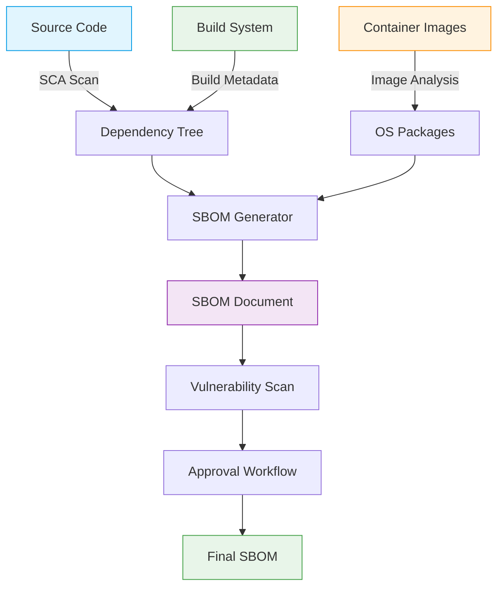
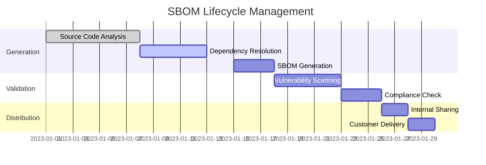
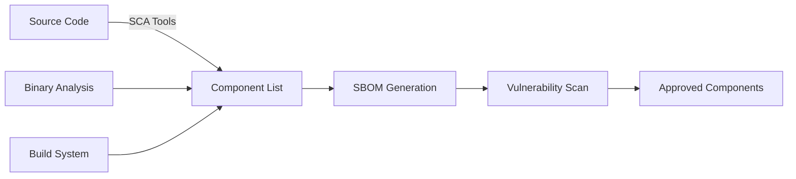
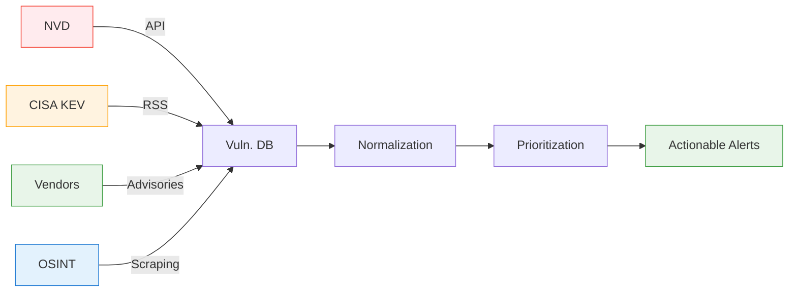
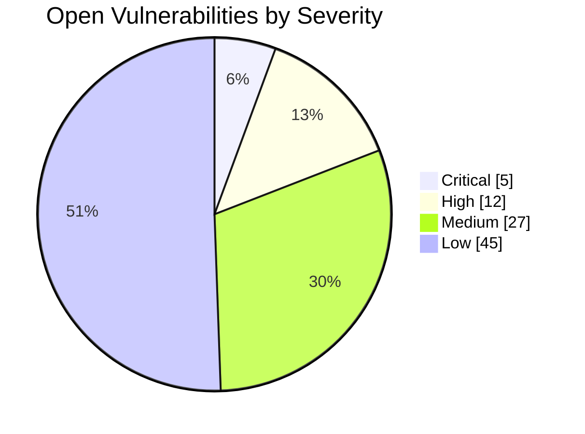
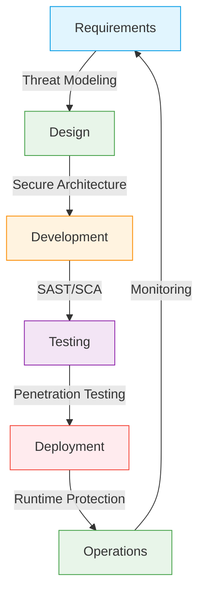
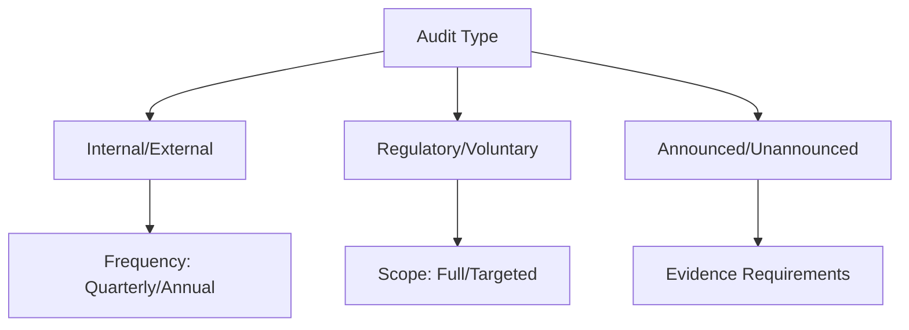

# Software Bill of Materials (SBOM)

## Overview
This document establishes the framework for creating and maintaining a comprehensive Software Bill of Materials (SBOM) for all software components used in nuclear facility control systems. The SBOM serves as a foundational element for software supply chain security, vulnerability management, and regulatory compliance.

## Table of Contents
1. [SBOM Requirements](#1-sbom-requirements)
2. [Component Identification](#2-component-identification)
3. [Vulnerability Management](#3-vulnerability-management)
4. [Supply Chain Security](#4-supply-chain-security)
5. [Compliance & Reporting](#5-compliance--reporting)
6. [Implementation Guidelines](#6-implementation-guidelines)
7. [Maintenance & Updates](#7-maintenance--updates)

## 1. SBOM Requirements

### 1.1 Minimum Required Fields
| Field | Description | Example |
|-------|-------------|---------|
| Supplier | Component vendor | "Red Hat, Inc." |
| Component Name | Software name | "Red Hat Enterprise Linux" |
| Version | Exact version | "8.5" |
| Unique Identifier | CPE, PURL, or SWID | "cpe:2.3:o:redhat:enterprise_linux:8.5:*:*:*:*:*:*:*" |
| Dependencies | Required components | "openssl >= 1.1.1k" |
| License | Software license | "GPL-2.0-only" |
| Author | Component author | "Red Hat, Inc." |
| Hash | Cryptographic hash | "sha256:abc123..." |

### 1.2 SBOM Formats
- **SPDX** (Software Package Data Exchange)
- **CycloneDX**
- **SWID Tags** (ISO/IEC 19770-2)
- **In-Toto**

## 2. SBOM Generation & Management

### 2.1 SBOM Generation Process

#### 2.1.1 Automated Generation Workflow


#### 2.1.2 Generation Tools Comparison
| Tool | Format Support | Language Coverage | Integration | Best For |
|------|----------------|-------------------|-------------|-----------|
| Syft | SPDX, CycloneDX | 20+ languages | CLI, CI/CD | Comprehensive scanning |
| SPDX-tools | SPDX | Multiple | Java API | Standard compliance |
| CycloneDX CLI | CycloneDX | 15+ languages | CLI, REST | Cloud-native |
| OWASP DC | CycloneDX | 15+ languages | Maven/Gradle | Java ecosystems |
| Snyk | Multiple | 10+ languages | SaaS, CI/CD | DevSecOps |

### 2.2 Component Identification

#### 2.2.1 Inventory Management


#### 2.2.2 Component Categories
| Category | Examples | Risk Level | SBOM Requirements |
|----------|----------|------------|-------------------|
| Operating System | RHEL, VxWorks | High | Full SBOM, Signatures |
| Middleware | Java, .NET | Medium | Version, Dependencies |
| Libraries | OpenSSL, glibc | Critical | Full SBOM, VEX |
| Applications | SCADA, HMI | High | Full SBOM, VEX |
| Development Tools | Compilers, IDEs | Low | Version, License |

### 2.3 SBOM Management System

#### 2.3.1 Core Components
- **Repository**: Central SBOM storage
- **Scanner**: Automated component detection
- **Analyzer**: Vulnerability and license analysis
- **Notifier**: Alerting on new vulnerabilities
- **Dashboard**: Visualization and reporting

#### 2.3.2 Integration Points
1. **CI/CD Pipeline Integration**
   - Automatic SBOM generation on build
   - Policy enforcement gates
   - Vulnerability scanning

2. **Vendor Management**
   - Supplier SBOM collection
   - Third-party component validation
   - Contractual requirements tracking

3. **Asset Management**
   - Component inventory
   - Version tracking
   - End-of-life monitoring

### 2.1 Inventory Management


### 2.2 Component Categories
| Category | Examples | Risk Level |
|----------|----------|------------|
| Operating System | RHEL, VxWorks | High |
| Middleware | Java, .NET | Medium |
| Libraries | OpenSSL, glibc | Critical |
| Applications | SCADA, HMI | High |
| Development Tools | Compilers, IDEs | Low |

## 3. Vulnerability Management & Remediation

### 3.1 Vulnerability Intelligence Integration

#### 3.1.1 Data Sources
- **National Vulnerability Database (NVD)**
- **CISA Known Exploited Vulnerabilities (KEV)**
- **Vendor Advisories**
- **Open Source Intelligence (OSINT)**
- **Internal Security Research**

#### 3.1.2 Vulnerability Intelligence Feed


### 3.2 Risk Assessment Framework

#### 3.2.1 CVSS v3.1 Scoring
| Metric | Description | Weight |
|--------|-------------|---------|
| **Base Score** | Intrinsic characteristics | 40% |
| **Temporal** | State of exploit techniques | 20% |
| **Environmental** | Organization-specific impact | 40% |

#### 3.2.2 Nuclear-Specific Risk Factors
- **Safety Impact**: Potential to affect nuclear safety functions
- **Security Impact**: Potential for cyber attack vector
- **Operational Impact**: Effect on plant operations
- **Regulatory Impact**: Compliance implications

### 3.3 Vulnerability Remediation Workflow

#### 3.3.1 Patch Management Process

```mermaid
gantt
    title Vulnerability Remediation Timeline
    dateFormat  YYYY-MM-DD
    section Critical (CVSS ≥ 9.0)
    Triage & Analysis    :crit, active, vuln1, 2023-01-01, 1d
    Emergency Change     :crit, vuln2, after vuln1, 3d
    Verification        :crit, vuln3, after vuln2, 1d
    
    section High (7.0-8.9)
    Triage & Analysis    :active, vuln4, 2023-01-05, 3d
    Scheduled Patch     :vuln5, after vuln4, 7d
    Verification       :vuln6, after vuln5, 2d
    
    section Medium (4.0-6.9)
    Triage & Analysis  :vuln7, 2023-01-15, 5d
    Next Maintenance   :vuln8, after vuln7, 30d
    
    section Low (0.1-3.9)
    Monitor           :vuln9, 2023-01-20, 90d
```


#### 3.3.2 Compensating Controls
When immediate patching isn't possible:
- **Network Segmentation**: Isolate affected systems
- **Access Controls**: Restrict access to vulnerable components
- **Intrusion Prevention**: Deploy signatures to block exploits
- **Enhanced Monitoring**: Increase logging and alerting

### 3.4 Vulnerability Exploitability eXchange (VEX)

#### 3.4.1 VEX Status Types
| Status | Description | Action Required |
|--------|-------------|------------------|
| Not Affected | No vulnerability impact | Document rationale |
| Affected | Vulnerability confirmed | Apply remediation |
| Fixed | Patch available | Apply update |
| Under Investigation | Analysis pending | Monitor for updates |

#### 3.4.2 VEX Implementation
```json
{
  "bomFormat": "CycloneDX",
  "specVersion": "1.4",
  "metadata": {
    "timestamp": "2023-01-15T12:00:00Z",
    "tools": [{"vendor": "Nuklei", "name": "VEX Generator"}]
  },
  "vulnerabilities": [{
    "id": "CVE-2023-12345",
    "analysis": {
      "state": "not_affected",
      "justification": "vulnerable_code_not_in_execute_path"
    },
    "affects": [{
      "ref": "pkg:maven/org.acme/library@1.0.0"
    }]
  }]
}
```

### 3.5 Metrics & Reporting

#### 3.5.1 Key Performance Indicators
- **Mean Time to Detect (MTTD)**: < 24 hours for critical vulnerabilities
- **Mean Time to Remediate (MTTR)**: 
  - Critical: < 7 days
  - High: < 30 days
  - Medium: < 90 days
- **Vulnerability Density**: < 1 critical/high per MB of code

#### 3.5.2 Executive Dashboard


### 3.1 Vulnerability Assessment
- **CVSS Scoring**: Base, Temporal, Environmental
- **Exploitability Metrics**:
  - Attack Vector (Network/Adjacent/Local/Physical)
  - Attack Complexity (Low/High)
  - Privileges Required (None/Low/High)
  - User Interaction (None/Required)
  - Scope (Changed/Unchanged)

### 3.2 Risk Mitigation
| Risk Level | Action | Timeline |
|------------|--------|----------|
| Critical | Immediate patch/isolate | 72 hours |
| High | Patch during next maintenance | 30 days |
| Medium | Schedule update | 90 days |
| Low | Monitor | Next upgrade |

## 4. Supply Chain Security & Integrity

### 4.1 Secure Software Development Lifecycle (SSDLC)

#### 4.1.1 SSDLC Phases


#### 4.1.2 Security Gates
| Phase | Security Control | Verification Method |
|-------|------------------|---------------------|
| Requirements | Security Requirements | Requirements Review |
| Design | Threat Modeling | Architecture Review |
| Development | SAST, SCA | Automated Scanning |
| Testing | DAST, IAST | Penetration Testing |
| Deployment | Infrastructure as Code | Policy as Code |
| Operations | Runtime Protection | Continuous Monitoring |

### 4.2 Third-Party Risk Management

#### 4.2.1 Vendor Assessment Framework
| Criteria | High Risk | Medium Risk | Low Risk |
|----------|-----------|-------------|----------|
| **Security Posture** | Certified (ISO 27001) | Self-Assessed | No Certification |
| **Vulnerability History** | Multiple Critical | Some High | Minimal |
| **Patch Cadence** | < 7 days | < 30 days | > 30 days |
| **Support Availability** | 24/7 | Business Hours | Limited |

#### 4.2.2 Contractual Requirements
- **Software Composition Analysis (SCA)** requirements
- **SBOM Delivery** requirements
- **Vulnerability Disclosure** policies
- **Penetration Testing** requirements
- **Incident Response** SLAs

### 4.3 Secure Build & Deployment

#### 4.3.1 Build Integrity
- **Reproducible Builds**: Verifiable build process
- **Build Pipeline Security**:
  - Isolated build environments
  - Immutable build artifacts
  - Cryptographic signing
  - Chain of custody

#### 4.3.2 Deployment Security
| Control | Implementation | Verification |
|---------|----------------|--------------|
| **Code Signing** | Digital signatures on all artifacts | Signature verification |
| **Immutable Infrastructure** | No direct access to production | Infrastructure as Code |
| **Secrets Management** | Centralized secrets storage | Regular rotation |
| **Deployment Verification** | Automated validation | Policy checks |

### 4.4 Supply Chain Attack Mitigations

#### 4.4.1 Common Attack Vectors
1. **Typosquatting**: Malicious packages mimicking legitimate ones
2. **Dependency Confusion**: Public package registry attacks
3. **Build System Compromise**: Malicious build scripts
4. **CI/CD Pipeline Attacks**: Compromised deployment processes

#### 4.4.2 Mitigation Strategies
- **Artifact Signing**: All artifacts must be signed
- **Dependency Pinning**: Exact version locking
- **Air-Gapped Repositories**: Internal package mirrors
- **Multi-Person Verification**: 4-eyes principle for critical updates

### 4.5 Case Study: SolarWinds-Style Attack Prevention

#### 4.5.1 Attack Simulation
- **Initial Access**: Compromised build system
- **Lateral Movement**: Privilege escalation
- **Persistence**: Backdoored updates
- **Exfiltration**: Data theft

#### 4.5.2 Prevention Controls
1. **Build System Hardening**:
   - Isolated build environments
   - Multi-party code review
   - Binary provenance verification

2. **Update Security**:
   - Code signing requirements
   - Update package verification
   - Canary deployments

3. **Monitoring**:
   - Anomaly detection in build pipelines
   - Unexpected network connections
   - Unauthorized code changes

#### 4.5.3 Detection Mechanisms
- **Behavioral Analysis**: Detect anomalous build patterns
- **Binary Analysis**: Verify compiled artifacts
- **Network Monitoring**: Detect data exfiltration
- **File Integrity Monitoring**: Detect unauthorized changes

### 4.6 Continuous Assurance

#### 4.6.1 Automated Verification
- **SBOM Verification**: Validate against known vulnerabilities
- **Policy as Code**: Enforce security policies
- **Compliance Scanning**: Continuous compliance monitoring

#### 4.6.2 Supply Chain Risk Scoring
```mermaid
radarChart
    title Supply Chain Risk Assessment
    axis Vendor Reputation, Security Posture, Patch Cadence, Compliance, Incident Response
    Vendor A: 8, 7, 6, 9, 7
    Vendor B: 5, 6, 4, 7, 5
    Vendor C: 9, 8, 8, 9, 8
    scale 0,10
    fill opacity 0.2
    stroke-width 2
```

### 4.1 Vendor Requirements
- **Code Signing**: All binaries must be signed
- **Vulnerability Disclosure**: 90-day disclosure policy
- **Patch Management**: Timely security updates
- **Source Code Access**: Escrow for critical components

### 4.2 Build Environment Security
- **Reproducible Builds**: Verifiable build process
- **Dependency Verification**: Signed package repositories
- **Build Integrity**: Protected CI/CD pipelines
- **Artifact Signing**: All build outputs signed

## 5. Compliance, Auditing & Reporting

### 5.1 Regulatory Framework Mapping

#### 5.1.1 Nuclear-Specific Regulations
| Regulation | SBOM Requirements | Implementation |
|------------|-------------------|----------------|
| **10 CFR 73.54** | Cyber Security Controls | Documented SBOM processes |
| **RG 5.71** | Digital Computer Software | SBOM for safety-related software |
| **NEI 08-09** | Cyber Security Plan | SBOM in configuration management |
| **NRC 10 CFR 50** | Quality Assurance | SBOM as part of QA records |

#### 5.1.2 Industry Standards
| Standard | Section | SBOM Relevance |
|----------|---------|----------------|
| **IEC 62243** | 4.2.3 | Software configuration management |
| **IEC 61513** | 6.7.12 | Software verification and validation |
| **NIST SP 800-53** | SA-12 | Supply chain protection |
| **NIST SP 800-161** | 3.1 | Supply chain risk management |

### 5.2 Audit Framework

#### 5.2.1 Audit Types


#### 5.2.2 Audit Preparation Checklist
- [ ] **Documentation Review**
  - SBOM inventory completeness
  - Vulnerability management records
  - Patch management logs
  - Change control documentation

- [ ] **Technical Verification**
  - SBOM accuracy verification
  - Access control validation
  - Build/release process audit
  - Backup and recovery testing

### 5.3 Compliance Monitoring

#### 5.3.1 Continuous Compliance Framework
| Control Area | Metrics | Monitoring Frequency |
|--------------|---------|----------------------|
| **SBOM Accuracy** | Component coverage % | Real-time |
| **Vulnerability Mgmt** | Time to remediate | Daily |
| **Patch Compliance** | % systems patched | Weekly |
| **Policy Adherence** | Policy violations | Real-time |

#### 5.3.2 Automated Compliance Tools
- **Policy as Code**: Open Policy Agent (OPA)
- **SBOM Validation**: In-toto, TUF
- **Compliance Scanning**: OpenSCAP, Chef InSpec
- **Evidence Collection**: GRC platforms

### 5.4 Reporting Requirements

#### 5.4.1 Standard Reports
1. **Executive Summary**
   - Compliance status overview
   - Risk exposure
   - Resource allocation

2. **Technical Report**
   - SBOM completeness metrics
   - Vulnerability trends
   - Remediation progress
   - Policy violations

#### 5.4.2 Regulatory Submissions
| Report | Frequency | Recipient | Format |
|--------|-----------|-----------|--------|
| Annual SBOM | Annual | NRC | XML/JSON |
| Vulnerability Report | Quarterly | INPO | PDF/CSV |
| Patch Compliance | Monthly | Internal | Dashboard |
| Audit Findings | Per Audit | Regulators | DOCX/PDF |

### 5.5 Audit Response Process

#### 5.5.1 Finding Remediation
1. **Triage**
   - Severity assessment
   - Impact analysis
   - Root cause identification

2. **Remediation Planning**
   - Action items
   - Resource allocation
   - Timeline development

3. **Verification**
   - Testing procedures
   - Evidence collection
   - Sign-off process

#### 5.5.2 Continuous Improvement
- **Lessons Learned**
  - Post-audit review
  - Process improvements
  - Training updates

- **Trend Analysis**
  - Recurring issues
  - Common vulnerabilities
  - Control effectiveness

### 5.6 Evidence Management

#### 5.6.1 Documentation Requirements
- **SBOM Records**: 10 years minimum
- **Audit Logs**: 3-7 years
- **Vulnerability Scans**: 5 years
- **Remediation Evidence**: 7 years

#### 5.6.2 Digital Chain of Custody
```mermaid
sequenceDiagram
    participant Dev as Developer
    participant CI as CI/CD
    participant Repo as Artifact Repo
    participant Audit as Audit System
    
    Dev->>+CI: Commits Code
    CI->>+Repo: Builds & Signs Artifact
    Repo->>Audit: Logs Metadata
    Audit->>Audit: Generates Proof
    Audit-->>-Repo: Attests Signature
    Repo-->>-CI: Returns Receipt
    CI-->>-Dev: Build Status
```

### 5.7 Training & Awareness

#### 5.7.1 Role-Based Training
| Role | Training Focus | Frequency |
|------|----------------|-----------|
| Developers | Secure Coding, SBOM Generation | Annually |
| Operations | SBOM Verification, Patching | Bi-annually |
| Management | Compliance Reporting | Quarterly |
| Auditors | Evidence Collection | Per Audit |

#### 5.7.2 Certification Requirements
- **SBOM Practitioners**: Certified SBOM Professional (CSP)
- **Auditors**: Certified Information Systems Auditor (CISA)
- **Security Staff**: CISSP, CCSP
- **Developers**: Secure Software Development certifications

### 5.1 Regulatory Requirements
- **NRC 10 CFR 73.54**: Cybersecurity requirements
- **NIST SP 800-161**: Cybersecurity Supply Chain Risk Management
- **Executive Order 14028**: Improving the Nation's Cybersecurity
- **NTIA Minimum Elements for SBOM**

### 5.2 Audit Requirements
- **Frequency**: Quarterly internal, annual external
- **Scope**: All production systems
- **Retention**: 3 years of SBOM history
- **Evidence**: SBOM attestations, vulnerability scans

## 6. Implementation Guidelines

### 6.1 Tooling Recommendations
| Tool | Purpose | License |
|------|---------|---------|
| OWASP Dependency-Check | Dependency analysis | Apache 2.0 |
| Syft | SBOM generation | Apache 2.0 |
| Grype | Vulnerability scanning | Apache 2.0 |
| Tern | Container image analysis | BSD-2-Clause |
| SPDX Tools | SBOM validation | Apache 2.0 |

### 6.2 Integration with CI/CD
```yaml
# Example GitHub Actions Workflow
name: SBOM Generation
on: [push, pull_request]

jobs:
  generate-sbom:
    runs-on: ubuntu-latest
    steps:
    - uses: actions/checkout@v3
    - name: Generate SBOM
      uses: anchore/sbom-action@v0.13.4
      with:
        image: ${{ github.repository }}
        format: spdx-json
    - name: Scan for vulnerabilities
      uses: anchore/scan-action@v3
      with:
        image: ${{ github.repository }}
        severity-cutoff: high
```

## 7. Maintenance & Updates

### 7.1 Update Procedures
1. **Identification**: Monitor for new vulnerabilities
2. **Assessment**: Determine impact and risk
3. **Planning**: Schedule update window
4. **Testing**: Verify in staging environment
5. **Deployment**: Apply updates
6. **Verification**: Confirm system stability
7. **Documentation**: Update SBOM and change logs

### 7.2 Retention Policy
| Record Type | Retention Period |
|-------------|------------------|
| SBOM Versions | 10 years |
| Vulnerability Scans | 3 years |
| Audit Logs | 7 years |
| Build Artifacts | 5 years |

## Appendices

### A. SBOM Examples
- SPDX JSON example
- CycloneDX XML example
- SWID tag example

### B. Vulnerability Management Process
- Risk assessment workflow
- Exception handling
- Emergency patching procedure

### C. Supplier Security Requirements
- Secure development practices
- Vulnerability disclosure policy
- Incident response requirements

### D. Revision History
| Version | Date | Changes |
|---------|------|---------|
| 1.0.0 | 2025-06-13 | Initial version |

## Contact
For SBOM-related inquiries: sbom@nuklei.org
