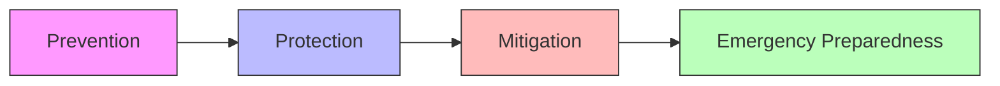
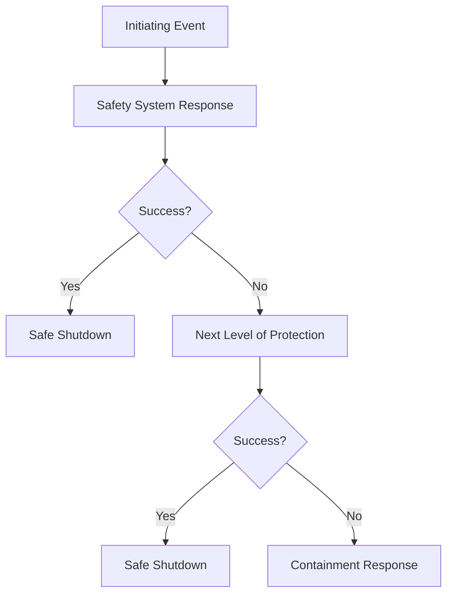

# Deterministic Safety Approach

This document outlines the deterministic safety methodology employed in the Nuklei framework, ensuring robust protection against design basis accidents through multiple, independent safety systems and defense-in-depth principles.

## Core Principles

### 1. Defense in Depth

*Figure 1: Defense in Depth Concept*

### 2. Multiple Barrier Concept
- Fuel Matrix
- Cladding
- Reactor Coolant System Boundary
- Containment Structure

## Design Basis Accidents (DBAs)

### 2.1 Classification of DBAs
1. **Anticipated Operational Occurrences (AOOs)**
   - Turbine trip
   - Loss of off-site power
   - Minor reactivity excursions

2. **Postulated Initiating Events (PIEs)**
   - Loss of Coolant Accidents (LOCA)
   - Reactivity Insertion Accidents (RIA)
   - Steam Generator Tube Rupture (SGTR)

### 2.2 Safety Analysis

*Figure 2: Safety System Response Logic*

## Safety Classification

### 3.1 Safety Classes
- **Class 1**: Components whose failure could cause or allow unacceptable radiation release
- **Class 2**: Components that provide secondary protection
- **Class 3**: Components important to safety but with less severe consequences
- **Non-Nuclear Safety (NNS)**: Not safety-related but important for operations

### 3.2 Single Failure Criterion
- Safety systems must perform their function with any single active component failure
- Applies to all safety-related systems
- Includes consideration of common cause failures

## Implementation Requirements

### 4.1 Design Requirements
- Redundancy (N+2 or 2x100%)
- Diversity (different operating principles)
- Physical separation
- Environmental qualification

### 4.2 Testing and Maintenance
- Pre-service inspection
- In-service inspection programs
- Surveillance testing
- Maintenance rule compliance

## Regulatory Framework
- 10 CFR 50 Appendix A
- IAEA SSR-2/1
- EUR Document Volume 2

## References
1. IAEA Safety Standards Series No. SSG-2
2. NUREG-0800, Chapter 15
3. ASME Boiler and Pressure Vessel Code, Section III
