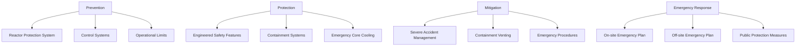
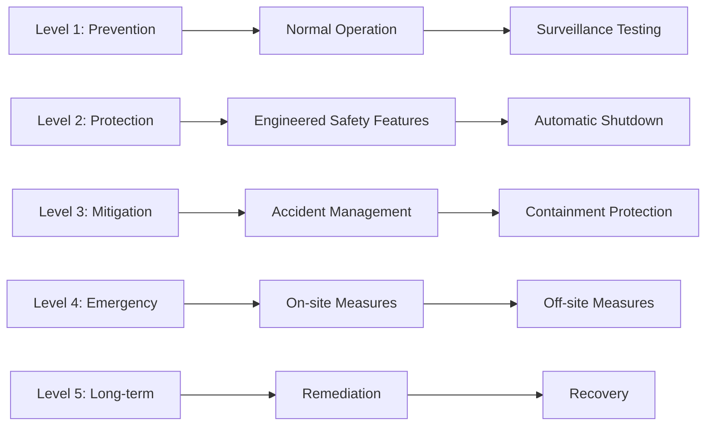
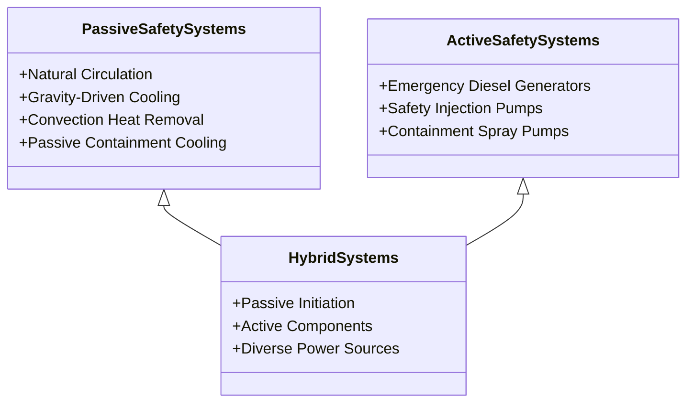
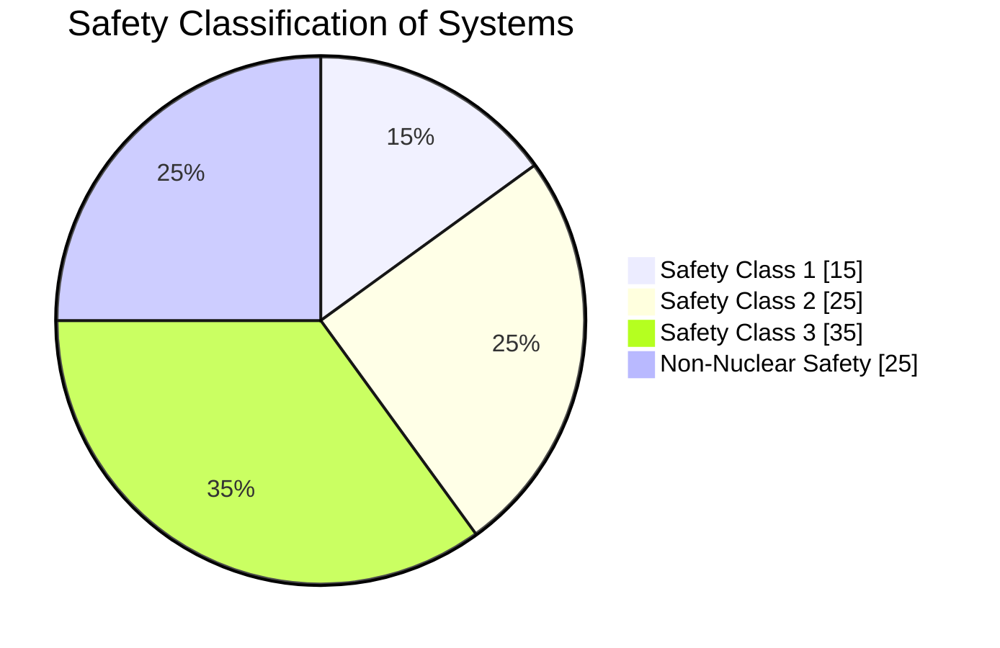
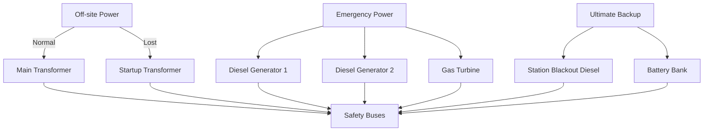
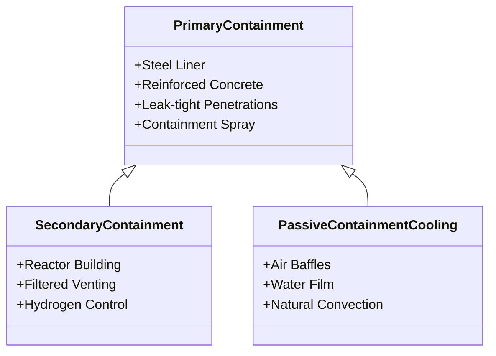
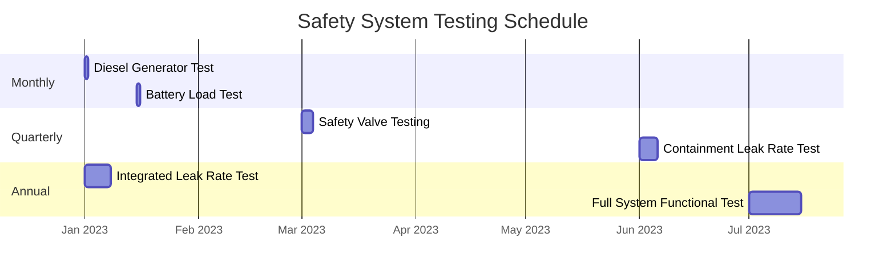
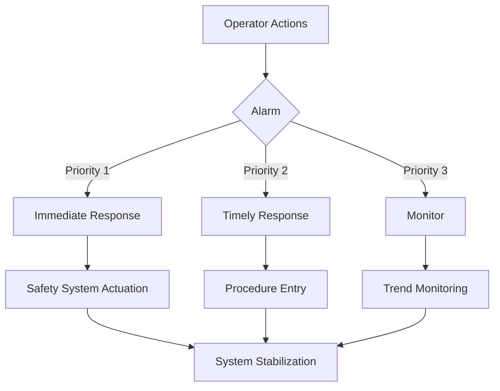
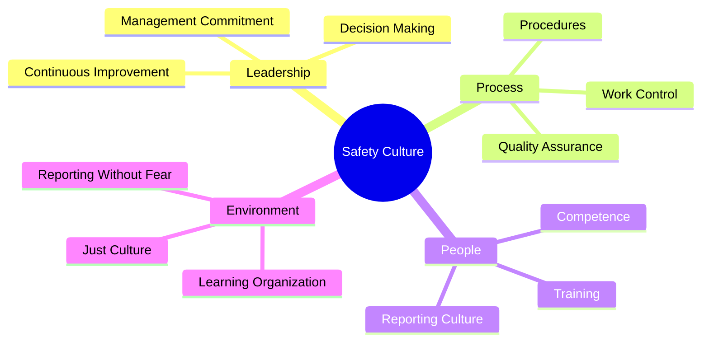

# Safety Systems Architecture

## 1. Overall Safety Architecture



*Figure 1: Multi-Level Safety Architecture*

## 2. Defense in Depth Concept



*Figure 2: Defense in Depth Implementation*

## 3. Passive Safety System Integration



*Figure 3: Safety System Classification*

## 4. Severe Accident Management Framework

```mermaid
gantt
    title Severe Accident Management Timeline
    dateFormat  HH:mm
    axisFormat %H:%M
    
    section Core Protection
    Core Uncovery : 00:00, 15m
    Core Damage : 00:30, 1h
    Molten Core Formation : 01:30, 2h
    
    section Containment
    Hydrogen Generation : 00:45, 4h
    Containment Challenge : 02:00, 6h
    Overpressure Risk : 04:00, 8h
    
    section Mitigation
    Water Injection : 00:15, 8h
    Depressurization : 00:45, 2h
    Containment Venting : 03:00, 4h
```



*Figure 4: Severe Accident Progression and Response*

## 5. Safety System Redundancy

```mermaid
xychart-beta
    title Safety System Redundancy
    x-axis "System"
    y-axis "Redundancy (N+?)" 0, 1, 2, 3, 4
    bar [2, 3, 2, 4, 3]
    x-axis-labels "ECCS", "Containment Cooling", "Power Supply", "Control Systems", "Instrumentation"
```

*Figure 5: Redundancy Levels in Safety Systems*

## 6. Safety Classification



*Figure 6: Distribution of Safety Classifications*

## 7. Emergency Power Systems



*Figure 7: Electrical Power Distribution for Safety Systems*

## 8. Containment Systems



*Figure 8: Containment System Components*

## 9. Safety System Testing



*Figure 9: Testing and Maintenance Schedule*

## 10. Safety System Response Times

```mermaid
xychart-beta
    title Safety System Response Times (seconds)
    x-axis "System"
    y-axis "Time (s)" 0, 10, 20, 30, 40, 50, 60
    bar [2, 15, 5, 30, 45]
    x-axis-labels "Reactor Trip", "Safety Injection", "Containment Isolation", "Emergency Power Start", "Containment Spray"
```

*Figure 10: Safety System Response Characteristics*

## 11. Human-System Interface



*Figure 11: Human-System Interaction Flow*

## 12. Safety Culture Framework



*Figure 12: Safety Culture Components*
