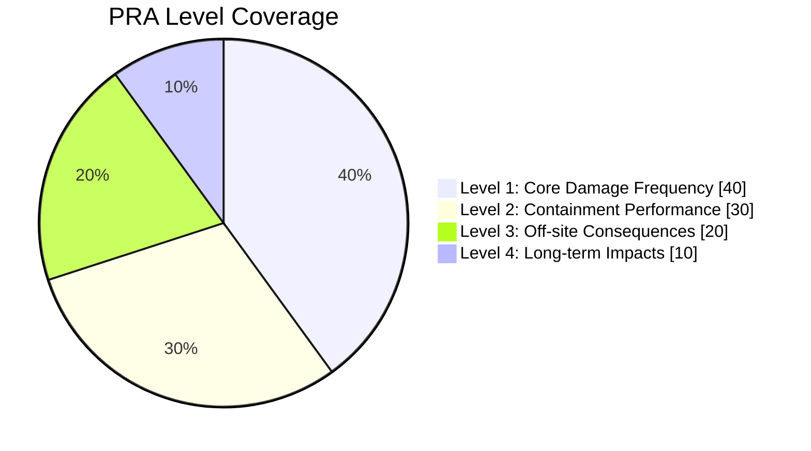

# Probabilistic Risk Assessment (PRA)

This document outlines the Probabilistic Risk Assessment methodology used in the Nuklei framework to evaluate and manage risks in nuclear facility design and operation.

## 1. PRA Overview

### 1.1 Definition and Purpose
- Systematic methodology for evaluating risk
- Quantifies likelihood and consequences of potential accidents
- Supports risk-informed decision making
- Complements deterministic safety analysis

### 1.2 PRA Levels



*Figure 1: PRA Level Coverage*

## 2. PRA Methodology

### 2.1 Key Components
1. **Initiating Events Analysis**
   - Identification of potential initiating events
   - Frequency estimation
   - Grouping by plant response

2. **Event Sequence Development**
   - Success/failure paths
   - System interactions
   - Human actions

3. **System Modeling**
   - Fault tree analysis
   - Common cause failures
   - Support system dependencies

### 2.2 Quantitative Analysis

#### 2.2.1 Core Damage Frequency (CDF)
- Target: <1E-4 per reactor-year
- Calculation methodology
- Uncertainty analysis

#### 2.2.2 Large Early Release Frequency (LERF)
- Target: <1E-5 per reactor-year
- Containment performance assessment
- Source term estimation

## 3. Tools and Techniques

### 3.1 Analysis Methods
- Fault Tree Analysis (FTA)
- Event Tree Analysis (ETA)
- Common Cause Failure (CCF) Analysis
- Human Reliability Analysis (HRA)

### 3.2 Software Tools
- SAPHIRE (NRC)
- RiskSpectrum (KTH)
- CAFTA (EPRI)
- OpenPSA (Open Source)

## 4. Risk Metrics and Acceptance Criteria

### 4.1 Risk Metrics
- Core Damage Frequency (CDF)
- Large Early Release Frequency (LERF)
- Risk Achievement Worth (RAW)
- Risk Reduction Worth (RRW)
- Fussell-Vesely Importance

### 4.2 Acceptance Criteria

```mermaid
xychart-beta
    title Risk Metrics and Acceptance Criteria
    x-axis "Metric"
    y-axis "Value" 0, 1E-6, 1E-5, 1E-4, 1E-3, 1E-2, 1E-1, 1
    bar [1E-4, 1E-5, 1E-3, 1E-2]
    x-axis-labels "CDF (1/yr)", "LERF (1/yr)", "Individual Risk (1/yr)", "Population Risk (person-rem/yr)"
    annotations ["<1E-4", "<1E-5", "<1E-3", "<1E2"]
```

*Figure 2: Risk Metrics and Acceptance Criteria*

## 5. Applications of PRA

### 5.1 Design Optimization
- Identification of risk-significant systems and components
- Evaluation of design alternatives
- Cost-benefit analysis of safety improvements

### 5.2 Risk-Informed Decision Making
- In-service inspection planning
- Technical specification optimization
- Maintenance rule implementation
- Configuration risk management

## 6. Case Studies

### 6.1 AP1000 PRA
- Advanced passive safety features
- CDF: 2.4E-7 per reactor-year
- Key risk insights and design improvements

### 6.2 EPR PRA
- Four-train safety systems
- CDF: 6.1E-7 per reactor-year
- Comparison with evolutionary designs

## 7. Regulatory Framework
- 10 CFR 50.69 (Risk-Informed Categorization)
- RG 1.200 (PRA Standard)
- ASME/ANS RA-S-1.1 (PRA Standard)
- IAEA SSG-3 (Development and Application of Level 1 PRA)

## 8. References
1. NUREG/CR-2300 (PRA Procedures Guide)
2. IAEA-TECDOC-1511 (Advances in PRA)
3. EPRI 3002002184 (PRA Standard)
4. ASME/ANS RA-S-1.1 (PRA Standard)
