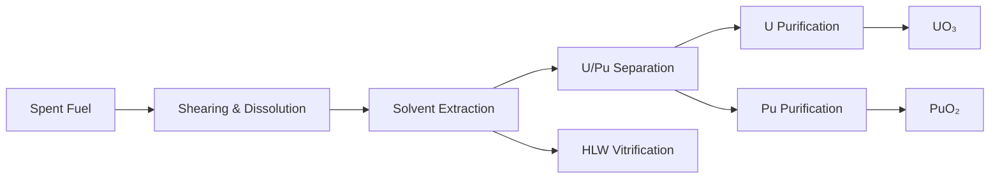

# Back-End & Advanced Recycling

## 1. Spent Fuel Management

### 1.1 Storage Solutions

#### 1.1.1 Wet Storage
- **Design Criteria**:
  - Pool dimensions: 12m x 12m x 12m (typical PWR)
  - Water depth: ≥8m (2m shielding above fuel)
  - Boron concentration: 2000-2500 ppm
  - Temperature: <50°C
  - Cooling capacity: 2-4 MWth (per 1000 MWe)

#### 1.1.2 Dry Cask Storage
| Parameter | Metal Casks | Concrete Casks | Vault Storage |
|-----------|-------------|----------------|---------------|
| Capacity | 21-32 PWR | 24-44 PWR | 200-400 PWR |
| Design Life | 100 years | 100 years | 100 years |
| Heat Load | 15-45 kW | 15-45 kW | 45-150 kW |
| Shielding | 30 cm steel | 1.5 m concrete | 2 m concrete |
| Cost ($/tHM) | 200-400 | 300-500 | 150-300 |

### 1.2 Transportation
- **Cask Design**:
  - Type B(U) packages (IAEA SSR-6)
  - 9m drop test (regulatory requirement)
  - 800°C fire test (30 minutes)
  - Submersion test (15m, 8 hours)

- **Security Requirements**:
  - GPS tracking
  - Real-time monitoring
  - Armed escort (HEU/MOX)
  - Route planning (avoid urban areas)

## 2. Advanced Recycling Technologies

### 2.1 Aqueous Reprocessing (PUREX)

### 2.2 Pyroprocessing
- **Process Steps**:
  1. Electrorefining (LiCl-KCl, 500°C)
  2. Cathode processing (Cd distillation)
  3. Metal fuel fabrication

- **Recovery Rates**:
  - U: >98%
  - TRU: >99.9%
  - Fission products: >99.99% separation

### 2.3 Partitioning & Transmutation
| Isotope | Half-life | Transmutation Target | Reduction Factor |
|---------|-----------|----------------------|------------------|
| ²³⁷Np | 2.14M y | ²³⁸Pu | 100-1000x |
 | ²⁴¹Am | 432 y | ²⁴²Pu | 50-200x |
 | ²⁴³Am | 7.37k y | ²⁴⁴Pu | 100-500x |
 | ²⁴⁵Cm | 8.5k y | ²⁴⁶Cm | 200-1000x |

## 3. Waste Classification & Treatment

### 3.1 Waste Categories (IAEA GSG-1)
| Category | Activity Level | Typical Sources | Disposal Method |
|----------|----------------|------------------|-----------------|
| **HLW** | >4 GBq/t α | Spent fuel, PUREX raffinate | Deep geological |
| **ILW** | 4 GBq-4 MBq/t α | Reactor components, resins | Near-surface/geological |
| **LLW** | <4 MBq/t α | Protective clothing, tools | Near-surface |
| **VLLW** | <100 Bq/g | Demolition waste | Landfill |

### 3.2 Treatment Technologies
| Technology | Volume Reduction | Final Form | Leach Rate (g/m²d) |
|------------|------------------|-------------|-------------------|
| Vitrification | 4-10x | Borosilicate glass | 10⁻⁶-10⁻⁵ |
| Cementation | 1-2x | Cement matrix | 10⁻³-10⁻² |
| Bituminization | 3-5x | Bitumen composite | 10⁻⁴-10⁻³ |
| Plasma | 10-50x | Vitrified slag | 10⁻⁷-10⁻⁶ |

## 4. Advanced Fuel Cycles

### 4.1 MOX Fuel Fabrication
| Parameter | PWR-MOX | Fast Reactor MOX |
|-----------|---------|------------------|
| Pu Content | 5-10% | 20-30% |
| ²³⁹Pu/²⁴¹Pu | 60/40 | 70/30 |
| Burnup (GWd/t) | 50-60 | 100-150 |
| Fabrication Cost ($/kg) | 1500-2000 | 2500-3500 |

### 4.2 Inert Matrix Fuels
| Matrix | Thermal Conductivity (W/mK) | Swelling Rate (%/GWD) | Chemical Stability |
|--------|----------------------------|-----------------------|-------------------|
| MgO | 30-40 | 0.5-1.0 | Excellent |
| ZrO₂ | 2-3 | 0.2-0.5 | Good |
| SiC | 100-120 | 0.1-0.3 | Excellent |
| Mo | 130-140 | 0.8-1.2 | Good |

## 5. Environmental & Safety

### 5.1 Radiation Protection
- **Dose Limits**:
  - Workers: 20 mSv/year (5-year avg.)
  - Public: 1 mSv/year
  - Accidental: 100 mSv (lifetime)

### 5.2 Effluent Control
| Radionuclide | Release Limit (Bq/year) | Treatment Efficiency |
|--------------|-------------------------|----------------------|
| ¹³⁷Cs | 1E+10 | >99.9% |
 | ⁹⁰Sr | 1E+09 | >99.99% |
 | ²³⁹Pu | 1E+07 | >99.999% |
 | ³H | 1E+14 | >95% |

## 6. Regulatory Framework

### 6.1 International Standards
- **IAEA**:
  - GSR Part 5: Predisposal Management
  - SSR-5: Disposal of Radioactive Waste
  - GSG-3: Classification of Radioactive Waste

### 6.2 National Regulations
- **United States**:
  - 10 CFR Part 60: HLW Repository
  - 10 CFR Part 61: LLW Disposal
  - 10 CFR Part 63: Yucca Mountain

- **European Union**:
  - Council Directive 2011/70/EURATOM
  - Waste Directive 2011/70/Euratom

## 7. Future Directions

### 7.1 Advanced Separation
- **i-SANEX**: Improved actinide separation
- **GANEX**: Group actinide extraction
- **Pyroprocessing**: Molten salt systems

### 7.2 Advanced Reactors
| Reactor Type | Fuel Cycle | TRU Consumption | Waste Reduction |
|--------------|------------|-----------------|-----------------|
| SFR | Closed | 50-100 kg/GWe·y | 10-50x |
| MSR | Closed | 100-200 kg/GWe·y | 50-100x |
| ADS | Transmutation | 200-300 kg/GWe·y | 100-200x |

### 7.3 Digitalization
- Digital twins for waste management
- AI for process optimization
- Blockchain for waste tracking
- Predictive analytics for storage
