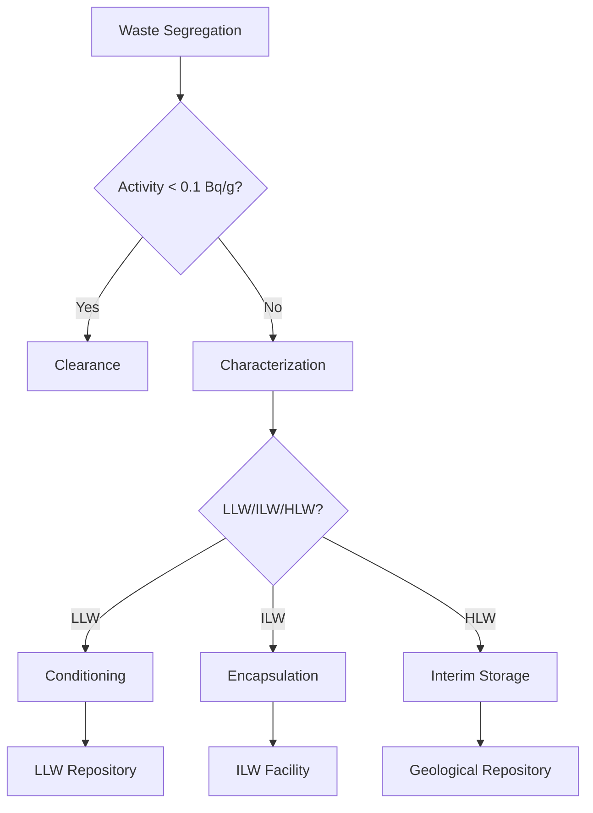

# Decommissioning Roadmap

## 1. Planning and Preparation

### 1.1 Pre-Decommissioning Activities

#### 1.1.1 Facility Characterization
- **Inventory Database**:
  - Reactor systems and components
  - Contamination levels (α, β, γ, n)
  - Hazardous materials (asbestos, PCBs, Hg)
  - Historical operational data

- **Radiological Mapping**:
  - Gamma scanning (10m grid)
  - Surface contamination (smear surveys)
  - Subsurface investigations
  - Airborne contamination assessment

### 1.2 Decommissioning Strategy Selection

| Strategy | Duration | Cost ($/kWe) | Waste Volume (m³/We) | Residual Risk |
|----------|----------|--------------|----------------------|---------------|
| **DECON** | 5-10 y | 300-500 | 0.03-0.05 | Low |
| **SAFSTOR** | 30-60 y | 100-300 | 0.02-0.04 | Medium |
| **ENTOMB** | 100+ y | 50-150 | 0.01-0.02 | High |
| **Hybrid** | 10-30 y | 200-400 | 0.025-0.045 | Medium-Low |

## 2. Dismantling and Decontamination

### 2.1 Dismantling Techniques

#### 2.1.1 Mechanical Methods
- **Thermal**: Plasma arc (4000-7000°C), oxy-fuel (3000°C)
- **Hydraulic**: 400-600 bar water jets
- **Abrasive**: 200-400 mesh grit blasting
- **Mechanical**: Diamond wire saws, disk cutters

#### 2.1.2 Remote Operations
- **Robotic Systems**:
  - Manipulators (6-7 DOF, 50-500kg capacity)
  - Crawlers (0.5-2 m/s, 360° cameras)
  - Drones (30-60 min flight time, LiDAR)

### 2.2 Decontamination Technologies

| Method | Application | DF* | Waste Volume | Cost ($/m²) |
|--------|-------------|-----|--------------|-------------|
| Chemical | Metal surfaces | 10-100 | Low | 500-2000 |
| Electrochemical | Vessels, pipes | 50-500 | Medium | 1000-3000 |
| Foam/Gel | Complex geometry | 5-20 | Very Low | 200-800 |
| Laser | Precision work | 100-1000 | Minimal | 3000-8000 |

*Decontamination Factor = Initial Activity/Final Activity

## 3. Waste Management

### 3.1 Waste Characterization Matrix

| Waste Stream | Activity (Bq/g) | Mass (tonnes/GWe) | Treatment | Disposal |
|--------------|-----------------|-------------------|-----------|----------|
| Metal | 10⁻⁴-10⁶ | 20,000-30,000 | Melting | LLW/Recycle |
| Concrete | 10⁻³-10⁴ | 200,000-300,000 | Crushing | LLW |
| Graphite | 10²-10⁷ | 2,000-3,000 | Conditioning | LLW/ILW |
| Ion Exchangers | 10⁴-10⁸ | 50-100 | Solidification | ILW |

### 3.2 Waste Processing Flow

- Record keeping
- Site reuse planning

## 4. Site Remediation

### 4.1 Cleanup Criteria

| Medium | Radionuclide | Cleanup Level (Bq/kg) | Reference |
|--------|--------------|----------------------|------------|
| Soil | Cs-137 | 0.1-0.3 | IAEA WS-G-5.1 |
 | Sr-90 | 0.04-0.1 | EPA 402-R-06-011 |
 | U-nat | 1.0-3.0 | NRC NUREG-1757 |
 Water | Gross α | 0.1 Bq/L | WHO Guidelines |
 | Gross β | 1.0 Bq/L | EPA 402-R-00-026 |

### 4.2 Remediation Technologies

| Technology | Depth (m) | Treatment Time | Cost ($/m³) | Efficiency |
|------------|-----------|----------------|-------------|------------|
| Excavation | 0-10 | Days-Weeks | 50-200 | >95% |
| Soil Washing | 0-5 | Weeks-Months | 100-300 | 70-90% |
| SVE** | 0-30 | Months-Years | 30-100 | 50-80% |
| PRB*** | 5-50 | Years | 200-500 | 60-90% |

**Soil Vapor Extraction  
***Permeable Reactive Barrier

## 5. Regulatory Framework

### 5.1 International Standards
- **IAEA Safety Standards**:
  - GSR Part 6: Decommissioning
  - WS-G-2.1: Release of Sites
  - SSG-47: Characterization for Decommissioning

### 5.2 National Regulations
- **United States**:
  - 10 CFR Part 20: Standards for Protection Against Radiation
  - 10 CFR Part 50.82: Termination of License
  - NUREG-1757: Consolidated Decommissioning Guidance

- **European Union**:
  - Council Directive 2013/59/EURATOM
  - IAEA Joint Convention on Safety of SNF Management

## 6. Project Management

### 6.1 Schedule and Milestones
- Critical path analysis
- Resource allocation
- Risk management
- Contingency planning

### 6.2 Cost Estimation
- Cost breakdown structure
- Uncertainty analysis
- Funding mechanisms
- Financial assurance

### 6.3 Quality Assurance
- Quality management system
- Inspection and testing
- Non-conformance management
- Records management

## 7. Case Studies and Lessons Learned
- Domestic decommissioning projects
- International experience
- Technology demonstrations
- Best practices

## 8. Future Directions
- Advanced decommissioning technologies
- Digital decommissioning tools
- Robotics and automation
- Knowledge management and transfer

## 9. Knowledge Management

### 9.1 Documentation Requirements
- **As-Built Drawings**: Updated to final conditions
- **Waste Records**: 30+ years retention
- **Radiological Data**: Final status survey reports
- **Lessons Learned**: Shared industry database

### 9.2 Training and Certification
- **Personnel**: 40 hours initial + 8h/year
- **Specialized Skills**: RWP, heavy lift, rad con
- **Simulators**: Virtual reality training
- **Certification**: ANSI/ANS 3.1, ISO 19443
