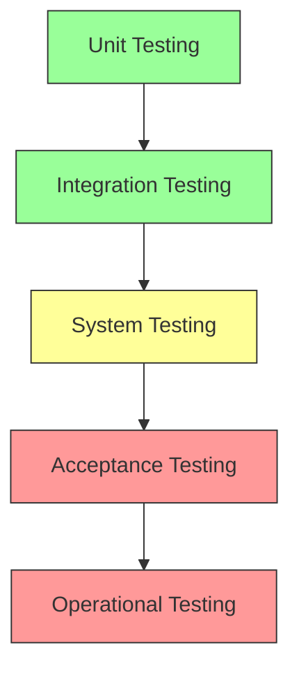
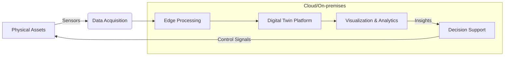

# Simulation, Testing, and Digital Twins

## 1. Executive Summary

This comprehensive framework establishes the approach for simulation, testing, and digital twin technologies in the design, operation, and maintenance of nuclear facilities. The integration of these technologies enables predictive maintenance, operational optimization, and enhanced safety through virtual representations of physical assets.

## 2. Strategic Objectives

### 2.1 Core Objectives
- **Safety Enhancement**: Predict and prevent potential failures
- **Operational Efficiency**: Optimize plant performance and maintenance
- **Cost Reduction**: Minimize downtime and extend asset life
- **Knowledge Preservation**: Capture and transfer operational knowledge
- **Regulatory Compliance**: Meet and exceed industry standards

### 2.2 Technology Stack

| Category | Technologies | Purpose |
|----------|--------------|----------|
| Simulation | ANSYS, RELAP, GSE, MAAP | System behavior analysis |
| Testing | Hardware-in-Loop, SIL, PIL | Verification & Validation |
| Digital Twins | Unity, Unreal, custom | Real-time monitoring |
| Data Analytics | Python, TensorFlow, PyTorch | Predictive analytics |
| Visualization | ParaView, Unity3D, WebGL | Data representation |

## 3. Simulation Framework

### 3.1 Simulation Types

| Type | Purpose | Tools | Accuracy |
|------|---------|-------|-----------|
| Full Scope | Operator training | GSE, WSC | High |
| Engineering | System analysis | RELAP, TRACE | Very High |
| CFD | Fluid dynamics | ANSYS Fluent, OpenFOAM | High |
| Neutronics | Core physics | MCNP, Serpent | Very High |
| Safety Analysis | Accident scenarios | MAAP, MELCOR | High |

### 3.2 Implementation Strategy

1. **Requirements Definition**
   - Regulatory requirements
   - Performance criteria
   - Interface specifications

2. **Model Development**
   - Physics-based modeling
   - Data-driven modeling
   - Hybrid approaches

3. **Verification & Validation**
   - Code verification
   - Solution verification
   - Validation against test data

## 4. Testing Methodologies

### 4.1 Testing Pyramid

### 4.2 Test Categories

| Category | Purpose | Tools |
|----------|---------|-------|
| Unit Testing | Component verification | Google Test, CppUTest |
| Integration Testing | Interface validation | Jenkins, GitLab CI |
| System Testing | End-to-end verification | TestStand, LabVIEW |
| Performance Testing | Load and stress testing | JMeter, Locust |
| Safety Testing | Failure mode analysis | FMEA, FTA tools |

## 5. Digital Twins Platform

### 5.1 Architecture

### 5.2 Implementation Layers

1. **Data Layer**
   - Real-time data acquisition
   - Historical data storage
   - Data quality management

2. **Model Layer**
   - Physics-based models
   - Machine learning models
   - Hybrid models

3. **Service Layer**
   - Analytics services
   - Simulation services
   - Visualization services

4. **Application Layer**
   - Monitoring dashboards
   - Predictive maintenance
   - Decision support systems

## 6. Integration Framework

### 6.1 Data Integration

| Data Source | Integration Method | Update Frequency |
|-------------|-------------------|------------------|
| SCADA | OPC UA, MQTT | Real-time |
| CMMS | REST API | Daily |
| Laboratory | CSV/Excel | Per test |
| Maintenance | Mobile Apps | Real-time |
| Weather | Public APIs | Hourly |

### 6.2 System Interfaces

| System | Interface Type | Protocol |
|--------|----------------|----------|
| DCS | OPC UA | TCP/IP |
| PLM | REST API | HTTPS |
| ERP | SOAP | HTTPS |
| Historian | ODBC | TCP/IP |
| GIS | WMS/WFS | HTTP |

## 7. Implementation Roadmap

### 7.1 Phase 1: Foundation (0-6 months)
- Requirements definition
- Technology selection
- Pilot implementation
- Team training

### 7.2 Phase 2: Expansion (6-18 months)
- Full-scale deployment
- Integration with existing systems
- Advanced analytics implementation
- Process optimization

### 7.3 Phase 3: Optimization (18-36 months)
- AI/ML model refinement
- Predictive capabilities
- Continuous improvement
- Knowledge transfer

## 8. Performance Metrics

### 8.1 Key Performance Indicators

| KPI | Target | Measurement Method |
|-----|--------|-------------------|
| Model Accuracy | >95% | Validation against test data |
| System Uptime | >99.9% | Monitoring system |
| Data Latency | <100ms | Performance testing |
| Prediction Accuracy | >90% | Historical comparison |
| User Satisfaction | >4/5 | Surveys |

### 8.2 Business Impact

| Metric | Target | Measurement Period |
|--------|--------|--------------------|
| Downtime Reduction | 30% | Annual |
| Maintenance Cost | 25% | Annual |
| Energy Efficiency | 15% | Annual |
| Safety Incidents | 50% | Annual |
| Regulatory Compliance | 100% | Continuous |

## 9. Risk Management

### 9.1 Risk Assessment

| Risk | Impact | Likelihood | Mitigation |
|------|--------|------------|------------|
| Data Quality Issues | High | Medium | Data validation |
| Model Drift | High | Medium | Continuous monitoring |
| Cybersecurity Threats | Critical | High | Security protocols |
| Integration Failures | High | Medium | API testing |
| Regulatory Changes | Medium | High | Compliance monitoring |

### 9.2 Contingency Planning
- Fallback procedures
- Data backup strategies
- Manual override capabilities
- Incident response plan
- Business continuity planning

## 10. Governance and Compliance

### 10.1 Regulatory Framework
- NRC Regulatory Guide 1.203
- IEEE 1012 (V&V)
- ASME V&V 20
- NQA-1 Quality Requirements
- 10 CFR Part 50/52

### 10.2 Quality Assurance
- Configuration management
- Version control
- Documentation standards
- Audit trails
- Change management

## 11. Appendices

### 11.1 Acronyms
- **CFD**: Computational Fluid Dynamics
- **DCS**: Distributed Control System
- **FMEA**: Failure Modes and Effects Analysis
- **HIL**: Hardware-in-the-Loop
- **M&S**: Modeling and Simulation
- **OPC UA**: Open Platform Communications Unified Architecture
- **PLM**: Product Lifecycle Management
- **SCADA**: Supervisory Control and Data Acquisition
- **SIL**: Software-in-the-Loop
- **V&V**: Verification and Validation

### 11.2 References
1. IAEA-TECDOC-1957: Advances in Modeling and Simulation for Nuclear Power Plants
2. EPRI 3002011562: Digital Twin Technology for Nuclear Power Plants
3. NUREG-0800: Standard Review Plan
4. ASME V&V 20: Standard for Verification and Validation in Computational Fluid Dynamics and Heat Transfer
5. ISO/IEC/IEEE 15288: Systems and software engineering - System life cycle processes
