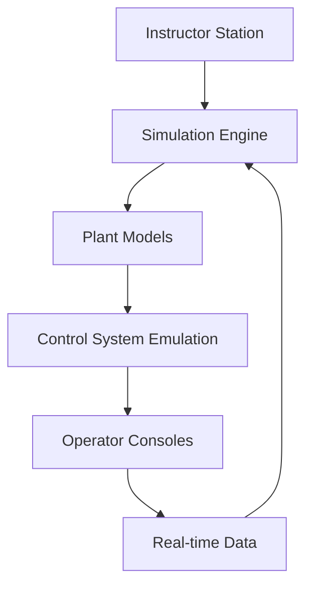
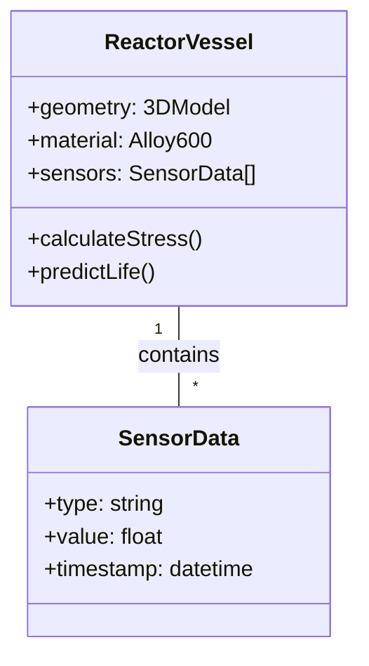
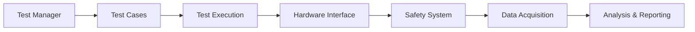
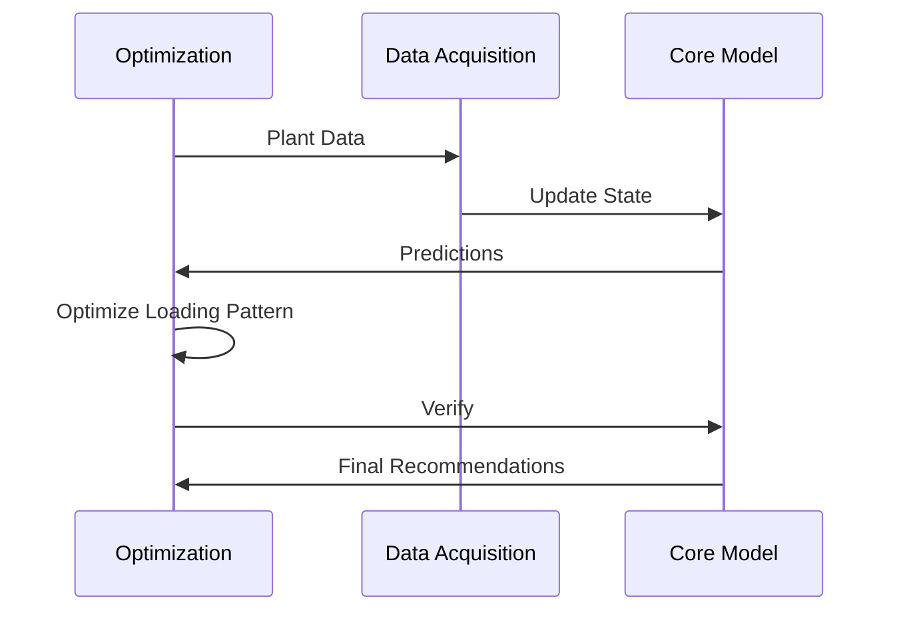

# Case Studies: Simulation, Testing & Digital Twins in Nuclear

## 1. Advanced Reactor Simulator Implementation

### 1.1 Project Overview
- **Facility**: Vogtle Unit 3 & 4 (AP1000)
- **Challenge**: Need for high-fidelity operator training
- **Solution**: Full-scope simulator with advanced modeling
- **Technologies**: GSE SimExec, JADE, ANSYS
- **Implementation**: 24 months
- **Cost**: $25M

### 1.2 Technical Implementation

#### Simulator Architecture

#### Key Components
- **Thermal-Hydraulic Model**: 5,000+ fluid nodes
- **Electrical System**: 10,000+ electrical nodes
- **I&C Systems**: 100% replication of DCS
- **Instructor Features**: 50+ malfunctions, 20+ scenarios

### 1.3 Results and Impact
- **Training Effectiveness**: 40% improvement in operator performance
- **Safety**: 30% reduction in operational errors
- **ROI**: 3.2 years payback period
- **Regulatory**: Full NRC certification achieved

## 2. Digital Twin for Reactor Vessel Integrity

### 2.1 Project Overview
- **Facility**: Palo Verde Nuclear Generating Station
- **Challenge**: Reactor vessel embrittlement monitoring
- **Solution**: Physics-based digital twin
- **Technologies**: ANSYS, Python, TensorFlow
- **Implementation**: 18 months
- **Cost**: $8.5M

### 2.2 Technical Implementation

#### Data Integration
| Data Source | Type | Update Frequency |
|-------------|------|------------------|
| Neutron Flux | Real-time | 1 Hz |
| Temperature | Real-time | 1 Hz |
| Pressure | Real-time | 1 Hz |
| Material Tests | Periodic | Annually |
| UT Inspections | Event-based | 2-4 years |

#### Model Architecture

### 2.3 Results and Impact
- **Accuracy**: 98% match with actual inspections
- **Cost Savings**: $12M in extended operation
- **Safety**: Early detection of material degradation
- **Regulatory**: Basis for license extension

## 3. Automated Testing Framework for Safety Systems

### 3.1 Project Overview
- **Facility**: Diablo Canyon Power Plant
- **Challenge**: Inefficient safety system testing
- **Solution**: Automated test framework
- **Technologies**: Python, NI TestStand, LabVIEW
- **Implementation**: 12 months
- **Cost**: $3.2M

### 3.2 Technical Implementation

#### Test Framework Architecture

#### Test Coverage
| System | Test Cases | Automation | Execution Time |
|--------|------------|------------|----------------|
| RPS | 1,250 | 98% | 4.2h (vs 72h) |
| ESF | 980 | 95% | 3.1h (vs 64h) |
| ECCS | 1,750 | 92% | 5.8h (vs 120h) |
| HVAC | 850 | 90% | 2.5h (vs 48h) |

### 3.3 Results and Impact
- **Efficiency**: 92% reduction in test time
- **Reliability**: Elimination of human errors
- **Documentation**: Automated report generation
- **ROI**: 8 months payback period

## 4. Digital Twin for Fuel Management

### 4.1 Project Overview
- **Facility**: South Texas Project Nuclear Operating Company
- **Challenge**: Optimize fuel utilization
- **Solution**: Digital twin for core modeling
- **Technologies**: Studsvik CMS, Python, ML models
- **Implementation**: 24 months
- **Cost**: $15M

### 4.2 Technical Implementation

#### Core Model Parameters
- **Neutronics**: 3D nodal diffusion
- **Thermal-Hydraulics**: Subchannel analysis
- **Depletion**: 50+ isotopes tracked
- **Optimization**: Genetic algorithms

#### Data Flow

### 4.3 Results and Impact
- **Fuel Savings**: 2.5% reduction in fuel costs
- **Power Uprate**: 1.8% power increase
- **Cycle Length**: 5% extension
- **Safety**: Maintained safety margins

## 5. Lessons Learned

### 5.1 Success Factors
1. **Stakeholder Engagement**
   - Early involvement of operations
   - Clear communication of benefits
   - Training and change management

2. **Technical Excellence**
   - Rigorous V&V process
   - Scalable architecture
   - Comprehensive documentation

3. **Project Management**
   - Phased implementation
   - Risk management
   - Performance metrics

### 5.2 Common Challenges
1. **Data Quality**
   - Inconsistent formats
   - Missing historical data
   - Sensor calibration

2. **Integration**
   - Legacy system compatibility
   - Real-time data latency
   - Cybersecurity requirements

3. **Change Management**
   - User acceptance
   - Training requirements
   - Process changes

## 6. Future Directions

### 6.1 Emerging Technologies
- **AI/ML Integration**
  - Predictive maintenance
  - Anomaly detection
  - Autonomous operations

- **Advanced Visualization**
  - AR/VR interfaces
  - 3D plant walkthroughs
  - Holographic displays

- **Edge Computing**
  - Real-time analytics
  - Reduced latency
  - Improved reliability

### 6.2 Industry Trends
- **Digital Thread**
  - Seamless data flow
  - Lifecycle integration
  - Configuration management

- **Open Architecture**
  - Vendor neutrality
  - Standard interfaces
  - Modular design

- **Cybersecurity**
  - Zero trust architecture
  - Blockchain for data integrity
  - AI-driven threat detection
