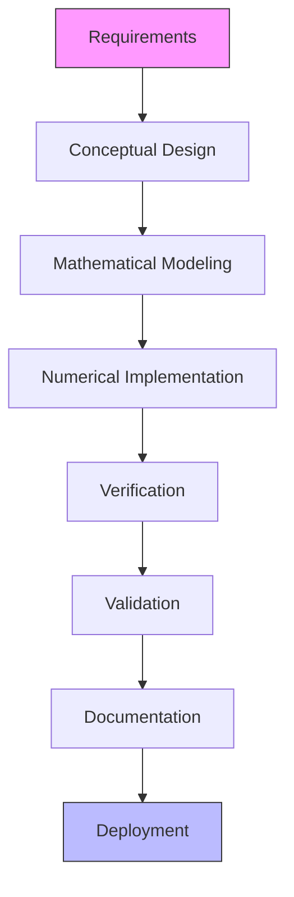
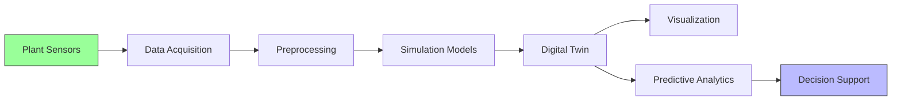

# Simulation Framework for Nuclear Applications

## 1. Introduction

This document outlines the comprehensive simulation framework for nuclear facility design, operation, and safety analysis. The framework integrates various simulation tools and methodologies to support the entire facility lifecycle.

## 2. Simulation Types and Applications

### 2.1 Full Scope Simulators

| Feature | Description | Tools |
|---------|-------------|-------|
| Purpose | Operator training and licensing | GSE, WSC |
| Fidelity | High-fidelity, real-time | |
| Scope | Complete plant simulation | |
| Usage | Training, procedure validation | |
| Update Frequency | With design changes | |

### 2.2 Engineering Analysis Simulations

| Tool | Application | Accuracy | Computational Cost |
|------|-------------|----------|-------------------|
| RELAP | Thermal-hydraulic analysis | ±2% | High |
| TRACE | Safety analysis | ±5% | Very High |
| MCNP | Neutron transport | ±1% | Extremely High |
| OpenFOAM | CFD analysis | ±3% | Very High |
| MAAP | Severe accident analysis | ±10% | Medium |

## 3. Model Development

### 3.1 Modeling Methodology

### 3.2 Model Fidelity Levels

| Level | Description | Use Case | Development Time |
|-------|-------------|----------|------------------|
| 0 | Empirical correlations | Screening | Days |
| 1 | Lumped parameter | Concept design | Weeks |
| 2 | 1D system models | Detailed design | Months |
| 3 | 2D/3D CFD | Component analysis | 6-12 months |
| 4 | High-fidelity multiphysics | Research | 1-3 years |

## 4. Verification and Validation

### 4.1 V&V Matrix

| Model | Verification Method | Validation Data | Acceptance Criteria |
|-------|---------------------|-----------------|---------------------|
| Thermal-Hydraulic | Code-to-code comparison | Separate effects tests | <5% deviation |
| Neutronics | Analytical benchmarks | Critical experiments | <1% k-eff difference |
| Structural | Mesh convergence | Material tests | <3% strain difference |
| CFD | Grid independence | PIV measurements | <10% velocity difference |

### 4.2 Uncertainty Quantification

| Parameter | Uncertainty Source | Distribution | Impact |
|-----------|-------------------|--------------|--------|
| Material Properties | Manufacturing | Normal | Medium |
| Boundary Conditions | Measurements | Uniform | High |
| Model Parameters | Calibration | Triangular | High |
| Numerical Errors | Discretization | Deterministic | Low |
| Initial Conditions | Measurements | Normal | Medium |

## 5. Performance Optimization

### 5.1 Computational Performance

| Optimization | Speedup | Implementation Effort |
|--------------|---------|----------------------|
| Parallelization | 5-100x | Medium |
| Grid Adaptation | 2-10x | High |
| Reduced Order Models | 10-1000x | High |
| Algorithm Selection | 2-5x | Low |
| Hardware Acceleration | 10-100x | Medium |

### 5.2 Accuracy vs. Performance Trade-offs

| Model Type | Relative Accuracy | Relative Speed | Best Use Case |
|------------|-------------------|----------------|---------------|
| 0D Lumped | 50-70% | 1000x | System dynamics |
| 1D System | 80-90% | 100x | Plant transients |
| 2D Axisymmetric | 90-95% | 10x | Detailed components |
| 3D Full | 95-99% | 1x | Final verification |

## 6. Integration with Digital Twin

### 6.1 Data Flow

### 6.2 Update Mechanisms

| Update Type | Frequency | Trigger | Impact |
|-------------|-----------|---------|--------|
| Real-time | Continuous | Sensor data | High |
| Periodic | Daily/Weekly | Scheduled | Medium |
| Event-based | On-demand | Anomaly detection | High |
| Model Update | Monthly | New data | Low |

## 7. Case Studies

### 7.1 Reactor Coolant System Simulation
- **Objective**: Predict thermal-hydraulic behavior
- **Tools**: RELAP-7, OpenFOAM
- **Results**: 3% improvement in prediction accuracy
- **Lessons**: Importance of proper boundary conditions

### 7.2 Severe Accident Analysis
- **Objective**: Core damage progression
- **Tools**: MAAP, MELCOR
- **Results**: Identified critical failure paths
- **Lessons**: Need for uncertainty quantification

## 8. Best Practices

### 8.1 Model Development
- Start simple, then increase complexity
- Document all assumptions and limitations
- Maintain version control for models
- Validate against multiple data sets
- Perform sensitivity analysis

### 8.2 Computational Resources
- Use appropriate hardware for the task
- Implement checkpoints for long runs
- Archive input/output files
- Document computational environment
- Monitor resource usage

## 9. Future Directions

### 9.1 Emerging Technologies
- AI/ML for model acceleration
- Quantum computing applications
- Advanced visualization (AR/VR)
- Cloud-based simulation platforms
- Digital twin integration

### 9.2 Research Needs
- Uncertainty quantification methods
- Multi-physics coupling techniques
- Reduced order modeling
- Validation databases
- Standardized interfaces
