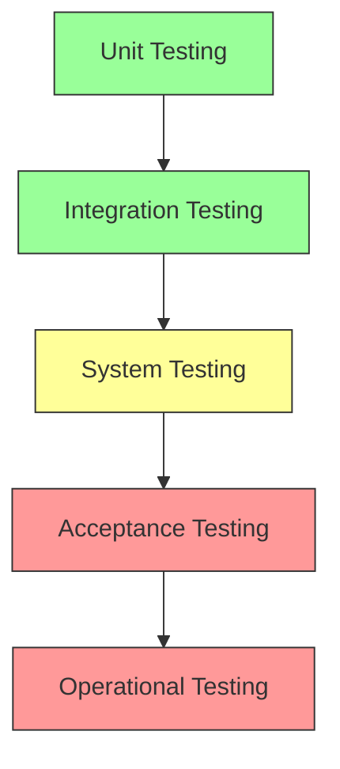
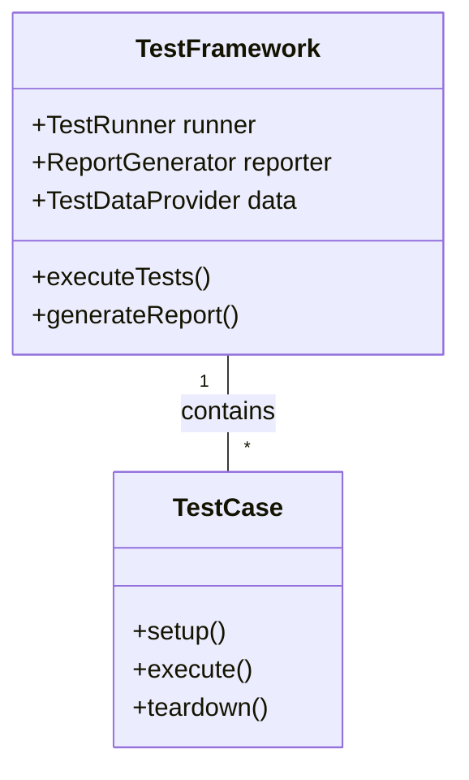
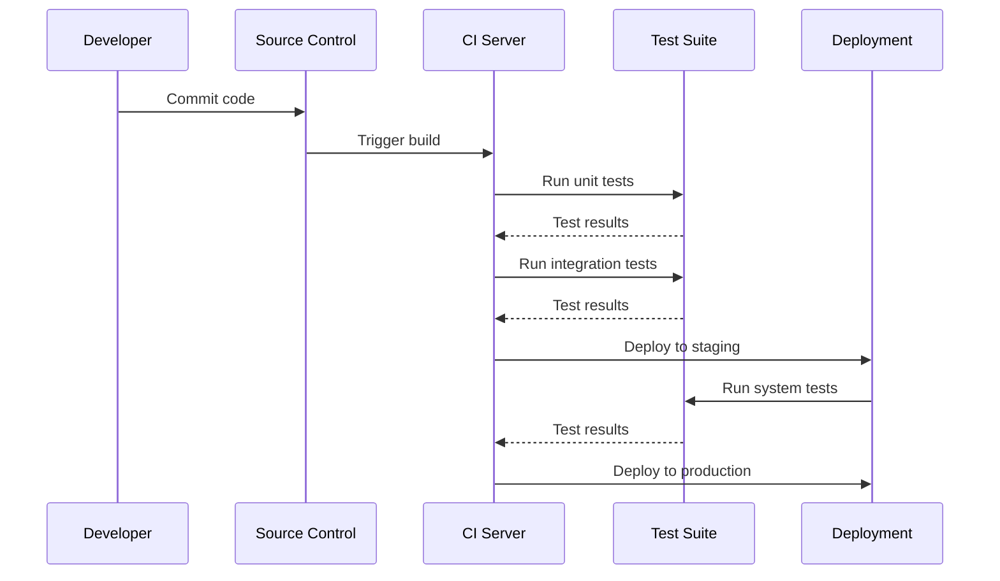

# Testing Methodologies for Nuclear Systems

## 1. Introduction

This document outlines comprehensive testing methodologies for nuclear systems, ensuring reliability, safety, and performance throughout the system lifecycle. The methodologies cover various testing levels from unit testing to system integration and acceptance testing.

## 2. Testing Strategy

### 2.1 Testing Pyramid

### 2.2 Test Categories

| Category | Purpose | Tools | When | Owner |
|----------|---------|-------|------|-------|
| Unit Testing | Verify individual components | Google Test, CppUTest | During development | Developers |
| Integration Testing | Validate interfaces | Jenkins, GitLab CI | After unit testing | QA Team |
| System Testing | End-to-end verification | TestStand, LabVIEW | Before deployment | Test Engineers |
| Performance Testing | Load and stress testing | JMeter, Locust | Before production | Performance Team |
| Safety Testing | Failure mode analysis | FMEA, FTA tools | Throughout SDLC | Safety Engineers |

## 3. Test Environments

### 3.1 Environment Configurations

| Environment | Purpose | Access | Refresh Frequency |
|-------------|---------|--------|------------------|
| Development | Feature development | Developers | Daily |
| Testing | Integration testing | QA Team | Weekly |
| Staging | Pre-production validation | Ops Team | Per release |
| Production | Live operations | Limited | N/A |
| Disaster Recovery | Business continuity | Ops Team | Quarterly |

### 3.2 Test Data Management

| Data Type | Generation Method | Anonymization | Refresh |
|-----------|-------------------|---------------|---------|
| Production-like | Data synthesis | Required | Monthly |
| Edge Cases | Manual creation | Not required | As needed |
| Performance | Load generation | Not applicable | Per test |
| Security | Synthetic patterns | Required | Quarterly |
| Compliance | Templates | As needed | Annually |

## 4. Test Automation

### 4.1 Automation Framework

### 4.2 Automation Tools Matrix

| Tool | Type | Language | Integration | Best For |
|------|------|----------|-------------|----------|
| Selenium | UI Testing | Java, Python, C# | Jenkins, GitLab | Web applications |
| JUnit | Unit Testing | Java | Maven, Gradle | Java applications |
| TestNG | Testing Framework | Java | Maven, TestNG | Data-driven testing |
| JMeter | Performance | Java | Jenkins | Load testing |
| Postman | API Testing | JavaScript | Newman | REST API testing |
| Appium | Mobile Testing | Java, Python | Appium Server | Mobile applications |

## 5. Performance Testing

### 5.1 Performance Testing Types

| Test Type | Purpose | Metrics | Tools |
|-----------|---------|---------|-------|
| Load Testing | System behavior under load | Response time, Throughput | JMeter, Gatling |
| Stress Testing | System limits | Breaking point, Recovery time | LoadRunner, k6 |
| Soak Testing | Long-term reliability | Memory usage, Response time | JMeter, Locust |
| Spike Testing | Sudden load changes | Recovery time, Error rates | BlazeMeter, Artillery |
| Scalability Testing | Resource allocation | Response time, Resource usage | Kubernetes, Docker Swarm |

### 5.2 Performance Metrics

| Metric | Description | Target | Measurement Method |
|--------|-------------|---------|-------------------|
| Response Time | Time to first byte | < 2s | Network analyzer |
| Throughput | Requests per second | > 1000 | Load testing tool |
| Error Rate | Failed requests | < 0.1% | Server logs |
| CPU Usage | CPU utilization | < 70% | Monitoring tools |
| Memory Usage | Memory consumption | < 80% | System monitoring |

## 6. Security Testing

### 6.1 Security Testing Types

| Test Type | Purpose | Tools | Frequency |
|-----------|---------|-------|-----------|
| Vulnerability Scanning | Identify known vulnerabilities | Nessus, Qualys | Monthly |
| Penetration Testing | Simulate cyber attacks | Metasploit, Burp Suite | Quarterly |
| Code Review | Identify security flaws | SonarQube, Checkmarx | Per commit |
| Configuration Audit | Check system hardening | OpenSCAP, Lynis | Monthly |
| Compliance Testing | Verify regulatory compliance | NIST, CIS Benchmarks | Annually |

### 6.2 OWASP Top 10 Coverage

| Risk | Test Method | Tools | Mitigation |
|------|-------------|-------|------------|
| Injection | Input validation testing | SQLmap, OWASP ZAP | Parameterized queries |
| Broken Authentication | Credential testing | Burp Suite, OWASP ZAP | MFA, Strong password policies |
| Sensitive Data Exposure | Data leakage testing | Wireshark, tcpdump | Encryption at rest/transit |
| XML External Entities | XXE testing | XXEinjector | Disable XML external entities |
| Broken Access Control | Authorization testing | OWASP ZAP, Burp Suite | Role-based access control |
| Security Misconfiguration | Configuration review | Nmap, OpenVAS | Secure configuration baselines |
| XSS | Cross-site scripting testing | XSS Hunter, OWASP ZAP | Input sanitization |
| Insecure Deserialization | Deserialization testing | ysoserial | Avoid deserialization of untrusted data |
| Using Components with Known Vulnerabilities | Dependency scanning | OWASP Dependency-Check | Regular updates |
| Insufficient Logging & Monitoring | Log review testing | ELK Stack, Splunk | Comprehensive logging |

## 7. Test Management

### 7.1 Test Planning

| Phase | Activities | Deliverables |
|-------|------------|--------------|
| Planning | Define scope, approach, resources | Test Plan |
| Design | Create test cases, data | Test Cases, Test Data |
| Execution | Run tests, log results | Test Results, Defects |
| Reporting | Analyze results, create reports | Test Summary Report |
| Closure | Document lessons learned | Lessons Learned |

### 7.2 Metrics and Reporting

| Metric | Formula | Target | Frequency |
|--------|---------|---------|-----------|
| Test Coverage | (Number of test cases executed / Total test cases) * 100 | > 90% | Per build |
| Defect Density | (Number of defects / Size of software) | < 1 per KLOC | Per release |
| Test Effectiveness | (Number of defects found in testing / Total defects found) * 100 | > 80% | Per release |
| Test Execution | (Number of test cases executed / Total test cases) * 100 | 100% | Daily |
| Defect Leakage | (Number of defects found in production / Total defects) * 100 | < 5% | Per release |

## 8. Continuous Testing

### 8.1 CI/CD Pipeline Integration

### 8.2 Test Automation Strategy

| Level | Automation Goal | Tools | Owner |
|-------|----------------|-------|-------|
| Unit | 90% coverage | JUnit, Mockito | Dev Team |
| API | 100% coverage | RestAssured, Postman | QA Team |
| UI | Critical paths | Selenium, Cypress | QA Team |
| Performance | Key transactions | JMeter, k6 | Performance Team |
| Security | OWASP Top 10 | OWASP ZAP, SonarQube | Security Team |

## 9. Best Practices

### 9.1 Test Case Design
- Follow naming conventions
- Keep tests independent
- Use meaningful assertions
- Implement proper cleanup
- Document test data requirements

### 9.2 Test Environment Management
- Version control environment configurations
- Automate environment provisioning
- Monitor environment health
- Document environment setup
- Regularly refresh test data

## 10. Future Trends

### 10.1 Emerging Technologies
- AI/ML in test case generation
- Shift-left testing
- Test automation in DevOps
- Service virtualization
- Chaos engineering

### 10.2 Industry Standards
- ISO/IEC/IEEE 29119
- ISTQB certification
- TMMi framework
- SAFe testing practices
- DevOps testing standards
