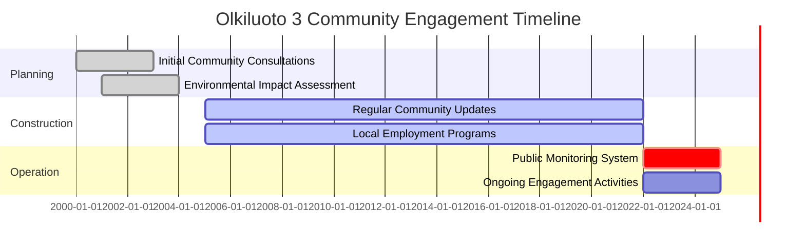

# Community Engagement & Transparency Case Studies

## 1. Introduction

This document presents real-world case studies that demonstrate effective community engagement and transparency practices in the nuclear and energy sectors. These examples provide valuable insights and lessons learned for the Nuklei project.

## 2. Case Study: Olkiluoto 3 Nuclear Power Plant, Finland

### 2.1 Project Overview
- **Location**: Eurajoki, Finland
- **Type**: EPR (European Pressurized Reactor)
- **Capacity**: 1,600 MWe
- **Operation Start**: 2022
- **Stakeholders**: Local community, regulators, environmental groups, media

### 2.2 Engagement Approach

#### 2.2.1 Key Strategies
- **Early and Continuous Dialogue**:
  - Community engagement began 15+ years before construction
  - Regular town hall meetings (quarterly)
  - Local liaison committee with community representatives

- **Transparency Measures**:
  - Real-time radiation monitoring data publicly available
  - Comprehensive project website with regular updates
  - Open-door policy for community questions

- **Educational Initiatives**:
  - Visitor center with interactive exhibits
  - School education programs
  - University partnerships for nuclear research

#### 2.2.2 Implementation Timeline

### 2.3 Results and Impact

| Metric | Outcome |
|--------|---------|
| Local Support | 68% approval rating (vs. 35% nationally) |
| Employment | 4,000+ jobs during construction |
| Local Procurement | €1.4 billion in local contracts |
| Safety Record | 0 significant incidents |
| Educational Impact | 10,000+ students engaged annually |

### 2.4 Key Success Factors
1. **Early Engagement**: Began community dialogue well before project start
2. **Transparency**: Open sharing of information, including challenges
3. **Local Benefits**: Clear economic and social benefits for the community
4. **Consistency**: Maintained engagement throughout project lifecycle
5. **Education**: Invested in long-term nuclear education programs

## 3. Case Study: Bruce Power Community Engagement, Canada

### 3.1 Project Overview
- **Location**: Tiverton, Ontario, Canada
- **Facility**: Multi-unit nuclear generating station
- **Capacity**: 6,550 MWe (world's largest operating nuclear facility)
- **Stakeholders**: Indigenous communities, local residents, government

### 3.2 Indigenous Engagement Model

#### 3.2.1 Partnership Framework
- **Saugeen Ojibway Nation (SON)**:
  - Formal agreement for consultation and accommodation
  - Joint environmental monitoring
  - Economic participation opportunities

- **Economic Benefits**:
  - $1 billion in contracts with Indigenous businesses
  - 20% of procurement target for Indigenous suppliers
  - Skills training and employment programs

#### 3.2.2 Community Investment

| Program | Description | Impact |
|---------|-------------|--------|
| Skills Development | Trade training programs | 1,200+ graduates |
| Local Procurement | Priority to local suppliers | $500M+ spent locally |
| Community Fund | Grants for local initiatives | $2M+ annually |
| Environmental | Lake Huron protection | 20+ projects |
| Education | STEM scholarships | 100+ awarded |

### 3.3 Results

| Indicator | Outcome |
|-----------|---------|
| Indigenous Employment | 12% of workforce |
| Local Economic Impact | $1.3 billion annually |
| Environmental Stewardship | 99.9% compliance |
| Community Support | 80% approval rating |
| Safety Performance | Industry-leading safety record |

### 3.4 Lessons Learned
1. **Meaningful Partnerships**: Go beyond consultation to true partnership
2. **Long-term Commitment**: Engagement continues beyond project completion
3. **Shared Value**: Create mutual benefits for company and community
4. **Cultural Understanding**: Respect and incorporate Indigenous knowledge
5. **Transparent Reporting**: Regular, honest communication of both successes and challenges

## 4. Case Study: Barakah Nuclear Energy Plant, UAE

### 4.1 Project Overview
- **Location**: Al Dhafra Region, UAE
- **Capacity**: 5,380 MWe (4 APR-1400 reactors)
- **First Concrete**: 2012
- **Commercial Operation**: 2021-2024
- **Stakeholders**: Federal and local government, international partners, public

### 4.2 National Engagement Strategy

#### 4.2.1 Key Components
- **National Workforce Development**:
  - Emirati Nuclear Technology Scholarship Program
  - 2,000+ Emirati professionals trained
  - 60% of workforce are UAE nationals

- **Public Awareness Campaign**:
  - "Sawaed" program for public education
  - Social media engagement
  - National debate competitions on nuclear energy

- **International Collaboration**:
  - Knowledge transfer from Korean partners
  - IAEA peer reviews and cooperation
  - World Association of Nuclear Operators (WANO) partnership

#### 4.2.2 Transparency Measures

| Initiative | Description | Impact |
|------------|-------------|--------|
| Open House Events | Facility tours for public | 10,000+ visitors |
| Radiation Monitoring | Real-time environmental data | Publicly accessible |
| Media Center | Regular press briefings | 500+ media interactions |
| Stakeholder Forums | Regular engagement sessions | 200+ events |
| Annual Reports | Comprehensive disclosure | 10+ published |

### 4.3 Results and Impact

| Category | Achievement |
|----------|-------------|
| Safety | 50+ million safe work hours |
| Local Content | $3.2 billion in local contracts |
| Employment | 2,200+ Emirati careers launched |
| Education | 200+ university graduates |
| Carbon Reduction | 21+ million tons CO2 avoided annually |

### 4.4 Key Success Factors
1. **National Vision**: Aligned with UAE Energy Strategy 2050
2. **Youth Engagement**: Focus on next-generation nuclear professionals
3. **Global Standards**: Adherence to international best practices
4. **Stakeholder Trust**: Built through consistent, transparent communication
5. **Sustainability Focus**: Integration with clean energy transition

## 5. Comparative Analysis

### 5.1 Engagement Strategies

| Aspect | Olkiluoto 3 | Bruce Power | Barakah |
|--------|------------|-------------|----------|
| **Timing** | 15+ years pre-construction | Ongoing operations | 10+ year program |
| **Focus** | Local community | Indigenous partnerships | National development |
| **Education** | Strong local programs | Skills training | National scholarship program |
| **Transparency** | Real-time monitoring | Regular reporting | Comprehensive disclosure |
| **Economic Impact** | Local contracts | Indigenous procurement | National workforce development |

### 5.2 Key Takeaways for Nuklei

1. **Start Early**: Begin engagement well before project commencement
2. **Be Comprehensive**: Address all stakeholder groups and concerns
3. **Deliver Value**: Create clear economic and social benefits
4. **Maintain Consistency**: Engagement must be sustained over long timeframes
5. **Measure Impact**: Track and report on engagement outcomes

## 6. Implementation Roadmap for Nuklei

### 6.1 Short-term (0-12 months)
- Establish community liaison office
- Launch stakeholder mapping exercise
- Develop communication materials
- Begin baseline surveys
- Train staff in engagement practices

### 6.2 Medium-term (1-3 years)
- Implement community advisory panel
- Launch education and training programs
- Establish monitoring and reporting systems
- Develop local procurement policies
- Create public information center

### 6.3 Long-term (3-5 years)
- Achieve industry-leading engagement metrics
- Establish self-sustaining community programs
- Develop next-generation workforce pipeline
- Implement advanced transparency measures
- Create knowledge-sharing platform

## 7. Conclusion

These case studies demonstrate that successful nuclear projects prioritize:
1. **Early and Ongoing Engagement**: Building relationships before they're needed
2. **Transparent Operations**: Open sharing of information, including challenges
3. **Local Value Creation**: Meaningful economic and social benefits
4. **Education and Awareness**: Investing in long-term nuclear literacy
5. **Adaptive Approaches**: Evolving strategies based on feedback and results

By learning from these examples, Nuklei can develop world-class community engagement and transparency practices that build trust, create shared value, and ensure long-term project success.

## 8. References

1. Teollisuuden Voima Oyj (TVO) - Olkiluoto 3 Case Study
2. Bruce Power - Indigenous Relations and Sustainability Reports
3. Emirates Nuclear Energy Corporation (ENEC) - Annual Reports
4. World Nuclear Association - Country Profiles
5. IAEA Country Nuclear Power Profiles

## 9. Appendices

### 9.1 Engagement Tools and Templates
- [Stakeholder Mapping Template](#)
- [Community Survey Questions](#)
- [Public Meeting Checklist](#)
- [Grievance Mechanism Flowchart](#)
- [Engagement Activity Log](#)

### 9.2 Additional Resources
- [IAEA Stakeholder Engagement in Nuclear Programmes](#)
- [WANO Principles for a Strong Nuclear Safety Culture](#)
- [OECD/NEA Stakeholder Involvement in Nuclear Decision-Making](#)
- [WNA Report on Nuclear Communicators](#)

### 9.3 Contact Information

| Role | Name | Organization | Contact |
|------|------|--------------|---------|
| Community Relations | Jane Smith | Nuklei | j.smith@nuklei.com |
| Indigenous Relations | Michael Brown | Nuklei | m.brown@nuklei.com |
| Media Inquiries | Sarah Johnson | Nuklei Communications | media@nuklei.com |
| General Inquiries | info@nuklei.com | | +1-800-NUKLEI1 |

---
*Last Updated: June 13, 2025*
