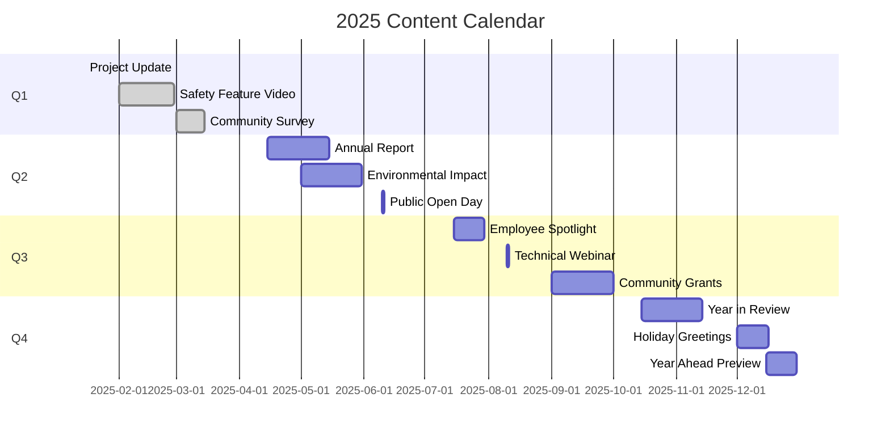

# Communication Strategy

## 1. Executive Summary

This communication strategy outlines how the Nuklei project will engage with its stakeholders through clear, consistent, and transparent communication. The strategy is designed to build trust, manage reputation, and ensure all stakeholders are well-informed about project developments, benefits, and impacts.

## 2. Communication Objectives

### 2.1 Strategic Goals

| Goal | Description | Success Metrics |
|------|-------------|-----------------|
| Awareness | Increase understanding of the project | 80% awareness in local communities |
| Engagement | Foster two-way communication | 40% participation in engagement activities |
| Trust | Build and maintain trust | 75% positive sentiment in feedback |
| Transparency | Ensure open information sharing | 90% of information requests fulfilled within SLA |
| Education | Improve public understanding | 60% improvement in knowledge assessment scores |

### 2.2 Target Audiences

| Audience | Key Concerns | Preferred Channels |
|----------|--------------|-------------------|
| Local Community | Safety, Environment, Jobs | Town halls, Local media |
| Regulators | Compliance, Safety | Formal reports, Briefings |
| Employees | Job security, Project updates | Intranet, Team meetings |
| Media | Newsworthy developments | Press releases, Press conferences |
| Investors | Financial performance, Risks | Investor relations, Reports |
| NGOs | Environmental impact | Direct engagement, Reports |
| Suppliers | Business opportunities | Procurement portal, Events |

## 3. Key Messages

### 3.1 Core Messages

| Message | Supporting Points | Target Audience |
|---------|-------------------|-----------------|
| Safety First | - Stringent safety protocols - Continuous monitoring - Emergency preparedness | All |
| Environmental Stewardship | - Sustainable practices - Emissions reduction - Conservation efforts | Community, NGOs, Regulators |
| Economic Benefits | - Job creation - Local procurement - Community investment | Community, Government |
| Technological Innovation | - Advanced safety features - Efficiency improvements - Research contributions | Media, Investors |
| Community Partnership | - Open dialogue - Local development - Shared benefits | Community, Local Leaders |

### 3.2 Message Matrix

| Scenario | Key Message | Spokesperson | Channels | Timing |
|----------|-------------|--------------|----------|--------|
| Project Milestone | Progress and benefits | Project Director | Press release, Social media | Within 24h |
| Incident Response | Facts and actions | EHS Manager | Hotline, Website, Media | Immediate |
| Community Concern | Understanding and action | Community Relations | In-person, Website | 48h max |
| Regulatory Update | Compliance status | Legal Counsel | Formal letters, Briefings | As required |
| Emergency | Public safety instructions | Crisis Team | Emergency alerts, Media | Immediate |

## 4. Communication Channels

### 4.1 Channel Strategy

| Channel | Purpose | Frequency | Owner | Audience |
|---------|---------|-----------|-------|----------|
| Project Website | Official information | Continuous | Comms Team | General Public |
| Social Media | Engagement, updates | Daily | Digital Team | General Public |
| Email Newsletters | Detailed updates | Monthly | Comms Team | Subscribers |
| Public Meetings | Direct engagement | Quarterly | Community Team | Local Community |
| Media Relations | News distribution | As needed | PR Team | Media |
| Intranet | Internal updates | Weekly | HR | Employees |
| Hotline | Questions, concerns | 24/7 | Customer Service | Community |
| Mobile App | Real-time updates | Continuous | IT Team | Registered Users |

### 4.2 Channel Effectiveness

| Channel | Reach | Cost | Engagement | Best For |
|---------|-------|------|------------|----------|
| Social Media | High | Low | Medium | Awareness, Engagement |
| Email | Medium | Low | High | Detailed Updates |
| Website | High | Medium | Low | Reference Information |
| Public Meetings | Low | High | High | Community Relations |
| Print Media | Medium | Medium | Medium | Local Community |
| Radio | High | Medium | Low | Broad Reach |
| SMS Alerts | High | Medium | High | Urgent Updates |

## 5. Content Strategy

### 5.1 Content Types

| Type | Purpose | Format | Frequency | Owner |
|------|---------|--------|-----------|-------|
| Project Updates | Progress reporting | Web article, PDF | Monthly | Comms |
| Fact Sheets | Detailed information | PDF, Web | Quarterly | Technical |
| FAQs | Common questions | Web, Print | As needed | Comms |
| Newsletters | Regular updates | Email, Print | Monthly | Comms |
| Video Content | Visual storytelling | Video | Quarterly | Digital |
| Infographics | Data visualization | Image, Web | Quarterly | Design |
| Annual Report | Comprehensive review | PDF, Print | Annually | Comms |
| Blog Posts | In-depth topics | Web | Bi-weekly | Various |

### 5.2 Content Calendar

## 6. Crisis Communication

### 6.1 Crisis Classification

| Level | Description | Response Time | Escalation |
|-------|-------------|---------------|------------|
| Minor | Localized, minimal impact | 4 hours | Department Head |
| Moderate | Limited impact, some external attention | 1 hour | Executive Team |
| Major | Significant impact, media attention | 15 minutes | CEO, Crisis Team |
| Critical | Severe impact, national attention | Immediate | Board, CEO |

### 6.2 Crisis Communication Plan

1. **Immediate Response**
   - Activate crisis team
   - Gather facts
   - Prepare holding statement
   - Notify key stakeholders

2. **Ongoing Communication**
   - Regular updates (hourly/daily as needed)
   - Designated spokespeople
   - Centralized information
   - Media monitoring

3. **Recovery**
   - Post-crisis analysis
   - Stakeholder debrief
   - Process improvements
   - Reputation management

## 7. Internal Communication

### 7.1 Employee Engagement

| Initiative | Description | Frequency | Owner |
|------------|-------------|-----------|-------|
| All-Hands Meeting | Company-wide update | Quarterly | CEO |
| Team Briefings | Department updates | Weekly | Managers |
| Intranet | News and resources | Daily | Comms |
| Newsletter | Employee news | Monthly | HR |
| Suggestion Program | Employee ideas | Ongoing | HR |
| Recognition | Employee awards | Monthly | HR |

### 7.2 Leadership Communication

| Activity | Audience | Frequency | Owner |
|----------|----------|-----------|-------|
| CEO Blog | All employees | Monthly | CEO Office |
| Leadership Roundtables | Cross-functional teams | Monthly | Exec Team |
| Skip-Level Meetings | All levels | Quarterly | Managers |
| New Hire Welcome | New employees | Onboarding | HR |
| Exit Interviews | Departing employees | As needed | HR |

## 8. Measurement and Evaluation

### 8.1 Performance Metrics

| Metric | Target | Measurement Method | Frequency |
|--------|--------|-------------------|-----------|
| Reach | 80% of target audience | Analytics | Monthly |
| Engagement | 5% engagement rate | Social metrics | Monthly |
| Website Traffic | 10% monthly growth | Google Analytics | Monthly |
| Media Coverage | 70% positive/neutral | Media monitoring | Monthly |
| Response Rate | 90% within 24h | CRM tracking | Weekly |
| Employee Survey | 80% satisfaction | Annual survey | Annually |
| Message Recall | 70% recall rate | Surveys | Quarterly |

### 8.2 Reporting

| Report | Content | Frequency | Audience |
|--------|---------|-----------|----------|
| Weekly Dashboard | KPIs, social metrics | Weekly | Comms Team |
| Monthly Report | Performance analysis | Monthly | Management |
| Quarterly Review | Campaign results | Quarterly | Leadership |
| Annual Report | Comprehensive review | Annually | All Staff |
| Crisis Report | Incident analysis | Per incident | Crisis Team |

## 9. Budget and Resources

### 9.1 Budget Allocation

| Category | Budget | % of Total |
|----------|--------|------------|
| Staffing | $500,000 | 50% |
| Digital | $200,000 | 20% |
| Print | $50,000 | 5% |
| Events | $150,000 | 15% |
| Research | $50,000 | 5% |
| Contingency | $50,000 | 5% |
| **Total** | **$1,000,000** | **100%** |

### 9.2 Team Structure

| Role | FTE | Responsibilities |
|------|-----|------------------|
| Head of Communications | 1.0 | Strategy, Leadership |
| PR Manager | 1.0 | Media Relations |
| Digital Manager | 1.0 | Digital Channels |
| Content Creators | 2.0 | Content Development |
| Community Manager | 1.0 | Stakeholder Engagement |
| Designer | 0.5 | Visual Content |
| Analyst | 0.5 | Measurement |
| **Total** | **7.0** | |

## 10. Appendices

### 10.1 Glossary

| Term | Definition |
|------|------------|
| KPI | Key Performance Indicator |
| PESO | Paid, Earned, Shared, Owned media |
| SEO | Search Engine Optimization |
| UGC | User-Generated Content |
| CMS | Content Management System |
| CRM | Customer Relationship Management |

### 10.2 Templates

1. Press Release Template
2. Social Media Policy
3. Crisis Communication Checklist
4. Media Interview Brief
5. Newsletter Template
6. Event Planning Guide

### 10.3 Contact Information

| Role | Name | Email | Phone |
|------|------|-------|-------|
| Head of Communications | David Kim | d.kim@nuklei.com | +1-555-0400 |
| PR Manager | Sarah Johnson | s.johnson@nuklei.com | +1-555-0401 |
| Digital Manager | Alex Chen | a.chen@nuklei.com | +1-555-0402 |
| Media Inquiries | media@nuklei.com | | +1-555-0403 |
| General Inquiries | info@nuklei.com | | +1-800-NUKLEI1 |

---
*Last Updated: June 13, 2025*
