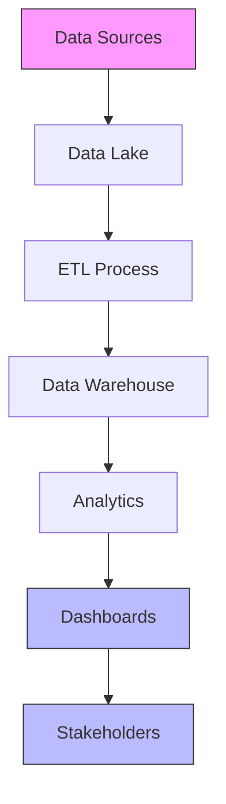
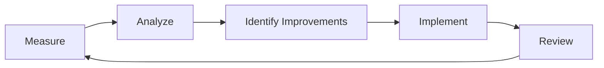
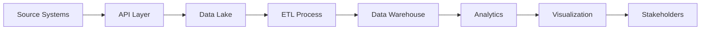

# Metrics and Reporting Framework

## 1. Introduction

This document establishes the metrics and reporting framework for monitoring and evaluating the effectiveness of the Nuklei project's community engagement and transparency initiatives. The framework ensures data-driven decision-making and continuous improvement.

## 2. Performance Metrics

### 2.1 Engagement Metrics

| Metric | Description | Target | Frequency | Data Source |
|--------|-------------|--------|-----------|-------------|
| Participation Rate | % of target audience engaged | 40% | Quarterly | Event logs, Surveys |
| Meeting Attendance | Number of participants | 100+/event | Per Event | Registration |
| Survey Response Rate | % of surveys completed | 30% | Bi-annually | Survey tools |
| Social Media Reach | Unique users reached | 50,000/month | Monthly | Analytics |
| Website Traffic | Unique visitors | 10,000/month | Monthly | Google Analytics |
| Grievance Resolution | % resolved within SLA | 95% | Monthly | CRM System |

### 2.2 Impact Metrics

| Metric | Description | Target | Frequency | Data Source |
|--------|-------------|--------|-----------|-------------|
| Trust Index | Public trust score | 80/100 | Annually | Surveys |
| Awareness Level | % aware of key messages | 80% | Bi-annually | Surveys |
| Satisfaction Score | Stakeholder satisfaction | 4/5 | Quarterly | Feedback forms |
| Economic Impact | Jobs created/supported | 200/year | Annually | HR, Partners |
| Environmental Benefit | CO2 reduced (tons) | 1,000 | Annually | Monitoring |
| Social ROI | Social value created | 3:1 | Annually | SROI Analysis |

## 3. Data Collection Methods

### 3.1 Quantitative Data

| Method | Description | Tools | Frequency | Owner |
|--------|-------------|-------|-----------|-------|
| Web Analytics | Digital engagement | Google Analytics | Continuous | Digital Team |
| CRM Tracking | Stakeholder interactions | Salesforce | Continuous | Comms |
| Surveys | Structured feedback | SurveyMonkey | Quarterly | Research |
| Event Metrics | Participation data | Eventbrite | Per Event | Events |
| Social Listening | Online sentiment | Hootsuite | Continuous | Digital |
| Compliance Logs | Regulatory reporting | Internal Systems | As needed | Legal |

### 3.2 Qualitative Data

| Method | Description | Participants | Frequency | Owner |
|--------|-------------|---------------|-----------|-------|
| Focus Groups | In-depth discussions | 8-12 people | Bi-annually | Research |
| Interviews | One-on-one insights | Key stakeholders | Quarterly | Comms |
| Case Studies | Success stories | Program participants | Annually | Comms |
| Community Forums | Open discussions | Community members | Quarterly | Comms |
| Feedback Forms | Event/Program feedback | Participants | Per Event | Events |

## 4. Reporting Framework

### 4.1 Report Types

| Report | Purpose | Audience | Frequency | Key Metrics |
|--------|---------|-----------|-----------|-------------|
| Executive Dashboard | High-level overview | Leadership | Monthly | KPIs, Trends |
| Community Impact | Program effectiveness | Stakeholders | Quarterly | Outcomes, Stories |
| Compliance | Regulatory requirements | Regulators | Annually | Compliance metrics |
| Annual Report | Comprehensive review | Public | Annually | All metrics |
| Project Updates | Progress tracking | Team | Weekly | Milestones, Issues |
| Grievance Report | Issue resolution | Management | Monthly | Volume, Resolution |

### 4.2 Report Templates

#### 4.2.1 Executive Dashboard

```markdown
# Nuklei Community Engagement Dashboard
**Period**: [Month/Year]

### Key Metrics
- Overall Engagement: [X]% (▲[Y]% from last period)
- Satisfaction Score: [X]/5
- Grievance Resolution: [X]% within SLA
- Social Media Reach: [X] (▲[Y]%)
- Website Traffic: [X] unique visitors

### Top Highlights
1. [Key achievement 1]
2. [Key achievement 2]
3. [Key achievement 3]

### Areas Needing Attention
1. [Area 1] - [Action]
2. [Area 2] - [Action]

### Upcoming Events
- [Event 1] - [Date]
- [Event 2] - [Date]
```

#### 4.2.2 Community Impact Report

```markdown
# Community Impact Report
**Period**: [Quarter/Year]

## Program Highlights
### [Program Name]
- Participants: [X]
- Outcomes: [Key results]
- Testimonial: [Quote]

## Metrics Overview
| Category | Target | Actual | Status |
|----------|--------|--------|--------|
| Education | 1,000 | 1,200 | ✅ Exceeded |
| Employment | 200 | 180 | ⏳ On Track |
| Environment | 500t | 450t | ⚠️ Needs Attention |

## Success Stories
1. [Story 1 with impact metrics]
2. [Story 2 with impact metrics]

## Next Steps
- [Action 1]
- [Action 2]
```

## 5. Data Visualization

### 5.1 Dashboard Framework



### 5.2 Visualization Types

| Data Type | Visualization | Purpose | Tools |
|-----------|---------------|---------|-------|
| Trends Over Time | Line Chart | Track metrics over time | Power BI, Tableau |
| Comparisons | Bar/Column Chart | Compare categories | Google Data Studio |
| Composition | Pie/Donut Chart | Show proportions | D3.js |
| Distribution | Histogram | Show data spread | Python, R |
| Relationships | Scatter Plot | Show correlations | Excel, Tableau |
| Geospatial | Maps | Location-based data | ArcGIS, Google Maps |
| Progress | Gauges | Show vs. target | Power BI |

## 6. Data Quality and Governance

### 6.1 Data Quality Framework

| Dimension | Standard | Measurement | Owner |
|-----------|----------|-------------|-------|
| Accuracy | >98% | Random sampling | Data Team |
| Completeness | >95% | Field completion rates | Data Team |
| Timeliness | 99% on time | Submission deadlines | Process Owners |
| Consistency | >97% | Cross-validation | Data Team |
| Validity | >99% | Rule compliance | Data Team |

### 6.2 Data Governance

| Component | Description | Owner |
|-----------|-------------|-------|
| Data Dictionary | Definitions and standards | Data Team |
| Access Control | Role-based permissions | IT Security |
| Retention Policy | Data lifecycle management | Legal |
| Privacy Compliance | GDPR, CCPA, etc. | Legal |
| Audit Trail | Change tracking | IT |
| Training | Data literacy | HR |

## 7. Performance Review Process

### 7.1 Review Cycle

1. **Monthly**
   - KPI dashboard review
   - Quick wins and challenges
   - Adjust tactics as needed

2. **Quarterly**
   - Deep dive into metrics
   - Program effectiveness
   - Resource allocation

3. **Annually**
   - Strategic review
   - Target setting
   - Budget planning

### 7.2 Continuous Improvement



## 8. Technology Stack

### 8.1 Core Systems

| Category | Tools | Purpose |
|----------|-------|---------|
| CRM | Salesforce, HubSpot | Stakeholder management |
| Analytics | Google Analytics, Power BI | Data visualization |
| Survey | SurveyMonkey, Qualtrics | Feedback collection |
| Social Media | Hootsuite, Sprout Social | Engagement tracking |
| Project Management | Asana, Jira | Task tracking |
| Document Management | SharePoint, Google Workspace | File storage |
| Communication | Slack, Microsoft Teams | Team collaboration |

### 8.2 Integration Architecture



## 9. Training and Capacity Building

### 9.1 Training Programs

| Program | Audience | Duration | Frequency | Owner |
|---------|-----------|-----------|-----------|-------|
| Data Literacy | All Staff | 1 day | Annually | HR |
| Tools Training | Specific Teams | 2-4 hours | Quarterly | IT |
| Best Practices | Data Owners | 1 day | Bi-annually | Data Team |
| Compliance | Relevant Staff | 2 hours | Annually | Legal |

### 9.2 Knowledge Management

| Component | Description | Owner |
|-----------|-------------|-------|
| Wiki | Documentation | IT |
| Playbooks | How-to guides | Teams |
| Templates | Standard forms | Comms |
| FAQ | Common questions | Support |
| Webinars | Training sessions | HR |

## 10. Appendices

### 10.1 Glossary

| Term | Definition |
|------|------------|
| KPI | Key Performance Indicator |
| ROI | Return on Investment |
| SLA | Service Level Agreement |
| ETL | Extract, Transform, Load |
| CRM | Customer Relationship Management |
| BI | Business Intelligence |
| API | Application Programming Interface |

### 10.2 Templates and Forms

1. [Data Collection Form Template](#)
2. [Monthly Report Template](#)
3. [Dashboard Design Guidelines](#)
4. [Data Quality Checklist](#)
5. [Performance Review Template](#)

### 10.3 Contact Information

| Role | Name | Email | Phone |
|------|------|-------|-------|
| Data Analytics Manager | Michael Brown | m.brown@nuklei.com | +1-555-0600 |
| Reporting Specialist | Emily Davis | e.davis@nuklei.com | +1-555-0601 |
| Data Quality Analyst | David Wilson | d.wilson@nuklei.com | +1-555-0602 |
| BI Developer | Sarah Johnson | s.johnson@nuklei.com | +1-555-0603 |
| General Inquiries | | metrics@nuklei.com | +1-800-NUKLEI1 |

---
*Last Updated: June 13, 2025*
