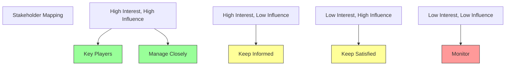
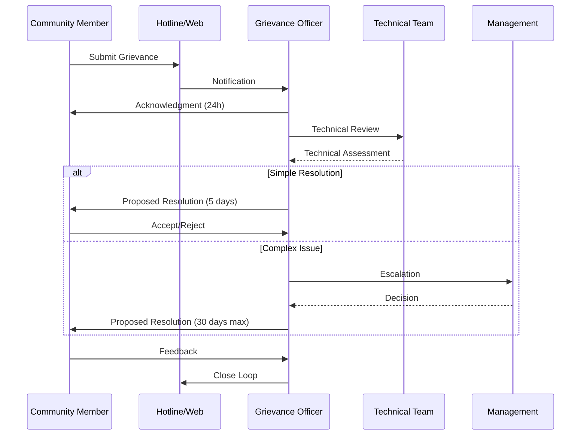

# Stakeholder Engagement Strategy

## 1. Introduction

This document outlines the comprehensive stakeholder engagement strategy for the Nuklei project, ensuring meaningful participation and collaboration with all interested and affected parties throughout the project lifecycle.

## 2. Stakeholder Identification

### 2.1 Stakeholder Categories

| Category | Examples | Interest Level | Influence Level |
|----------|----------|----------------|-----------------|
| Government | Local, State, Federal | High | High |
| Regulatory | NRC, EPA, State Agencies | High | High |
| Community | Residents, Local Businesses | High | Medium |
| Industry | Suppliers, Contractors | Medium | Medium |
| Academia | Universities, Research Institutes | Medium | Medium |
| NGOs | Environmental Groups | High | Medium |
| Media | Local, National Outlets | Medium | High |
| Employees | Staff, Contractors | High | Medium |

### 2.2 Stakeholder Mapping

## 3. Engagement Approach

### 3.1 Engagement Methods

| Method | Description | Frequency | Best For |
|--------|-------------|-----------|----------|
| Public Forums | Open community meetings | Quarterly | General public |
| Focus Groups | Small group discussions | Bi-annually | In-depth feedback |
| Surveys | Online/paper questionnaires | Annually | Broad input |
| Workshops | Interactive sessions | Quarterly | Specific topics |
| Site Visits | Project tours | Semi-annually | Community leaders |
| Advisory Groups | Ongoing consultation | Monthly | Key stakeholders |
| Social Media | Digital engagement | Continuous | General public |
| Newsletters | Email updates | Monthly | Subscribers |

### 3.2 Engagement Matrix

| Stakeholder Group | Engagement Method | Frequency | Objectives |
|-------------------|-------------------|-----------|------------|
| Local Residents | Town Halls, Surveys | Quarterly | Address concerns, share updates |
| Government | Briefings, Reports | Monthly | Ensure compliance, alignment |
| Regulators | Formal Submissions | As required | Meet requirements |
| Industry | Working Groups | Bi-monthly | Collaboration |
| NGOs | Dialogue Sessions | Quarterly | Address concerns |
| Media | Press Releases | As needed | Accurate information |
| Employees | Internal Comms | Continuous | Keep informed |

## 4. Communication Plan

### 4.1 Key Messages

| Message | Target Audience | Communication Channel | Frequency |
|---------|-----------------|----------------------|-----------|
| Project Updates | All Stakeholders | Website, Newsletter | Monthly |
| Safety Information | Local Community | Public Meetings | Quarterly |
| Job Opportunities | Local Residents | Job Fairs, Website | Ongoing |
| Environmental Impact | Regulators, NGOs | Reports, Briefings | Quarterly |
| Emergency Procedures | Local Community | Multiple Channels | Bi-annually |
| Project Benefits | General Public | Media, Website | Ongoing |

### 4.2 Communication Channels

| Channel | Purpose | Frequency | Owner |
|---------|---------|-----------|-------|
| Project Website | General information | Continuous | Comms Team |
| Email Updates | Regular updates | Monthly | Comms Team |
| Social Media | Engagement, updates | Daily | Comms Team |
| Community Hotline | Questions, concerns | 24/7 | Ops Team |
| Local Newspapers | Community news | Weekly | Comms Team |
| Public Meetings | Direct engagement | Quarterly | Project Team |
| Fact Sheets | Detailed information | Per release | Technical Team |

## 5. Grievance Mechanism

### 5.1 Process Overview

### 5.2 Grievance Tracking

| ID | Date | Category | Status | Resolution Time | Satisfaction |
|----|------|----------|--------|-----------------|--------------|
| 001 | 2025-01-15 | Noise | Resolved | 5 days | 5/5 |
| 002 | 2025-02-03 | Traffic | In Progress | 12 days | Pending |
| 003 | 2025-02-15 | Employment | Resolved | 8 days | 4/5 |
| 004 | 2025-03-01 | Environment | Pending | 2 days | Pending |
| 005 | 2025-03-10 | Safety | Resolved | 3 days | 5/5 |

## 6. Engagement Activities

### 6.1 Annual Calendar

| Month | Activity | Target Audience | Location |
|-------|----------|-----------------|----------|
| January | New Year Open House | Community | Town Hall |
| March | Environmental Forum | NGOs, Regulators | Conference Center |
| May | Career Fair | Job Seekers | Local School |
| July | Safety Demonstration | Community | Project Site |
| September | Annual Review | All Stakeholders | Hotel |
| November | School Visits | Students | Local Schools |

### 6.2 Special Initiatives

| Initiative | Description | Timeline | Partners |
|------------|-------------|----------|----------|
| STEM Program | School partnerships | Ongoing | Local Schools |
| Local Hiring | Job training and placement | 2 years | Workforce Development |
| Supplier Diversity | Support local businesses | Ongoing | Chamber of Commerce |
| Environmental Projects | Conservation initiatives | Annual | Environmental Groups |
| Emergency Preparedness | Community training | Bi-annual | Local Emergency Services |

## 7. Monitoring and Evaluation

### 7.1 Performance Metrics

| Metric | Target | Measurement Method | Frequency |
|--------|--------|-------------------|-----------|
| Engagement Rate | 60% | Meeting attendance | Quarterly |
| Response Time | 48h | Grievance tracking | Continuous |
| Satisfaction | 85% | Surveys | Bi-annually |
| Reach | 10,000 | Analytics | Monthly |
| Resolution Rate | 95% | Grievance tracking | Monthly |
| Media Coverage | 80% Positive | Media monitoring | Monthly |

### 7.2 Reporting

| Report | Frequency | Audience | Distribution |
|--------|-----------|----------|--------------|
| Monthly Update | Monthly | Management | Email, Web |
| Quarterly Report | Quarterly | Stakeholders | Web, Print |
| Annual Review | Annually | Public | Web, Print |
| Grievance Report | Bi-annually | Regulators | Web, Email |
| Impact Assessment | Annually | All | Web, Print |

## 8. Resources

### 8.1 Team Structure

| Role | Responsibilities | FTEs |
|------|------------------|------|
| Community Relations Manager | Strategy, Oversight | 1.0 |
| Engagement Officers | Field engagement | 3.0 |
| Communications Specialist | Content, Media | 2.0 |
| Grievance Officer | Case management | 1.0 |
| Administrative Support | Coordination | 1.0 |
| **Total** | | **8.0** |

### 8.2 Budget (Annual)

| Category | Budget | % of Total |
|----------|--------|------------|
| Personnel | $800,000 | 53% |
| Community Programs | $300,000 | 20% |
| Communications | $200,000 | 13% |
| Training | $100,000 | 7% |
| Technology | $50,000 | 3% |
| Contingency | $50,000 | 3% |
| **Total** | **$1,500,000** | **100%** |

## 9. Continuous Improvement

### 9.1 Feedback Mechanisms
- Stakeholder surveys
- Focus group discussions
- Suggestion boxes
- Online feedback forms
- Social media monitoring
- Grievance analysis
- Meeting evaluations

### 9.2 Improvement Process
1. **Collect** feedback from all channels
2. **Analyze** data for trends and issues
3. **Plan** improvements and solutions
4. **Implement** changes
5. **Evaluate** effectiveness
6. **Document** lessons learned
7. **Communicate** outcomes

## 10. Appendices

### 10.1 Contact Information

| Role | Name | Email | Phone |
|------|------|-------|-------|
| Community Relations | Sarah Johnson | s.johnson@nuklei.com | +1-555-0200 |
| Grievance Officer | Michael Brown | m.brown@nuklei.com | +1-555-0201 |
| Media Relations | Emily Davis | e.davis@nuklei.com | +1-555-0202 |
| General Inquiries | info@nuklei.com | | +1-800-NUKLEI1 |

### 10.2 Glossary
- **Stakeholder**: Any individual or group affected by the project
- **Grievance**: A formal complaint or concern
- **Engagement**: Process of involving stakeholders
- **CSR**: Corporate Social Responsibility
- **ESG**: Environmental, Social, and Governance

### 10.3 References
1. IFC Performance Standard 1
2. AA1000 Stakeholder Engagement Standard
3. GRI Standards
4. UN Guiding Principles on Business and Human Rights
5. ICMM Good Practice Guide on Community Development

---
*Last Updated: June 13, 2025*
