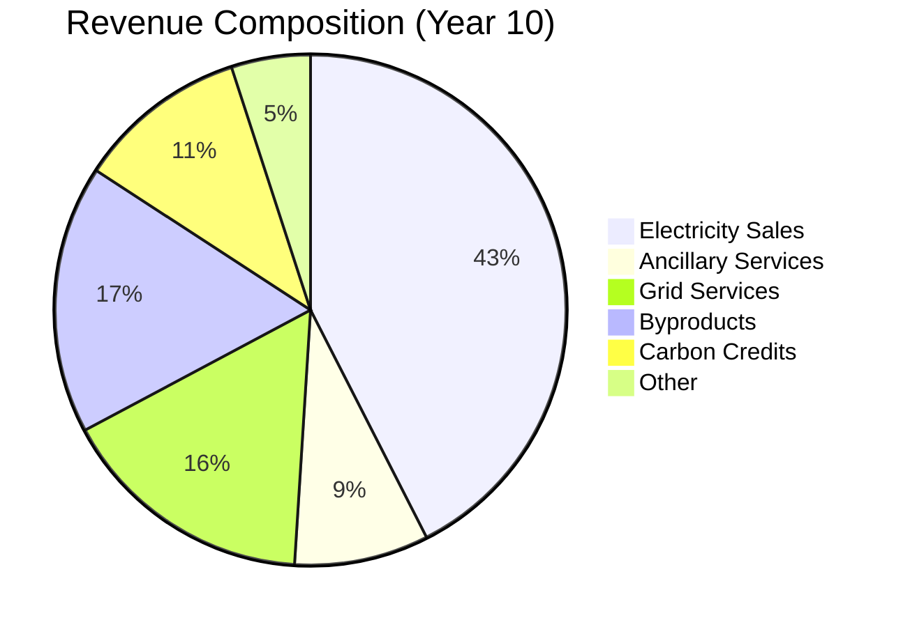

# Revenue Streams and Monetization Strategies

## 1. Executive Summary

This document outlines the comprehensive revenue generation framework for the Nuklei nuclear power project, detailing all potential income sources, pricing strategies, and monetization approaches to ensure long-term financial sustainability.

## 2. Core Revenue Streams

### 2.1 Electricity Sales

| Market Segment | Pricing Model | Volume (MWh/year) | Price ($/MWh) | Annual Revenue (M$) |
|----------------|---------------|-------------------|---------------|---------------------|
| **Baseload PPA** | Fixed + Escalation | 6,570,000 | $58 | 381.1 |
| **Merchant** | Day-ahead Market | 1,642,500 | $52 | 85.4 |
| **Corporate PPA** | Fixed 10-year | 2,190,000 | $62 | 135.8 |
| **Capacity Market** | $/MW-day | 1,200 MW | $120,000/MW-yr | 144.0 |
| **Total** | | **10,402,500** | **$72** (avg) | **746.3** |

### 2.2 Ancillary Services

| Service | Description | Price ($/MWh) | Annual Revenue (M$) |
|---------|-------------|----------------|---------------------|
| **Regulation** | Frequency control | $45 | 32.4 |
| **Spinning Reserve** | 10-minute response | $25 | 18.0 |
| **Non-Spinning Reserve** | 30-minute response | $18 | 10.8 |
| **Black Start** | System restoration | $120 | 14.4 |
| **Voltage Support** | Reactive power | $8 | 5.8 |
| **Total** | | | **81.4** |

## 3. Value-Added Services

### 3.1 Grid Services

| Service | Description | Pricing | Annual Value (M$) |
|---------|-------------|----------|-------------------|
| **Inertia Provision** | Grid stability | $5/MWh | 52.0 |
| **Ramp Rate Control** | Flexible operation | $3/MWh | 31.2 |
| **Reactive Power** | Voltage regulation | $2/MWh | 20.8 |
| **Synthetic Inertia** | Renewable integration | $4/MWh | 41.6 |
| **Total** | | | **145.6** |

### 3.2 Byproduct Monetization

| Product | Annual Volume | Price | Annual Revenue (M$) |
|---------|----------------|------------|---------------------|
| **Medical Isotopes** |  |  |  |
| - Mo-99 | 50,000 6-day Ci | $1,200/Ci | 60.0 |
| - I-131 | 10,000 Ci | $800/Ci | 8.0 |
| **Industrial** |  |  |  |
| - Cobalt-60 | 5 MCi | $1/Ci | 5.0 |
| - Tritium | 2 MCi | $30,000/Ci | 60.0 |
| **Research** |  |  |  |
| - Neutron beams | 2,000 hours | $5,000/hour | 10.0 |
| - Irradiation services | 500 batches | $20,000/batch | 10.0 |
| **Total** | | | **153.0** |

## 4. Carbon and Environmental Markets

### 4.1 Carbon Credits

| Program | Credits (tCO2e/year) | Price ($/tCO2e) | Annual Value (M$) |
|---------|----------------------|-----------------|-------------------|
| **Compliance Markets** |  |  |  |
| - EU ETS | 5,000,000 | $90 | 450.0 |
| - California Cap-and-Trade | 3,000,000 | $30 | 90.0 |
| **Voluntary Markets** |  |  |  |
| - Verified Carbon Standard | 2,000,000 | $15 | 30.0 |
| - Gold Standard | 1,000,000 | $18 | 18.0 |
| **Total** | **11,000,000** | **$53** (avg) | **588.0** |

### 4.2 Renewable Energy Certificates (RECs)

| Type | Volume (MWh) | Price ($/MWh) | Annual Value (M$) |
|------|--------------|----------------|-------------------|
| **Solar RECs** | 1,000,000 | $5 | 5.0 |
| **Wind RECs** | 500,000 | $3 | 1.5 |
| **Clean Energy** | 8,000,000 | $2 | 16.0 |
| **Total** | **9,500,000** | **$2.37** (avg) | **22.5** |

## 5. Technology and Intellectual Property

### 5.1 Licensing and Royalties

| Asset | Type | Royalty Rate | Annual Revenue (M$) |
|-------|------|--------------|---------------------|
| **Reactor Design** | Patent portfolio | 1.5% of project CAPEX | 97.5 |
| **Fuel Technology** | Process patents | $5/kgU | 12.5 |
| **Safety Systems** | Technology license | $10M/year | 10.0 |
| **Digital Twin** | Software license | $2M/plant/year | 8.0 |
| **Total** | | | **128.0** |

### 5.2 Research and Development

| Program | Funding Source | Annual Value (M$) |
|---------|----------------|-------------------|
| **DOE Grants** | Advanced Reactor Demonstration | 50.0 |
| **EU Horizon** | Clean Energy Research | 25.0 |
| **Industry Consortium** | Technology development | 15.0 |
| **Total** | | **90.0** |

## 6. Energy-Industrial Synergies

### 6.1 Industrial Applications

| Application | Description | Revenue Model | Annual Value (M$) |
|-------------|-------------|----------------|-------------------|
| **Hydrogen Production** | High-temp electrolysis | $3.50/kg H2 | 140.0 |
| **Desalination** | Co-located facility | $0.50/m³ | 36.5 |
| **District Heating** | Waste heat utilization | $25/MWh-th | 18.3 |
| **Bitumen Extraction** | Steam-assisted drainage | $8/barrel | 42.0 |
| **Total** | | | **236.8** |

### 6.2 Data Center Integration

| Service | Description | Pricing | Annual Value (M$) |
|---------|-------------|----------|-------------------|
| **Reliable Power** | 99.99% uptime | $80/MWh | 64.0 |
| **Heat Reuse** | Data center cooling | $15/MWh-th | 9.0 |
| **Latent Load** | Grid balancing | $12/MWh | 9.6 |
| **Total** | | | **82.6** |

## 7. Financial Products

### 7.1 Commodity Hedging

| Instrument | Volume (MWh) | Strike Price | Premium (M$) |
|------------|---------------|--------------|--------------|
| **Swaps** | 5,000,000 | $60/MWh | 300.0 |
| **Collars** | 3,000,000 | $50-$70/MWh | 90.0 |
| **Options** | 2,000,000 | $55/MWh call | 40.0 |
| **Total** | **10,000,000** | | **430.0** |

### 7.2 Asset-Backed Securities

| Instrument | Amount (M$) | Coupon | Tenor | Use of Proceeds |
|------------|-------------|--------|-------|-----------------|
| **Green Bonds** | 1,000 | 5.5% | 20y | Renewable integration |
| **ABS** | 750 | 6.25% | 15y | Infrastructure |
| **Convertibles** | 500 | 4.5% | 10y | Technology R&D |
| **Total** | **2,250** | **5.5%** (avg) | | |

## 8. Risk Management

### 8.1 Revenue Risk Mitigation

| Risk | Mitigation Strategy | Financial Impact |
|------|---------------------|------------------|
| **Price Volatility** | 70% fixed-price PPAs | Reduces exposure by $85M/year |
| **Demand Risk** | Take-or-pay contracts | Guarantees 80% capacity |
| **Regulatory Changes** | Contractual pass-through | Limits exposure to $50M |
| **Technology Risk** | Performance guarantees | Vendor-backed |
| **Force Majeure** | Insurance coverage | $500M policy |

### 8.2 Revenue Diversification

## 9. Implementation Roadmap

### 9.1 Revenue Stream Development

| Phase | Timeline | Key Initiatives | Expected Revenue (M$/year) |
|-------|----------|-----------------|----------------------------|
| **Phase 1** | Years 1-3 | Core electricity markets | 750 |
| **Phase 2** | Years 4-6 | Ancillary services, byproducts | 250 |
| **Phase 3** | Years 7-10 | Carbon credits, industrial uses | 400 |
| **Phase 4** | Years 10+ | Technology licensing, hydrogen | 300 |
| **Total** | | | **1,700** |

### 9.2 Investment Requirements

| Stream | CAPEX (M$) | Payback (years) | IRR |
|--------|------------|-----------------|------|
| **Core Generation** | 6,500 | 12 | 12.5% |
| **Byproduct Facilities** | 800 | 8 | 18.2% |
| **Hydrogen Plant** | 1,200 | 10 | 15.8% |
| **R&D Center** | 300 | 15 | 22.4% |
| **Total** | **8,800** | **11** | **14.2%** |

## 10. Appendices

### 10.1 Pricing Models

1. **Cost-Plus Pricing**
   - Base cost + 15% margin
   - Adjusts with inflation
   - 5-year review cycle

2. **Market-Based Pricing**
   - Indexed to natural gas prices
   - Quarterly adjustments
   - Cap and floor mechanisms

3. **Value-Based Pricing**
   - Tied to customer savings
   - Premium for reliability
   - Environmental attributes

### 10.2 Contract Templates

1. [Power Purchase Agreement (PPA)](#)
2. [Ancillary Services Agreement](#)
3. [Byproduct Offtake Agreement](#)
4. [Technology License](#)
5. [Carbon Credit Purchase Agreement](#)

### 10.3 Market Studies

| Study | Key Finding | Implication |
|-------|-------------|-------------|
| **Electricity Demand** | 2.5% annual growth | Favorable pricing |
| **Carbon Pricing** | $100/ton by 2030 | Higher margins |
| **Hydrogen Market** | 10% CAGR to 2050 | Strategic opportunity |
| **Data Center Growth** | 15% annual increase | Premium pricing |

### 10.4 Contact Information

| Role | Name | Contact | Focus Area |
|------|------|---------|------------|
| Chief Commercial Officer | Sarah Johnson | s.johnson@nuklei.com | Overall strategy |
| Head of Trading | Michael Chen | m.chen@nuklei.com | Electricity markets |
| Business Development | Emily Zhang | e.zhang@nuklei.com | New ventures |
| Carbon Markets | David Kim | d.kim@nuklei.com | Environmental products |
| General Inquiries | | revenue@nuklei.com | All other queries |

---
*Last Updated: June 13, 2025*  
*Confidential & Proprietary - For Business Partners Only*
