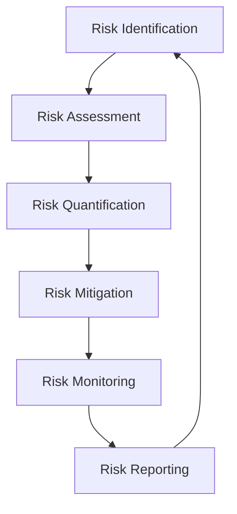
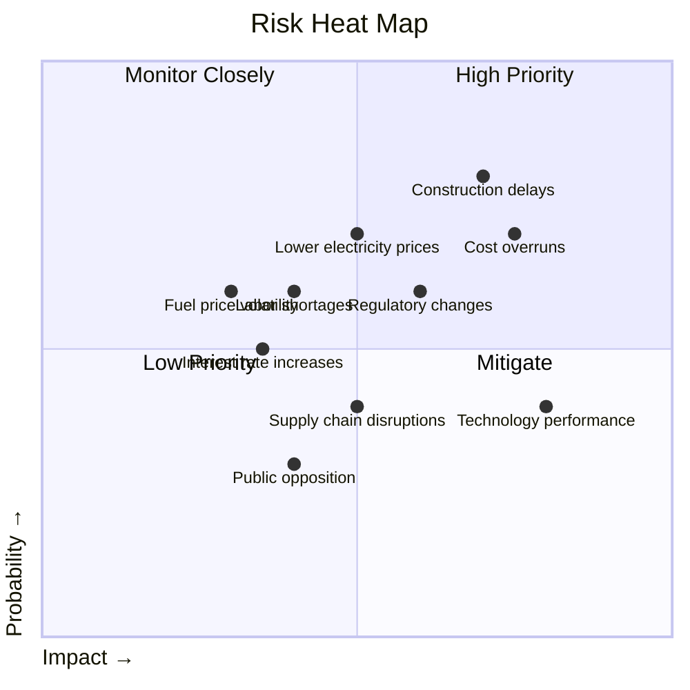

# Risk Analysis and Mitigation Strategy

## 1. Executive Summary

This document provides a comprehensive risk assessment for the Nuklei nuclear power project, identifying potential risks across all project phases, quantifying their potential impact, and detailing mitigation strategies to ensure project success and financial viability.

## 2. Risk Management Framework

### 2.1 Risk Management Process

### 2.2 Risk Categories

| Category | Description | Examples |
|----------|-------------|-----------|
| **Construction** | Risks during project development and construction | Delays, cost overruns |
| **Operational** | Risks during plant operation | Performance, safety |
| **Market** | Commercial and financial risks | Price volatility, demand |
| **Regulatory** | Legal and compliance risks | Policy changes, licensing |
| **Technical** | Technology and design risks | Design flaws, obsolescence |
| **Environmental** | Ecological and social impacts | Emissions, community impact |
| **Force Majeure** | Unforeseeable events | Natural disasters, pandemics |

## 3. Risk Register

### 3.1 Top 10 Project Risks

| Risk | Category | Probability | Impact (M$) | Risk Score | Owner |
|------|-----------|-------------|-------------|------------|-------|
| Construction delays | Construction | 30% | 1,200 | 360 | Project Director |
| Cost overruns | Construction | 25% | 1,500 | 375 | CFO |
| Regulatory changes | Regulatory | 20% | 800 | 160 | Legal Counsel |
| Lower electricity prices | Market | 35% | 600 | 210 | Commercial Director |
| Technology performance | Technical | 15% | 1,000 | 150 | CTO |
| Fuel price volatility | Market | 40% | 300 | 120 | Supply Chain Mgr |
| Labor shortages | Construction | 30% | 450 | 135 | HR Director |
| Interest rate increases | Market | 25% | 350 | 88 | Treasurer |
| Supply chain disruptions | Construction | 20% | 500 | 100 | Procurement Mgr |
| Public opposition | Environmental | 15% | 400 | 60 | External Affairs |

### 3.2 Risk Heat Map

## 4. Quantitative Risk Analysis

### 4.1 Monte Carlo Simulation Results

| Metric | P10 | P50 | P90 | Mean | Std Dev |
|--------|-----|-----|-----|------|----------|
| **Total CAPEX (B$)** | 6.1 | 6.5 | 7.2 | 6.6 | 0.55 |
| **Construction Time (yrs)** | 7.5 | 8.0 | 9.0 | 8.2 | 0.75 |
| **LCOE ($/MWh)** | 55 | 60 | 68 | 61 | 6.5 |
| **Project IRR (%)** | 10.2 | 12.5 | 14.8 | 12.6 | 2.3 |
| **Equity IRR (%)** | 13.5 | 15.2 | 17.8 | 15.4 | 2.1 |

### 4.2 Sensitivity Analysis

| Variable | Base Case | -20% | +20% | Impact on IRR |
|----------|-----------|------|------|---------------|
| **CAPEX** | $6.5B | 14.2% | 10.8% | -3.4% to +2.1% |
| **Construction Time** | 8 years | 13.1% | 10.3% | -2.2% to +1.6% |
| **Electricity Price** | $60/MWh | 8.7% | 16.3% | -3.8% to +3.8% |
| **Capacity Factor** | 92% | 10.1% | 14.9% | -2.4% to +2.4% |
| **O&M Costs** | $120M/year | 13.2% | 11.8% | -0.7% to +0.7% |
| **Fuel Costs** | $40M/year | 12.9% | 12.1% | -0.4% to +0.4% |

## 5. Risk Mitigation Strategies

### 5.1 Construction Risks

| Risk | Mitigation | Responsibility | Timeline |
|------|------------|----------------|----------|
| **Delays** | Fixed-price EPC contract with LD clauses | Project Director | Pre-construction |
| **Cost Overruns** | 15% contingency, value engineering | CFO | Ongoing |
| **Labor Shortages** | Early workforce planning, training programs | HR Director | Construction phase |
| **Supply Chain** | Dual sourcing, strategic inventory | Procurement Mgr | Ongoing |
| **Design Changes** | Front-end engineering, 3D modeling | Engineering Mgr | Design phase |

### 5.2 Market Risks

| Risk | Mitigation | Responsibility | Timeline |
|------|------------|----------------|----------|
| **Price Volatility** | 70% fixed-price PPAs, hedging | Commercial Director | Ongoing |
| **Demand Risk** | Take-or-pay contracts, capacity payments | Business Dev Mgr | Pre-construction |
| **Interest Rates** | Interest rate swaps, fixed-rate debt | Treasurer | Financing phase |
| **Currency Risk** | Natural hedging, currency swaps | CFO | Ongoing |
| **Inflation** | Price escalation clauses, CPI indexing | Commercial Director | Contracting phase |

### 5.3 Regulatory and Political Risks

| Risk | Mitigation | Responsibility | Timeline |
|------|------------|----------------|----------|
| **Permitting Delays** | Early engagement, regulatory roadmap | Regulatory Affairs | Pre-construction |
| **Policy Changes** | Active lobbying, scenario planning | External Affairs | Ongoing |
| **Taxation** | Tax stabilization agreements | CFO | Development phase |
| **Expropriation** | Political risk insurance, BITs | Legal Counsel | Pre-investment |
| **Local Content** | Early community engagement, hiring | Community Relations | All phases |

## 6. Contingency Planning

### 6.1 Contingency Budget

| Category | Base Cost (M$) | Contingency (%) | Contingency (M$) |
|----------|----------------|-----------------|------------------|
| **Direct Costs** | 4,875 | 10% | 487.5 |
| **Indirect Costs** | 1,203 | 15% | 180.5 |
| **Owner's Costs** | 422 | 20% | 84.4 |
| **Total** | **6,500** | **11.6%** | **752.4** |

### 6.2 Schedule Buffer

| Milestone | Base Duration | Buffer | Total Duration |
|-----------|----------------|--------|----------------|
| **Site Prep** | 12 months | 2 months | 14 months |
| **Civil Works** | 24 months | 4 months | 28 months |
| **Equipment Installation** | 30 months | 6 months | 36 months |
| **Commissioning** | 6 months | 2 months | 8 months |
| **Total** | **72 months** | **14 months** | **86 months** |

## 7. Insurance Program

### 7.1 Insurance Coverage

| Coverage | Limit (M$) | Deductible (M$) | Premium (M$/yr) |
|----------|------------|-----------------|------------------|
| **Property All Risks** | 6,500 | 10 | 32.5 |
| **Third-Party Liability** | 1,500 | 5 | 7.5 |
| **Delay in Startup** | 1,000 | 30 days | 10.0 |
| **Marine Cargo** | 500 | 1 | 2.5 |
| **Directors & Officers** | 100 | 1 | 1.5 |
| **Total** | **9,600** | | **54.0** |

### 7.2 Nuclear Liability Coverage

| Coverage | Limit (M$) | Notes |
|----------|------------|-------|
| **Primary Layer** | 500 | Local requirements |
| **Secondary Layer** | 1,500 | International pools |
| **Government Backstop** | Unlimited | Subject to conventions |
| **Total** | **Unlimited** | |

## 8. Stress Testing

### 8.1 Scenario Analysis

| Scenario | Description | Impact | Mitigation |
|----------|-------------|--------|------------|
| **Recession** | 20% drop in electricity demand | -15% revenue | Fixed-price contracts, cost cuts |
| **Regulatory Change** | New safety requirements | +$300M CAPEX | Contingency, regulatory engagement |
| **Technology Failure** | Major component failure | 6-month outage | Redundancy, insurance |
| **Pandemic** | 12-month labor disruption | 18-month delay | Remote work, supply chain diversification |
| **Climate Event** | 1-in-100 year flood | $500M damage | Site selection, flood defenses |

### 8.2 Break-even Analysis

| Scenario | Break-even Price ($/MWh) | Current Price ($/MWh) | Buffer |
|----------|--------------------------|------------------------|---------|
| **Base Case** | 48 | 60 | 25% |
| **High CAPEX** | 54 | 60 | 11% |
| **Low Capacity Factor** | 52 | 60 | 15% |
| **High O&M** | 51 | 60 | 18% |
| **All Adverse** | 66 | 60 | -10% |

## 9. Risk Monitoring and Reporting

### 9.1 Key Risk Indicators (KRIs)

| KRI | Threshold | Current | Status |
|-----|-----------|---------|--------|
| **Construction Schedule** | ≤ 1 month behind | 2 weeks | Green |
| **Cost Performance Index** | ≥ 0.95 | 0.98 | Green |
| **Regulatory Milestones** | 100% on time | 100% | Green |
| **Liquidity Coverage** | ≥ 1.2x | 1.5x | Green |
| **Debt Service Coverage** | ≥ 1.3x | 1.4x | Green |
| **Public Support** | ≥ 60% | 68% | Green |

### 9.2 Reporting Framework

| Report | Frequency | Audience | Key Metrics |
|--------|-----------|----------|-------------|
| **Monthly Risk Report** | Monthly | Project Team | Top 10 risks, KRIs |
| **Quarterly Risk Review** | Quarterly | Management | Risk trends, mitigation progress |
| **Annual Risk Assessment** | Annually | Board | Strategic risks, risk appetite |
| **Ad Hoc Alerts** | As needed | Relevant parties | Emerging risks, incidents |

## 10. Appendices

### 10.1 Risk Assessment Methodology

1. **Risk Identification**
   - Brainstorming sessions
   - Historical data analysis
   - Expert interviews
   - Lessons learned

2. **Risk Assessment**
   - Probability assessment (1-5 scale)
   - Impact assessment (1-5 scale)
   - Risk scoring (P×I)
   - Risk prioritization

3. **Risk Quantification**
   - Monte Carlo simulation
   - Sensitivity analysis
   - Scenario analysis
   - Financial modeling

### 10.2 Risk Management Tools

| Tool | Purpose | Provider |
|------|---------|----------|
| **@Risk** | Monte Carlo simulation | Palisade |
| **SAP Risk Management** | Risk register | SAP |
| **ARM** | Enterprise risk management | LogicManager |
| **Tableau** | Risk visualization | Salesforce |
| **Power BI** | Risk reporting | Microsoft |

### 10.3 References

1. **Standards**
   - ISO 31000:2018 Risk Management
   - COSO ERM Framework
   - PMI Risk Management Standard

2. **Industry Guidelines**
   - IAEA Safety Standards
   - WANO Performance Objectives and Criteria
   - OECD/NEA Risk Communication

3. **Regulatory Requirements**
   - NRC Regulatory Guide 1.206
   - EU Stress Test Requirements
   - National Nuclear Regulator Guidelines

### 10.4 Contact Information

| Role | Name | Contact |
|------|------|---------|
| Chief Risk Officer | Michael Chen | m.chen@nuklei.com |
| Risk Manager | Sarah Johnson | s.johnson@nuklei.com |
| Insurance Manager | David Kim | d.kim@nuklei.com |
| Safety Director | Emily Zhang | e.zhang@nuklei.com |
| General Inquiries | | risk@nuklei.com |

---
*Last Updated: June 13, 2025*  
*Confidential & Proprietary - For Internal Use Only*
