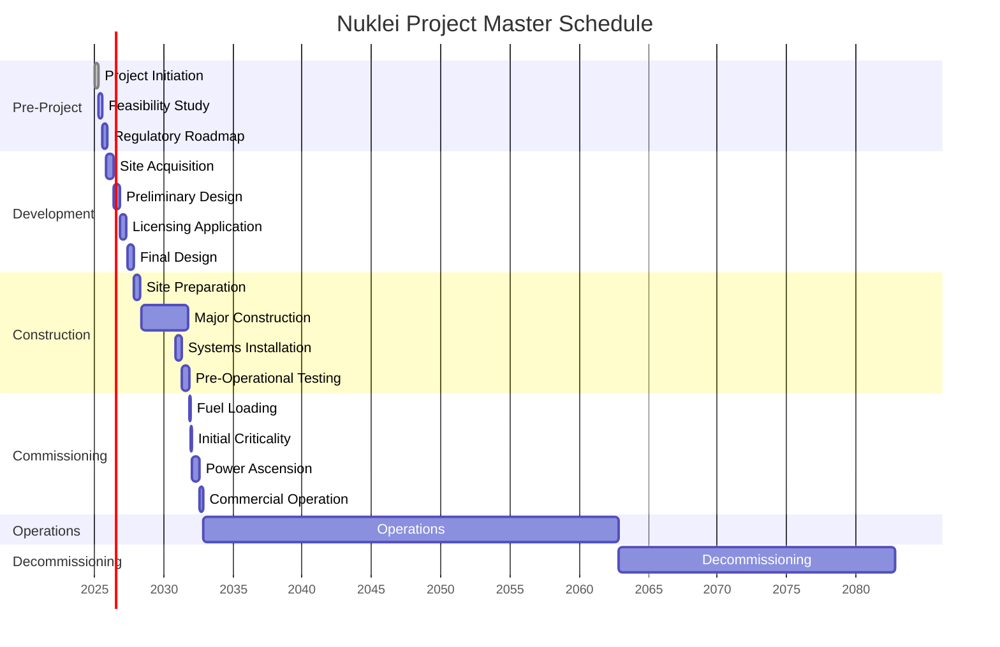

# Project Phases, Timeline & Milestones

## 1. Executive Summary

This document outlines the comprehensive project phasing, timeline, and key milestones for the Nuklei nuclear facility project. The project is structured into distinct phases, each with specific objectives, deliverables, and success criteria, designed to ensure systematic progression from concept to decommissioning.

## 2. Project Phases Overview

### 2.1 Phase 1: Pre-Project (Months 1-12)

| Milestone | Timeline | Key Deliverables | Success Criteria |
|-----------|----------|------------------|------------------|
| Project Initiation | M1-M3 | - Project Charter - Stakeholder Register - Initial Risk Register | Approved charter and identified stakeholders |
| Feasibility Study | M4-M8 | - Site Assessment Report - Technology Selection Matrix - Financial Model | Positive feasibility determination |
| Regulatory Roadmap | M9-M12 | - Licensing Strategy - Regulatory Engagement Plan | Approved engagement plan with regulators |

### 2.2 Phase 2: Development (Months 13-36)

| Milestone | Timeline | Key Deliverables | Success Criteria |
|-----------|----------|------------------|------------------|
| Site Acquisition | M13-M18 | - Land Purchase/Secure - Environmental Baseline | Site secured with all permits |
| Preliminary Design | M19-M24 | - Conceptual Design Package - Safety Analysis Report (Draft) | Design Basis Document approved |
| Licensing Application | M25-M30 | - Construction Permit Application - Environmental Impact Statement | Application accepted for review |
| Final Design | M31-M36 | - Final Design Package - Procurement Specifications | 90% IFC (Issued for Construction) drawings |

### 2.3 Phase 3: Construction (Months 37-96)

| Milestone | Timeline | Key Deliverables | Success Criteria |
|-----------|----------|------------------|------------------|
| Site Preparation | M37-M42 | - Site Grading - Foundations | Ready for major construction |
| Major Construction | M43-M84 | - Civil Works - Structural Steel - Mechanical Installation | Construction 90% complete |
| Systems Installation | M85-M90 | - I&C Systems - Electrical Systems | Systems installed and tested |
| Pre-Operational Testing | M91-M96 | - Cold/Hot Functional Testing - Fuel Load | Ready for fuel load |

### 2.4 Phase 4: Commissioning (Months 97-108)

| Milestone | Timeline | Key Deliverables | Success Criteria |
|-----------|----------|------------------|------------------|
| Fuel Loading | M97 | - Fuel Receipt & Inspection - Core Loading | Fuel loaded per procedures |
| Initial Criticality | M98 | - Criticality Testing - Low Power Physics Tests | First criticality achieved |
| Power Ascension | M99-M105 | - Power Ascension Testing - Performance Testing | 100% Power Operation |
| Commercial Operation | M106-M108 | - Performance Testing Complete - Turnover to Operations | COD (Commercial Operation Date) achieved |

### 2.5 Phase 5: Operations (Years 10-60)

| Milestone | Timeline | Key Deliverables | Success Criteria |
|-----------|----------|------------------|------------------|
| First Fuel Cycle | Y1-Y2 | - Operational Data - Performance Reports | Meets or exceeds performance targets |
| First Refueling Outage | Y2 | - Outage Report - Fuel Performance | On-time completion, within budget |
| Major Component Replacement | Y15, Y30 | - Component Replacement - Life Extension Studies | Extended operational life confirmed |

### 2.6 Phase 6: Decommissioning (Years 61-80)

| Milestone | Timeline | Key Deliverables | Success Criteria |
|-----------|----------|------------------|------------------|
| Defueling | Y61-Y63 | - Fuel Removal - Spent Fuel Storage | All fuel in dry storage |
| Decontamination | Y64-Y70 | - Decontamination Reports - Waste Shipment | Below release criteria |
| Dismantling | Y71-Y75 | - Component Removal - Material Recycling | Structures removed to grade |
| Site Restoration | Y76-Y80 | - Final Survey - License Termination | Unrestricted release of site |

## 3. Integrated Master Schedule

### 3.1 Gantt Chart Overview

### 3.2 Critical Path Analysis

The critical path for the Nuklei project includes:

1. **Regulatory Approval Timeline**
   - Construction Permit: Month 30
   - Operating License: Month 90
   - License Renewal: Year 25

2. **Long-Lead Items**
   - Reactor Pressure Vessel: Order by Month 18
   - Steam Generators: Order by Month 24
   - Turbine Generator: Order by Month 30

3. **Key Dependencies**
   - Fuel Supply Agreement must be finalized before Construction Permit Application
   - Emergency Planning Zone (EPZ) approval required before Site Preparation
   - Fuel Load cannot proceed without NRC Operating License

## 4. Resource Loading & Manpower Plan

### 4.1 Staffing Profile by Phase

| Phase | Engineering | Construction | Operations | Support | Total |
|-------|-------------|--------------|------------|---------|-------|
| Pre-Project | 25 | 5 | 5 | 15 | 50 |
| Development | 50 | 10 | 10 | 30 | 100 |
| Construction | 100 | 1,500 | 50 | 100 | 1,750 |
| Commissioning | 75 | 250 | 150 | 75 | 550 |
| Operations | 50 | 25 | 300 | 125 | 500 |
| Decommissioning | 30 | 200 | 50 | 70 | 350 |

### 4.2 Training Requirements

| Role | Pre-Job Training | Annual Training | Certification Required |
|------|------------------|-----------------|------------------------|
| Reactor Operators | 24 months | 200 hours | NRC License |
| Health Physics | 3 months | 80 hours | NRRPT Preferred |
| Maintenance Tech | 6 months | 100 hours | ASME/NBIC |
| Security | 3 months | 120 hours | NRC Firearms |
| Engineering | 1 month | 40 hours | PE Preferred |

## 5. Budget & Cost Profile

### 5.1 Phase-Wise Budget Allocation

| Phase | Budget ($M) | % of Total | Key Cost Drivers |
|-------|-------------|------------|------------------|
| Pre-Project | 50 | 0.5% | Studies, Permits |
| Development | 200 | 2.0% | Design, Licensing |
| Construction | 7,500 | 75.0% | Materials, Labor |
| Commissioning | 500 | 5.0% | Testing, Training |
| Operations | 1,500 | 15.0% | Staff, Maintenance |
| Decommissioning | 250 | 2.5% | Dismantling, Waste |
| **Total** | **10,000** | **100%** | |

### 5.2 Funding Profile

| Source | Amount ($M) | % of Total | Terms |
|--------|-------------|------------|-------|
| Equity | 3,000 | 30% | 15% IRR |
| Senior Debt | 5,000 | 50% | 5.5% fixed, 25y |
| Government Loan | 1,500 | 15% | 3.0% fixed, 30y |
| Grants | 500 | 5% | Non-dilutive |
| **Total** | **10,000** | **100%** | |

## 6. Risk Management

### 6.1 Top Project Risks

| Risk | Probability | Impact | Mitigation Strategy | Owner |
|------|------------|--------|---------------------|-------|
| Regulatory Delays | High | High | Early engagement, parallel reviews | Regulatory Affairs |
| Cost Overruns | Medium | High | Contingency, fixed-price contracts | Project Controls |
| Supply Chain Disruptions | Medium | High | Dual sourcing, strategic reserves | Procurement |
| Skilled Labor Shortage | High | Medium | Training programs, international recruitment | HR |
| Technology Readiness | Low | High | Phased deployment, vendor guarantees | Engineering |

### 6.2 Contingency Allocation

| Phase | Base Cost ($M) | Contingency (%) | Contingency ($M) |
|-------|----------------|------------------|-------------------|
| Pre-Project | 50 | 20% | 10 |
| Development | 200 | 15% | 30 |
| Construction | 7,500 | 10% | 750 |
| Commissioning | 500 | 8% | 40 |
| Operations | 1,500 | 5% | 75 |
| Decommissioning | 250 | 15% | 37.5 |
| **Total** | **10,000** | **9.9%** | **992.5** |

## 7. Performance Metrics & KPIs

### 7.1 Construction Phase KPIs

| KPI | Target | Frequency | Owner |
|-----|--------|-----------|-------|
| Schedule Performance Index (SPI) | ≥0.95 | Monthly | Project Controls |
| Cost Performance Index (CPI) | ≥0.95 | Monthly | Finance |
| Safety - TRIR | <1.0 | Monthly | HSE |
| Quality Non-Conformances | <5/month | Weekly | QA/QC |
| Change Orders | <2% of contract value | Monthly | Contracts |

### 7.2 Operations Phase KPIs

| KPI | Target | Frequency | Owner |
|-----|--------|-----------|-------|
| Capacity Factor | ≥90% | Monthly | Operations |
| Forced Outage Rate | <2% | Monthly | Maintenance |
| Fuel Reliability | >99.9% | Per cycle | Fuel Engineering |
| Collective Radiation Exposure | <100 person-rem/year | Quarterly | Health Physics |
| Security Drills | 100% on time | Quarterly | Security |

## 8. Stakeholder Engagement

### 8.1 Communication Matrix

| Stakeholder | Interest | Communication Method | Frequency | Owner |
|-------------|----------|----------------------|-----------|-------|
| Regulators | Compliance | Formal Submissions | Monthly | Regulatory Affairs |
| Investors | Financial Performance | Quarterly Reports | Quarterly | Investor Relations |
| Local Community | Safety, Jobs | Town Halls | Bi-annually | Public Affairs |
| Suppliers | Schedule, Payments | Vendor Portals | Monthly | Procurement |
| Employees | Project Status | All-Hands Meetings | Quarterly | HR |

### 8.2 Public Consultation Schedule

| Event | Timing | Purpose | Participants |
|-------|--------|---------|--------------|
| Project Kickoff | M1 | Introduce project | All Stakeholders |
| Preliminary Design Review | M24 | Gather feedback | Regulators, Community |
| Construction Start | M37 | Address concerns | Local Community |
| Pre-Operational Readiness | M90 | Demonstrate safety | Regulators, Public |
| Operational Updates | Annually | Maintain transparency | All Stakeholders |

## 9. Change Management

### 9.1 Change Control Process

1. **Change Request** - Documented in Change Control System
2. **Impact Assessment** - Technical, Schedule, Cost, Safety
3. **Review & Approval** - Change Control Board (CCB)
4. **Implementation** - Following approved procedures
5. **Verification** - Confirm changes implemented as approved

### 9.2 Change Thresholds

| Change Type | Approval Authority | Documentation Required |
|-------------|-------------------|------------------------|
| Minor (<$100k, <2 weeks) | Project Manager | Change Request Form |
| Moderate (<$1M, <1 month) | Executive Sponsor | Impact Analysis |
| Major (≥$1M or ≥1 month) | Board of Directors | Full Business Case |

## 10. Appendices

### 10.1 Regulatory Milestones

| Milestone | Agency | Timeline | Key Deliverables |
|-----------|--------|----------|------------------|
| Early Site Permit | NRC | M18 | ESP Application |
| Construction Permit | NRC | M30 | COLA Submission |
| Operating License | NRC | M90 | FSAR, EIS |
| Fuel Load Approval | NRC | M96 | Fuel Handling Procedures |
| Initial Criticality | NRC | M98 | Test Procedures |
| Full Power Operation | NRC | M108 | Performance Testing |

### 10.2 Long-Lead Items Procurement

| Item | Lead Time | Order By | Vendor | Status |
|------|-----------|----------|--------|--------|
| Reactor Vessel | 48 months | M18 | Doosan | TBD |
| Steam Generators | 36 months | M24 | BWXT | TBD |
| Turbine Generator | 30 months | M30 | GE | TBD |
| Main Transformers | 24 months | M36 | Siemens | TBD |
| I&C Systems | 18 months | M42 | Framatome | TBD |

### 10.3 Key Assumptions & Constraints

1. **Regulatory Approval**
   - No major changes in regulatory requirements
   - Timely review and approval by regulatory bodies

2. **Market Conditions**
   - Stable commodity prices for construction materials
   - Availability of skilled labor
   - Favorable interest rates for project financing

3. **Technology**
   - Proven technology with established supply chain
   - No first-of-a-kind technology risks
   - Vendor support throughout project lifecycle

4. **Site Conditions**
   - No major geotechnical surprises
   - Adequate infrastructure (roads, power, water)
   - Community acceptance and support

## 11. Revision History

| Version | Date | Author | Changes |
|---------|------|--------|---------|
| 0.1 | 2025-06-13 | Nuklei Team | Initial Draft |
| 0.2 | 2025-06-13 | Nuklei Team | Added Gantt chart and resource loading |
| 1.0 | 2025-06-13 | Nuklei Team | First Approved Version |

---
*Confidential & Proprietary - For Authorized Recipients Only*  
*© 2025 Nuklei Project. All rights reserved.*
