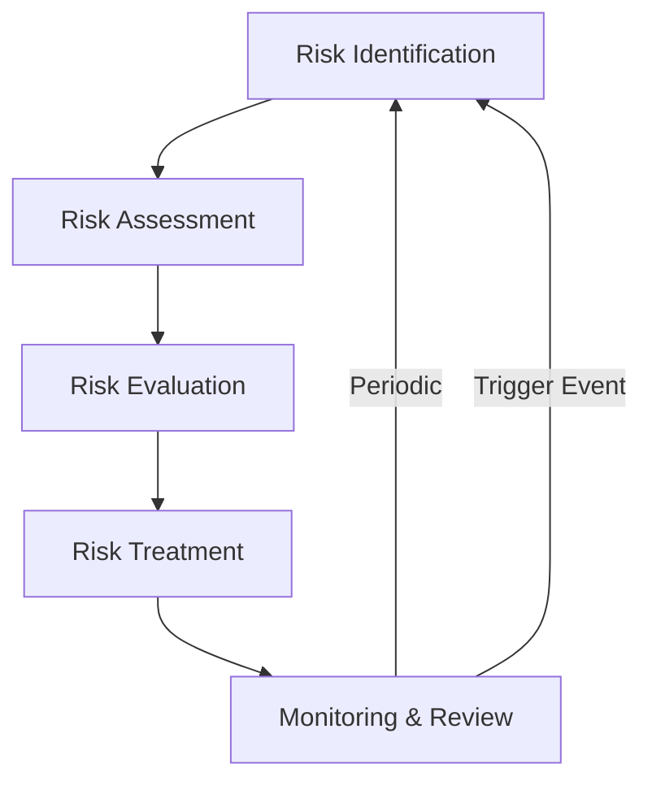
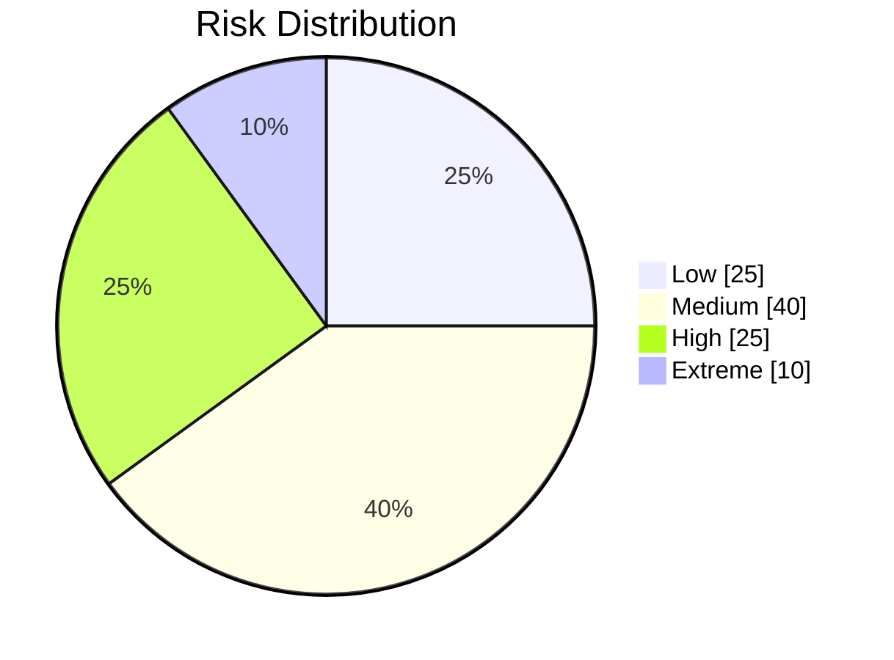

# Challenges, Risk Register & Mitigation

## Table of Contents
1. [Introduction](#1-introduction)
2. [Risk Management Framework](#2-risk-management-framework)
3. [Risk Identification](#3-risk-identification)
4. [Risk Assessment](#4-risk-assessment)
5. [Risk Mitigation Strategies](#5-risk-mitigation-strategies)
6. [Monitoring & Review](#6-monitoring--review)
7. [Roles & Responsibilities](#7-roles--responsibilities)
8. [Appendices](#8-appendices)

## 1. Introduction

This document serves as the central repository for identifying, assessing, and mitigating risks throughout the Nuklei project lifecycle. It provides a structured approach to risk management, ensuring that potential challenges are proactively addressed to maintain project success and safety.

### 1.1 Purpose
- Establish a standardized risk management process
- Identify potential threats and opportunities
- Develop effective mitigation strategies
- Ensure regulatory compliance
- Protect project objectives and stakeholders

### 1.2 Scope
This framework applies to all aspects of the Nuklei project, including:
- Design and engineering
- Construction and commissioning
- Operations and maintenance
- Decommissioning
- Regulatory compliance
- Stakeholder management

## 2. Risk Management Framework

### 2.1 Risk Management Process

### 2.2 Risk Categories

| Category | Description | Examples |
|----------|-------------|-----------|
| Technical | Engineering and design challenges | Component failure, Design flaws |
| Schedule | Timeline delays | Supply chain disruptions, Weather |
| Cost | Budget overruns | Material cost increases, Scope creep |
| Safety | Personnel and public safety | Radiation exposure, Industrial accidents |
| Regulatory | Compliance requirements | Changing regulations, Permit delays |
| Environmental | Ecological impact | Contamination, Waste management |
| Security | Physical and cyber threats | Sabotage, Cyber attacks |
| Reputational | Public perception | Media coverage, Community opposition |

## 3. Risk Identification

### 3.1 Identification Methods
- **Brainstorming sessions** with cross-functional teams
- **Expert interviews** with subject matter experts
- **Document analysis** of similar projects
- **Checklists** based on historical data
- **Assumption analysis** of project constraints
- **SWOT analysis** (Strengths, Weaknesses, Opportunities, Threats)

### 3.2 Risk Register Structure
See the [Risk Register Template](./risk-register/template.md) for the complete structure and instructions.

## 4. Risk Assessment

### 4.1 Risk Matrix

| Likelihood/Impact | Minor (1) | Moderate (2) | Major (3) | Severe (4) | Catastrophic (5) |
|------------------|-----------|--------------|-----------|------------|------------------|
| **Almost Certain (5)** | Medium | High | High | Extreme | Extreme |
| **Likely (4)** | Medium | Medium | High | High | Extreme |
| **Possible (3)** | Low | Medium | Medium | High | Extreme |
| **Unlikely (2)** | Low | Low | Medium | High | High |
| **Rare (1)** | Low | Low | Medium | Medium | High |

### 4.2 Risk Scoring

## 5. Risk Mitigation Strategies

### 5.1 Treatment Options
1. **Avoid**: Eliminate the threat or protect objectives from impact
2. **Reduce**: Optimize likelihood and/or impact
3. **Transfer**: Share the risk (e.g., insurance, contracts)
4. **Accept**: Acknowledge the risk with contingency plans

### 5.2 Mitigation Measures
- **Engineering Controls**: Design modifications, Safety systems
- **Administrative Controls**: Procedures, Training, Supervision
- **PPE**: Personal protective equipment
- **Contingency Planning**: Backup systems, Emergency response

## 6. Monitoring & Review

### 6.1 Monitoring Activities
- **Regular reviews** (monthly/quarterly)
- **Trigger-based reviews** (after significant events)
- **Performance indicators** tracking
- **Audits** and inspections

### 6.2 Review Process
1. Evaluate effectiveness of controls
2. Identify new risks
3. Update risk register
4. Adjust mitigation strategies
5. Document lessons learned

## 7. Roles & Responsibilities

| Role | Responsibilities |
|------|------------------|
| Project Manager | Overall risk management oversight |
| Risk Manager | Maintain risk register, Facilitate reviews |
| Technical Leads | Identify and assess technical risks |
| Safety Officer | Monitor safety-related risks |
| All Team Members | Report potential risks, Follow mitigation measures |

## 8. Appendices

### 8.1 Definitions
- **Risk**: Effect of uncertainty on objectives
- **Likelihood**: Chance of something happening
- **Impact**: Effect on objectives if risk occurs
- **Risk Appetite**: Amount of risk willing to pursue
- **Risk Tolerance**: Degree of variance acceptable

### 8.2 References
- ISO 31000:2018 Risk Management
- IAEA Safety Standards
- NRC Regulatory Guides
- Project Management Institute (PMI) Standards

### 8.3 Document History

| Version | Date | Author | Changes |
|---------|------|--------|----------|
| 1.0 | 2025-06-13 | Nuklei Team | Initial version |
