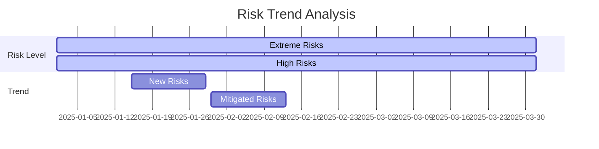
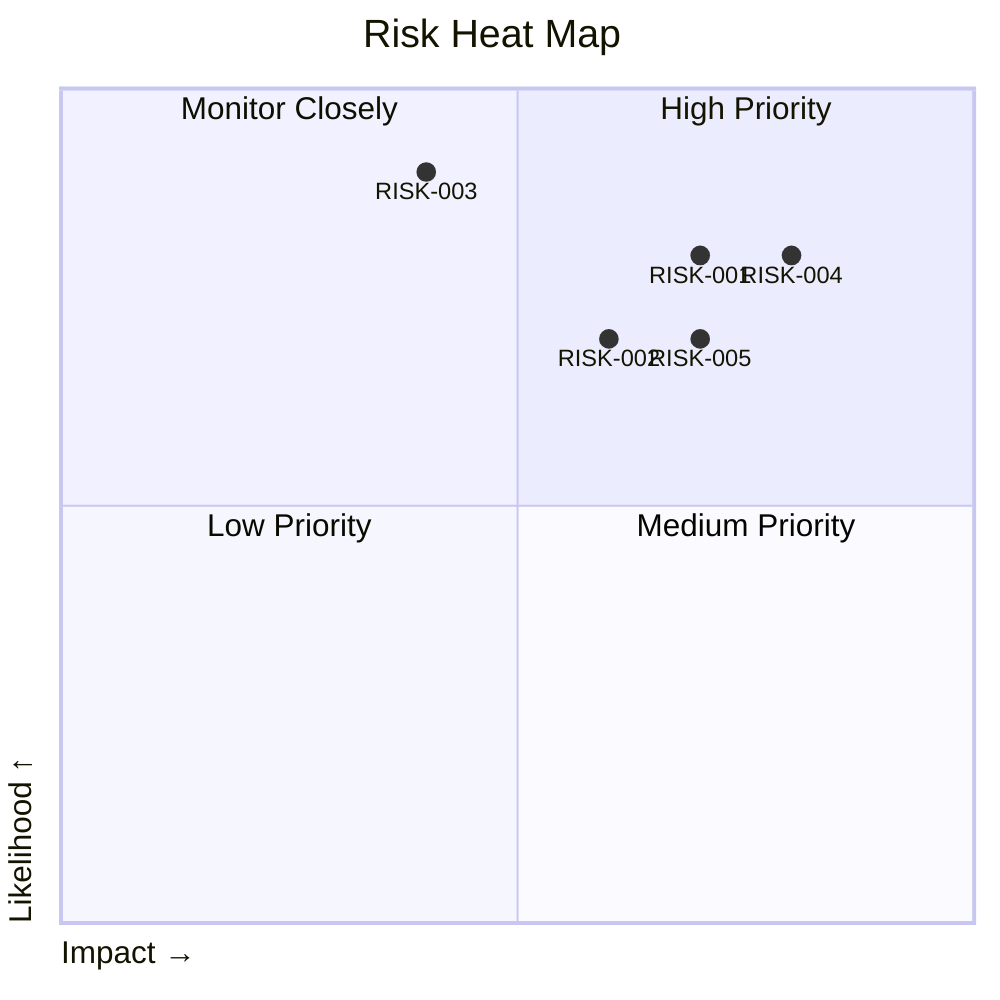

# Risk Register Template

## Instructions for Use
1. **Risk ID**: Unique identifier (e.g., RISK-001)
2. **Date Identified**: When the risk was first identified
3. **Risk Owner**: Individual responsible for managing the risk
4. **Risk Statement**: Clear description of the risk
5. **Category**: Risk category (Technical, Schedule, Cost, etc.)
6. **Likelihood**: On a scale of 1 (Rare) to 5 (Almost Certain)
7. **Impact**: On a scale of 1 (Minor) to 5 (Catastrophic)
8. **Risk Score**: Likelihood × Impact
9. **Risk Level**: Low (1-4), Medium (5-9), High (10-20), Extreme (21-25)
10. **Mitigation Strategy**: Actions to reduce likelihood/impact
11. **Contingency Plan**: Actions if risk materializes
12. **Status**: Open / In Progress / Closed / Transferred
13. **Target Date**: Expected resolution date
14. **Last Updated**: Date of last review

## Risk Register

| Risk ID | Date Identified | Risk Owner | Risk Statement | Category | L | I | Score | Level | Mitigation Strategy | Contingency Plan | Status | Target Date | Last Updated |
|---------|-----------------|------------|----------------|-----------|---|---|-------|-------|----------------------|-------------------|--------|-------------|--------------|
| RISK-001 | 2025-01-15 | Project Manager | Delay in regulatory approval for design changes | Regulatory | 4 | 4 | 16 | High | Early engagement with regulators, Parallel processing of non-impacted work | Extend project timeline, Allocate additional resources | Open | 2025-03-31 | 2025-01-20 |
| RISK-002 | 2025-01-10 | Engineering Lead | Critical component supply chain disruption | Supply Chain | 3 | 5 | 15 | High | Dual-source suppliers, Safety stock inventory | Alternative component design, Expedited shipping | Open | 2025-02-28 | 2025-01-18 |
| RISK-003 | 2025-01-05 | Safety Officer | Inadequate contractor safety training | Safety | 2 | 5 | 10 | High | Mandatory training program, On-site supervision | Stop work order, Retraining | In Progress | 2025-02-15 | 2025-01-12 |
| RISK-004 | 2025-01-18 | IT Security | Cyber attack on control systems | Security | 3 | 5 | 15 | High | Network segmentation, Regular penetration testing | Incident response plan, System isolation | Open | 2025-04-30 | 2025-01-20 |
| RISK-005 | 2025-01-22 | HR Director | Shortage of qualified nuclear engineers | Human Resources | 4 | 4 | 16 | High | Recruitment drive, Training program | Contract staffing, Retention bonuses | Open | 2025-06-30 | 2025-01-25 |

## Risk Breakdown Structure (RBS)

### 1. Technical Risks
- Design flaws
- Technology maturity
- Integration challenges
- Performance shortfalls

### 2. Project Management Risks
- Schedule delays
- Cost overruns
- Resource constraints
- Scope creep

### 3. External Risks
- Regulatory changes
- Market conditions
- Political factors
- Force majeure events

### 4. Organizational Risks
- Staff turnover
- Knowledge gaps
- Decision-making delays
- Stakeholder conflicts

### 5. Environmental Risks
- Natural disasters
- Climate impacts
- Ecological concerns
- Waste management

## Risk Reporting

### Executive Summary
- Total risks: 15
  - Extreme: 2
  - High: 7
  - Medium: 4
  - Low: 2
- Top 3 Risks:
  1. RISK-004: Cyber attack on control systems (Score: 15)
  2. RISK-001: Delay in regulatory approval (Score: 16)
  3. RISK-005: Shortage of qualified engineers (Score: 16)

### Risk Trend Analysis

## Risk Response Planning

### Avoidance Strategies
- Redesign processes to eliminate hazards
- Clarify requirements to prevent misunderstandings
- Obtain necessary permits before project start

### Mitigation Measures
- Implement early warning systems
- Conduct regular safety audits
- Maintain contingency budgets
- Develop alternative solutions

### Transfer Options
- Insurance policies
- Performance bonds
- Fixed-price contracts
- Partnerships and alliances

### Acceptance Criteria
- Low-impact, low-probability risks
- Cost of mitigation exceeds potential impact
- Strategic business decisions

## Risk Monitoring Dashboard

### Key Risk Indicators (KRIs)
1. **Schedule Performance Index (SPI)**: 0.92
2. **Cost Performance Index (CPI)**: 0.88
3. **Risk Exposure**: $2.4M
4. **Open High+ Risks**: 9
5. **Mitigation Effectiveness**: 75%

### Risk Heat Map

## Risk Review Meeting Template

### Meeting Details
- **Frequency**: Monthly
- **Duration**: 60 minutes
- **Participants**: Project Manager, Risk Owners, Key Stakeholders

### Agenda
1. Review of previous action items (10 min)
2. New risks identification (15 min)
3. Risk status updates (15 min)
4. Risk scoring changes (10 min)
5. Mitigation plan adjustments (10 min)

### Action Items Tracking
| Action | Owner | Due Date | Status |
|--------|-------|----------|--------|
| Finalize risk mitigation plan for RISK-001 | PM | 2025-02-15 | In Progress |
| Conduct security audit | CISO | 2025-02-28 | Not Started |
| Update risk register with new findings | Risk Manager | 2025-02-05 | Completed |

## Risk Communication Plan

### Stakeholder Matrix
| Stakeholder | Information Needs | Frequency | Format |
|-------------|-------------------|-----------|--------|
| Executive Team | High-level risk exposure | Monthly | Dashboard |
| Project Team | Detailed risk items | Bi-weekly | Meeting + Report |
| Regulators | Compliance risks | Quarterly | Formal Report |
| Contractors | Relevant risks | As needed | Email + Meeting |

### Escalation Path
1. **Level 1**: Risk Owner
2. **Level 2**: Department Head
3. **Level 3**: Steering Committee
4. **Level 4**: Executive Board

## Continuous Improvement

### Lessons Learned Process
1. Document risk events and outcomes
2. Analyze root causes
3. Update risk management plan
4. Share findings with relevant teams
5. Incorporate into future planning

### Training Requirements
- Risk Management Fundamentals (All Staff)
- Advanced Risk Analysis (Managers)
- Crisis Management (Leadership)
- Industry-specific Risk Training (Technical Staff)
