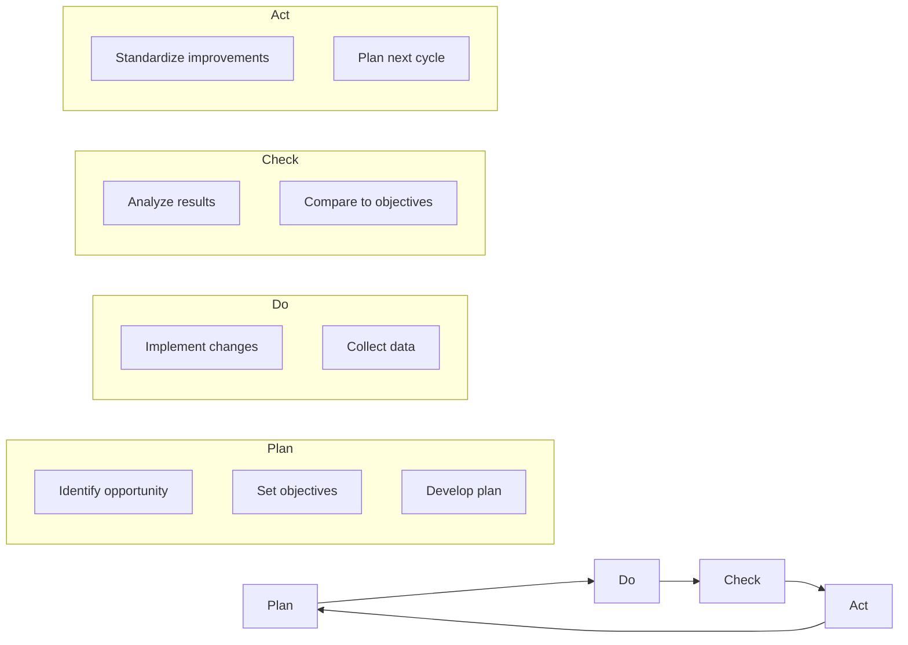
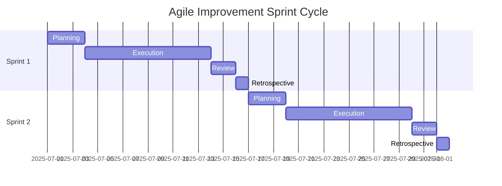
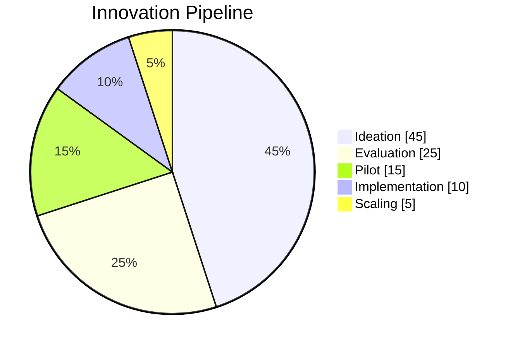

# Continuous Improvement & Innovation Cycles

## Table of Contents
1. [Introduction](#1-introduction)
2. [Vision & Objectives](#2-vision--objectives)
3. [Improvement Frameworks](#3-improvement-frameworks)
4. [Innovation Process](#4-innovation-process)
5. [Implementation Roadmap](#5-implementation-roadmap)
6. [Metrics & KPIs](#6-metrics--kpis)
7. [Roles & Responsibilities](#7-roles--responsibilities)
8. [Appendices](#8-appendices)

## 1. Introduction

This document outlines Nuklei's approach to continuous improvement and innovation, ensuring the project remains at the forefront of nuclear technology development while maintaining the highest standards of safety, efficiency, and reliability.

### 1.1 Purpose
- Establish a structured approach to continuous improvement
- Foster a culture of innovation and learning
- Ensure systematic capture and implementation of improvements
- Align improvement initiatives with strategic objectives
- Measure and demonstrate progress

### 1.2 Scope
This framework applies to all aspects of the Nuklei project, including:
- Engineering and design
- Operations and maintenance
- Safety and regulatory compliance
- Project management
- Community engagement
- Knowledge management

## 2. Vision & Objectives

### 2.1 Vision Statement
"To be the global benchmark for continuous improvement and innovation in nuclear technology development and deployment."

### 2.2 Strategic Objectives
1. **Accelerate Technology Development**
   - Reduce development cycles by 30%
   - Increase innovation success rate by 40%
   - Achieve 90% on-time project delivery

2. **Enhance Operational Excellence**
   - Improve safety performance by 25%
   - Increase operational efficiency by 20%
   - Reduce non-conformances by 30%

3. **Foster Collaborative Innovation**
   - Establish 5+ strategic partnerships
   - Increase community contributions by 50%
   - Implement 100+ improvement ideas annually

## 3. Improvement Frameworks

### 3.1 PDCA (Plan-Do-Check-Act) Cycle

### 3.2 DMAIC (Define, Measure, Analyze, Improve, Control)

| Phase | Activities | Tools | Outputs |
|-------|------------|-------|----------|
| **Define** | Project scope, Customer requirements | SIPOC, VOC | Project charter, Problem statement |
| **Measure** | Data collection, Process mapping | Process maps, Data collection plans | Baseline metrics, Data quality assessment |
| **Analyze** | Root cause analysis, Hypothesis testing | Fishbone, 5 Whys, Regression analysis | Verified root causes, Data insights |
| **Improve** | Solution generation, Implementation | FMEA, Pilot testing, DOE | Validated solutions, Implementation plan |
| **Control** | Standardization, Monitoring | Control charts, SOPs, Training | Control plan, Sustained results |

### 3.3 Agile Improvement Sprints

## 4. Innovation Process

### 4.1 Idea Generation
- **Brainstorming sessions** (quarterly)
- **Hackathons** (bi-annually)
- **Suggestion system** (continuous)
- **Cross-industry benchmarking**
- **Research partnerships**

### 4.2 Evaluation & Selection

| Criteria | Weight | Description |
|----------|--------|-------------|
| Strategic Alignment | 25% | Alignment with Nuklei's mission and goals |
| Feasibility | 20% | Technical and operational feasibility |
| Impact | 25% | Potential benefits and value creation |
| Resources Required | 15% | Human, financial, and time resources |
| Risk Level | 15% | Potential challenges and mitigation |

### 4.3 Implementation Framework

1. **Pilot Testing**
   - Small-scale validation
   - Data collection and analysis
   - Stakeholder feedback

2. **Scaling Up**
   - Phased implementation
   - Resource allocation
   - Change management

3. **Institutionalization**
   - Process documentation
   - Training and knowledge transfer
   - Performance monitoring

## 5. Implementation Roadmap

### 5.1 Short-term (0-6 months)
- Establish improvement teams
- Launch idea management platform
- Conduct initial training
- Implement quick wins

### 5.2 Medium-term (6-18 months)
- Complete process mapping
- Implement improvement projects
- Establish baseline metrics
- Develop innovation pipeline

### 5.3 Long-term (18-36 months)
- Full deployment of improvement framework
- Mature innovation process
- Achieve performance targets
- Industry recognition

## 6. Metrics & KPIs

### 6.1 Performance Metrics

| Metric | Target | Frequency | Owner |
|--------|--------|-----------|-------|
| Improvement ideas submitted | 100+/year | Monthly | CI Manager |
| Implementation rate | >60% | Quarterly | CI Manager |
| Cycle time reduction | 25% | Bi-annually | Process Owners |
| Cost savings | $500K+/year | Annually | Finance |
| Safety incidents | 0 | Continuous | HSE Manager |

### 6.2 Innovation Metrics

## 7. Roles & Responsibilities

### 7.1 Improvement Teams

| Role | Responsibilities |
|------|------------------|
| **Executive Sponsor** | Strategic direction, Resource allocation |
| **CI Manager** | Program oversight, Performance monitoring |
| **Process Owners** | Implementation, Results delivery |
| **Team Members** | Idea generation, Implementation support |
| **Facilitators** | Methodology expertise, Training |

### 7.2 Innovation Council
- **Composition**: Cross-functional leadership
- **Meetings**: Quarterly
- **Responsibilities**:
  - Strategic alignment
  - Resource allocation
  - Portfolio management
  - Performance review

## 8. Appendices

### 8.1 Templates
- [Idea Submission Form](./templates/idea-submission.md)
- [Project Charter](./templates/project-charter.md)
- [A3 Report](./templates/a3-report.md)
- [Lessons Learned](./templates/lessons-learned.md)

### 8.2 References
- The Lean Startup - Eric Ries
- The Innovator's Dilemma - Clayton Christensen
- The Fifth Discipline - Peter Senge
- ISO 56000 Innovation Management

### 8.3 Document History

| Version | Date | Author | Changes |
|---------|------|--------|----------|
| 1.0 | 2025-06-13 | Nuklei Team | Initial version |
| 1.1 | 2025-06-20 | CI Team | Added metrics and KPIs |
