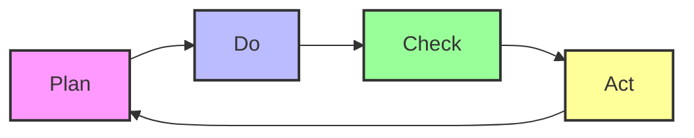

# Improvement Frameworks

## Table of Contents
1. [Introduction](#1-introduction)
2. [PDCA (Plan-Do-Check-Act)](#2-pdca-plan-do-check-act)
3. [DMAIC (Define, Measure, Analyze, Improve, Control)](#3-dmaic-define-measure-analyze-improve-control)
4. [Agile Improvement Sprints](#4-agile-improvement-sprints)
5. [Lean Six Sigma](#5-lean-six-sigma)
6. [Kaizen](#6-kaizen)
7. [Theory of Constraints](#7-theory-of-constraints)
8. [Benchmarking](#8-benchmarking)
9. [Implementation Guide](#9-implementation-guide)
10. [Appendices](#10-appendices)

## 1. Introduction

This document provides a comprehensive guide to the improvement frameworks used within the Nuklei project. These frameworks provide structured approaches to identify, analyze, and implement improvements across all aspects of our operations.

### 1.1 Framework Selection Criteria

| Framework | Best For | Complexity | Timeframe | Key Benefit |
|-----------|----------|------------|-----------|-------------|
| **PDCA** | Incremental improvements | Low | Short-term | Simple, quick implementation |
| **DMAIC** | Process improvement | Medium | Medium-term | Data-driven, structured |
| **Agile Sprints** | Rapid iterations | Medium | Flexible | Adaptable, fast results |
| **Lean Six Sigma** | Quality improvement | High | Long-term | Defect reduction, efficiency |
| **Kaizen** | Continuous small improvements | Low | Ongoing | Employee engagement |
| **TOC** | Bottleneck elimination | Medium | Varies | Focuses on constraints |

## 2. PDCA (Plan-Do-Check-Act)

### 2.1 Overview
A four-step management method used for the control and continuous improvement of processes and products.

### 2.2 Implementation Steps

#### Plan
1. Identify the problem or opportunity
2. Analyze the current situation
3. Develop potential solutions
4. Select the best solution
5. Create an action plan

#### Do
1. Implement the solution on a small scale
2. Document the process
3. Train relevant personnel
4. Execute the plan

#### Check
1. Monitor and measure results
2. Compare against objectives
3. Identify any deviations
4. Document findings

#### Act
1. Standardize successful changes
2. Implement changes on a wider scale
3. Document new standards
4. Plan for the next cycle

### 2.3 PDCA Cycle Visualization



## 3. DMAIC (Define, Measure, Analyze, Improve, Control)

### 3.1 Phase Details

#### Define
- **Purpose**: Clearly define the problem and project goals
- **Tools**: Project charter, SIPOC, Voice of Customer (VOC)
- **Output**: Clear problem statement, project scope, business case

#### Measure
- **Purpose**: Measure the current process performance
- **Tools**: Process mapping, data collection plan, baseline metrics
- **Output**: Current state metrics, process capability analysis

#### Analyze
- **Purpose**: Identify root causes of problems
- **Tools**: Fishbone diagram, 5 Whys, hypothesis testing
- **Output**: Verified root causes, data-driven insights

#### Improve
- **Purpose**: Develop and test solutions
- **Tools**: FMEA, pilot testing, design of experiments
- **Output**: Validated improvements, implementation plan

#### Control
- **Purpose**: Maintain improvements
- **Tools**: Control charts, SOPs, training
- **Output**: Control plan, monitoring system

### 3.2 DMAIC Project Charter Template

```markdown
# DMAIC Project Charter

## Project Information
- **Project Name**: 
- **Project Lead**: 
- **Team Members**: 
- **Date**: 
- **Expected Completion**: 

## Business Case
[Brief description of the business need/opportunity]

## Problem Statement
[Clear statement of the problem to be solved]

## Goal Statement
[Specific, measurable objectives]

## Project Scope
- **In Scope**: 
- **Out of Scope**: 
- **Constraints**: 
- **Assumptions**: 

## Stakeholders
| Role | Name | Department | Contact |
|------|------|------------|---------|
| Sponsor | | | |
| Process Owner | | | |
| Team Members | | | |

## Timeline
| Phase | Start Date | End Date | Status |
|-------|------------|----------|--------|
| Define | | | |
| Measure | | | |
| Analyze | | | |
| Improve | | | |
| Control | | | |

## Success Metrics
| Metric | Baseline | Target |
|--------|----------|--------|
| | | |

## Approval
| Role | Name | Signature | Date |
|------|------|-----------|------|
| Project Sponsor | | | |
| Project Lead | | | |
```

## 4. Agile Improvement Sprints

### 4.1 Sprint Framework

#### Sprint Planning (1-2 days)
- Define sprint goals
- Select backlog items
- Create sprint backlog
- Define acceptance criteria

#### Daily Stand-up (15 min)
- What was accomplished yesterday?
- What will be done today?
- Any impediments?

#### Sprint Review (2-4 hours)
- Demonstrate completed work
- Review against sprint goals
- Update product backlog

#### Sprint Retrospective (1-2 hours)
- What went well?
- What could be improved?
- Action items for next sprint

### 4.2 Sprint Backlog Template

```markdown
# Sprint [Number] - [Dates]

## Sprint Goal
[Clear, concise goal statement]

## Committed Items
| ID | User Story | Story Points | Owner | Status | Notes |
|----|------------|--------------|-------|--------|-------|
 |  |  |  |  |  | |

## Sprint Metrics
- Planned Velocity: 
- Actual Velocity: 
- Sprint Burndown: 

## Blockers & Issues
| Issue | Impact | Owner | Status | Resolution |
|-------|--------|-------|--------|------------|
 |  |  |  |  | |

## Notes
[Any additional notes or context]
```

## 5. Lean Six Sigma

### 5.1 Key Concepts

#### Waste Elimination (DOWNTIME)
- **D**efects
- **O**verproduction
- **W**aiting
- **N**on-utilized talent
- **T**ransport
- **I**nventory
- **M**otion
- **E**xtra-processing

### 5.2 Six Sigma Methodology

#### Define Phase
- Project charter
- Stakeholder analysis
- High-level process map

#### Measure Phase
- Data collection plan
- Process capability analysis
- Measurement system analysis

#### Analyze Phase
- Root cause analysis
- Hypothesis testing
- Multi-vari analysis

#### Improve Phase
- Solution generation
- Pilot testing
- Implementation planning

#### Control Phase
- Control plan
- Standard operating procedures
- Training

## 6. Kaizen

### 6.1 Kaizen Events

#### Preparation (2-4 weeks)
- Define scope and objectives
- Form cross-functional team
- Collect baseline data

#### Event (3-5 days)
- **Day 1**: Training and current state analysis
- **Day 2**: Identify improvements
- **Day 3**: Implement changes
- **Day 4**: Test and refine
- **Day 5**: Standardize and document

#### Follow-up (30-60 days)
- Monitor results
- Address issues
- Standardize successful changes

## 7. Theory of Constraints

### 7.1 Five Focusing Steps
1. **Identify** the constraint
2. **Exploit** the constraint
3. **Subordinate** other processes
4. **Elevate** the constraint
5. **Repeat** the process

### 7.2 Application Example

| Step | Action | Example |
|------|--------|----------|
| 1. Identify | Locate bottleneck | Slowest machine in production |
| 2. Exploit | Maximize constraint output | Reduce setup time |
| 3. Subordinate | Align other processes | Match upstream/downstream rates |
| 4. Elevate | Increase capacity | Add resources to constraint |
| 5. Repeat | Find next constraint | Move to next bottleneck |

## 8. Benchmarking

### 8.1 Benchmarking Process

1. **Planning**
   - Identify what to benchmark
   - Select benchmarking partners
   - Determine data collection methods

2. **Analysis**
   - Collect data
   - Analyze performance gaps
   - Identify best practices

3. **Integration**
   - Set goals
   - Develop action plans
   - Gain leadership approval

4. **Action**
   - Implement improvements
   - Monitor progress
   - Adjust as needed

5. **Maturity**
   - Achieve leadership position
   - Share best practices
   - Continuous improvement

## 9. Implementation Guide

### 9.1 Framework Selection Matrix

| Situation | Recommended Framework | Why |
|-----------|----------------------|-----|
| Quick wins needed | PDCA | Fast, simple |
| Complex process issues | DMAIC | Structured, data-driven |
| Rapid innovation | Agile Sprints | Flexible, iterative |
| Quality problems | Six Sigma | Reduces variation |
| Employee engagement | Kaizen | Empowers teams |
| Bottlenecks | Theory of Constraints | Focuses on constraints |
| Performance gaps | Benchmarking | Learn from others |

### 9.2 Implementation Checklist

- [ ] Define clear objectives
- [ ] Secure leadership support
- [ ] Select appropriate framework
- [ ] Form cross-functional team
- [ ] Provide training
- [ ] Allocate resources
- [ ] Set baseline metrics
- [ ] Develop implementation plan
- [ ] Communicate to stakeholders
- [ ] Monitor and adjust

## 10. Appendices

### 10.1 Templates
- [PDCA Worksheet](./templates/pdca-worksheet.md)
- [DMAIC Project Charter](./templates/dmaic-charter.md)
- [Sprint Planning Template](./templates/sprint-planning.md)
- [Kaizen Event Plan](./templates/kaizen-event.md)

### 10.2 References
- "The Toyota Way" - Jeffrey Liker
- "Lean Thinking" - James Womack & Daniel Jones
- "The Goal" - Eliyahu Goldratt
- "Six Sigma for Dummies" - Craig Gygi

### 10.3 Document History

| Version | Date | Author | Changes |
|---------|------|--------|----------|
| 1.0 | 2025-06-13 | Nuklei Team | Initial version |
| 1.1 | 2025-06-20 | CI Team | Added implementation guide |
