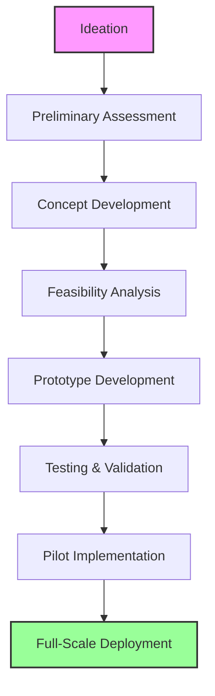
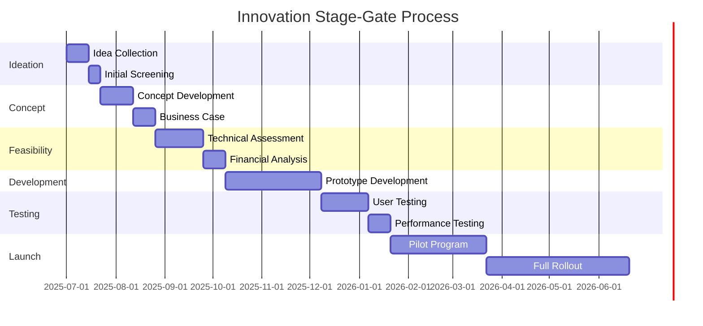
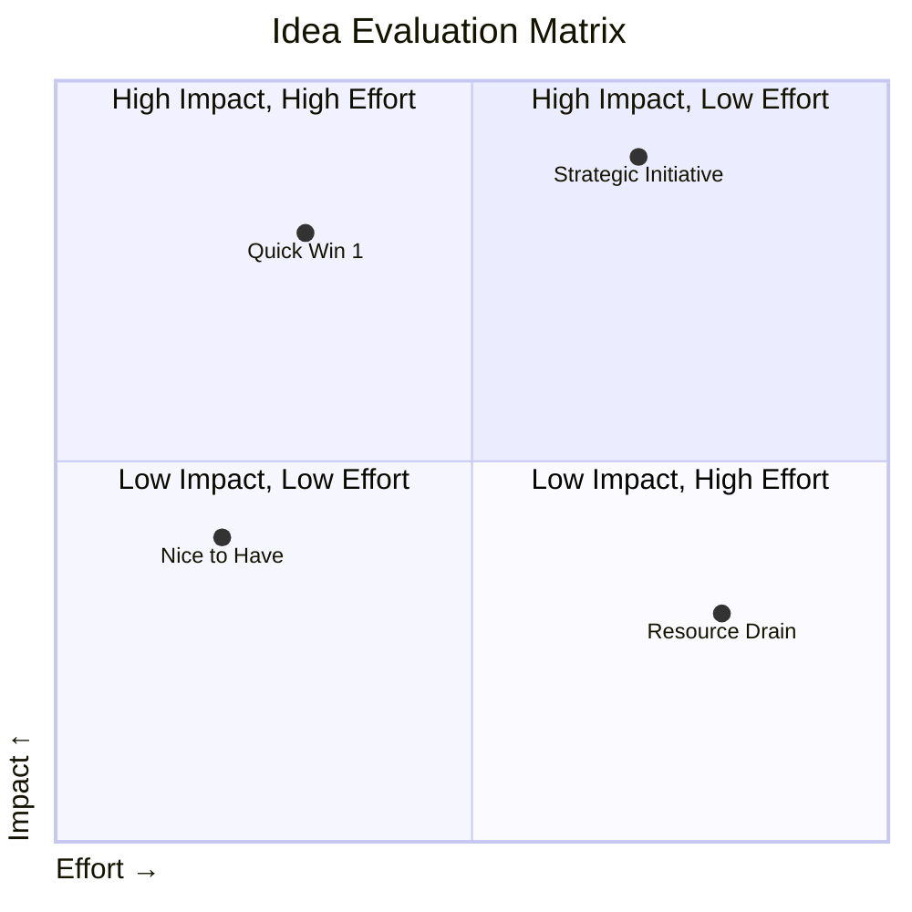
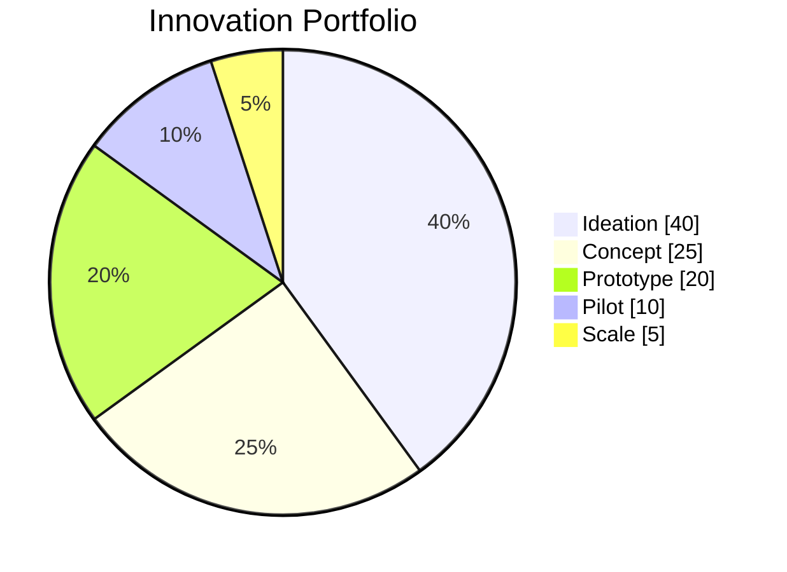

# Innovation Processes

## Table of Contents
1. [Introduction](#1-introduction)
2. [Innovation Funnel](#2-innovation-funnel)
3. [Idea Generation](#3-idea-generation)
4. [Idea Evaluation](#4-idea-evaluation)
5. [Prototyping & Testing](#5-prototyping--testing)
6. [Commercialization](#6-commercialization)
7. [Scaling & Integration](#7-scaling--integration)
8. [Innovation Metrics](#8-innovation-metrics)
9. [Tools & Techniques](#9-tools--techniques)
10. [Appendices](#10-appendices)

## 1. Introduction

This document outlines Nuklei's structured approach to fostering and managing innovation. It provides a clear framework for generating, evaluating, and implementing innovative ideas that drive the project forward.

### 1.1 Innovation Principles

- **Customer-Centric**: Focus on solving real user problems
- **Data-Driven**: Base decisions on evidence and metrics
- **Collaborative**: Leverage diverse perspectives and expertise
- **Iterative**: Embrace rapid experimentation and learning
- **Risk-Intelligent**: Balance innovation with risk management

### 1.2 Types of Innovation

| Type | Description | Example |
|------|-------------|----------|
| **Incremental** | Small improvements to existing solutions | Process optimization |
| **Adjacent** | New applications of existing capabilities | New market entry |
| **Disruptive** | Game-changing new approaches | Novel reactor design |
| **Architectural** | Reconfiguring existing components | System redesign |
| **Radical** | Completely new paradigms | New energy generation method |

## 2. Innovation Funnel

### 2.1 Funnel Stages



### 2.2 Stage Gates

| Stage | Purpose | Key Activities | Success Criteria |
|-------|---------|----------------|------------------|
| **Ideation** | Generate and collect ideas | Brainstorming, Hackathons | 100+ ideas per quarter |
| **Screening** | Initial evaluation | Quick assessment, Scoring | 20% pass rate |
| **Concept** | Develop initial concept | Market research, Initial design | Clear value proposition |
| **Feasibility** | Assess viability | Technical assessment, Cost analysis | Positive ROI projection |
| **Development** | Create prototype | Engineering, Testing | Functional prototype |
| **Testing** | Validate concept | User testing, Performance testing | Meets requirements |
| **Launch** | Initial deployment | Pilot program, Training | Successful pilot completion |
| **Scale** | Full implementation | Rollout, Monitoring | Achieves business objectives |

### 2.3 Stage-Gate Process



## 3. Idea Generation

### 3.1 Methods

#### 3.1.1 Brainstorming Sessions
- **Frequency**: Monthly
- **Duration**: 2 hours
- **Participants**: Cross-functional team (5-8 people)
- **Process**:
  1. Problem framing (15 min)
  2. Silent idea generation (10 min)
  3. Round-robin sharing (30 min)
  4. Grouping and voting (30 min)
  5. Top ideas selection (15 min)
  6. Next steps (20 min)

#### 3.1.2 Hackathons
- **Frequency**: Bi-annually
- **Duration**: 48 hours
- **Teams**: 3-5 members per team
- **Themes**: Focused on strategic priorities
- **Judging Criteria**:
  - Innovation (30%)
  - Feasibility (25%)
  - Impact (25%)
  - Presentation (20%)

#### 3.1.3 Suggestion System
- **Platform**: Online portal
- **Categories**:
  - Process improvement
  - Product enhancement
  - Cost reduction
  - Customer experience
  - Safety improvements
- **Review Process**:
  1. Initial screening (48 hours)
  2. Department review (1 week)
  3. Implementation planning (2 weeks)
  4. Feedback to submitter

### 3.2 Idea Capture Template

```markdown
# Idea Submission

## Basic Information
- **Title**: 
- **Submitted by**: 
- **Date**: 
- **Category**: [Dropdown: Process/Product/Service/Business Model]
- **Impact Area**: [Dropdown: Safety/Efficiency/Cost/Customer Satisfaction]

## Idea Description
- **Problem Statement**: 
- **Proposed Solution**: 
- **Expected Benefits**: 
- **Potential Challenges**: 

## Implementation Considerations
- **Resources Required**: 
- **Estimated Timeline**: 
- **Key Stakeholders**: 
- **Success Metrics**: 

## Additional Information
- **Similar Existing Solutions**: 
- **Supporting Data/Research**: 
- **Attachments**: 
```

## 4. Idea Evaluation

### 4.1 Evaluation Criteria

| Criterion | Weight | Description |
|-----------|--------|-------------|
| **Strategic Fit** | 20% | Alignment with Nuklei's goals |
| **Market Potential** | 15% | Addressable market size |
| **Technical Feasibility** | 20% | Technology readiness |
| **Financial Viability** | 15% | ROI, Payback period |
| **Risk Level** | 10% | Technical and market risks |
| **Implementation Effort** | 10% | Resources and time required |
| **Competitive Advantage** | 10% | Unique value proposition |

### 4.2 Scoring Matrix



### 4.3 Evaluation Process

1. **Initial Screening** (1 week)
   - Check completeness
   - Remove duplicates
   - Categorize ideas

2. **Preliminary Assessment** (2 weeks)
   - Score against criteria
   - Shortlist promising ideas
   - Request additional information if needed

3. **Detailed Evaluation** (3-4 weeks)
   - In-depth analysis
   - Stakeholder interviews
   - Feasibility studies

4. **Decision Making** (1 week)
   - Present to innovation board
   - Make go/no-go decision
   - Allocate resources

## 5. Prototyping & Testing

### 5.1 Prototyping Approaches

| Type | Description | When to Use | Tools |
|------|-------------|-------------|-------|
| **Paper Prototype** | Hand-drawn interfaces | Early concept validation | Paper, Markers |
| **Digital Mockup** | Static digital designs | UI/UX testing | Figma, Sketch |
| **3D Printed** | Physical models | Hardware concepts | 3D printers |
| **Functional** | Working prototype | Technical validation | Development tools |
| **MVP** | Minimum Viable Product | Market testing | Agile development |

### 5.2 Testing Framework

1. **Define Test Objectives**
   - Success criteria
   - Key metrics
   - Test scenarios

2. **Select Test Methods**
   - Usability testing
   - A/B testing
   - Performance testing
   - Security testing

3. **Conduct Tests**
   - Controlled environment
   - Real-world conditions
   - User feedback sessions

4. **Analyze Results**
   - Quantitative analysis
   - Qualitative feedback
   - Identify improvements

## 6. Commercialization

### 6.1 Go-to-Market Strategy

#### 6.1.1 Market Analysis
- Target customer segments
- Competitive landscape
- Pricing strategy
- Distribution channels

#### 6.1.2 Launch Plan
- Beta testing
- Soft launch
- Full launch
- Marketing campaign

### 6.2 Business Model

| Component | Description |
|-----------|-------------|
| **Value Proposition** | Core benefits and differentiation |
| **Revenue Streams** | How the innovation generates income |
| **Cost Structure** | Fixed and variable costs |
| **Key Resources** | Required assets and capabilities |
| **Partnerships** | Strategic alliances |

## 7. Scaling & Integration

### 7.1 Scaling Framework

1. **Assessment**
   - Review pilot results
   - Identify scaling constraints
   - Update business case

2. **Planning**
   - Resource allocation
   - Risk assessment
   - Timeline development

3. **Execution**
   - Phased rollout
   - Training and support
   - Performance monitoring

### 7.2 Integration Approach

| Level | Description | Activities |
|-------|-------------|------------|
| **Technical** | System integration | APIs, Data migration |
| **Process** | Workflow alignment | Process redesign |
| **People** | Change management | Training, Communication |
| **Governance** | Compliance | Policies, Standards |

## 8. Innovation Metrics

### 8.1 Performance Metrics

| Metric | Target | Frequency | Owner |
|--------|--------|-----------|-------|
| Ideas submitted | 100/quarter | Monthly | Innovation Manager |
| Implementation rate | 30% | Quarterly | Portfolio Manager |
| Time to market | < 12 months | Per project | Project Manager |
| ROI | 5:1 | Annually | Finance |
| Employee engagement | 80% participation | Bi-annually | HR |

### 8.2 Innovation Accounting



## 9. Tools & Techniques

### 9.1 Innovation Tools

| Tool | Purpose | Best For |
|------|---------|-----------|
| Design Thinking | Human-centered design | Early-stage ideation |
| TRIZ | Systematic innovation | Technical problems |
| SCAMPER | Idea generation | Product improvement |
| Business Model Canvas | Business model design | New ventures |
| Lean Startup | Rapid experimentation | Startups |

### 9.2 Technology Enablers

| Technology | Application | Benefit |
|------------|-------------|----------|
| AI/ML | Predictive analytics | Better decision making |
| Blockchain | IP protection | Secure collaboration |
| IoT | Connected devices | Real-time monitoring |
| AR/VR | Training | Enhanced learning |
| 3D Printing | Rapid prototyping | Faster iteration |

## 10. Appendices

### 10.1 Templates
- [Idea Submission Form](./templates/idea-submission.md)
- [Business Case Template](./templates/business-case.md)
- [Prototype Testing Plan](./templates/testing-plan.md)
- [Go-to-Market Checklist](./templates/gtm-checklist.md)

### 10.2 References
- "The Innovator's Dilemma" - Clayton Christensen
- "Lean Startup" - Eric Ries
- "Design Thinking" - Tim Brown
- "Ten Types of Innovation" - Larry Keeley

### 10.3 Document History

| Version | Date | Author | Changes |
|---------|------|--------|----------|
| 1.0 | 2025-06-13 | Nuklei Team | Initial version |
| 1.1 | 2025-06-20 | Innovation Team | Added evaluation criteria |
