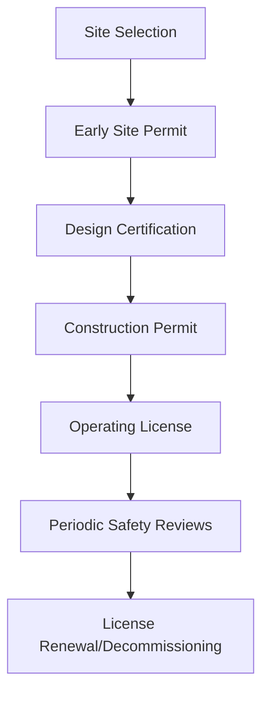

# Regulatory & Legal Foundations

This directory contains comprehensive documentation on the regulatory frameworks, legal requirements, and compliance strategies for nuclear energy projects under the Nuklei initiative.

## Core Documents

1. [International Framework](international-framework.md) - Global nuclear regulations and treaties
2. [Licensing Process](licensing-process.md) - Step-by-step guide to nuclear facility licensing
3. [Compliance Management](compliance-management.md) - Tools and processes for maintaining compliance
4. [Legal Considerations](legal-considerations.md) - Contracting, liability, and intellectual property
5. [Case Studies](case-studies/) - Real-world examples of regulatory processes

## Visual Overviews

### Regulatory Process Flow

### Key Regulatory Bodies

| Region | Primary Regulator | Key Regulations |
|--------|-------------------|----------------|
| Global | IAEA | Safety Standards, NPT |
| USA | NRC | 10 CFR Series |
| EU | ENSREG | EURATOM Treaty |
| Asia | Regional Bodies | WENRA Reference Levels |

## How to Use These Documents

- **For Project Managers**: Start with the [Licensing Process](licensing-process.md) for project timelines
- **For Legal Teams**: Review [Legal Considerations](legal-considerations.md) for contracting and liability
- **For Engineers**: See [Compliance Management](compliance-management.md) for technical standards
- **For Executives**: Review [Case Studies](case-studies/) for risk assessment

## Contributing

To contribute to the regulatory documentation:

1. Open an issue to discuss proposed changes
2. Submit a pull request with your modifications
3. Reference relevant regulations and standards

## Related Documents

- [Main Project Roadmap](../../nuklei_roadmap.md)
- [Strategic Vision](../01_strategic-vision/README.md)
- [Safety Documentation](../safety/README.md)

## Updates

- **Last Updated**: 2025-06-13
- **Next Review**: 2025-12-13
