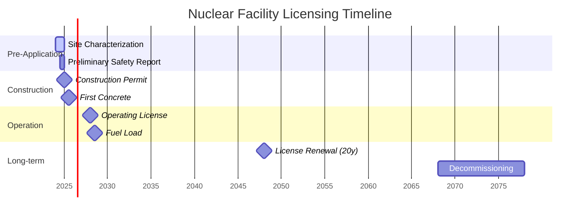

# Nuclear Facility Licensing Process

This document provides a comprehensive guide to the nuclear facility licensing process, from site selection through decommissioning, with a focus on modern, risk-informed approaches.

## 1. Licensing Framework Overview

### 1.1 Phased Licensing Approach

### 1.2 Key Regulatory Bodies

| Country | Regulatory Body | Key Legislation |
|---------|-----------------|-----------------|
| USA | NRC | Atomic Energy Act, 10 CFR |
| UK | ONR | Energy Act 2013 |
| France | ASN | Environmental Code |
| Japan | NRA | Reactor Regulation Act |
| China | MEE/NNSA | Nuclear Safety Law |

## 2. Step-by-Step Licensing Process

### 2.1 Site Evaluation and Approval

#### 2.1.1 Site Characterization
- **Requirements**:
  - Seismic hazard analysis
  - Meteorological conditions
  - Population distribution
  - Environmental impact
- **Deliverables**:
  - Preliminary Safety Analysis Report (PSAR)
  - Environmental Impact Assessment (EIA)

#### 2.1.2 Early Site Permit (ESP)
- **Validity**: 10-20 years
- **Key Considerations**:
  - Emergency planning
  - Environmental protection
  - Site safety parameters

### 2.2 Design Certification

#### 2.2.1 Standard Design Approval
- **Process**:
  - Technical review (24-36 months)
  - Public hearings
  - Safety evaluation report
- **Reference**: IAEA SSR-2/1 (Rev. 1)

#### 2.2.2 Design-Specific Requirements
- **Safety Systems**:
  - Redundancy (N+2)
  - Diversity
  - Physical separation
- **Design Basis Threat**:
  - Aircraft impact
  - Seismic events
  - External hazards

### 2.3 Construction Permit

#### 2.3.1 Application Requirements
- **Documents**:
  - Final Safety Analysis Report (FSAR)
  - Quality Assurance Program
  - Environmental Report
  - Emergency Planning

#### 2.3.2 Regulatory Review
- **Areas of Focus**:
  - Structural integrity
  - Radiation protection
  - Waste management
  - Decommissioning plans

### 2.4 Operating License

#### 2.4.1 Pre-Operational Testing
- **Stages**:
  1. Cold hydrostatic tests
  2. Hot functional testing
  3. Fuel load
  4. Initial criticality
  5. Power ascension tests

#### 2.4.2 Operational Limits and Conditions
- **Technical Specifications**:
  - Safety limits
  - Operating limits
  - Surveillance requirements
  - Design features

## 3. Risk-Informed Regulation

### 3.1 Probabilistic Risk Assessment (PRA)
- **Levels**:
  1. Plant damage states
  2. Containment performance
  3. Off-site consequences

### 3.2 Performance-Based Requirements
- **Focus Areas**:
  - Safety margins
  - Defense-in-depth
  - Safety culture

## 4. International Harmonization

### 4.1 MDEP (Multinational Design Evaluation Programme)
- **Purpose**: Streamline design reviews
- **Working Groups**:
  - EPR
  - AP1000
  - VVER
  - SMRs

### 4.2 WENRA Reference Levels
- **Application**:
  - New build
  - Long-term operation
  - Decommissioning

## 5. Digital Tools and Documentation

### 5.1 Digital Licensing Platform
- **Features**:
  - Document management
  - Review tracking
  - Stakeholder comments
  - Version control

### 5.2 Standard Review Plans
- **Areas Covered**:
  - Structural integrity
  - Reactor safety
  - Radiation protection
  - Environmental protection

## 6. Public Participation

### 6.1 Stakeholder Engagement
- **Mechanisms**:
  - Public hearings
  - Comment periods
  - Information sessions
  - Digital platforms

### 6.2 Transparency Requirements
- **Disclosures**:
  - Safety reports
  - Inspection findings
  - Performance indicators
  - Event reports

## 7. Compliance and Enforcement

### 7.1 Inspection Regime
- **Types**:
  - Routine inspections
  - Unannounced inspections
  - Special inspections
  - Follow-up inspections

### 7.2 Enforcement Actions
- **Measures**:
  - Notices of violation
  - Civil penalties
  - Orders
  - License modification/suspension

## 8. License Renewal and Life Extension

### 8.1 Periodic Safety Review (PSR)
- **Frequency**: Typically every 10 years
- **Scope**:
  - Plant condition
  - Safety margins
  - Operating experience
  - Technical updates

### 8.2 Long-Term Operation (LTO)
- **Requirements**:
  - Aging management
  - System upgrades
  - Regulatory approval

## 9. Decommissioning and Waste Management

### 9.1 Decommissioning License
- **Options**:
  - Immediate dismantling
  - Safe enclosure
  - Entombment

### 9.2 Waste Licensing
- **Categories**:
  - Very low-level waste (VLLW)
  - Low-level waste (LLW)
  - Intermediate-level waste (ILW)
  - High-level waste (HLW)

## 10. Emerging Regulatory Challenges

### 10.1 Advanced Reactor Technologies
- **Considerations**:
  - Novel fuel cycles
  - Different coolants
  - Modular construction

### 10.2 Climate Resilience
- **Aspects**:
  - Sea level rise
  - Extreme weather
  - Water availability

## 11. Resources and Tools

### 11.1 Regulatory Guides
- **IAEA Safety Standards**:
  - GSR Part 4: Safety Assessment
  - SSG-2: Deterministic Safety Analysis
  - SSG-3: Probabilistic Safety Assessment

### 11.2 Training and Capacity Building
- **Programs**:
  - IAEA training courses
  - Regulatory exchange programs
  - Technical workshops

## 12. Case Studies

### 12.1 Successful Licensing Examples
1. **AP1000** (USA/China/UK)
   - Standard design certification
   - Global deployment
   - Lessons learned

2. **EPR** (Finland/France/UK)
   - First-of-a-kind challenges
   - Regulatory cooperation
   - Construction experience

## 13. Best Practices

### 13.1 Early Regulatory Engagement
- **Benefits**:
  - Clear expectations
  - Risk reduction
  - Schedule certainty

### 13.2 Digital Transformation
- **Opportunities**:
  - Model-based regulation
  - Digital twins
  - AI-assisted reviews

## 14. Next Steps

1. Develop project-specific licensing strategy
2. Engage with regulators early
3. Prepare pre-application documentation
4. Establish quality management system
5. Plan for public engagement

## 15. Contact Information

For regulatory inquiries, contact:
- **Nuklei Regulatory Affairs**: regulatory@nuklei.org
- **IAEA Regulatory Support**: rwss@iaea.org
- **National Regulatory Bodies**: See [IAEA Directory](https://www.iaea.org/resources/databases/directory-of-regulatory-authorities)
