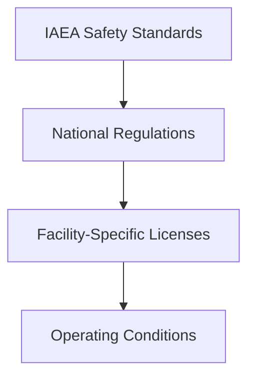
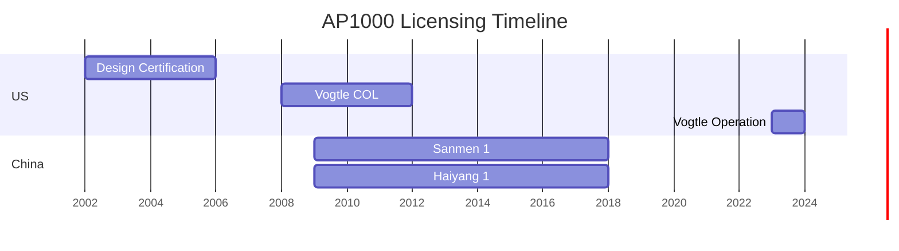

# Regulatory & Legal Foundations

### Comprehensive Framework for Nuclear Energy Projects

---

## Table of Contents

1. International Regulatory Framework
2. Licensing Process Overview
3. Compliance Management System
4. Key Legal Considerations
5. Case Study: AP1000 Licensing
6. Best Practices & Recommendations

---

## 1. International Regulatory Framework

### Core Components

### Key Treaties
- Non-Proliferation Treaty (NPT)
- Convention on Nuclear Safety
- Joint Convention on Spent Fuel
- Civil Liability Conventions

---

## 2. Licensing Process

### Phased Approach

| Phase | Duration | Key Activities |
|-------|----------|----------------|
| Site Evaluation | 2-3 years | Environmental studies, Safety analysis |
| Construction | 4-6 years | Permits, Inspections, QA/QC |
| Operation | 40-60 years | Periodic reviews, Compliance monitoring |
| Decommissioning | 10-15 years | Waste management, Site restoration |

---

## 3. Compliance Management

### Key Components

- **Regulatory Watch**
- **Gap Analysis**
- **Action Tracking**
- **Verification**
- **Reporting**

### Performance Metrics

| KPI | Target | Frequency |
|-----|--------|-----------|
| Regulatory Findings | 0 | Quarterly |
| Training Compliance | 100% | Monthly |
| Documentation Accuracy | 99.9% | Quarterly |

---

## 4. Legal Considerations

### Liability Regimes

| Country | Liability Limit | Insurance Required |
|---------|-----------------|-------------------|
| USA | $450M | $450M |
| UK | €1.2B | €700M |
| France | €700M | €700M |
| Japan | JPY 120B | Full amount |

### Key Contracts
- EPC Agreements
- O&M Contracts
- Fuel Supply
- Waste Management

---

## 5. Case Study: AP1000 Licensing

### Global Deployment

### Key Learnings
1. Early regulatory engagement
2. Design maturity
3. International collaboration
4. Supply chain management

---

## 6. Best Practices

### Regulatory Strategy
- Early and frequent engagement
- Pre-application discussions
- Issue resolution before submission
- Staff training programs

### Project Execution
- Risk management
- First-of-a-kind engineering
- Supply chain qualification
- Quality assurance oversight

---

## 7. Resources & Next Steps

### Available Resources
- IAEA Safety Standards
- National Regulatory Guides
- Industry Best Practices
- Case Studies

### Recommended Actions
1. Conduct regulatory gap analysis
2. Develop compliance management system
3. Engage with regulators
4. Train project team

---

# Thank You

### Questions?

**Contact:** regulatory@nuklei.org  
**Website:** nuklei.org/regulatory

---

## Appendix: Regulatory Bodies

| Region | Primary Regulator | Key Regulations |
|--------|-------------------|----------------|
| Global | IAEA | Safety Standards, NPT |
| USA | NRC | 10 CFR Series |
| EU | ENSREG | EURATOM Treaty |
| Asia | Regional Bodies | WENRA Reference Levels |

---

## Appendix: Compliance Checklist

- [ ] Regulatory requirements identified
- [ ] Controls implemented
- [ ] Staff trained
- [ ] Documentation complete
- [ ] Verification completed

---

## Appendix: Key Acronyms

- **NRC**: Nuclear Regulatory Commission
- **IAEA**: International Atomic Energy Agency
- **EPC**: Engineering, Procurement, Construction
- **COL**: Combined Operating License
- **PSA**: Probabilistic Safety Assessment
- **FSAR**: Final Safety Analysis Report

---

## References

1. IAEA Safety Standards Series
2. NRC Regulatory Guides
3. WNA Information Papers
4. OECD/NEA Reports

---

# End of Presentation
