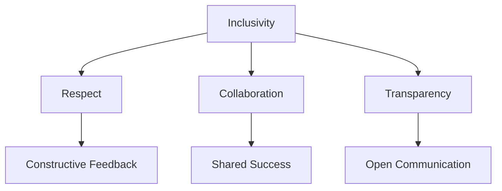
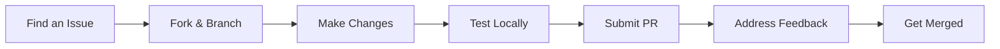

# Nuklei Community Guidelines

## 1. Our Community Values

### 1.1 Core Principles

### 1.2 Expected Behavior

- **Be Respectful**: Value diverse perspectives and experiences
- **Be Inclusive**: Welcome all contributors
- **Be Patient**: Allow time for discussion and consensus
- **Be Clear**: Communicate effectively and transparently
- **Be Responsible**: Take ownership of your contributions

## 2. Communication Guidelines

### 2.1 Official Channels

| Platform | Purpose | Moderation |
|----------|---------|------------|
| GitHub | Code, issues, PRs | Maintainers |
| Forum | Discussions | Community Leaders |
| Chat | Real-time help | Channel Ops |
| Mailing List | Announcements | TSC |

### 2.2 Communication Standards

1. **Be Clear and Concise**
   - Use descriptive subject lines
   - Keep messages focused
   - Use formatting for readability

2. **Be Professional**
   - Use inclusive language
   - Avoid jargon and acronyms
   - Be mindful of cultural differences

3. **Be Responsive**
   - Acknowledge messages promptly
   - Set expectations for response times
   - Use "@" mentions when action is needed

## 3. Contribution Guidelines

### 3.1 How to Contribute

### 3.2 Contribution Types

| Type | Process | Reviewers |
|------|---------|-----------|
| Bug Fix | 1. Create Issue 2. Fix Bug 3. Submit PR | 1 Maintainer |
| Feature | 1. Create Proposal 2. Get Approval 3. Implement | 2+ Maintainers |
| Documentation | 1. Create/Update Docs 2. Submit PR | 1 Maintainer |
| Translation | 1. Check Status 2. Submit PR | Translation Team |

## 4. Code of Conduct

### 4.1 Our Pledge

We pledge to make participation in our community a harassment-free experience for everyone, regardless of:

- Age
- Body size
- Disability
- Ethnicity
- Gender identity and expression
- Level of experience
- Nationality
- Personal appearance
- Race
- Religion
- Sexual identity and orientation

### 4.2 Unacceptable Behavior

- Harassment of any form
- Trolling or insulting comments
- Public or private harassment
- Publishing others' private information
- Other conduct that could reasonably be considered inappropriate

## 5. Conflict Resolution

### 5.1 Reporting Issues

1. **Direct Resolution**: Address the issue directly with the person(s) involved
2. **Mediation**: If unresolved, contact a community mediator
3. **Escalation**: If needed, contact the TSC at tsc@nuklei.org

### 5.2 Enforcement Process

1. **Investigation**: Confidential review of the report
2. **Temporary Measures**: If needed, temporary restrictions may be imposed
3. **Resolution**: Appropriate action will be determined
4. **Appeal**: Decisions can be appealed to the TSC

## 6. Recognition

### 6.1 Contribution Recognition

| Level | Badge | Requirements |
|-------|-------|--------------|
| New Contributor | 🌱 | First contribution |
| Active Contributor | 🚀 | 5+ contributions |
| Core Contributor | ⭐ | 20+ contributions |
| Project Champion | 🏆 | 50+ contributions |

### 6.2 Recognition Programs

- **Monthly Spotlight**: Featured contributor
- **Quarterly Awards**: Outstanding contributions
- **Annual Recognition**: Major milestones
- **Hall of Fame**: Long-term contributors

## 7. Events and Activities

### 7.1 Regular Events

| Event | Frequency | Audience |
|-------|-----------|----------|
| Community Call | Monthly | All |
| Working Group Meetings | Bi-weekly | WG Members |
| Hackathons | Quarterly | Contributors |
| Contributor Summit | Annual | Community |

### 7.2 Event Guidelines

1. **Code of Conduct**: All events follow our CoC
2. **Accessibility**: Events should be accessible to all
3. **Recording**: Meetings should be recorded when possible
4. **Notes**: Meeting notes should be published

## 8. Mentorship

### 8.1 Programs

| Program | Duration | Focus |
|---------|----------|-------|
| Newcomer Mentorship | 3 months | Onboarding |
| Project Mentorship | 6 months | Specific projects |
| Leadership Development | 1 year | Future leaders |

### 8.2 Getting a Mentor

1. Check available programs
2. Submit application
3. Get matched with a mentor
4. Set goals and meet regularly

## 9. Local Communities

### 9.1 Starting a Local Chapter

1. Find 3+ interested members
2. Contact community@nuklei.org
3. Complete chapter application
4. Sign chapter agreement
5. Plan your first event

### 9.2 Chapter Requirements

- Monthly meetups
- Annual report
- Code of Conduct adherence
- Regular communication with main community

## 10. Resources

### 10.1 Learning Resources

- Documentation
- Tutorials
- Webinars
- Training materials

### 10.2 Support Channels

- FAQ
- Discussion forum
- Office hours
- Community chat

## 11. Feedback

### 11.1 How to Give Feedback

1. Be specific and constructive
2. Focus on behavior, not people
3. Suggest improvements
4. Be open to discussion

### 11.2 Community Surveys

- Quarterly pulse survey
- Annual community survey
- Event feedback forms
- Exit surveys

## 12. Contact

For community-related questions:
- **General Inquiries**: community@nuklei.org
- **Code of Conduct**: conduct@nuklei.org
- **Event Support**: events@nuklei.org
- **Mentorship**: mentorship@nuklei.org

## 13. Changelog

| Date | Version | Changes |
|------|---------|---------|
| 2025-06-13 | 1.0.0 | Initial version |

## 14. License

This document is licensed under [CC BY-SA 4.0](https://creativecommons.org/licenses/by-sa/4.0/).
