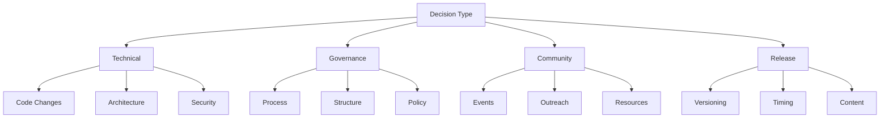

# Decision Making Process

This document outlines the decision-making framework for the Nuklei project, ensuring transparent, inclusive, and effective governance.

## 1. Decision Types

### 1.1 Categorization



### 1.2 Decision Matrix

| Type | Owner | Approver | Process | Timeframe |
|------|-------|----------|----------|------------|
| **Technical** | WG Leads | TSC | Lazy Consensus | 1-2 weeks |
| **Governance** | TSC | TSC | Formal Vote | 2-4 weeks |
| **Community** | Community Manager | TSC | Discussion | 1-3 weeks |
| **Release** | Release Manager | TSC | Approval | 4-6 weeks |

## 2. Decision Process

### 2.1 Standard Process

```mermaid
sequenceDiagram
    participant P as Proposer
    participant C as Community
    participant W as Working Group
    participant T as TSC
    
    P->>C: Submit Proposal
    C->>C: Discuss (1-2 weeks)
    C->>W: Review & Refine
    W->>T: Recommend
    alt Consensus Reached
        T-->>P: Approve
    else No Consensus
        T->>T: Vote (1 week)
        T-->>P: Decision
    end
```



### 2.2 Lazy Consensus

1. **Definition**:
   - Default approval if no objections
   - Silent = Agreement
   - 72-hour minimum period

2. **When Used**:
   - Routine technical decisions
   - Non-controversial changes
   - Low-impact decisions

### 2.3 Formal Voting

1. **Process**:
   - Call for vote
   - 1-week voting period
   - Simple majority unless specified
   - Results published

2. **Voting Methods**:
   - GitHub Reactions
   - Email ballot
   - Anonymous survey (sensitive issues)

## 3. Proposal Lifecycle

### 3.1 Proposal Stages

| Stage | Owner | Duration | Deliverables |
|-------|-------|----------|--------------|
| **Draft** | Author | 1-2 weeks | Initial proposal |
| **Review** | WG | 2 weeks | Feedback |
| **Refinement** | Author | 1-2 weeks | Updates |
| **Decision** | TSC | 1 week | Approval/Rejection |
| **Implementation** | WG | Variable | Code/Docs |
| **Retrospective** | All | 1 month | Lessons learned |

### 3.2 Proposal Template

```markdown
# [PROPOSAL] Title

## 1. Summary
Brief description (1-2 paragraphs)

## 2. Motivation
- Why is this needed?
- What problem does it solve?
- Who benefits?

## 3. Proposal Details
- Technical specifications
- Implementation plan
- Dependencies

## 4. Alternatives Considered
- Other approaches
- Pros/cons
- Why chosen approach is better

## 5. Impact
- Security considerations
- Performance implications
- Backward compatibility

## 6. Timeline
- Proposed milestones
- Dependencies
- Critical path

## 7. Success Metrics
- How to measure success
- Key performance indicators
- Monitoring requirements
```

## 4. Decision Records

### 4.1 ADR (Architectural Decision Record)

```markdown
# [ADR-001] Title

## Status
Proposed/Accepted/Deprecated/Superseded

## Context
What is the issue?

## Decision
What was decided?

## Consequences
- Positive outcomes
- Negative outcomes
- Risks
- Dependencies
```

### 4.2 Decision Log

| ID | Title | Type | Status | Date | Owner |
|----|-------|------|--------|------|-------|
| 001 | Reactor Core Design | Technical | Accepted | 2025-01-15 | @user1 |
| 002 | Release Schedule | Governance | Proposed | 2025-02-01 | @user2 |

## 5. Conflict Resolution

### 5.1 Escalation Path

1. **Direct Discussion**: Parties involved
2. **Mediation**: Neutral third party
3. **WG Review**: Working group discussion
4. **TSC Decision**: Final arbitration

### 5.2 Appeals Process

1. Submit appeal to TSC
2. 14-day review period
3. Special session if needed
4. Final decision within 30 days

## 6. Tools & Systems

### 6.1 Decision Tracking

| Tool | Purpose | Access |
|------|---------|--------|
| GitHub Issues | Proposal tracking | Public |
| ADR Directory | Decision records | Public |
| Wiki | Process documentation | Public |
| Mailing List | Announcements | Public |

### 6.2 Communication Channels

| Channel | Purpose | Moderation |
|---------|---------|------------|
| GitHub Discussions | General discussion | Maintainers |
| Slack/Discord | Real-time chat | Community |
| Zoom | Meetings | TSC |
| Email List | Formal communication | TSC |

## 7. Decision Rights

### 7.1 Role-Based Authority

| Role | Proposal | Review | Approve | Veto |
|------|----------|--------|---------|------|
| **TSC** | Yes | Yes | Yes | Yes |
| **WG Lead** | Yes | Yes | Limited | No |
| **Maintainer** | Yes | Yes | Limited | No |
| **Committer** | Yes | Yes | No | No |
| **Contributor** | Yes | Yes | No | No |

### 7.2 Decision Thresholds

| Decision Type | Threshold | Duration |
|---------------|-----------|----------|
| Code Changes | 2 Approvals | 72h |
| Releases | TSC Majority | 1 week |
| Governance | 2/3 TSC | 2 weeks |
| Membership | 2/3 TSC | 2 weeks |

## 8. Review & Improvement

### 8.1 Retrospectives

- After major decisions
- Quarterly process reviews
- Annual governance review

### 8.2 Process Metrics

1. **Efficiency**:
   - Time to decision
   - Backlog age
   - Implementation rate

2. **Quality**:
   - Reversal rate
   - Issue reopening
   - Community satisfaction

## 9. Templates

### 9.1 Meeting Decision Template

```markdown
# Decision: [Title]

## Date
YYYY-MM-DD

## Attendees
- @user1
- @user2

## Background
[Context and discussion]

## Decision
[The decision made]

## Action Items
- [ ] Task 1 (@owner)
- [ ] Task 2 (@owner)

## Next Steps
[Follow-up actions]
```

## 10. Contact

For decision-making process questions:
- **TSC Chair**: tsc-chair@nuklei.org
- **Community Manager**: community@nuklei.org
- **Working Group Leads**: wg-leads@nuklei.org
