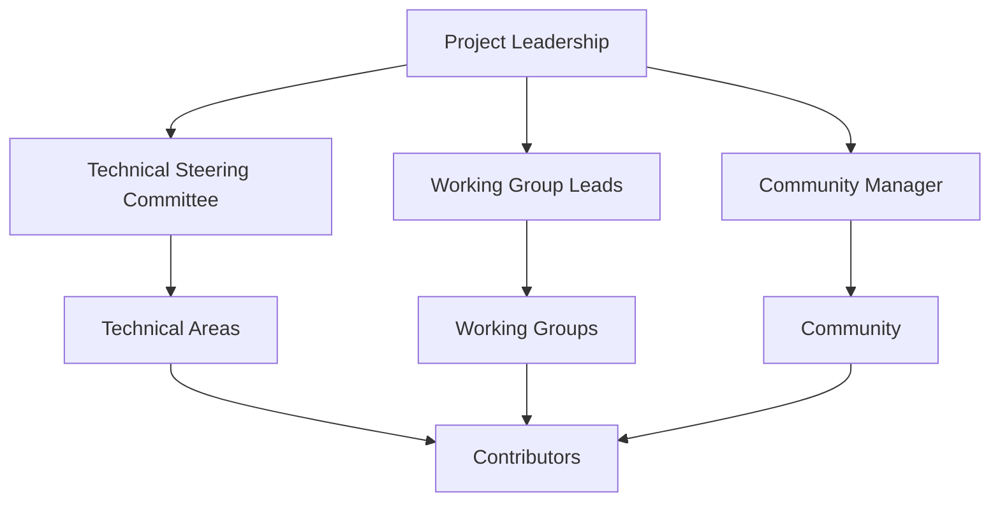
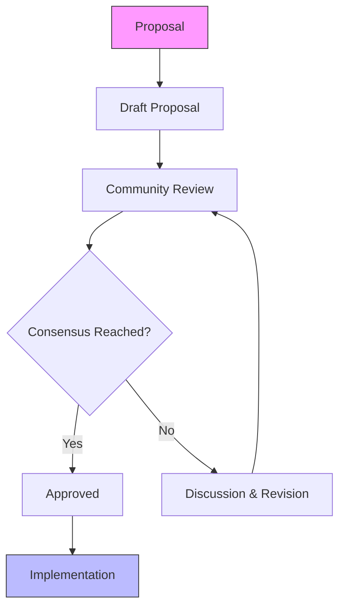
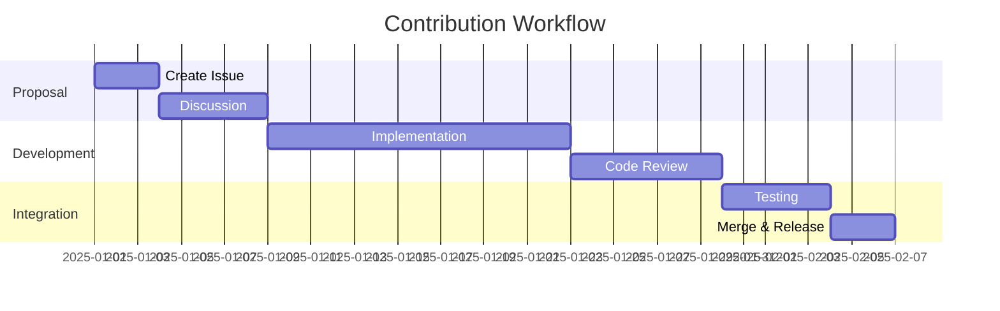

# Nuklei Governance Model

This document outlines the governance structure and processes for the Nuklei project, ensuring transparent decision-making and effective project management.

## 1. Overview

### 1.1 Purpose

The Nuklei governance model is designed to:

- Foster an open, inclusive, and productive community
- Ensure technical excellence and project sustainability
- Provide clear decision-making processes
- Define roles and responsibilities
- Manage intellectual property and licensing

### 1.2 Guiding Principles

1. **Openness**: All decisions and discussions happen in the open
2. **Meritocracy**: Influence is earned through contribution
3. **Inclusivity**: Welcome diverse perspectives and backgrounds
4. **Accountability**: Clear roles and responsibilities
5. **Sustainability**: Long-term project health and growth

## 2. Governance Structure

### 2.1 Project Leadership

### 2.2 Key Components

#### 2.2.1 Technical Steering Committee (TSC)
- **Purpose**: Provide technical leadership and oversight
- **Responsibilities**:
  - Define technical vision and roadmap
  - Approve major releases
  - Resolve technical disputes
  - Manage security vulnerabilities
- **Composition**:
  - 5-7 members
  - 2-year terms
  - 1/3 rotation annually

#### 2.2.2 Working Groups
- **Purpose**: Focus on specific technical or functional areas
- **Examples**:
  - Reactor Design
  - Safety Analysis
  - Digital Systems
  - Regulatory Compliance
  - Documentation
- **Structure**:
  - Each has a lead and co-lead
  - Regular meetings
  - Public meeting notes

#### 2.2.3 Community Manager
- **Purpose**: Facilitate community growth and health
- **Responsibilities**:
  - Onboard new contributors
  - Organize events
  - Manage communication channels
  - Handle code of conduct issues

## 3. Decision Making

### 3.1 Decision Types

| Type | Description | Process |
|------|-------------|----------|
| **Technical** | Code, architecture, features | Lazy consensus |
| **Governance** | Process, policy, structure | TSC vote |
| **Community** | Events, outreach, resources | Working group + TSC |
| **Release** | Versioning, timing, content | Release manager + TSC |

### 3.2 Decision Process

### 3.3 Voting

- **When**: When consensus cannot be reached
- **Quorum**: 2/3 of voting members
- **Majority**: Simple majority (50% + 1) for most decisions
- **Super Majority**: 2/3 for governance changes
- **Tie Breaker**: Project lead has tie-breaking vote

## 4. Communication

### 4.1 Channels

| Channel | Purpose | Archive |
|---------|---------|---------|
| GitHub Issues | Bug reports, feature requests | Public |
| Mailing List | Announcements, discussions | Public |
| Chat | Real-time discussion | Public |
| Video Calls | Working group meetings | Recorded |

### 4.2 Meeting Structure

#### 4.2.1 TSC Meetings
- **Frequency**: Bi-weekly
- **Duration**: 60 minutes
- **Agenda**:
  1. Roll call
  2. Action items from last meeting
  3. Working group reports
  4. Major decisions
  5. Open discussion

#### 4.2.2 Community Calls
- **Frequency**: Monthly
- **Duration**: 90 minutes
- **Agenda**:
  1. Project updates
  2. Demos
  3. Lightning talks
  4. Q&A

## 5. Contribution Process

### 5.1 Workflow

### 5.2 Code Review Guidelines

1. **Requirements**:
   - All changes must be documented
   - Tests must pass
   - Code style must be followed
   - Security review for sensitive changes

2. **Process**:
   - Minimum 2 approvers
   - 72-hour review period for major changes
   - No self-merges

## 6. Intellectual Property

### 6.1 Licensing

- **Code**: Apache 2.0
- **Documentation**: CC BY-SA 4.0
- **Trademarks**: Nuklei Project

### 6.2 Copyright

- Individual contributors retain copyright
- Project maintains a list of all contributors
- All contributions must be licensed under project license

## 7. Conflict Resolution

### 7.1 Process

1. **Direct Discussion**: Parties attempt to resolve directly
2. **Mediation**: Involve neutral third party
3. **TSC Decision**: If unresolved, TSC makes final decision

### 7.2 Code of Conduct

- All participants must follow the [Code of Conduct](../../CODE_OF_CONDUCT.md)
- Reports should be sent to conduct@nuklei.org
- Response time: 48 hours for acknowledgment

## 8. Amendments

This governance model can be amended by:

1. Proposal submitted as a pull request
2. 30-day community review period
3. Super majority (2/3) vote of the TSC
4. Announcement to the community

## 9. References

- [Contributing Guidelines](../../CONTRIBUTING.md)
- [Code of Conduct](../../CODE_OF_CONDUCT.md)
- [Technical Charter](../../GOVERNANCE.md)

## 10. Contact

For governance-related questions, contact:
- **TSC Chair**: tsc-chair@nuklei.org
- **Community Manager**: community@nuklei.org
- **Security**: security@nuklei.org
