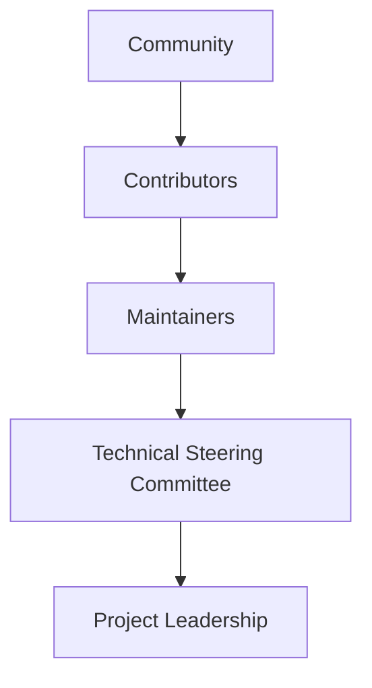
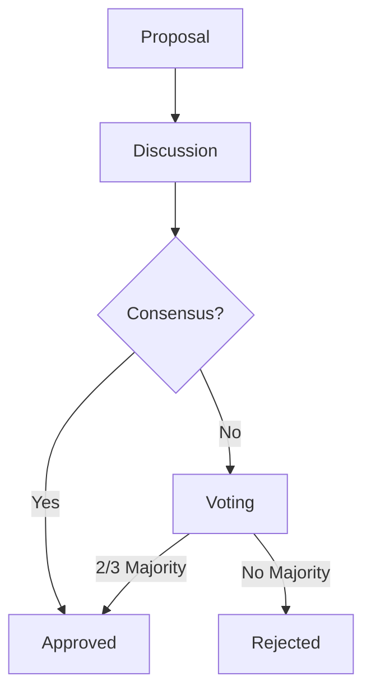
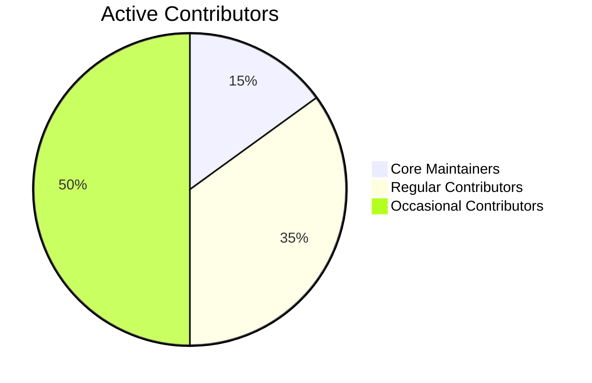
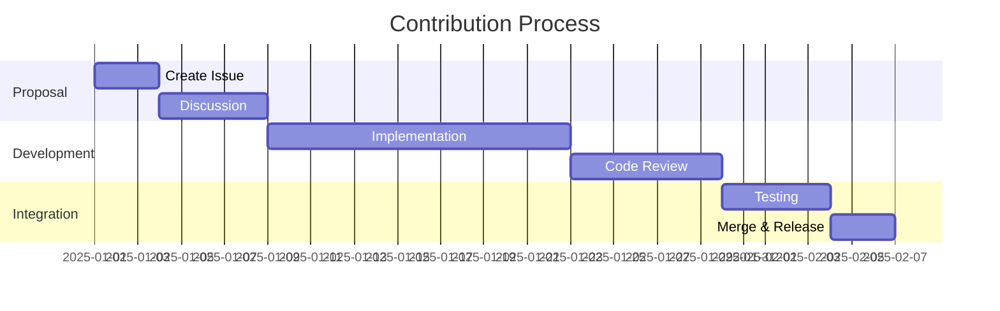

# Nuklei Project Governance
## & Open-Source Strategy

---

# Agenda

1. Governance Overview
2. Roles & Responsibilities
3. Decision Making
4. Community Guidelines
5. Release Process
6. Open Source Strategy

---

# 1. Governance Overview

## Core Structure



---

# 2. Roles & Responsibilities

## Key Roles

| Role | Count | Term |
|------|-------|------|
| TSC Members | 5-7 | 2 years |
| Working Group Leads | 5+ | 1 year |
| Maintainers | 10+ | Ongoing |
| Contributors | 100+ | - |

---

# 3. Decision Making

## Process Flow



---

# 4. Community Guidelines

## Core Values

- **Inclusivity**: Welcome all contributors
- **Respect**: Value diverse perspectives
- **Transparency**: Open communication
- **Collaboration**: Work together effectively
- **Responsibility**: Own your contributions

---

# 5. Release Process

## Versioning

```
Major.Minor.Patch
   |     |    |
   |     |    └── Bug fixes
   |     └────── New features
   └────────── Breaking changes
```

---

# 6. Open Source Strategy

## Vision

> "To build the most trusted, collaborative platform for nuclear technology development through open source principles."

---

# Key Metrics

## Community Health



---

# Roadmap

## Next 12 Months

1. **Q3 2025**: Onboarding program launch
2. **Q4 2025**: First community summit
3. **Q1 2026**: Enterprise support program
4. **Q2 2026**: Certification milestones

---

# Get Involved

## Ways to Contribute

- Join working groups
- Fix good first issues
- Improve documentation
- Help with testing
- Spread the word

---

# Thank You!

## Questions?

- **Website**: nuklei.org
- **GitHub**: github.com/nuklei
- **Email**: info@nuklei.org
- **Chat**: nuklei.slack.com

---

# Appendix

## Governance Model Details

### Technical Steering Committee
- 5-7 members
- 2-year staggered terms
- Oversee technical direction
- Resolve disputes

---

## Decision Types

| Type | Process | Timeframe |
|------|---------|-----------|
| Routine | Lazy Consensus | 72h |
| Standard | Discussion + Vote | 1-2 weeks |
| Governance | Formal Proposal | 2-4 weeks |
| Emergency | Fast-track | 24-48h |

---

## Contribution Workflow



---

## Release Cadence

| Type | Frequency | Support |
|------|-----------|---------|
| Major | 12-18 months | 3 years |
| Minor | 3 months | 6 months |
| Patch | As needed | N/A |

---

## Security Practices

1. **Vulnerability Management**
   - 24h response time
   - Private disclosure
   - Coordinated release

2. **Code Quality**
   - Mandatory reviews
   - Automated testing
   - Security scanning

---

## Community Programs

1. **Mentorship**
   - New contributor program
   - Project mentorship
   - Leadership development

2. **Recognition**
   - Monthly spotlights
   - Quarterly awards
   - Annual contributor summit

---

## License Compliance

| Component | License |
|-----------|---------|
| Code | Apache 2.0 |
| Documentation | CC BY-SA 4.0 |
| Data | CC0 |
| Trademarks | All Rights Reserved |

---

## Contact Information

### Key Contacts
- **Governance**: governance@nuklei.org
- **Security**: security@nuklei.org
- **Community**: community@nuklei.org
- **Press**: press@nuklei.org

---

## Resources

### Documentation
- [Governance Model](governance-model.md)
- [Contributing Guide](../../CONTRIBUTING.md)
- [Code of Conduct](../../CODE_OF_CONDUCT.md)
- [Release Process](release-process.md)

### Communication
- GitHub: github.com/nuklei
- Forum: discuss.nuklei.org
- Chat: nuklei.slack.com
- Twitter: @nukleiproject

---

# Thank You!

## Let's Build the Future of Nuclear Technology
### Together

---

## Changelog

| Date | Version | Changes |
|------|---------|---------|
| 2025-06-13 | 1.0.0 | Initial version |

---

## License

This presentation is licensed under [CC BY-SA 4.0](https://creativecommons.org/licenses/by-sa/4.0/).
