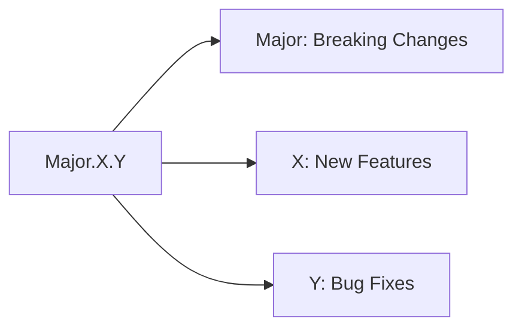
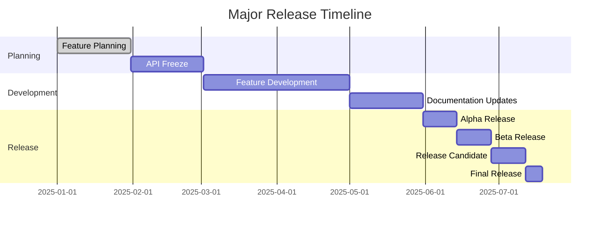
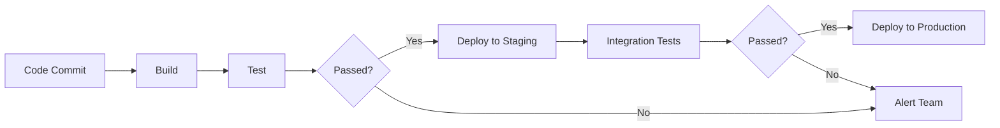

# Nuklei Release Process

This document defines the release process for Nuklei, ensuring consistent, reliable, and high-quality software releases.

## 1. Release Types

### 1.1 Versioning Scheme



### 1.2 Release Cadence

| Type | Frequency | Support Duration | Branch Pattern |
|------|-----------|------------------|----------------|
| Major | 12-18 months | 3 years | `v1.x`, `v2.x` |
| Minor | 3 months | 6 months | `v1.1.x`, `v1.2.x` |
| Patch | As needed | Until next release | `v1.0.1`, `v1.0.2` |
| Pre-release | As needed | N/A | `v1.0.0-rc.1` |

## 2. Release Timeline

### 2.1 Major Release Timeline



### 2.2 Minor Release Timeline

| Week | Activities |
|------|------------|
| -3 | Feature freeze, begin stabilization |
| -2 | Code complete, testing |
| -1 | Release candidate testing |
| 0 | Release day |

## 3. Release Roles

### 3.1 Release Team

| Role | Responsibilities |
|------|------------------|
| Release Manager | Overall release coordination |
| QA Lead | Testing coordination |
| Docs Lead | Documentation updates |
| Security Lead | Security validation |
| Community Manager | Release communication |

### 3.2 Role Responsibilities

#### 3.2.1 Release Manager
- Create release schedule
- Coordinate release activities
- Cut release branches
- Tag releases
- Manage release notes

#### 3.2.2 QA Lead
- Define test plan
- Coordinate testing
- Verify bug fixes
- Sign off on release quality

## 4. Release Checklist

### 4.1 Pre-Release Checklist

- [ ] All features completed and tested
- [ ] Documentation updated
- [ ] All tests passing
- [ ] Security audit completed
- [ ] Performance benchmarks met
- [ ] Dependencies updated and audited
- [ ] Upgrade path documented
- [ ] Release notes drafted

### 4.2 Release Day Checklist

- [ ] Create release branch
- [ ] Update version numbers
- [ ] Run final tests
- [ ] Generate artifacts
- [ ] Sign release artifacts
- [ ] Publish release notes
- [ ] Announce release
- [ ] Update documentation

## 5. Version Management

### 5.1 Branch Strategy


### 5.2 Version Bumping

| Change | Before | After | Command |
|--------|--------|-------|----------|
| Major | 1.2.3 | 2.0.0 | `npm version major` |
| Minor | 1.2.3 | 1.3.0 | `npm version minor` |
| Patch | 1.2.3 | 1.2.4 | `npm version patch` |
| Pre-release | 1.2.3 | 1.2.4-rc.1 | `npm version prerelease --preid=rc` |

## 6. Release Artifacts

### 6.1 Artifact Types

| Type | Format | Description |
|------|--------|-------------|
| Binary | .tar.gz, .zip | Compiled binaries |
| Container | .tar, .oci | Container images |
| Source | .tar.gz | Source code |
| Checksum | .sha256 | Artifact checksums |
| SBOM | .spdx, .json | Software bill of materials |

### 6.2 Signing and Verification

1. **Signing**
   ```bash
   # Sign artifacts
   gpg --detach-sign --armor artifact.tar.gz
   
   # Generate checksum
   sha256sum artifact.tar.gz > artifact.tar.gz.sha256
   ```

2. **Verification**
   ```bash
   # Verify signature
   gpg --verify artifact.tar.gz.asc
   
   # Verify checksum
   sha256sum -c artifact.tar.gz.sha256
   ```

## 7. Release Communication

### 7.1 Communication Plan

| When | Channel | Audience | Message |
|------|---------|----------|----------|
| T-14 days | Mailing List | Community | Release schedule |
| T-7 days | Chat | Developers | Feature freeze reminder |
| T-1 day | Chat | Testers | Release candidate |
| Release day | Blog, Social Media | Users | Release announcement |
| Post-release | Forum | Community | Known issues |

### 7.2 Release Notes Template

```markdown
# Nuklei vX.Y.Z Release Notes

## Highlights
- Major new features
- Performance improvements
- Important changes

## New Features
### Feature 1
Description of feature 1

### Feature 2
Description of feature 2

## Breaking Changes
- Change 1
- Change 2

## Deprecations
- Deprecated feature 1
- Deprecated feature 2

## Bug Fixes
- [GH-1234] Fixed issue with...
- [GH-1235] Resolved problem with...

## Security Fixes
- [CVE-YYYY-XXXX] Vulnerability description

## Contributors
Thank you to our contributors:
- @user1
- @user2

## Upgrade Notes
Instructions for upgrading from previous versions

## Known Issues
- Issue 1
- Issue 2
```

## 8. Post-Release Activities

### 8.1 Monitoring

| Metric | Target | Monitoring Tool |
|--------|--------|-----------------|
| Error Rate | < 0.1% | Prometheus |
| Performance | < 100ms p99 | Grafana |
| Rollback Rate | < 1% | Internal Metrics |
| Uptime | > 99.9% | Uptime Monitor |

### 8.2 Support Policy

| Version | Status | End of Life |
|---------|--------|-------------|
| v1.0.x | Security fixes only | 2024-12-31 |
| v1.1.x | Active development | 2025-06-30 |
| v2.0.0 | Latest | TBD |

## 9. Emergency Releases

### 9.1 Process

1. **Triage**
   - Verify the issue
   - Determine severity
   - Get TSC approval

2. **Hotfix**
   - Create hotfix branch
   - Apply minimal fix
   - Test thoroughly

3. **Release**
   - Bump patch version
   - Follow abbreviated release process
   - Communicate clearly

### 9.2 Severity Levels

| Level | Response Time | Example |
|-------|--------------|----------|
| Critical | 24 hours | Security vulnerability |
| High | 72 hours | Data loss |
| Medium | 1 week | Major functionality broken |
| Low | Next release | Minor issues |

## 10. Tools and Automation

### 10.1 CI/CD Pipeline



### 10.2 Release Tools

| Tool | Purpose |
|------|----------|
| GitHub Actions | CI/CD Pipeline |
| GoReleaser | Binary releases |
| Docker Hub | Container images |
| Helm | Kubernetes packages |
| Release Drafter | Release notes |

## 11. Rollback Plan

### 11.1 Rollback Triggers

- Critical bugs in production
- Performance degradation
- Security vulnerabilities
- Failed health checks

### 11.2 Rollback Procedure

1. **Decision**
   - Verify issue severity
   - Get approval from Release Manager
   - Notify stakeholders

2. **Execution**
   - Stop traffic to new version
   - Route traffic to previous version
   - Verify system stability
   - Document the rollback

3. **Post-Mortem**
   - Root cause analysis
   - Preventative measures
   - Update runbooks

## 12. Metrics and Reporting

### 12.1 Release Metrics

| Metric | Target | Actual |
|--------|--------|--------|
| Release Frequency | 3 months | - |
| Lead Time | 14 days | - |
| Change Failure Rate | < 5% | - |
| MTTR | < 1 hour | - |

### 12.2 Quality Metrics

- Test coverage
- Bug count by severity
- Performance benchmarks
- Security vulnerabilities

## 13. Continuous Improvement

### 13.1 Retrospective Process

1. **Data Collection**
   - What went well
   - What could be improved
   - Action items

2. **Action Items**
   - Owner assignment
   - Due dates
   - Follow-up

### 13.2 Process Updates

- Update this document
- Train team members
- Automate where possible

## 14. Contact

For release-related questions:
- **Release Manager**: releases@nuklei.org
- **Security Issues**: security@nuklei.org
- **Documentation**: docs@nuklei.org

## 15. Changelog

| Date | Version | Changes |
|------|---------|---------|
| 2025-06-13 | 1.0.0 | Initial version |

## 16. License

This document is licensed under [CC BY-SA 4.0](https://creativecommons.org/licenses/by-sa/4.0/).
