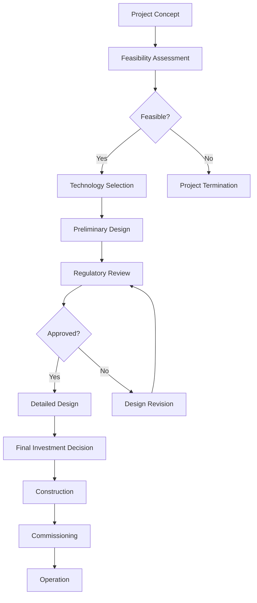

# Decision Framework for Nuclear Projects

This document provides a structured approach for making key decisions throughout the nuclear project lifecycle under the Nuklei framework.

## 1. Decision-Making Process

*Figure 1: Decision Flow for Nuclear Projects*

### 1.1 Decision Hierarchy
- **Strategic Decisions** (Project viability, technology selection)
- **Tactical Decisions** (Design choices, procurement strategies)
- **Operational Decisions** (Construction sequencing, testing protocols)

### 1.2 Decision Gates
| Phase | Decision Point | Key Deliverables |
|-------|----------------|-------------------|
| Concept | Project Initiation | Feasibility study, Market assessment |
| Definition | Technology Selection | Technology assessment, Preliminary design |
| Development | Final Investment Decision | Detailed design, Construction permits |
| Execution | Fuel Load Authorization | Construction completion, Commissioning tests |
| Operation | Commercial Operation | Operating license, Performance tests |

## 2. Decision Criteria

### 2.1 Technical Criteria
- Technology readiness level (TRL)
- Safety performance
- Reliability and availability
- Supply chain maturity
- Regulatory compliance

### 2.2 Economic Criteria
- Capital costs (CAPEX)
- Operating costs (OPEX)
- Levelized cost of electricity (LCOE)
- Return on investment (ROI)
- Payback period

### 2.3 Risk Criteria
- Safety risks
- Project risks
- Financial risks
- Regulatory risks
- Market risks

### 2.4 Social and Environmental Criteria
- Public acceptance
- Environmental impact
- Carbon footprint
- Job creation
- Local economic development

## 3. Decision Tools and Methods

### 3.1 Multi-Criteria Decision Analysis (MCDA)
- Weighted scoring models
- Analytic Hierarchy Process (AHP)
- Technique for Order of Preference by Similarity to Ideal Solution (TOPSIS)

### 3.2 Cost-Benefit Analysis (CBA)
- Net present value (NPV)
- Internal rate of return (IRR)
- Benefit-cost ratio (BCR)
- Sensitivity analysis

### 3.3 Risk Assessment
- Probability-impact matrix
- Fault tree analysis
- Event tree analysis
- Monte Carlo simulation

## 4. Stakeholder Engagement

### 4.1 Stakeholder Identification
- Regulators
- Investors
- Local communities
- Government agencies
- Industry partners
- Environmental groups

### 4.2 Engagement Strategies
- Public consultations
- Focus groups
- Community advisory panels
- Information sessions
- Digital platforms

### 4.3 Feedback Integration
- Comment tracking
- Response development
- Decision documentation
- Follow-up communication

## 5. Decision Documentation

### 5.1 Decision Records
- Decision statement
- Alternatives considered
- Analysis results
- Stakeholder input
- Implementation plan

### 5.2 Approval Process
- Review by technical experts
- Management approval
- Board approval (if applicable)
- Regulatory approval (if required)

### 5.3 Communication Plan
- Internal communication
- External communication
- Media relations
- Digital communication

## 6. Implementation Planning

### 6.1 Action Items
- Tasks and activities
- Responsibilities
- Timeline
- Resource requirements

### 6.2 Performance Metrics
- Key performance indicators (KPIs)
- Monitoring frequency
- Reporting requirements
- Review process

### 6.3 Contingency Planning
- Risk triggers
- Response actions
- Escalation procedures
- Communication protocols

## 7. Review and Continuous Improvement

### 7.1 Post-Decision Review
- Outcomes vs. expectations
- Lessons learned
- Process improvements
- Knowledge management

### 7.2 Performance Monitoring
- Regular reporting
- Performance dashboards
- Exception reporting
- Trend analysis

### 7.3 Continuous Improvement
- Best practices
- Process optimization
- Technology updates
- Training and development

## 8. Case Studies

### 8.1 Successful Projects
- Decision-making approaches
- Key success factors
- Lessons learned

### 8.2 Challenging Projects
- Decision-making challenges
- Root cause analysis
- Corrective actions

## 9. Templates and Tools

### 9.1 Decision Templates
- Decision log
- Meeting minutes
- Action item tracker
- Risk register

### 9.2 Analysis Tools
- Decision matrix
- Risk assessment template
- Cost-benefit analysis template
- Stakeholder analysis template

## 10. Next Steps
1. Apply the decision framework to current project decisions
2. Document decisions and rationale
3. Monitor implementation and outcomes
4. Continuously improve the decision-making process

## 11. References
- IAEA Nuclear Energy Series NG-T-1.4: Nuclear Project Management
- PMI Standard for Portfolio Management
- ISO 31000:2018 Risk Management
- ISO 55000:2014 Asset Management
