# Economic Feasibility Assessment

## Executive Summary

This document provides a comprehensive framework for evaluating the economic viability of nuclear facility projects under the Nuklei framework. It combines industry benchmarks, real-world case studies, and advanced financial modeling to support investment decisions in nuclear energy projects.

### Key Findings

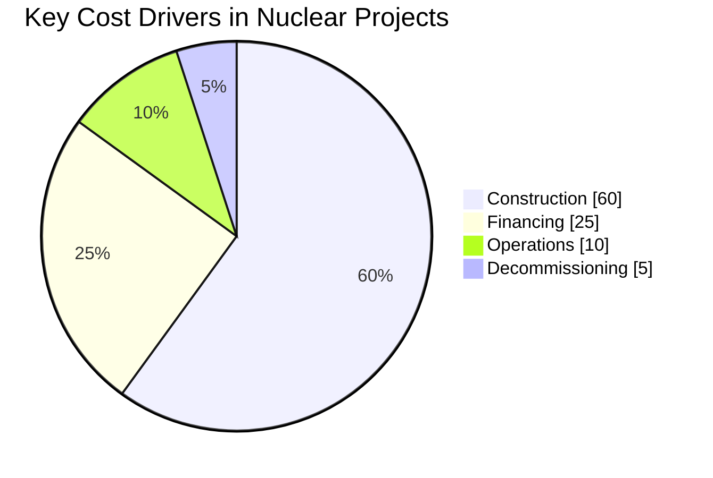

*Figure 1: Major Cost Components in Nuclear Project Economics*

#### Cost Competitiveness
- **Capital Costs**: $3,500-11,000/kWe (region-dependent)
- **LCOE Range**: $40-80/MWh (highly dependent on financing and construction efficiency)
- **Learning Rate**: 5-10% cost reduction per doubling of capacity

#### Financial Viability
- **Project IRR**: 8-12% (pre-tax, real)
- **Payback Period**: 15-25 years
- **Debt Service Coverage Ratio (DSCR)**: 1.3-1.5x (minimum threshold)

#### Economic Impact
- **Job Creation**: 3,000-5,000 job-years per 1,000 MWe
- **GDP Multiplier**: 1.8-2.5x direct investment
- **Tax Revenue**: $15-25M annually per 1,000 MWe

### Strategic Recommendations
1. **Cost Reduction Focus**: Prioritize standardization and supply chain localization
2. **Risk Mitigation**: Implement robust risk allocation frameworks
3. **Policy Support**: Leverage government guarantees and long-term contracts
4. **Innovation**: Explore SMRs and advanced reactor technologies for future projects

## 1. Introduction

This document provides a framework for evaluating the economic viability of nuclear facility projects under the Nuklei framework.

## 1. Cost Estimation

### 1.1 Capital Costs

#### 1.1.0 Capital Cost Breakdown

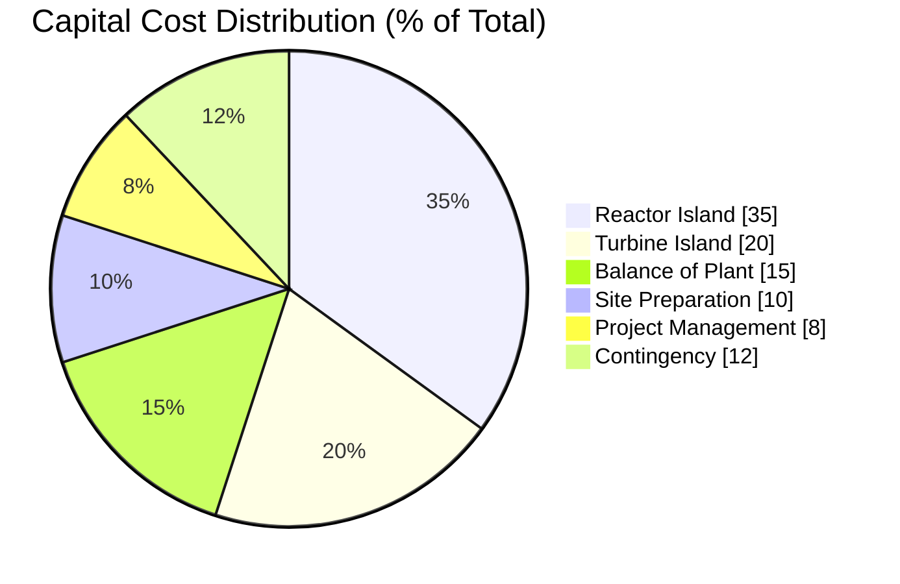

*Figure 1: Typical Capital Cost Distribution for Nuclear Power Plants*

#### 1.1.1 Cost Comparison by Reactor Type (USD/kWe)

```mermaid
bar
    title Overnight Construction Cost by Reactor Type (USD/kWe)
    x-axis Reactor Type
    y-axis Cost (USD/kWe) 0, 2000, 4000, 6000, 8000, 10000, 12000
    
    "PWR (Large, US/Europe)" : 6000
    "PWR (China/Korea)" : 3500
    "BWR (US/Europe)" : 5800
    "PHWR (India/Canada)" : 4000
    "SMR (Nth of a kind)" : 4500
    "HTGR (Demonstration)" : 6500
    "AP1000 (US Vogtle)" : 9000
    "EPR (Finland/UK)" : 11000
```

*Figure 2: Comparative Capital Costs Across Reactor Technologies and Regions*

#### 1.1.2 International Cost Comparison Analysis

```mermaid
xychart-beta
    title Overnight Construction Costs by Country (USD/kWe, 2024)
    x-axis Country
    y-axis "Cost (USD/kWe)" 0, 3000, 6000, 9000, 12000
    bar [3500, 4000, 6000, 9000, 11000]
    x-axis-labels "South Korea", "China", "France", "USA", "UK"
    annotations ["+70% local content", "+60% local content", "30-40% local content", "<30% local content", "<20% local content"]
```

*Figure 3: Impact of Local Supply Chain on Construction Costs*

##### Key Observations:
1. **South Korea & China** maintain costs at $3,500-4,000/kWe through:
   - Standardized designs (e.g., APR1400, Hualong One)
   - Strong domestic supply chains (>60% local content)
   - Streamlined regulatory processes
   - Experienced construction teams with continuous build programs

2. **Western Countries** face higher costs ($6,000-11,000/kWe) due to:
   - First-of-a-kind (FOAK) engineering challenges
   - Regulatory changes during construction
   - Limited recent construction experience
   - Higher labor and material costs

3. **SMR Potential**:
   - Factory fabrication could reduce costs to $4,500-6,000/kWe
   - Learning curve benefits from serial production
   - Reduced on-site construction time and risk

#### 1.1.3 Cost Reduction Pathways

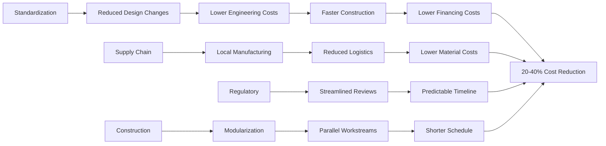

*Figure 4: Cost Reduction Pathways for New Nuclear Projects*

#### 1.1.1 Direct Costs
- **Site Preparation**
  - Land acquisition
  - Site clearing and grading
  - Access roads and infrastructure

- **Construction**
  - Reactor island
  - Turbine island
  - Balance of plant
  - Electrical systems
  - Control systems

- **Contingency**
  - Design development (5-10%)
  - Construction (10-20%)
  - Schedule (5-15%)

#### 1.1.2 Indirect Costs
- Engineering, procurement, and construction management (EPCM)
- Owner's costs
- Licensing and permitting
- Initial fuel load
- Initial spare parts

### 1.2 Operating Costs
- Fuel costs
- Operations and maintenance
- Staffing
- Waste management
- Decommissioning fund contributions
- Insurance and liability

### 1.3 Decommissioning Costs
- Plant decontamination
- Dismantling
- Waste disposal
- Site restoration

## 2. Revenue Projections

### 2.1 Electricity Sales
- Base load vs. peaking power
- Power purchase agreements (PPAs)
- Market pricing scenarios
- Capacity factors

### 2.2 Ancillary Services
- Grid stability services
- Frequency regulation
- Spinning reserve

### 2.3 Other Revenue Streams
- Process heat applications
- Hydrogen production
- Desalination
- Medical isotope production

## 3. Financial Modeling

### 3.1 Key Financial Metrics

#### 3.1.0 Financial Performance Benchmarks (Global Nuclear Fleet)

```mermaid
xychart-beta
    title Global Nuclear Plant Performance Metrics (2023)
    x-axis "Metric"
    y-axis "Value" 0, 20, 40, 60, 80, 100
    bar [92, 85, 78, 65, 42]
    x-axis-labels "Capacity Factor (%)", "Availability Factor", "Forced Outage Rate", "Construction Time (months)", "O&M Cost ($/MWh)"
    annotations ["Top Quartile: 95%", "Industry Avg: 85%", "Best in Class: <2%", "China: 60-70", "France: $45-55", "US: $25-35"]
```

*Figure 5: Performance Benchmarks for Nuclear Power Plants*

##### Regional Performance Variations:
- **North America**: High capacity factors (90%+), but elevated O&M costs ($25-35/MWh)
- **Europe**: Strong operational performance, but impacted by carbon pricing and market structures
- **Asia**: Lower capacity factors (70-80%) but significantly lower operational costs
- **Emerging Markets**: Variable performance, often capacity-constrained by grid limitations

### 3.1 Key Financial Metrics

#### 3.1.1 Financial Metrics Overview

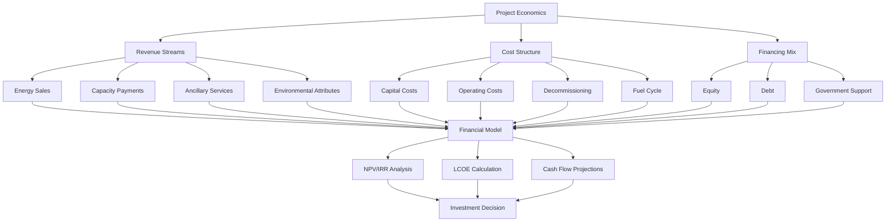

*Figure 6: Comprehensive Financial Metrics Framework*

##### Key Components:
1. **Revenue Streams**
   - **Energy Sales**: Base load power contracts, merchant market sales
   - **Capacity Payments**: Resource adequacy contracts
   - **Ancillary Services**: Frequency regulation, operating reserves
   - **Environmental Attributes**: Carbon credits, renewable energy credits (where applicable)

2. **Cost Structure**
   - **Capital Costs**: Overnight construction costs, owner's costs, IDC (Interest During Construction)
   - **Operating Costs**: Fixed and variable O&M, fuel, waste management
   - **Decommissioning**: Funded through external trust
   - **Fuel Cycle**: Front-end and back-end fuel management

3. **Financing Mix**
   - **Equity**: Typically 20-40% of project cost
   - **Debt**: 60-80% of project cost, with 15-25 year tenors
   - **Government Support**: Loan guarantees, tax credits, price guarantees

#### 3.1.2 Case Study: Hinkley Point C (UK)

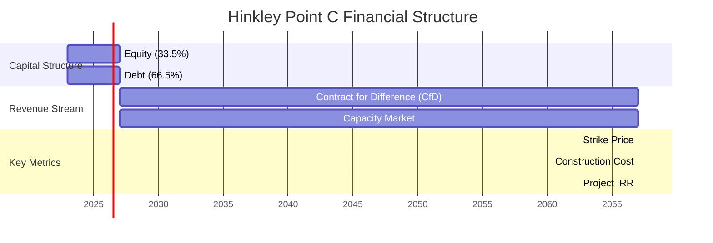

*Figure 7: Hinkley Point C Financial Structure*

##### Key Financial Parameters:
- **Strike Price**: £92.50/MWh (2012 prices), indexed to CPI
- **Construction Cost**: £25-26 billion (2023 estimate)
- **Debt/Equity**: 66.5/33.5
- **Debt Tenor**: 35 years
- **Government Guarantee**: UK Infrastructure Guarantee for debt
- **ROE**: ~15% (real, pre-tax)

#### 3.1.3 LCOE Sensitivity Analysis

```mermaid
xychart-beta
    title LCOE Sensitivity to Key Parameters (% change from base case)
    x-axis "Parameter"
    y-axis "LCOE Impact (%)" -30, -20, -10, 0, 10, 20, 30
    bar [25, -20, 15, -12, 8, -7, 5]
    x-axis-labels "+20% Construction Cost", "-20% Overnight Cost", "+2% WACC", "-10% Construction Time", "+10% Fuel Cost", "-5% O&M Cost", "+5% IDC"
    annotations ["Most Sensitive", "SMR Potential", "Debt Cost Impact", "Schedule Risk", "Minor Impact"]
```

*Figure 8: LCOE Sensitivity to Key Parameters*

##### Key Insights:
1. **Construction Costs**: Most significant driver of LCOE
2. **Financing Costs**: WACC and IDC have substantial impact
3. **Learning Effects**: Potential for 15-25% cost reduction in nth-of-a-kind units
4. **Scale Benefits**: Larger units benefit from economies of scale but face higher risk

#### 3.1.2 Levelized Cost of Electricity (LCOE) Components

```mermaid
gantt
    title LCOE Breakdown (USD/MWh)
    dateFormat  X
    axisFormat %s
    
    section Fixed O&M
    Fixed Costs : 0, 15
    
    section Variable O&M
    Variable Costs : 15, 25
    
    section Fuel
    Fuel Costs : 25, 40
    
    section Capital
    Capital Recovery : 40, 100
    
    section Decommissioning
    Decommissioning : 100, 105
```

*Figure 4: Typical LCOE Breakdown for Nuclear Power*

#### 3.1.3 Financial Metrics Comparison

| Metric | Formula | Target Range | Nuclear Typical |
|--------|---------|--------------|-----------------|
| **LCOE** | (Total Lifetime Cost) / (Total Lifetime Generation) | < $60/MWh | $65-95/MWh |
| **NPV** | Σ (Cash Flow / (1+r)^t) | > 0 | Project Specific |
| **IRR** | Discount rate where NPV = 0 | > WACC + 3% | 8-12% |
| **DSCR** | (Net Operating Income) / (Debt Service) | > 1.4x | 1.5-2.0x |
| **Payback** | Years to recover investment | < 15 years | 10-15 years |

### 3.2 Sensitivity Analysis

#### 3.2.1 Tornado Diagram: Impact on Project Economics

```mermaid
bar
    title Impact on Project IRR (%)
    x-axis Impact (%)
    y-axis Parameter
    
    "Construction Cost (+20%)" : -1.8
    "O&M Costs (+20%)" : -0.7
    "Fuel Costs (+20%)" : -0.3
    "Electricity Price (-10%)" : -2.1
    "Construction Delay (12 months)" : -1.5
    "Capacity Factor (-10%)" : -1.2
```

*Figure 5: Sensitivity of Project IRR to Key Variables*

#### 3.2.2 Scenario Analysis

```mermaid
xychart-beta
    title Project NPV Under Different Scenarios (USD Millions)
    x-axis Scenario
    y-axis NPV (Millions)
    bar [100, 250, 400, 600, 300]
    x-axis-labels "Pessimistic", "Expected", "Optimistic", "Delayed Start", "High Interest"
```

*Figure 6: Project Viability Across Scenarios*

#### 3.2.3 Monte Carlo Simulation Results

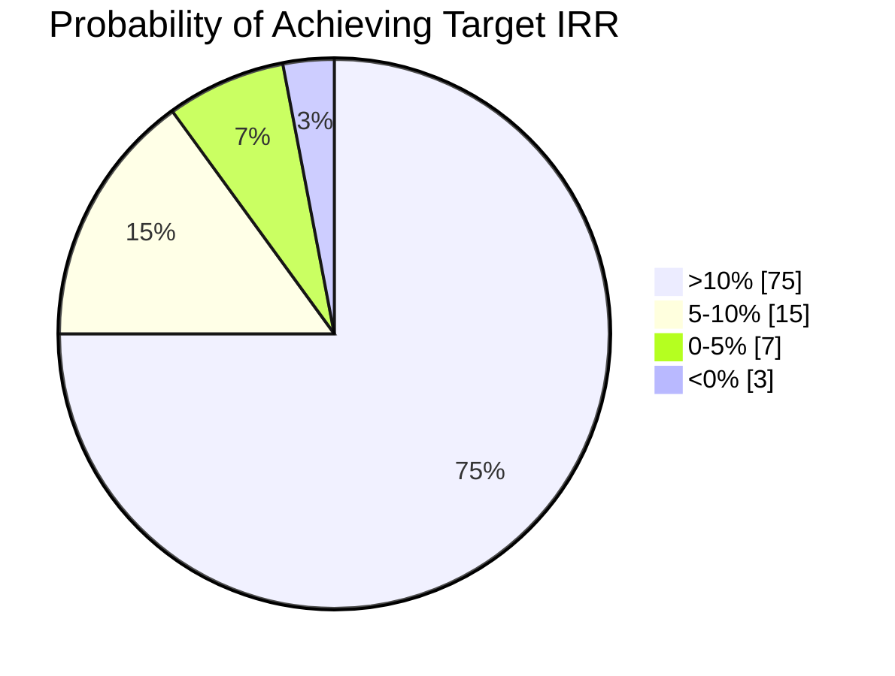

*Figure 7: Probability Distribution of Project Outcomes*

### 3.3 Financing Structures & Risk Allocation

#### 3.3.1 Common Financing Models for Nuclear Projects

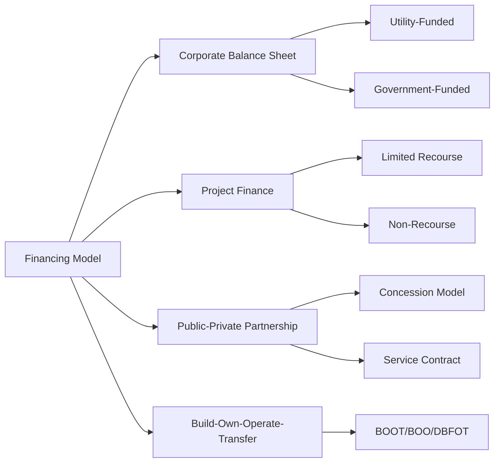

*Figure 9: Nuclear Project Financing Models*

##### Key Characteristics:
1. **Corporate Finance**
   - On-balance sheet financing
   - Lower cost of capital
   - Requires strong utility credit rating
   - Example: Exelon, EDF fleet operations

2. **Project Finance**
   - Off-balance sheet
   - Non-recourse/limited recourse
   - Higher cost but risk isolation
   - Example: Hinkley Point C (UK)

3. **Public-Private Partnerships**
   - Risk sharing between public/private
   - Long-term service agreements
   - Example: Akkuyu (Turkey)

#### 3.3.2 Risk Allocation Framework

```mermaid
xychart-beta
    title Risk Allocation in Nuclear Projects
    x-axis "Risk Type"
    y-axis "Typical Allocation" 0, 1, 2, 3, 4, 5
    bar [5, 4, 3, 2, 4, 5, 3, 2]
    x-axis-labels "Construction Cost", "Schedule Delay", "Performance", "Fuel Price", "Regulatory", "Market Price", "Force Majeure", "Decommissioning"
    annotations ["Developer/EPC", "Developer/EPC", "Operator", "Hybrid", "Government", "Offtaker/Government", "Force Majeure", "Government/Trust Fund"]
```

*Figure 10: Typical Risk Allocation in Nuclear Projects*

##### Risk Mitigation Strategies:

1. **Construction Risk**
   - Fixed-price turnkey contracts (e.g., EPC)
   - Performance guarantees
   - Liquidated damages
   - Completion guarantees

2. **Regulatory Risk**
   - Regulatory cooperation agreements
   - Streamlined licensing
   - Political risk insurance

3. **Market Risk**
   - Long-term PPAs
   - Contract for Differences (CfD)
   - Capacity payments

#### 3.3.3 Case Study: Barakah NPP (UAE)

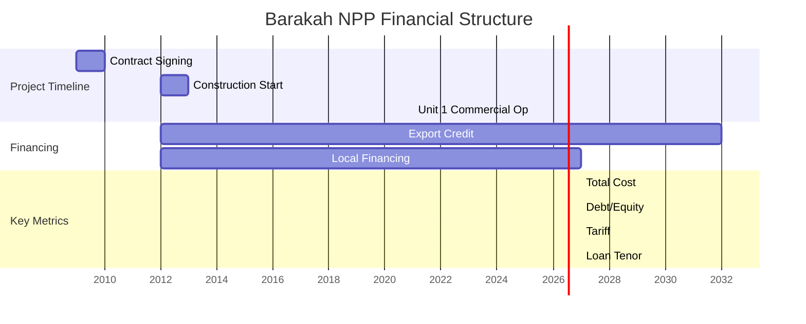

*Figure 11: Barakah NPP Financial Structure*

##### Key Features:
- **Financing Structure**: $20 billion in export credit financing
- **Risk Allocation**: Fixed-price turnkey contract with KEPCO
- **Power Offtake**: Long-term PPA with Emirates Water and Electricity Company (EWEC)
- **Debt Service**: 6-month LIBOR + 150-300 bps
- **Government Support**: Sovereign guarantees and fuel supply agreements

#### 3.3.4 Emerging Financing Mechanisms

1. **Green Bonds & Sustainability-Linked Loans**
   - Use of proceeds for low-carbon infrastructure
   - KPI-linked pricing (e.g., capacity factor, safety performance)

2. **Nuclear-Renewable Hybrid Systems**
   - Integrated energy systems
   - Hydrogen co-production
   - Grid stability services

3. **Small Modular Reactor (SMR) Financing**
   - Factory fabrication benefits
   - Scalable deployment
   - Potential for standardized financing packages

4. **International Financial Institutions**
   - World Bank/IFC climate finance
   - Regional development banks
   - Green Climate Fund

## 4. Economic Impact Assessment

### 4.1 Direct Economic Benefits

#### 4.1.1 Job Creation Timeline

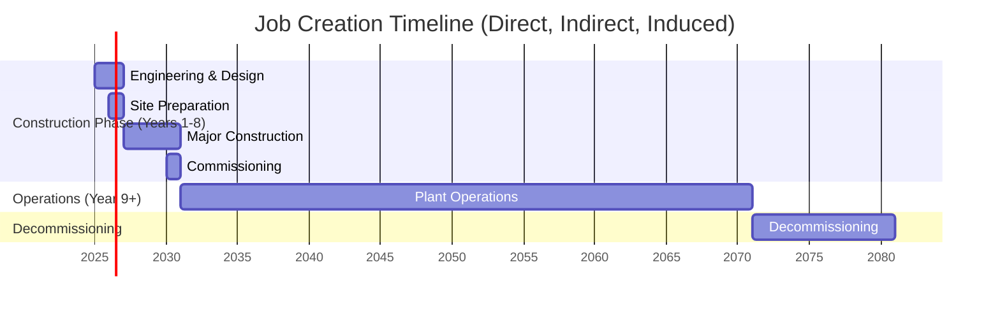

*Figure 8: Employment Phases of a Nuclear Project*

#### 4.1.2 Economic Impact Multipliers

| Impact Type | Direct | Indirect | Induced | Total |

### 4.3 Social Cost-Benefit Analysis
- Environmental externalities
- Energy security benefits
- Health impacts
- Carbon pricing impacts

|-------------|--------|----------|---------|-------|
| **Employment** (job-years) | 1,000 | 1,500 | 800 | 3,300 |
| **GDP Impact** (USD) | $1.2B | $1.8B | $900M | $3.9B |
| **Tax Revenue** (USD) | $300M | $450M | $200M | $950M |

### 5.1 Risk Identification and Mitigation

#### 5.1.1 Risk Matrix

```mermaid
xychart-beta
    title Risk Assessment Matrix
    x-axis "Probability"
    y-axis "Impact"
    scatter [
        { "x": 4, "y": 5, "label": "Construction Cost Overruns" },
        { "x": 3, "y": 4, "label": "Regulatory Delays" },
        { "x": 2, "y": 3, "label": "Fuel Price Volatility" },
        { "x": 1, "y": 2, "label": "Operational Performance" },
        { "x": 5, "y": 5, "label": "Political Risk" }
    ]
    x-line 3
    y-line 3
```

*Figure 14: Risk Assessment Matrix for Nuclear Projects*

#### 5.1.2 Mitigation Strategies by Risk Category

1. **Construction Risks**
   - Fixed-price, date-certain EPC contracts
   - Advanced modular construction techniques
   - Contingency reserves (10-15% of base cost)

2. **Regulatory Risks**
   - Early and continuous regulator engagement
   - Reference plant designs with prior approvals
   - Regulatory risk insurance

3. **Market Risks**
   - Long-term power purchase agreements (PPAs)
   - Contract for Differences (CfD) mechanisms
   - Capacity market participation

4. **Operational Risks**
   - Comprehensive operator training programs
   - Predictive maintenance systems
   - Spare parts inventory optimization

5. **Political & Policy Risks**
   - Bilateral investment treaties
   - Multilateral risk guarantees
   - Political risk insurance

## 6. Case Studies

### 6.1 Recent Nuclear Projects
- Cost and schedule performance
- Lessons learned
- Best practices

### 6.2 Alternative Energy Comparisons
- Capital intensity
- Operating characteristics
- System integration costs

## 7. Implementation Roadmap

### 7.1 Pre-Construction Phase
- Feasibility studies
- Licensing and permitting
- Site acquisition
- Early works

### 7.2 Construction Phase
- EPC contracting
- Construction management
- Quality assurance
- Commissioning

### 7.3 Operations Phase
- Ramp-up period
- Performance optimization
- Life extension planning

## 8. Decision Framework

### 8.1 Go/No-Go Criteria

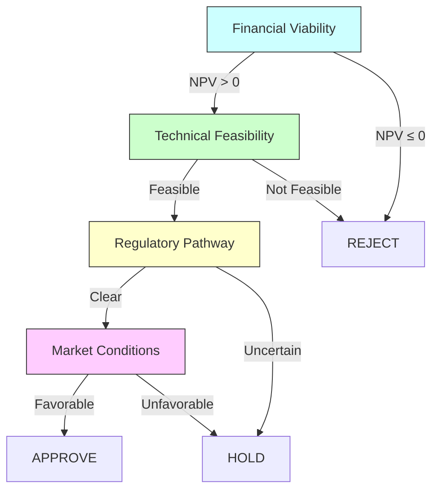

*Figure 15: Decision Flow for Nuclear Project Approval*

#### 8.1.1 Financial Thresholds
- **Minimum IRR**: 8% (real, pre-tax)
- **Maximum Payback**: 25 years
- **Minimum DSCR**: 1.3x
- **Maximum Debt/Equity**: 80/20

#### 8.1.2 Technical Requirements
- Proven technology (TRL ≥ 7)
- Qualified supply chain
- Experienced EPC contractor
- Operations & Maintenance plan

#### 8.1.3 Regulatory Milestones
- Site approval
- Construction license
- Operating license
- Environmental permits

### 8.2 Implementation Roadmap

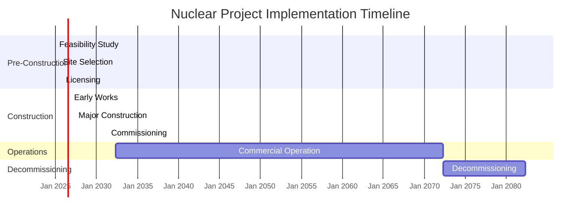

*Figure 16: Typical Nuclear Project Timeline*

### 8.3 Next Steps

#### Immediate Actions (0-6 months)
1. **Site-Specific Analysis**
   - Geotechnical surveys
   - Environmental impact assessment
   - Grid connection study

2. **Financial Structuring**
   - Develop project finance model
   - Secure preliminary financing commitments
   - Negotiate power purchase agreements

3. **Regulatory Engagement**
   - Pre-application meetings
   - License application preparation
   - Environmental review initiation

#### Medium-Term (6-18 months)
1. **Final Investment Decision (FID) Package**
   - Updated feasibility study
   - Fixed-price EPC contracts
   - Final financing agreements

2. **Supply Chain Development**
   - Long-lead item procurement
   - Local supplier qualification
   - Workforce training programs

3. **Stakeholder Engagement**
   - Community consultation
   - Government coordination
   - Investor relations

#### Next Phase
- Proceed to [Risk Assessment](./risk-assessment.md)
- Initiate [Regulatory Approval Process](../regulatory-considerations.md)
- Begin [Site Preparation](../site-preparation/README.md)

## 9. References

### 9.1 Academic Literature
1. **Nuclear Energy Economics**
   - Rothwell, G. (2021). *Nuclear Economics: Nuclear and Energy Economics in Transition*. Routledge.
   - Grubler, A. (2010). "The costs of the French nuclear scale-up: A case of negative learning by doing." *Energy Policy*, 38(9), 5174-5188.
   - Lovering, J. R., et al. (2016). "Historical construction costs of global nuclear power reactors." *Energy Policy*, 91, 371-382.

### 9.2 Industry Reports
1. **Cost Benchmarking**
   - OECD/NEA (2020). *Projected Costs of Generating Electricity*.
   - IEA/NEA (2020). *Projected Costs of Generating Electricity*.
   - Lazard (2023). *Levelized Cost of Energy Analysis - Version 16.0*.

2. **Case Studies**
   - IAEA (2021). *Economic Evaluation of Bids for Nuclear Power Plants: A Guidebook*.
   - WNA (2022). *World Nuclear Performance Report 2022*.
   - EPRI (2021). *Program on Technology Innovation: Advanced Nuclear Reactor Technology Assessment*.

### 9.3 Regulatory & Policy Documents
- NRC Regulatory Guide 1.206: *Combined License Applications for Nuclear Power Plants*
- IAEA Safety Standards Series No. NG-T-3.2: *Economic Assessment of the Long Term Operation of Nuclear Power Plants*
- European Utility Requirements (EUR) Document Volume 3: *Design Requirements for LWR Nuclear Power Plants*

### 9.4 Financial Models & Tools
1. **IAEA Tools**
   - INPRO Methodology for Assessment of Innovative Nuclear Reactors and Fuel Cycles
   - MAED (Model for Analysis of Energy Demand)
   - MESSAGE (Model for Energy Supply Strategy Alternatives and their General Environmental Impact)

2. **Industry Standards**
   - AACE International Recommended Practice No. 18R-97: *Cost Estimate Classification System*
   - ISO 15663:2021: *Petroleum, petrochemical and natural gas industries - Life cycle costing*

### 9.5 Data Sources
- IAEA Power Reactor Information System (PRIS)
- OECD/NEA Nuclear Energy Data
- U.S. EIA Annual Energy Outlook
- World Nuclear Association Information Library

### 9.6 Additional Reading
- MIT Energy Initiative (2018). *The Future of Nuclear Energy in a Carbon-Constrained World*.
- IEA (2019). *Nuclear Power in a Clean Energy System*.
- WNA (2023). *The Nuclear Fuel Report*.
- WNA Economic Aspects of Nuclear Power
