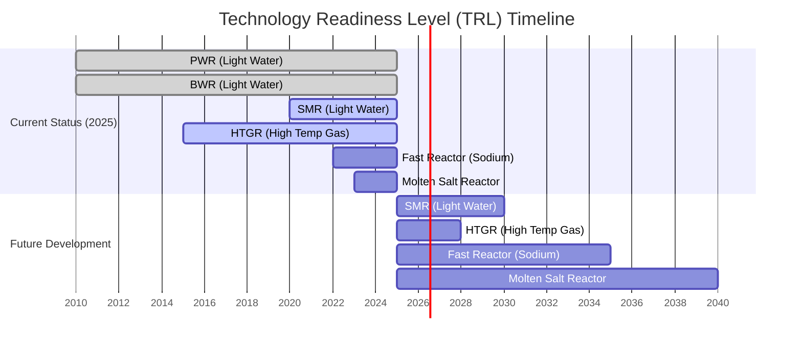

# Technical Feasibility Assessment

This document outlines the methodology for evaluating the technical feasibility of nuclear facility projects under the Nuklei framework.

## 1. Site Suitability

### 1.1 Geographic Considerations
- Seismic activity and fault lines
- Proximity to water sources for cooling
- Distance from population centers
- Transportation infrastructure
- Environmental impact zones

### 1.2 Geotechnical Analysis
- Soil composition and stability
- Flood risk assessment
- Seismic hazard analysis
- Foundation requirements

## 2. Technology Selection

### 2.1 Reactor Technology Options

#### Technology Readiness Level (TRL) Assessment

*Figure 2: Technology Readiness Level Timeline*

#### Reactor Technology Comparison

| Technology | TRL (2025) | Output (MWe) | Key Advantages | Key Challenges |
|------------|------------|--------------|----------------|----------------|
| **PWR** (Pressurized Water) | 9 (Commercial) | 300-1600 | - Proven technology - Extensive regulatory framework - High power output | - Large footprint - High capital costs - Water-intensive |
| **BWR** (Boiling Water) | 9 (Commercial) | 200-1500 | - Simpler design - Lower pressure vessel - Direct cycle | - Potential for fuel contamination - Larger containment |
| **SMR** (Light Water) | 7-8 (Demonstration) | 10-300 | - Modular construction - Enhanced safety - Scalable | - First-of-a-kind costs - Regulatory adaptation |
| **HTGR** (High Temp Gas) | 6-7 (Prototype) | 100-600 | - High efficiency - Process heat capable - Inherent safety | - New fuel fabrication - Limited operational experience |
| **Fast Reactor** (Sodium) | 5-6 (Demonstration) | 100-1500 | - Fuel efficiency - Waste reduction - Breeder capability | - Sodium handling - Safety systems complexity |
| **Molten Salt** | 4-5 (Lab Scale) | 50-1000 | - Fuel flexibility - Low pressure operation - High temperature | - Material challenges - Tritium management |

#### TRL Definitions:
1. **TRL 9**: Actual system proven in operational environment
2. **TRL 8**: System complete and qualified
3. **TRL 7**: System prototype demonstration in operational environment
4. **TRL 6**: System/subsystem model or prototype demonstration
5. **TRL 5**: Component and/or breadboard validation
6. **TRL 4**: Component and/or breadboard validation in lab
7. **TRL 3**: Analytical and experimental critical function proof-of-concept
8. **TRL 2**: Technology concept and/or application formulated
9. **TRL 1**: Basic principles observed and reported

### 2.2 Key Technical Parameters
- Thermal efficiency targets
- Fuel cycle requirements
- Cooling system design
- Grid compatibility
- Integration with renewable energy sources

## 3. Infrastructure Requirements

### 3.1 Power Infrastructure
- Grid connection capacity
- Backup power systems
- Voltage regulation requirements

### 3.2 Water Management
- Cooling water requirements
- Water treatment systems
- Wastewater management

### 3.3 Fuel Handling
- Fuel storage requirements
- Refueling equipment
- Spent fuel management

## 4. Technical Risk Assessment

### 4.1 Technology Readiness Level (TRL)
- Assessment of component and system maturity
- Identification of technology gaps
- Development roadmap for emerging technologies

### 4.2 Supply Chain Evaluation
- Availability of critical components
- Qualified suppliers
- Local content opportunities
- Lead times for long-lead items

## 5. Implementation Considerations

### 5.1 Construction Planning
- Modular vs. stick-built approaches
- Construction sequencing
- Labor requirements and availability

### 5.2 Commissioning Strategy
- Testing protocols
- Performance validation
- Handover to operations

## 6. Technical Documentation
- System design specifications
- Safety analysis reports
- Operating procedures
- Maintenance requirements

## Next Steps
1. Complete site characterization studies
2. Finalize technology selection based on site-specific requirements
3. Develop preliminary design basis
4. Conduct preliminary safety assessment
5. Proceed to [Economic Feasibility](./economic-feasibility.md)
