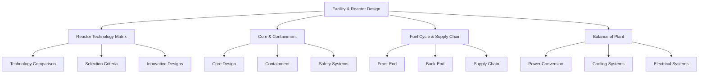

# Facility & Reactor Design

## Overview

This section provides comprehensive documentation on the design principles, technologies, and considerations for nuclear facilities and reactor systems within the Nuklei framework. Our approach integrates cutting-edge engineering with proven nuclear safety standards to create efficient, safe, and sustainable nuclear power solutions.

## Core Documentation

### 1. Reactor Technology Matrix
- Comprehensive comparison of reactor technologies
- Selection methodology and criteria
- Technology readiness levels (TRL)
- [View Details](./reactor-technology-matrix.md)

### 2. Core & Containment Architecture
- Reactor core design principles
- Containment structures and systems
- Safety features and redundancy
- [View Details](./core-containment-architecture.md)

### 3. Fuel Cycle & Supply Chain
- Complete fuel cycle management
- Supply chain security and resilience
- Waste management strategies
- [View Details](./fuel-cycle-supply-chain.md)

### 4. Balance-of-Plant (BoP) Systems
- Power conversion systems
- Cooling and auxiliary systems
- Electrical and I&C systems
- [View Details](./balance-of-plant.md)

## Design Philosophy

### Safety-First Approach
- Defense-in-depth principles
- Multiple independent safety systems
- Passive safety features
- Severe accident management

### Innovation & Modernization
- Digital instrumentation and control
- Advanced materials
- Modular construction
- Digital twin integration

### Sustainability
- Resource efficiency
- Waste minimization
- Lifecycle considerations
- Decommissioning planning

## Integration with Nuklei Framework

This documentation works in conjunction with other Nuklei components:

| Related Section | Integration Points |
|-----------------|-------------------|
| Regulatory & Legal | Compliance with safety standards |
| Site Selection | Site-specific adaptations |
| Digital Systems | I&C integration |
| Safety Analysis | Design basis accidents |

## Getting Started

### For Designers & Engineers
1. Review the Reactor Technology Matrix to select appropriate technology
2. Study Core & Containment requirements
3. Develop detailed system designs
4. Verify compliance with safety standards

### For Regulators
- Review design basis documentation
- Verify safety analysis reports
- Validate compliance with regulatory requirements

### For Contributors
- Follow our [contribution guidelines](../../CONTRIBUTING.md)
- Join design reviews
- Submit improvements via pull requests

## Technical Standards & References

- IAEA Safety Standards Series
- ASME Boiler and Pressure Vessel Code
- IEEE Standards for Nuclear Power Plants
- EPRI Advanced Nuclear Technology Reports
- NRC Regulatory Guides

## License

This documentation is licensed under [CC BY-SA 4.0](https://creativecommons.org/licenses/by-sa/4.0/).

## Feedback & Support

For questions or feedback, please [open an issue](https://github.com/your-org/nuklei/issues) or join our community discussions.
