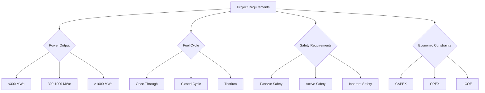
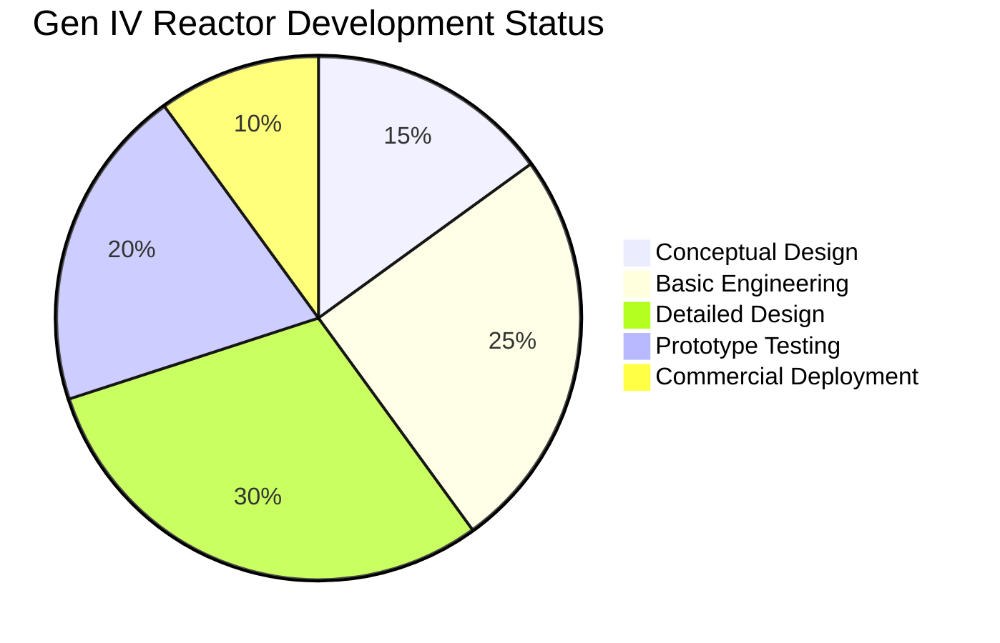
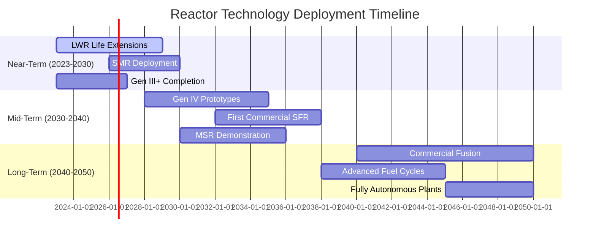

# Reactor Technology Matrix

## Overview

This document provides a comprehensive comparative analysis of various reactor technologies considered within the Nuklei framework. The matrix evaluates different reactor types based on technical, economic, and safety parameters to guide optimal technology selection for specific project requirements.



## Technology Readiness Levels (TRL)

| TRL | Description | Example Technologies |
|-----|-------------|----------------------|
| 9   | Commercial Operation | LWR, PHWR, BWR |
| 8   | First-of-a-Kind Deployment | AP1000, EPR |
| 7   | Prototype Demonstration | HTR-PM, BN-800 |
| 6   | Engineering Prototype | NuScale, SMR-160 |
| 5   | Large-scale Validation | Xe-100, Natrium |
| 4   | Lab Validation | Moltex, Terrestrial Energy |
| 3   | Proof of Concept | Most Gen IV concepts |

## Evaluation Criteria

### 1. Technical Parameters
- **Thermal Efficiency**: Energy conversion efficiency
- **Power Output Range**: Typical electrical output (MWe)
- **Coolant Type**: Primary coolant medium
- **Moderator**: Neutron moderator material
- **Fuel Type**: Enrichment level and form
- **Refueling Interval**: Time between refueling cycles
- **Design Life**: Expected operational lifetime

### 2. Safety Features
- **Inherent Safety**: Passive safety characteristics
- **Containment**: Multiple barrier protection
- **Decay Heat Removal**: Passive cooling capabilities
- **Core Damage Frequency (CDF)**: Probability of core damage per reactor year
- **Large Release Frequency (LRF)**: Probability of significant radioactive release

### 3. Economic Factors
- **Capital Cost**: $/kWe overnight cost
- **O&M Costs**: Annual operational expenses
- **Construction Time**: Years from first concrete to commercial operation
- **Levelized Cost of Electricity (LCOE)**: $/MWh
- **Fuel Costs**: $/MWh

### 4. Proliferation Resistance
- **Weapons-Grade Material**: Potential for diversion
- **Safeguards**: Ease of monitoring and verification
- **Fuel Cycle**: Open vs. closed cycle considerations

## Reactor Technology Comparison

```mermaid
xychart-beta
    title "Reactor Technology Comparison"
    x-axis ["PWR", "BWR", "PHWR", "HTGR", "SFR", "MSR"]
    y-axis "Value" 0 --> 5
    bar [3, 3, 3, 4, 4, 5] -- "Efficiency (1-5)"
    bar [5, 5, 4, 3, 2, 2] -- "Maturity (1-5)"
    bar [3, 3, 4, 5, 5, 5] -- "Safety (1-5)"
    bar [3, 3, 4, 2, 2, 1] -- "Weapons Proliferation Risk (1-5)"
```

### Detailed Comparison Matrix

| Parameter | PWR | BWR | PHWR | HTGR | SFR | MSR |
|-----------|-----|-----|------|------|-----|-----|
| **Coolant** | Light Water | Light Water | Heavy Water | Helium | Sodium | Molten Salt |
| **Moderator** | Water | Water | Heavy Water | Graphite | None | Graphite |
| **Fuel** | UO₂ (3-5%) | UO₂ (2-4%) | Natural UO₂ | UO₂/TRISO | MOX/Metal | UF₄/ThF₄ |
| **Thermal Efficiency** | ~33% | ~32% | ~29% | ~42% | ~40% | ~45% |
| **Power Output (MWe)** | 300-1600 | 500-1400 | 500-900 | 100-300 | 300-1500 | 50-1000 |
| **Refueling Interval** | 18-24 mo | 18-24 mo | On-line | 2-3 years | 12-18 mo | Continuous |
| **Core Damage Freq. (/ry)** | 10⁻⁵ | 10⁻⁵ | 10⁻⁶ | 10⁻⁷ | 10⁻⁶ | 10⁻⁷ |
| **LCOE ($/MWh)** | 60-100 | 65-110 | 70-120 | 80-140 | 75-130 | 70-125 |
| **TRL** | 9 | 9 | 9 | 7-8 | 6-7 | 5-6 |
| **Construction Time (years)** | 5-7 | 5-7 | 6-8 | 4-6 | 5-7 | 3-5 |
| **Overnight Cost ($/kWe)** | 4000-6000 | 4000-6500 | 4500-7000 | 5000-8000 | 4500-7500 | 4000-7500 |
| **Water Usage (m³/MWh)** | 2.3-3.0 | 2.5-3.2 | 2.0-2.8 | 0.5-1.0 | 0.3-0.8 | 0.2-0.7 |
| **Land Use (km²/GWe)** | 1-4 | 1-4 | 1.5-5 | 0.5-2 | 0.5-2 | 0.3-1.5 |
| **Waste Volume (m³/GWe-yr)** | 20-30 | 20-30 | 25-35 | 5-10 | 5-15 | 2-8 |
| **Weapons Proliferation Risk** | Medium | Medium | Medium-Low | Low | High | Medium |

## Technology-Specific Considerations

### Pressurized Water Reactor (PWR)
- **Advantages**: Mature technology, extensive operational experience
- **Challenges**: High pressure primary system, complex safety systems
- **Nuklei Focus**: Digital I&C modernization, passive safety features

### Boiling Water Reactor (BWR)
- **Advantages**: Simpler design than PWR, lower pressure
- **Challenges**: Potential for fuel cladding corrosion
- **Nuklei Focus**: Advanced materials, safety system optimization

### Pressurized Heavy Water Reactor (PHWR)
- **Advantages**: Natural uranium fuel, online refueling
- **Challenges**: Tritium production, heavy water costs
- **Nuklei Focus**: Fuel cycle optimization, cost reduction

### High-Temperature Gas-Cooled Reactor (HTGR)
- **Advantages**: High efficiency, process heat applications
- **Challenges**: Graphite management, fuel fabrication
- **Nuklei Focus**: TRISO fuel development, cogeneration

### Sodium-Cooled Fast Reactor (SFR)
- **Advantages**: Breeder capability, high temperature
- **Challenges**: Sodium reactivity, secondary sodium loop
- **Nuklei Focus**: Safety system design, materials development

### Molten Salt Reactor (MSR)
- **Advantages**: Low pressure, high temperature, fuel flexibility
- **Challenges**: Materials corrosion, tritium management
- **Nuklei Focus**: Salt chemistry, structural materials

## Advanced Technology Features

### Small Modular Reactors (SMRs)

| Feature | NuScale | BWRX-300 | HTR-PM | Xe-100 |
|---------|---------|----------|--------|--------|
| **Type** | iPWR | BWR | HTGR | HTGR |
| **Power (MWe)** | 77 | 300 | 210 | 80 |
| **Coolant** | Water | Water | Helium | Helium |
| **Refueling** | 2 years | 2 years | 2 years | 4 years |
| **Safety** | Passive | Passive + Active | Inherent | Inherent |
| **Deployment** | 2029 | 2028 | 2023 | 2028 |

### Generation IV Reactor Features



## Selection Methodology

### Decision Matrix Framework

1. **Project Requirements Analysis**
   - Base load vs. Load following
   - Grid stability requirements
   - Co-generation potential (heat, hydrogen, desalination)
   - Site-specific constraints (seismic, cooling water, etc.)

2. **Regulatory Pathway**
   - Existing licensing framework
   - Regulatory body experience
   - International certification
   - Environmental impact assessment

3. **Fuel Cycle Considerations**
   - Uranium utilization efficiency
   - Waste management strategy
   - Proliferation resistance
   - Fuel fabrication infrastructure

4. **Economic Assessment**
   - Capital expenditure (CAPEX) breakdown
   - Operational expenditure (OPEX) analysis
   - Levelized Cost of Electricity (LCOE)
   - Financing and insurance

5. **Safety & Security**
   - Probabilistic Risk Assessment (PRA)
   - Security requirements
   - Emergency planning zones
   - Decommissioning provisions

### Multi-Criteria Decision Analysis (MCDA)

| Criterion | Weight | PWR | SFR | MSR | HTGR |
|-----------|--------|-----|-----|-----|------|
| Safety | 25% | 4 | 5 | 5 | 5 |
| Cost | 20% | 5 | 3 | 4 | 3 |
| Technology Maturity | 20% | 5 | 3 | 2 | 4 |
| Fuel Efficiency | 15% | 2 | 5 | 5 | 4 |
| Waste Management | 10% | 2 | 4 | 5 | 4 |
| Proliferation Resistance | 10% | 3 | 2 | 4 | 5 |
| **Total** | **100%** | **3.8** | **3.55** | **4.05** | **4.15** |

*Scale: 1 (Poor) to 5 (Excellent)*

## Emerging Technologies

### Advanced Reactor Concepts

#### 1. Microreactors (<10 MWe)
- **Applications**: Remote communities, military bases, disaster recovery
- **Features**: Transportable, autonomous operation, long core life
- **Examples**: eVinci (Westinghouse), Aurora (Oklo)

#### 2. Molten Chloride Fast Reactors (MCFR)
- **Coolant**: Molten chloride salt
- **Fuel**: UCl₃ or PuCl₃
- **Advantages**: High temperature, fast spectrum, actinide burning

#### 3. Lead-Cooled Fast Reactors (LFR)
- **Coolant**: Lead or lead-bismuth
- **Features**: High temperature, chemical inertness, natural circulation
- **Challenges**: Corrosion, coolant purification

## Implementation Roadmap



## References

1. **IAEA Advanced Reactors Information System (ARIS)** - Comprehensive database of advanced reactor designs
2. **Generation IV International Forum (GIF) Technology Roadmap** - 2023 Update
3. **OECD/NEA** - Advanced Nuclear Reactor Systems and Future Energy Market Needs (2024)
4. **EPRI** - Advanced Nuclear Technology: Advanced Reactor Technology Assessment Guide (2023)
5. **MIT** - The Future of Nuclear Energy in a Carbon-Constrained World (2023)
6. **U.S. DOE** - Advanced Reactor Demonstration Program (ARDP) Reports
7. **IAEA** - Advances in Small Modular Reactor Technology Developments (2023)
8. **World Nuclear Association** - Advanced Nuclear Power Reactors
9. **European Commission** - Strategic Energy Technology (SET) Plan
10. **IAEA** - Climate Change and Nuclear Power (2023)

## Next Steps

### Phase 1: Technology Screening (Months 1-6)
- [ ] Define project-specific requirements and constraints
- [ ] Conduct preliminary technology screening
- [ ] Develop shortlist of 3-5 candidate technologies
- [ ] Perform gap analysis for each technology

### Phase 2: Feasibility Study (Months 6-18)
- [ ] Conduct detailed feasibility studies
- [ ] Perform site-specific assessments
- [ ] Develop preliminary cost estimates (±30%)
- [ ] Identify key technology risks and mitigation strategies

### Phase 3: Pre-licensing (Months 18-36)
- [ ] Engage with regulatory authorities
- [ ] Develop preliminary safety analysis reports (PSAR)
- [ ] Conduct environmental impact assessment
- [ ] Finalize technology selection

### Phase 4: Implementation Planning (Months 36-48)
- [ ] Finalize vendor selection
- [ ] Develop detailed project schedule
- [ ] Secure necessary financing
- [ ] Finalize contracting strategy

## Technology Watch List

| Technology | Development Stage | Key Players | Expected Commercialization | Notes |
|------------|------------------|-------------|---------------------------|-------|
| Sodium Fast Reactor | Demonstration | TerraPower, GE-Hitachi | 2030 | High temperature, fuel cycle benefits |
| Molten Salt Reactor | Early Development | Terrestrial Energy, Moltex | 2032 | Flexible operation, safety advantages |
| High-Temperature Gas Reactor | Prototype | X-energy, Framatome | 2028 | Process heat applications |
| Lead-Cooled Fast Reactor | Research | Newcleo, Westinghouse | 2035 | Inherent safety, waste burning |
| Fusion-Fission Hybrid | Conceptual | CFS, TAE, General Fusion | 2040+ | Potential game-changer |

## Continuous Monitoring

- Subscribe to IAEA Advanced Reactors Information System (ARIS) updates
- Monitor regulatory developments in target markets
- Track technology readiness levels (TRLs) of emerging designs
- Participate in industry working groups and standards development
