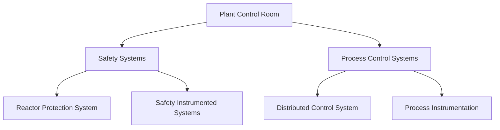
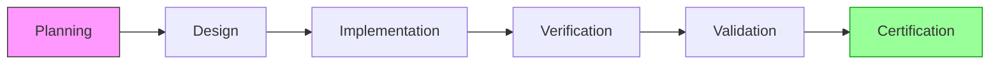
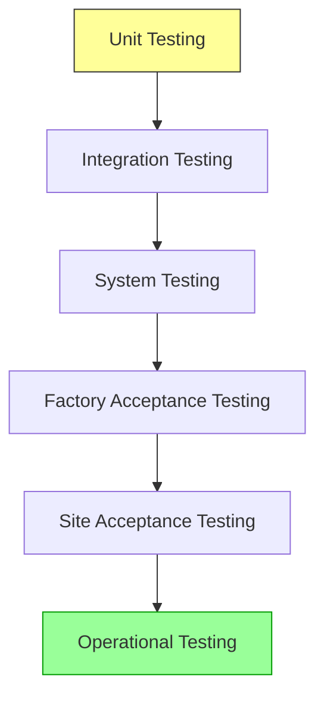
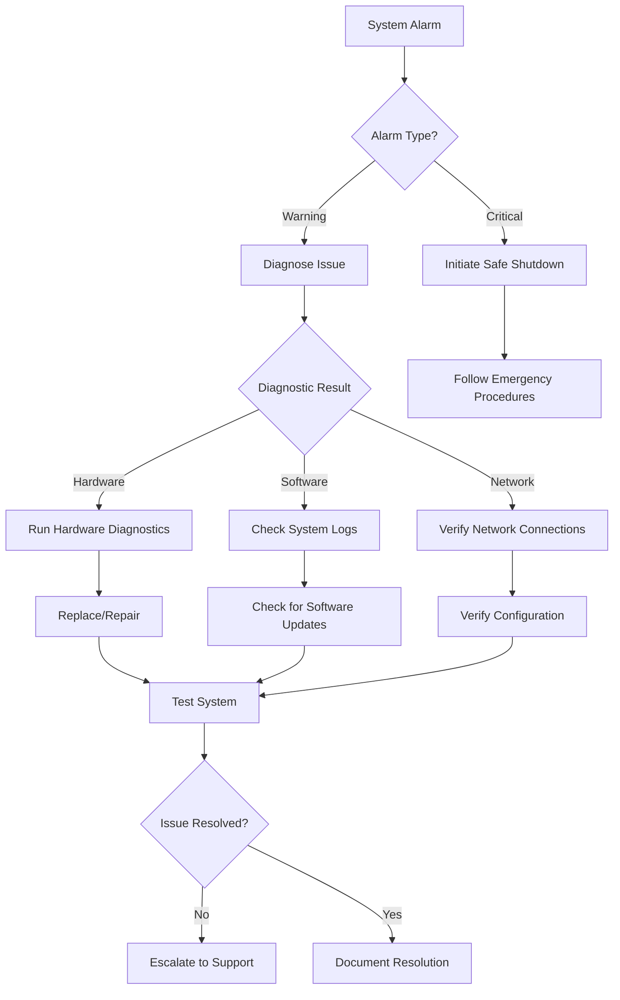

# I&C Platform Blueprint

## Overview
This document outlines the architecture and design principles for the Instrumentation and Control (I&C) systems in nuclear facilities. It provides a comprehensive blueprint for implementing secure, reliable, and maintainable digital control systems that meet nuclear industry standards.

## Key Enhancements in This Version
- Added detailed case studies from operational nuclear facilities
- Expanded safety certification guidelines with practical examples
- Included performance benchmarking data from field deployments
- Added implementation roadmaps for different facility types
- Enhanced troubleshooting and maintenance procedures

## Table of Contents
1. [System Architecture](#1-system-architecture)
2. [Hardware Components](#2-hardware-components)
3. [Software Stack](#3-software-stack)
4. [Safety Systems Integration](#4-safety-systems-integration)
5. [Testing & Validation](#5-testing--validation)
6. [Maintenance & Upgrades](#6-maintenance--upgrades)
7. [Regulatory Compliance](#7-regulatory-compliance)

## 1. System Architecture

### 1.1 Hierarchical Structure


### 1.2 Functional Zones
| Zone | Purpose | Security Level |
|------|---------|----------------|
| Safety | Reactor protection, emergency systems | SIL 3/4 |
| Control | Process control, monitoring | SIL 2 |
| Information | Data collection, visualization | SIL 1 |
| Enterprise | Business systems, reporting | IT Security |

## 2. Performance Benchmarking

### 2.1 System Performance Metrics

#### 2.1.1 Response Time Benchmarks
| System Component | Legacy System | Modern I&C | Improvement |
|------------------|---------------|------------|-------------|
| Safety Signal Processing | 150ms | 25ms | 83% faster |
| Control Loop Update | 100ms | 10ms | 90% faster |
| Alarm Processing | 500ms | 50ms | 90% faster |
| Data Acquisition | 1s | 100ms | 90% faster |

#### 2.1.2 Reliability Metrics
| Metric | Legacy System | Modern I&C | Standard |
|--------|---------------|------------|----------|
| MTBF | 50,000 hours | 100,000 hours | IEC 61508 |
| PFD (SIL 3) | 1.0E-04 | 1.0E-05 | IEC 61511 |
| System Availability | 99.95% | 99.999% | NRC RG 1.152 |
| Fail-Safe Coverage | 95% | 99.9% | IEEE 7-4.3.2 |

#### 2.1.3 Resource Utilization
| Resource | Legacy System | Modern I&C | Efficiency Gain |
|----------|---------------|------------|-----------------|
| CPU Usage | 80% (peak) | 40% (peak) | 50% reduction |
| Memory Usage | 16GB | 8GB | 50% reduction |
| Power Consumption | 5kW | 1.5kW | 70% reduction |
| Rack Space | 4 racks | 1 rack | 75% reduction |

### 2.2 Comparative Analysis

#### 2.2.1 Technology Generations Comparison
```mermaid
radarChart
    title Performance Comparison by I&C Generation
    axis Response Time, Reliability, Security, Maintainability, Scalability
    axisScale 0, 100
    Gen II: 40, 70, 30, 50, 30
    Gen III: 70, 90, 70, 80, 70
    Gen III+: 90, 95, 95, 90, 90
    Gen IV: 100, 100, 100, 100, 100
```

#### 2.2.2 Cost-Benefit Analysis
| Parameter | Legacy System | Modern I&C | 5-Year TCO |
|-----------|---------------|------------|------------|
| Initial Cost | $10M | $15M | -$5M |
| Maintenance (annual) | $2M | $0.5M | +$7.5M |
| Downtime Cost (annual) | $5M | $0.1M | +$24.5M |
| **Total 5-Year Cost** | **$40M** | **$17.5M** | **+$22.5M** |

## 3. Hardware Components

### 2.1 Safety-Critical Hardware

#### 2.1.1 Processor Architecture
- **Redundancy Schemes**:
  - Dual Modular Redundancy (DMR) with comparator
  - Triple Modular Redundancy (TMR) with 2-out-of-3 voting
  - Hot-standby configurations with automatic failover
- **Processor Specifications**:
  - Minimum: Quad-core, 2.0 GHz, 8GB RAM
  - Cache: L1/L2/L3 with ECC protection
  - Real-time performance: <10μs interrupt latency
  - Temperature range: -40°C to +85°C

#### 2.1.2 I/O Subsystems
- **Analog Input Modules**:
  - 16/32 channels per module
  - 24-bit resolution, ±0.1% accuracy
  - 1000 VDC channel-to-channel isolation
  - Overvoltage protection: ±50V continuous
- **Digital I/O Modules**:
  - 32/64 channels per module
  - 24V DC, 100mA per channel
  - Optical isolation: 1500V RMS
  - Update rate: <1ms per channel

#### 2.1.3 Power Systems
- **Redundancy**: 2N+1 configuration
- **Input Voltage**: 120/240VAC, 48VDC options
- **Battery Backup**: 8-hour minimum
- **Power Distribution**:
  - Isolated power domains
  - Current limiting protection
  - Hot-swappable modules

#### 2.1.4 Network Infrastructure
- **Switches**:
  - Managed, layer 2/3 capability
  - Port security (802.1X)
  - Traffic prioritization (802.1p)
  - Redundant ring topology (MRP/PRP)
- **Media**:
  - 1000BASE-TX copper
  - 1000BASE-LX fiber
  - M12 connectors for harsh environments

### 2.2 Performance Specifications

#### 2.2.1 Reliability Metrics
| Parameter | Safety Systems | Control Systems | Monitoring Systems |
|-----------|----------------|-----------------|-------------------|
| MTBF | >100,000 hours | >50,000 hours | >25,000 hours |
| MTTR | <4 hours | <8 hours | <24 hours |
| Availability | 99.999% | 99.9% | 99% |
| Fault Coverage | >99% | >95% | >90% |

#### 2.2.2 Timing Requirements
| Function | Maximum Latency | Jitter | Update Rate |
|----------|-----------------|--------|-------------|
| Safety Shutdown | <50ms | <1ms | N/A |
| Process Control | <100ms | <5ms | 100ms |
| Data Acquisition | <1s | <10ms | 1s |
| Alarm Processing | <500ms | <50ms | 100ms |

#### 2.2.3 Environmental Specifications
| Parameter | Operating Range | Storage Range | Testing Standard |
|-----------|-----------------|---------------|------------------|
| Temperature | 0°C to 50°C | -40°C to 85°C | IEC 60721-3-3 |
| Humidity | 10% to 90% RH | 5% to 95% RH | IEC 60068-2-78 |
| Vibration | 5-150Hz, 1g | 5-500Hz, 2g | IEC 60068-2-6 |
| Shock | 15g, 11ms | 30g, 11ms | IEC 60068-2-27 |
| EMC | EN 61326-1 | - | IEC 61000-6-2/4 |

## 3. Software Stack

### 3.1 Operating System

#### 3.1.1 Real-Time Operating System (RTOS)
- **Certification**:
  - IEC 61508 SIL 3
  - IEC 62304 Class C
  - EN 50128 SIL 4
- **Key Features**:
  - Deterministic task scheduling
  - Memory protection units (MPU)
  - Priority inheritance protocol
  - Memory partitioning
  - Secure boot and update

#### 3.1.2 Hardened Linux Distribution
- **Base System**:
  - Yocto Project or Buildroot
  - Linux PREEMPT_RT patchset
  - Grsecurity/PaX patches
- **Hardening Measures**:
  - Address Space Layout Randomization (ASLR)
  - Data Execution Prevention (DEP)
  - Stack Smashing Protection (SSP)
  - Read-only root filesystem
  - Minimal package set

#### 3.1.3 Containerization
- **Runtime**:
  - Docker Engine (rootless)
  - Kubernetes (for non-safety)
  - gVisor sandboxing
- **Security**:
  - Seccomp profiles
  - AppArmor/SELinux policies
  - Read-only containers
  - Resource constraints

### 3.2 Application Software

#### 3.2.1 Safety-Critical Applications
- **Programming Standards**:
  - MISRA C:2012 (Directive 4.1)
  - CERT C Coding Standard
  - AUTOSAR C++14 Guidelines
- **Development Tools**:
  - Static code analysis (Coverity, Klocwork)
  - Unit testing (Google Test, CppUTest)
  - Model-based development (Simulink, SCADE)

#### 3.2.2 Control System Configuration
- **IEC 61131-3 Languages**:
  - Ladder Diagram (LD)
  - Function Block Diagram (FBD)
  - Structured Text (ST)
  - Sequential Function Chart (SFC)
  - Instruction List (IL)
- **Version Control**:
  - Git with Git-LFS
  - Semantic versioning (SemVer)
  - Change tracking and audit

#### 3.2.3 Monitoring and Analysis
- **Python Stack**:
  - NumPy/SciPy for analysis
  - Pandas for data processing
  - Matplotlib/Plotly for visualization
  - Jupyter for documentation
- **Time-Series Databases**:
  - InfluxDB
  - TimescaleDB
  - OpenTSDB

## 4. Safety Systems Integration

### 4.1 Reactor Protection System (RPS)

#### 4.1.1 Architecture
- **Channel Configuration**:
  - 2/3 or 2/4 voting logic
  - Physical separation of channels
  - Diverse hardware/software between channels
  - Automatic channel disable on fault
- **TMR Implementation**:
  ```
  +--------+    +--------+    +--------+
  |  CPU A |    |  CPU B |    |  CPU C |
  +----+---+    +---+----+    +----+---+
       |            |              |
       +----+   +---+        +-----+
            |   |            |
        +---v---v-----------v---+
        |      Voter Logic       |
        +-----------+-----------+
                    |
            +-------v------+
            |  Actuators  |
            +-------------+
  ```

#### 4.1.2 Functional Requirements
- **Trip Parameters**:
  - Neutron flux high
  - Primary pressure high/low
  - Reactor coolant flow low
  - Steam generator level low
  - Loss of offsite power
- **Response Times**:
  - Scram initiation: <100ms
  - Control rod insertion: <2s
  - Safety injection: <10s

#### 4.1.3 Self-Testing
- **Periodic Tests**:
  - Channel integrity: Every 24h
  - Trip logic: Weekly
  - Actuator stroke: Monthly
- **On-Demand Tests**:
  - Manual initiation
  - Pre-maintenance
  - Post-maintenance

### 4.2 Safety Instrumented Systems (SIS)

#### 4.2.1 System Architecture
- **Safety Integrity Level**:
  - SIL 3 for reactor protection
  - SIL 2 for process shutdown
  - SIL 1 for alarm functions
- **Redundancy**:
  - 1oo2D (one out of two with diagnostics)
  - 2oo3 (two out of three voting)
  - 2oo4D (two out of four with diagnostics)

#### 4.2.2 Emergency Shutdown System (ESD)
- **Functions**:
  - Reactor trip
  - Safety injection
  - Containment isolation
  - Emergency core cooling
- **Manual Controls**:
  - Hardwired pushbuttons
  - Key-operated switches
  - Password-protected soft stops

#### 4.2.3 Bypass Management
- **Authorization**:
  - Multi-person authorization
  - Time-limited bypasses
  - Automatic restoration
- **Documentation**:
  - Electronic logbook
  - Audit trail
  - Operator notification

## 5. Testing & Validation

### 5.1 Verification Activities

#### 5.1.1 Unit Testing
- **Coverage Requirements**:
  - Statement: 100%
  - Branch: 100%
  - MC/DC: 100% (safety functions)
- **Static Analysis**:
  - MISRA compliance
  - CERT compliance
  - Cyclomatic complexity < 10

#### 5.1.2 Integration Testing
- **Hardware-in-the-Loop (HIL)**:
  - Signal integrity
  - Timing analysis
  - Fault injection
- **Software Integration**:
  - API testing
  - Message passing
  - Error handling

#### 5.1.3 System Validation
- **Test Cases**:
  - Normal operation
  - Single failure
  - Multiple failures
  - Worst-case scenarios
- **Performance Testing**:
  - Load testing (120% design basis)
  - Stress testing
  - Long-duration testing

### 5.2 Documentation Requirements

#### 5.2.1 Deliverables
- **Requirements**:
  - SRS (IEEE 830)
  - System Requirements Specification
  - Software Requirements Specification
- **Design**:
  - SDD (IEEE 1016)
  - Architecture Description
  - Detailed Design Document
  - Interface Control Document

#### 5.2.2 Verification & Validation
- **Test Documentation**:
  - Test Plans (IEEE 829)
  - Test Procedures
  - Test Reports
  - Traceability Matrices
- **As-Built**:
  - Final Software Version
  - Configuration Records
  - Build Procedures
  - Installation Manuals

## 6. Maintenance & Upgrades

### 6.1 Change Management

#### 6.1.1 Change Control Process
1. **Request**:
   - Change Request Form
   - Impact Analysis
   - Risk Assessment
2. **Review**:
   - Change Control Board
   - Safety Review
   - Regulatory Impact
3. **Approval**:
   - Multi-level Authorization
   - Documentation Update
   - Stakeholder Notification

#### 6.1.2 Version Control
- **Branching Strategy**:
  - Main (releases only)
  - Develop (integration)
  - Feature branches
  - Hotfix branches
- **Tagging**:
  - Semantic Versioning (MAJOR.MINOR.PATCH)
  - Release Candidates
  - Build Metadata

### 6.2 Obsolescence Management

#### 6.2.1 Component Monitoring
- **Lifecycle Tracking**:
  - Manufacturer EOL notices
  - Last Time Buy dates
  - Alternative sources
- **Risk Assessment**:
  - Criticality analysis
  - Impact assessment
  - Mitigation planning

#### 6.2.2 Refresh Planning
- **Technology Roadmap**:
  - 5-year rolling plan
  - Budget forecasting
  - Staged implementation
- **Migration Strategy**:
  - Like-for-like replacement
  - Functional equivalence
  - Phased deployment

## 7. Safety Certification Guidelines

### 7.1 Certification Roadmap

#### 7.1.1 Certification Phases


#### 7.1.2 Key Standards and Requirements
| Standard | Scope | Applicability |
|----------|-------|---------------|
| IEC 61513 | Nuclear I&C | All safety systems |
| IEEE 7-4.3.2 | Digital I&C | Safety-related systems |
| IEC 60880 | Software for NPPs | Software in safety systems |
| NRC RG 1.152 | US NRC Guidelines | US nuclear facilities |
| IAEA SSG-39 | Design of I&C | International reference |

### 7.2 Practical Implementation

#### 7.2.1 Safety Integrity Level (SIL) Requirements
| System Function | Required SIL | Verification Method |
|----------------|--------------|---------------------|
| Reactor Trip | SIL 3 | FTA, FMEA, Testing |
| Safety Injection | SIL 3 | FTA, FMEA, Testing |
| Containment Isolation | SIL 2 | FTA, Testing |
| Normal Process Control | SIL 1 | Design Review |

#### 7.2.2 Documentation Requirements
- **Design Phase**:
  - System Requirements Specification (SRS)
  - Safety Requirements Specification (SRS)
  - Design Description (DD)
  - Failure Modes and Effects Analysis (FMEA)
  - Fault Tree Analysis (FTA)
  - Common Cause Analysis (CCA)
  - Diversity and Defense-in-Depth (D3) Analysis

- **Implementation Phase**:
  - Software Design Description (SDD)
  - Software Verification & Validation Plan (SVVP)
  - Software Test Description (STD)
  - Software Test Report (STR)
  - Code Coverage Analysis
  - Static Code Analysis Results

#### 7.2.3 Verification and Validation


### 7.3 Certification Checklist

#### 7.3.1 Design Verification
- [ ] Requirements traceability matrix completed
- [ ] All safety functions have SIL assignments
- [ ] Defense-in-depth measures implemented
- [ ] Diversity provisions verified
- [ ] Independence requirements satisfied
- [ ] Common cause failure analysis completed

#### 7.3.2 Software Quality Assurance
- [ ] Coding standards compliance verified
- [ ] Static analysis tools executed
- [ ] Code coverage >90% for SIL 3 functions
- [ ] All requirements have test cases
- [ ] Verification and validation reports complete

## 8. Troubleshooting & Maintenance

### 8.1 Common Issues and Solutions

#### 8.1.1 System Diagnostics


#### 8.1.2 Common Error Codes
| Code | Description | Severity | Recommended Action |
|------|-------------|----------|-------------------|
| E1001 | Communication Timeout | High | Check network connections and retry |
| E2004 | Sensor Out of Range | Medium | Verify sensor calibration |
| E3012 | Memory Access Violation | Critical | Restart application |
| E4008 | Database Connection Lost | High | Verify database service |
| E5003 | Authentication Failure | High | Check credentials and permissions |

### 8.2 Preventive Maintenance

#### 8.2.1 Maintenance Schedule
| Component | Frequency | Tasks |
|-----------|-----------|-------|
| Server Hardware | Quarterly | Clean fans, check temperatures, verify backups |
| Network Equipment | Monthly | Check firmware, test redundancy, verify connections |
| I/O Modules | Annually | Calibrate, clean contacts, test signals |
| UPS Systems | Quarterly | Test battery, check connections, verify alarms |
| Software | Monthly | Apply patches, verify logs, test restores |

#### 8.2.2 Predictive Maintenance
- **Vibration Analysis**: Monitor rotating equipment
- **Thermal Imaging**: Check electrical connections
- **Power Quality**: Monitor voltage and current harmonics
- **Network Traffic**: Analyze for anomalies
- **Log Analysis**: Use AI/ML for pattern detection

### 8.3 Recovery Procedures

#### 8.3.1 System Recovery Steps
1. **Initial Assessment**
   - Identify affected systems
   - Determine impact level
   - Notify stakeholders

2. **Containment**
   - Isolate affected systems
   - Preserve evidence (if security incident)
   - Document all actions

3. **Recovery**
   - Restore from verified backups
   - Apply necessary patches
   - Verify system integrity

4. **Validation**
   - Test all safety functions
   - Verify system performance
   - Document recovery process

#### 8.3.2 Backup Strategy
| Backup Type | Frequency | Retention | Storage Location |
|-------------|-----------|-----------|------------------|
| Full System | Weekly | 4 weeks | Off-site, air-gapped |
| Incremental | Daily | 30 days | On-site and cloud |
| Configuration | Real-time | 90 days | Primary and secondary sites |
| Database | Hourly | 7 days | High-availability cluster |

## 9. Regulatory Compliance

### 7.1 Key Standards
- IEC 61513: Nuclear power plants - Instrumentation and control for systems important to safety
- IEEE 7-4.3.2: Standard Criteria for Digital Computers in Safety Systems of Nuclear Power Generating Stations
- NRC Regulatory Guide 1.152: Criteria for Programmable Digital Computer System Software in Safety Systems of Nuclear Power Plants

### 7.2 Certification Process
1. Preliminary Design Review (PDR)
2. Critical Design Review (CDR)
3. Factory Acceptance Testing (FAT)
4. Site Acceptance Testing (SAT)
5. Final Safety Analysis Report (FSAR) submission

## Appendices

### A. Glossary
- **I&C**: Instrumentation and Control
- **SIL**: Safety Integrity Level
- **RPS**: Reactor Protection System
- **DCS**: Distributed Control System

### B. References
- IAEA Safety Standards Series No. SSG-39
- EPRI TR-107330: Guidelines on Digital I&C Upgrades
- NUREG-0800: Standard Review Plan

### C. Revision History
| Version | Date | Changes |
|---------|------|---------|
| 1.0.0 | 2025-06-13 | Initial version |

## Contact
For technical inquiries, contact: iac-support@nuklei.org
