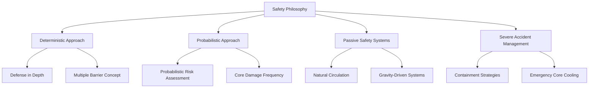

# Safety Philosophy & Systems Engineering

This section outlines the comprehensive safety framework and systems engineering approach for nuclear facilities under the Nuklei framework. It integrates deterministic and probabilistic methodologies to ensure robust safety throughout the facility lifecycle.

## Overview



*Figure 1: Safety Philosophy Framework*

## Key Components

1. **Deterministic Safety Analysis**
   - [Design Basis Accidents](deterministic-approach/design-basis-accidents.md)
   - [Safety Classification](deterministic-approach/safety-classification.md)
   - [Single Failure Criterion](deterministic-approach/single-failure-criterion.md)

2. **Probabilistic Risk Assessment**
   - [Methodology Overview](probabilistic-approach/methodology.md)
   - [Fault Tree Analysis](probabilistic-approach/fault-tree-analysis.md)
   - [Event Tree Analysis](probabilistic-approach/event-tree-analysis.md)

3. **Passive Safety Systems**
   - [Natural Circulation Systems](passive-safety/natural-circulation.md)
   - [Passive Containment Cooling](passive-safety/containment-cooling.md)
   - [Gravity-Driven Safety Systems](passive-safety/gravity-systems.md)

4. **Severe Accident Management**
   - [Prevention and Mitigation](severe-accident-management/prevention-mitigation.md)
   - [Containment Integrity](severe-accident-management/containment-integrity.md)
   - [Emergency Preparedness](severe-accident-management/emergency-preparedness.md)

## Implementation Approach

### Systems Engineering Integration
- Requirements Management
- Interface Control
- Verification & Validation
- Configuration Management

### Safety Analysis Tools
- [RELAP5](tools/relap5.md)
- [MELCOR](tools/melcor.md)
- [MAAP](tools/maap.md)

## Case Studies
- [Fukushima Daiichi Accident Analysis](case-studies/fukushima.md)
- [Passive Safety in AP1000](case-studies/ap1000.md)
- [EPR Safety Features](case-studies/epr.md)

## Regulatory Framework
- IAEA Safety Standards
- NRC Regulatory Guides
- WENRA Reference Levels

## Documentation Structure
```
safety-philosophy-systems-engineering/
├── README.md                     # This file
├── deterministic-approach/       # Deterministic safety analysis
├── probabilistic-approach/       # Probabilistic risk assessment
├── passive-safety/               # Passive safety systems
├── severe-accident-management/    # SAM strategies
├── case-studies/                 # Real-world examples
├── diagrams/                     # Visual assets
└── tools/                        # Analysis tools and software
```

## Next Steps
1. Review [Deterministic Safety Approach](deterministic-approach/README.md)
2. Explore [Probabilistic Risk Assessment](probabilistic-approach/README.md)
3. Understand [Passive Safety Systems](passive-safety/README.md)

## Contact
For technical inquiries, contact: safety-engineering@nuklei.org
