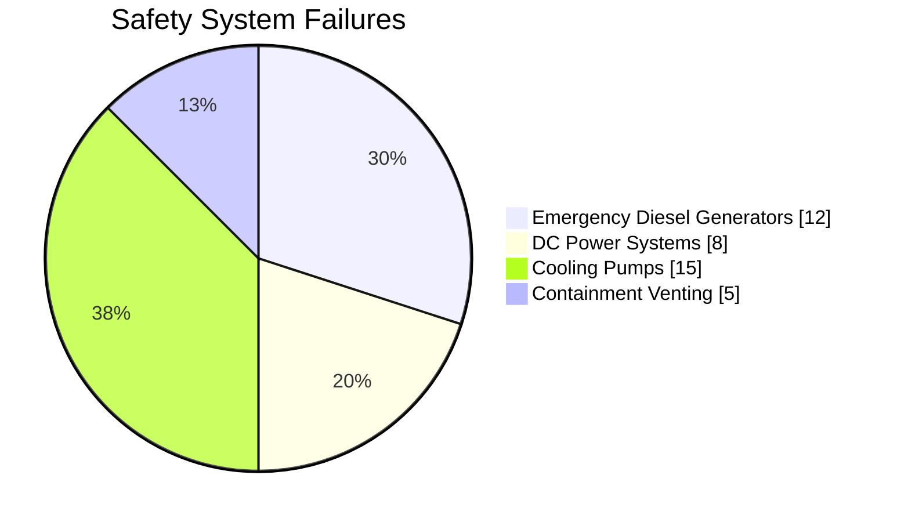

# Fukushima Daiichi Nuclear Accident: Case Study Analysis

## 1. Event Overview

### 1.1 Basic Information
- **Location**: Ōkuma, Fukushima, Japan
- **Plant Type**: Boiling Water Reactor (BWR)
- **Units Affected**: Units 1-4
- **Date**: March 11, 2011
- **INES Level**: 7 (Major Accident)

### 1.2 Accident Sequence

```mermaid
timeline
    title Fukushima Daiichi Accident Timeline
    section March 11, 2011
    14:46 : M9.0 Tohoku Earthquake
    15:27 : Tsunami (14m) impacts site
    15:37 : Station blackout begins
    
    section March 12
    15:36 : Unit 1 hydrogen explosion
    
    section March 14
    11:01 : Unit 3 hydrogen explosion
    
    section March 15
    06:00 : Unit 2 suspected PCV damage
    06:14 : Unit 4 hydrogen explosion
```

*Figure 1: Key Events Timeline*

## 2. Technical Analysis

### 2.1 Root Causes
1. **Direct Causes**
   - Beyond design basis tsunami height (14m vs. 5.7m design)
   - Loss of all AC/DC power (station blackout)
   - Failure of emergency diesel generators

2. **Contributing Factors**
   - Inadequate tsunami risk assessment
   - Insufficient defense-in-depth against flooding
   - Ineffective regulatory oversight

### 2.2 Safety System Performance



*Figure 2: Safety System Failures*

## 3. Accident Progression

### 3.1 Unit-by-Unit Analysis

#### Unit 1
- Complete core melt within hours
- Hydrogen explosion at reactor building
- PCV damage suspected

#### Unit 2
- Partial core damage
- Possible PCV failure
- No hydrogen explosion

#### Unit 3
- Complete core melt
- Hydrogen explosion
- MOX fuel implications

#### Unit 4
- No fuel in reactor (outage)
- Hydrogen explosion from Unit 3 backflow
- Spent fuel pool concerns

### 3.2 Containment Performance
- Wetwell venting challenges
- Hydrogen management failures
- Containment overpressure protection issues

## 4. Emergency Response

### 4.1 Immediate Actions
- Declaration of nuclear emergency
- Evacuation orders (2km → 3km → 10km → 20km)
- Attempts to restore power and cooling

### 4.2 Challenges Faced
- Multiple simultaneous emergencies
- Communication failures
- Radiation monitoring limitations
- Access and logistics difficulties

## 5. Lessons Learned

### 5.1 Technical Improvements
1. **Flood Protection**
   - Higher seawalls (15m+)
   - Watertight doors and penetrations
   - Elevated emergency equipment

2. **Power Supply**
   - Diverse AC power sources
   - Portable equipment readiness
   - Enhanced battery capacity

3. **Containment Venting**
   - Filtered venting systems
   - Reliable hydrogen control
   - Hardened vent paths

### 5.2 Regulatory Changes
- Establishment of Nuclear Regulation Authority (NRA)
- New safety standards (2013)
- Stress test requirements
- Emergency preparedness enhancements

## 6. Industry Impact

### 6.1 Global Response
- Safety re-evaluations worldwide
- Stress tests in Europe and US
- Phased nuclear phase-outs (Germany, Belgium)

### 6.2 Design Improvements
- Passive safety systems
- Diverse and flexible coping strategies (FLEX)
- Enhanced spent fuel pool cooling

## 7. Current Status
- Decommissioning in progress (30-40 year timeline)
- Water treatment and storage challenges
- Ongoing environmental monitoring
- Community resettlement issues

## 8. Key Recommendations
1. **Defense-in-Depth**
   - Multiple independent safety systems
   - Diverse and redundant power sources
   - Severe accident management guidelines

2. **Emergency Preparedness**
   - Robust emergency response plans
   - Regular training and drills
   - Public communication strategies

3. **Regulatory Framework**
   - Independent regulatory bodies
   - Periodic safety reviews
   - International cooperation

## 9. References
1. The National Diet of Japan (2012). *The Official Report of The Fukushima Nuclear Accident Independent Investigation Commission*
2. IAEA (2015). *The Fukushima Daiichi Accident*
3. NAIIC (2012). *Investigation Committee on the Accident at Fukushima Nuclear Power Stations of Tokyo Electric Power Company*
4. TEPCO (2012). *Fukushima Nuclear Accident Analysis Report*
5. NRC (2011). *Recommendations for Enhancing Reactor Safety in the 21st Century*
