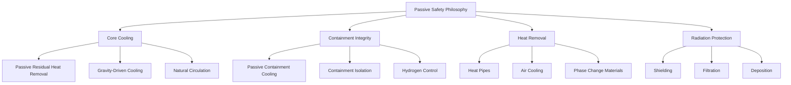
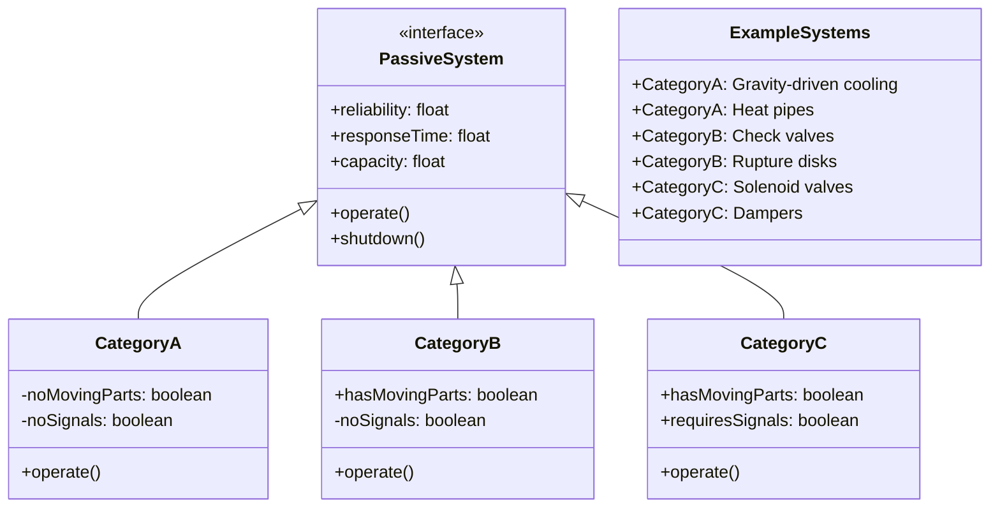
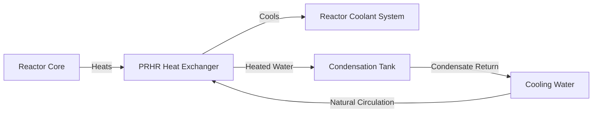
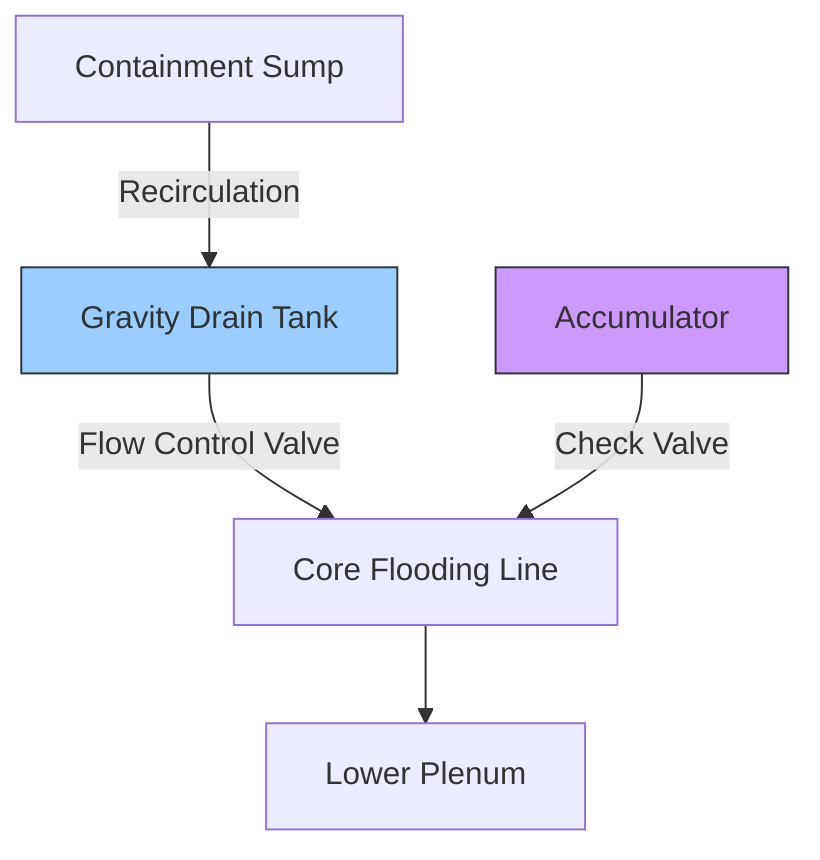
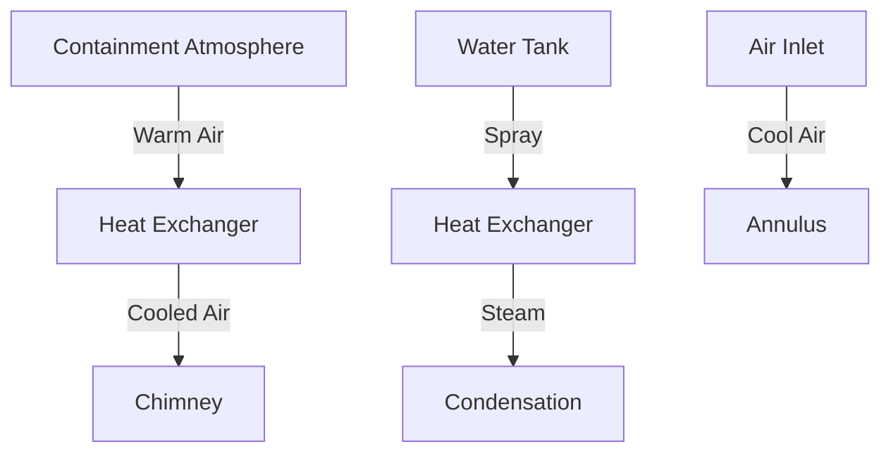
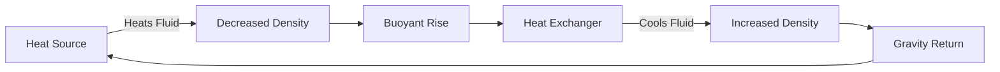
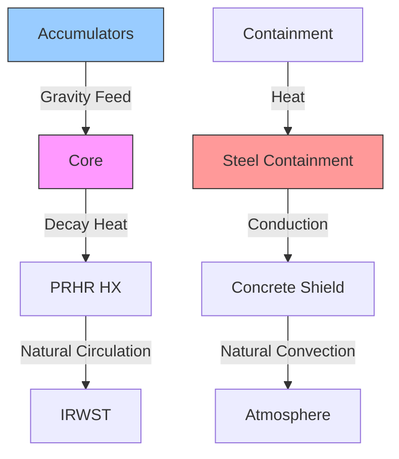

# Passive Safety Systems in Nuclear Power Plants

## Executive Summary

This document provides a comprehensive technical specification for passive safety systems implemented in modern nuclear power plants, with a focus on their integration within the Nuklei framework. These systems leverage fundamental physical principles—gravity, natural circulation, and stored energy—to ensure nuclear safety without reliance on active components or operator actions during accident scenarios.

*Figure 1: Integrated Passive Safety Systems Architecture*

## Document Purpose and Scope

This document serves as a technical reference for:
- Nuclear plant designers and engineers
- Regulatory compliance personnel
- Safety analysts
- Operations and maintenance teams
- Academic researchers

It covers design principles, system classifications, implementation examples, and performance characteristics of passive safety systems in nuclear power generation.

## 1. Fundamental Principles of Passive Safety

### 1.1 Definition and Philosophy

Passive safety systems are engineered to ensure nuclear safety through the exclusive use of:

#### 1.1.1 Natural Phenomena
- **Gravity-Driven Flows**: Utilizing elevation differences for fluid movement
- **Natural Convection**: Density-driven circulation without mechanical pumps
- **Thermal Conduction/Radiation**: Heat transfer through solid materials and space
- **Phase Change**: Utilizing latent heat of vaporization/condensation

#### 1.1.2 Stored Energy Sources
- **Potential Energy**: Elevated water inventories
- **Compressed Gas**: Nitrogen accumulators for emergency injection
- **Thermal Energy**: Phase change materials (PCMs)
- **Chemical Energy**: Exothermic reactions for hydrogen recombination

#### 1.1.3 Inherent Material Properties
- Negative temperature coefficients
- High thermal conductivity materials
- Corrosion-resistant alloys
- Radiation-tolerant components

### 1.2 Key Advantages and Benefits

#### 1.2.1 Enhanced Reliability
- No active component failures (pumps, valves, etc.)
- No reliance on external power sources
- Reduced common-cause failure potential
- Simplified maintenance requirements

#### 1.2.2 Operational Benefits
- Reduced operator actions (72+ hours grace period)
- Simplified emergency operating procedures
- Enhanced defense-in-depth
- Improved public acceptance

#### 1.2.3 Economic Advantages
- Lower operational costs
- Reduced maintenance requirements
- Extended component lifetimes
- Simplified licensing basis

### 1.3 Design Principles

#### 1.3.1 Inherent Safety
- Negative void coefficient
- Negative temperature coefficient
- Passive shutdown mechanisms
- Natural circulation cooling

#### 1.3.2 Defense in Depth
- Multiple, independent safety barriers
- Diverse and redundant systems
- Physical separation of safety trains
- Fail-safe design philosophy

#### 1.3.3 Reliability Engineering
- Single failure criterion
- Common cause failure protection
- Environmental qualification
- Seismic qualification

## 2. System Classification and Taxonomy

### 2.1 IAEA Classification System

*Figure 2: UML Class Diagram of Passive System Classification*

### 2.2 Detailed Classification

#### 2.2.1 Category A: No Signals, No Moving Parts
- **Characteristics**:
  - Purely physical/chemical processes
  - No mechanical actuation
  - No external signals required
- **Examples**:
  - Natural circulation cooling
  - Heat pipes
  - Thermal siphons
  - Gravity-driven injection

#### 2.2.2 Category B: No Signals, With Moving Parts
- **Characteristics**:
  - Mechanical components that self-actuate
  - No external signals or power
  - Typically single-use devices
- **Examples**:
  - Check valves
  - Rupture disks
  - Pressure relief valves
  - Squib valves

#### 2.2.3 Category C: With Signals and Moving Parts
- **Characteristics**:
  - Require external signals for activation
  - Include moving mechanical components
  - May require stored energy sources
- **Examples**:
  - Solenoid valves (battery-powered)
  - Dampers with spring return
  - Battery-powered control systems

### 2.3 Performance Metrics

| Category | Response Time | Reliability | Maintenance | Complexity |
|----------|---------------|-------------|-------------|------------|
| A | Medium-High | Very High | Low | Low |
| B | Fast | High | Medium | Medium |
| C | Fastest | Medium | High | High |

### 2.4 Selection Criteria

#### 2.4.1 Safety Requirements
- Safety classification
- Single failure criterion
- Environmental conditions
- Seismic requirements

#### 2.4.2 Performance Requirements
- Response time
- Capacity
- Duration of operation
- Heat removal rate

#### 2.4.3 Economic Factors
- Capital cost
- Operating cost
- Maintenance requirements
- Component lifetime

## 3. Core Passive Safety Systems

### 3.1 Core Cooling Systems

#### 3.1.1 Passive Residual Heat Removal (PRHR)

**Design Parameters:**
- **Heat Removal Capacity**: 30-100 MWth
- **Response Time**: < 30 minutes
- **Operation Duration**: 72+ hours
- **Coolant Inventory**: 2000-5000 m³

**Key Components:**
1. **Heat Exchanger**
   - Vertical U-tube design
   - Inconel-690 tubes
   - Natural circulation on both sides

2. **Condensation Tank**
   - Atmospheric pressure
   - Non-condensable gas venting
   - Makeup water supply

3. **Cooling Water System**
   - Demineralized water
   - Natural convection loops
   - Heat rejection to atmosphere

#### 3.1.2 Gravity-Driven Cooling System (GDCS)

**System Architecture:**

**Design Parameters:**
- **Water Inventory**: 2000-4000 m³
- **Injection Flow Rate**: 1000-2000 gpm
- **Actuation Pressure**: 200-300 psig
- **Duration**: 72+ hours

**Actuation Sequence:**
1. Reactor pressure drops below setpoint
2. Squib valves open automatically
3. Water flows by gravity head
4. Core cooling established within minutes

### 3.2 Containment Systems

#### 3.2.1 Passive Containment Cooling System (PCCS)

**System Overview:**

**Design Features:**
- **Natural Air Circulation**
  - Chimney height: 30-50 m
  - Air flow rate: 1000-2000 m³/min
  - Temperature difference: 30-50°C

- **Water Film Cooling**
  - Flow rate: 100-200 gpm
  - Coverage: 100% of heat exchanger surface
  - Water inventory: 24-72 hours

#### 3.2.2 Advanced Containment Heat Removal

**Heat Pipe System:**
- **Type**: Variable conductance
- **Working Fluid**: Sodium, potassium, or water
- **Heat Transport**: 5-50 kW per pipe
- **Temperature Range**: 200-800°C

**Radiative Cooling:**
- **Surface Area**: 1000-5000 m²
- **Emissivity**: >0.8
- **Heat Flux**: 1-5 kW/m²

### 3.3 Advanced Passive Safety Systems

#### 3.3.1 Core Catchers
- **Basemat Melt Retention**
  - Sacrificial material layer
  - Core spreading area
  - Long-term cooling

#### 3.3.2 Passive Autocatalytic Recombiners (PARs)
- **Capacity**: 100-1000 Nm³/h
- **Activation**: 2-4% H₂ concentration
- **Materials**: Platinum/palladium catalysts

#### 3.3.3 Passive Filtration Systems
- **Metal Fiber Filters**
  - Efficiency: >99.9% @ 0.3 μm
  - Pressure drop: <5 kPa
  - Temperature resistance: Up to 400°C

- **Sand Bed Filters**
  - Multiple layers of sand/gravel
  - Chemical additives for iodine capture
  - Water spray cooling

## 4. Advanced Design Features

### 4.1 Natural Circulation Systems

#### 4.1.1 Principles of Operation

**Key Parameters:**
- **Driving Head**: Δρgh
- **Flow Rate**: 1-5% of forced flow
- **Stability Margin**: >1.5
- **Startup Time**: 10-30 minutes

#### 4.1.2 Design Considerations
- **Loop Height**: 10-20 m
- **Flow Resistance**: Minimize losses
- **Heat Exchanger Design**: Counter-flow, U-tube
- **Fluid Properties**: High thermal expansion coefficient

### 4.2 Inherent Safety Features

#### 4.2.1 Negative Feedback Mechanisms
- **Temperature Coefficient**: -1 to -5 pcm/°C
- **Void Coefficient**: -50 to -200 pcm/%void
- **Power Coefficient**: -1 to -10 pcm/%power

#### 4.2.2 Passive Decay Heat Removal
- **Initial Phase (0-10s)**: Thermal inertia
- **Intermediate (10s-2h)**: Natural circulation
- **Long-term (>2h)**: Air/water cooling

#### 4.2.3 Core Catcher Systems
- **Materials**: ZrO₂, FeO, SiO₂
- **Cooling**: Water injection channels
- **Capacity**: 100% core melt
- **Heat Removal**: 10-20 MW/m²

### 4.3 Advanced Materials

#### 4.3.1 High-Temperature Alloys
- **Inconel 617**: 1000°C service
- **Hastelloy X**: Oxidation resistance
- **ODS Steels**: Radiation tolerance

#### 4.3.2 Ceramic Composites
- **SiC/SiC**: Cladding applications
- **ZrC Coating**: Accident tolerance
- **Graphite**: High-temperature moderation

## 5. Implementation Case Studies

### 5.1 Westinghouse AP1000®

#### 5.1.1 System Architecture

#### 5.1.2 Key Parameters
- **Core Cooling**: 72+ hours without operator action
- **Containment Cooling**: 72+ hours without AC power
- **Safety Injection**: 1000 gpm initial, 200 gpm long-term
- **Containment Pressure**: < design pressure for 24h

### 5.2 GE-Hitachi ESBWR

#### 5.2.1 Passive Safety Systems
- **Isolation Condensers (ICs)**
  - 4×100% capacity
  - Submerged in PCC pools
  - No pumps or valves in safety chain

- **Gravity-Driven Cooling System (GDCS)**
  - 3×100% trains
  - 1,000,000 gallon water inventory
  - 48+ hours of core cooling

#### 5.2.2 Performance Data
- **Decay Heat Removal**: 100% passive
- **Containment Cooling**: 7 days without makeup
- **Core Damage Frequency**: <1E-8/ry

### 5.3 VVER-1200 (AES-2006)

#### 5.3.1 Passive Heat Removal
- **Hydroaccumulators**: 4×1000 m³
- **Core Catcher**: External vessel cooling
- **Passive Heat Removal**: 72+ hours

#### 5.3.2 Safety Parameters
- **Core Damage Frequency**: 1E-7/ry
- **Large Release Frequency**: 1E-8/ry
- **Evacuation Radius**: 800m

## 6. Performance Analysis

### 6.1 Reliability Assessment

#### 6.1.1 Failure Modes and Effects Analysis (FMEA)

| Component | Failure Mode | Effect | Mitigation |
|-----------|--------------|--------|------------|
| Heat Exchanger | Tube Rupture | Bypass flow | Double-wall design |
| Check Valve | Stuck Closed | Flow blockage | Redundant trains |
| Water Tank | Leakage | Inventory loss | Liner with leak detection |
| Air Path | Blockage | Reduced cooling | Multiple air inlets |

#### 6.1.2 Reliability Metrics
- **PRHR System**: >0.9999
- **GDCS System**: >0.99999
- **PCCS System**: >0.9999
- **Overall CDF**: <1E-7/ry

### 6.2 Thermal-Hydraulic Performance

#### 6.2.1 Natural Circulation
- **Flow Stability**: >1.5 DNB ratio
- **Heat Removal**: 5-10% of rated power
- **Response Time**: 10-30 minutes

#### 6.2.2 Containment Response
- **Pressure Peak**: <0.5 MPa
- **Temperature Peak**: <150°C
- **H₂ Concentration**: <10% (vol)

## 7. Regulatory and Licensing

### 7.1 Regulatory Framework
- **IAEA Safety Standards**: SSR-2/1, SSG-30
- **10 CFR 50**: Appendix A, GDC
- **EUR Document**: Chapter 5
- **SFR Requirements**: Chapter 15

### 7.2 Licensing Basis
- **Design Certification**: COL, DC
- **Technical Specifications**: LCOs, SRs
- **Accident Analysis**: Chapter 15
- **Probabilistic Analysis**: Chapter 19

## 8. Future Developments

### 8.1 Advanced Reactor Designs
- **Sodium Fast Reactors (SFR)**
- **High-Temperature Gas Reactors (HTGR)**
- **Molten Salt Reactors (MSR)**
- **Lead-Cooled Fast Reactors (LFR)**

### 8.2 Research Areas
- **Advanced Materials**: SiC composites, ODS steels
- **Enhanced Heat Transfer**: Nanofluids, microchannels
- **Digital Twins**: Real-time monitoring
- **AI/ML**: Predictive maintenance

## 9. References

### 9.1 Standards and Guidelines
- ASME BPVC Section III, Div. 1 & 5
- IEEE 603-2018 (I&C)
- RG 1.183, 1.200
- NUREG-0800, Ch. 6, 15

### 9.2 Technical References
- W. M. Stacey, Nuclear Reactor Physics
- M. M. El-Wakil, Nuclear Heat Transport
- IAEA-TECDOC-1624 (Passive Safety Systems)
- NUREG-1860 (AP1000 DCD)

## 10. Appendices

### 10.1 Nomenclature
- **PRHR**: Passive Residual Heat Removal
- **GDCS**: Gravity-Driven Cooling System
- **PCCS**: Passive Containment Cooling System
- **IRWST**: In-Containment Refueling Water Storage Tank
- **ADS**: Automatic Depressurization System
- **CDF**: Core Damage Frequency
- **DNB**: Departure from Nucleate Boiling

### 10.2 Conversion Factors
- 1 MWth = 3.412 MMBtu/h
- 1 MPa = 145.04 psi
- 1 m³ = 264.17 gallons
- 1°C = 1.8°F - 32

### 10.3 Acronyms
- **ALARA**: As Low As Reasonably Achievable
- **BWR**: Boiling Water Reactor
- **PWR**: Pressurized Water Reactor
- **ESBWR**: Economic Simplified Boiling Water Reactor
- **VVER**: Water-Water Energetic Reactor
- **SMR**: Small Modular Reactor

---

*Document Revision: 2.0  
Last Updated: June 13, 2025  
Prepared by: Nuklei Safety Engineering Team  
Approved by: [TBD]  
Confidentiality: Uncontrolled When Printed*

### 6.1 Reliability Analysis
- Failure Modes and Effects Analysis (FMEA)
- Common Cause Failure (CCF) assessment
- Reliability Block Diagrams (RBD)

### 6.2 Testing and Validation
- Separate Effects Tests
- Integral System Tests
- Full-Scale Testing
- Code Validation

## 7. Regulatory Considerations

### 7.1 Design Certification
- 10 CFR Part 52
- Design Control Document (DCD)
- Technical Specifications

### 7.2 Licensing Basis
- Safety Analysis Report (SAR)
- Probabilistic Risk Assessment (PRA)
- Technical Support Document (TSD)

## 8. Case Studies

### 8.1 AP1000 Certification
- NRC Design Certification
- European Utility Requirements (EUR)
- Chinese Design Certification

### 8.2 ESBWR Design Certification
- NRC Design Certification
- UK Generic Design Assessment (GDA)

## 9. Future Developments
- Advanced passive components
- Enhanced materials
- Improved heat transfer mechanisms
- Digital I&C integration

## 10. References
1. IAEA-TECDOC-1624: Passive Safety Systems and Natural Circulation in Water Cooled Nuclear Power Plants
2. NUREG-1793: Final Safety Evaluation Report on the AP1000
3. EPRI 1011719: Passive Nuclear Power Plant Safety Systems
4. ASME/ANS RA-S-1.4: Probabilistic Risk Assessment Standard for Advanced Non-Light Water Reactor Nuclear Power Plants
