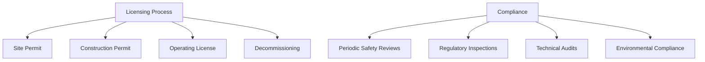
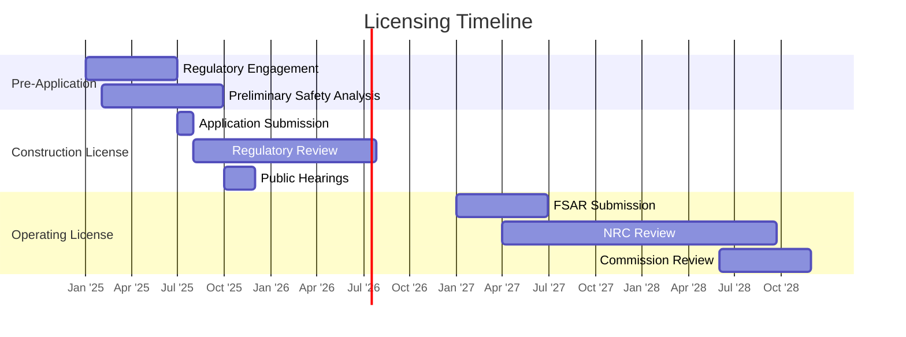

# Licensing Milestones & Compliance Audits

This section provides a comprehensive guide to the nuclear facility licensing process and compliance verification through audits, ensuring adherence to regulatory requirements throughout the facility's lifecycle.

## Overview



*Figure 1: Licensing and Compliance Framework*

## Key Components

1. **Regulatory Framework**
   - [National Regulations](regulatory-framework/national-regulations.md)
   - [International Standards](regulatory-framework/international-standards.md)
   - [Regulatory Body Interface](regulatory-framework/regulatory-interface.md)

2. **Licensing Process**
   - [Pre-Application Phase](licensing-process/pre-application.md)
   - [Construction License](licensing-process/construction-license.md)
   - [Operating License](licensing-process/operating-license.md)
   - [License Renewal](licensing-process/license-renewal.md)

3. **Compliance Audits**
   - [Audit Planning](compliance-audits/audit-planning.md)
   - [Inspection Protocols](compliance-audits/inspection-protocols.md)
   - [Findings and Corrective Actions](compliance-audits/corrective-actions.md)
   - [Audit Reporting](compliance-audits/audit-reporting.md)

4. **Templates and Tools**
   - [License Application Templates](templates/application-templates.md)
   - [Inspection Checklists](templates/inspection-checklists.md)
   - [Compliance Tracking](templates/compliance-tracking.md)
   - [Document Management](templates/document-management.md)

## Regulatory Timeline



*Figure 2: Typical Licensing Timeline (Example)*

## Compliance Verification

### Key Audit Areas
1. **Safety Systems**
   - Design basis verification
   - Maintenance and testing
   - Performance monitoring

2. **Radiation Protection**
   - ALARA program
   - Dose monitoring
   - Radioactive waste management

3. **Operational Safety**
   - Procedures and instructions
   - Operator qualifications
   - Emergency preparedness

4. **Organizational Effectiveness**
   - Safety culture
   - Management systems
   - Continuous improvement

## Case Studies
- [AP1000 Design Certification](case-studies/ap1000-certification.md)
- [EPR Flamanville 3 Licensing](case-studies/flamanville-licensing.md)
- [Vogtle 3 & 4 COL Process](case-studies/vogtle-col.md)

## Documentation Structure
```
licensing-milestones-compliance-audits/
├── README.md                     # This file
├── regulatory-framework/         # Regulatory requirements
├── licensing-process/            # Step-by-step licensing
├── compliance-audits/            # Audit procedures
├── templates/                    # Standard templates
├── case-studies/                 # Real-world examples
└── diagrams/                     # Visual assets
```

## Next Steps
1. Review [Regulatory Framework](regulatory-framework/README.md)
2. Understand [Licensing Process](licensing-process/README.md)
3. Prepare for [Compliance Audits](compliance-audits/README.md)

## Contact
For regulatory inquiries, contact: regulatory-affairs@nuklei.org
