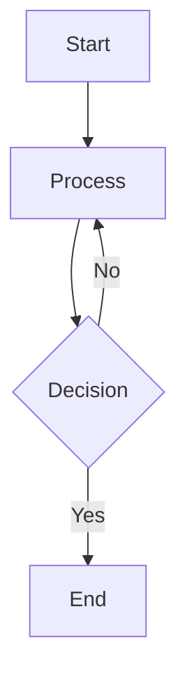

# Licensing Process Diagrams

This directory contains visual representations of the nuclear facility licensing process, including flowcharts, timelines, and other diagrams that help illustrate complex regulatory processes and requirements.

## Diagram Categories

### 1. Process Flows
- **Licensing Process Overview**: High-level view of the entire licensing journey
- **Application Review Process**: Steps in reviewing license applications
- **Inspection Workflows**: Regulatory inspection procedures
- **Audit Processes**: Compliance audit methodologies

### 2. Timelines
- **Project Milestones**: Key dates in facility lifecycle
- **Regulatory Review Timelines**: Typical durations for each review phase
- **License Renewal Schedule**: Phases of the renewal process

### 3. Organizational Charts
- **Regulatory Body Structure**: Organization of nuclear regulatory authorities
- **Licensee Organization**: Typical licensee organizational structure
- **Interface Management**: Relationships between different stakeholders

### 4. Compliance Matrices
- **Regulatory Requirements**: Mapping of requirements to evidence
- **Documentation Traceability**: Traceability of requirements through documents
- **Gap Analysis**: Identification of compliance gaps

## File Naming Convention

Use the following naming convention for diagram files:

```
[category]-[description]-[version].[extension]
```

Example: `process-licensing-overview-v1.png`

## File Formats

| Format | Best For | Notes |
|--------|----------|-------|
| PNG    | Flowcharts, diagrams | Lossless compression, good for diagrams with text |
| SVG    | Vector graphics | Scalable, preferred for diagrams with text |
| PDF    | Multi-page documents | Good for reports and presentations |
| MMD    | Mermaid source files | Text-based diagram source |

## Creating New Diagrams

### Using Mermaid

1. Create a new `.mmd` file
2. Add Mermaid syntax for your diagram
3. Generate PNG/SVG using Mermaid CLI or online editor
4. Commit both source and rendered files

Example Mermaid file:


### Using Drawing Tools

1. Use tools like draw.io, Visio, or Lucidchart
2. Export in both source (e.g., .drawio) and rendered (PNG/SVG) formats
3. Follow the naming convention
4. Include a title, legend, and version number in the diagram

## Version Control

- Increment version number for significant changes
- Keep previous versions for reference
- Document changes in the diagram's description

## Accessibility

- Use high contrast colors
- Include alt text for all images
- Ensure text is readable when zoomed
- Provide text descriptions for complex diagrams

## Templates

Find diagram templates in the [templates](../templates/) directory.

## Contributing

1. Create a new branch for your changes
2. Add new diagrams to the appropriate category
3. Update this README if adding new categories
4. Submit a pull request for review
