# Nuclear Facility Licensing Process

This document provides a comprehensive guide to the nuclear facility licensing process, from initial site selection through decommissioning, following a phased approach to ensure safety and regulatory compliance at each stage.

## 1. Overview of the Licensing Process

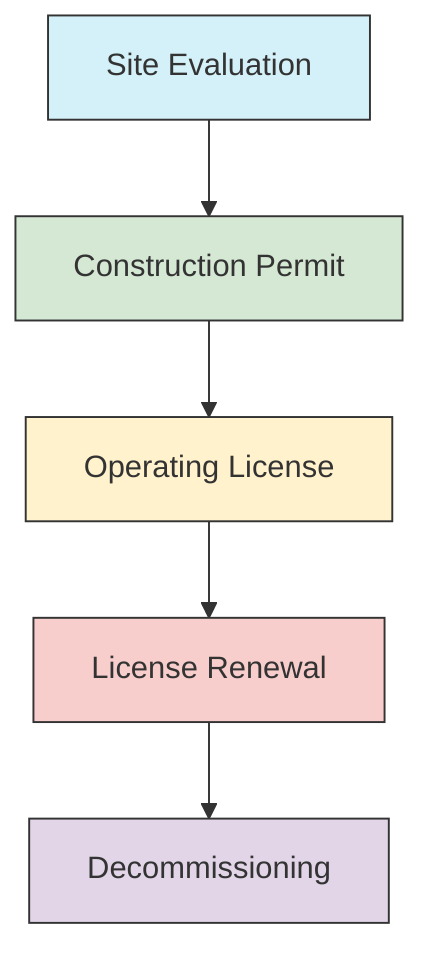

*Figure 1: Phased Licensing Approach*

## 2. Pre-Application Phase (3-5 years)

### 2.1 Early Site Permit (ESP)

The Early Site Permit (ESP) process allows for early resolution of site-related issues before major investments are made. This phase typically takes 3-5 years and involves extensive technical and environmental reviews.

#### 2.1.1 Purpose and Benefits
- **Risk Reduction**: Identifies potential showstoppers early
- **Financial Certainty**: Reduces regulatory uncertainty for investors
- **Schedule Efficiency**: Allows parallel processing of site and design reviews
- **Public Engagement**: Early involvement of stakeholders and host communities

#### 2.1.2 Key Activities

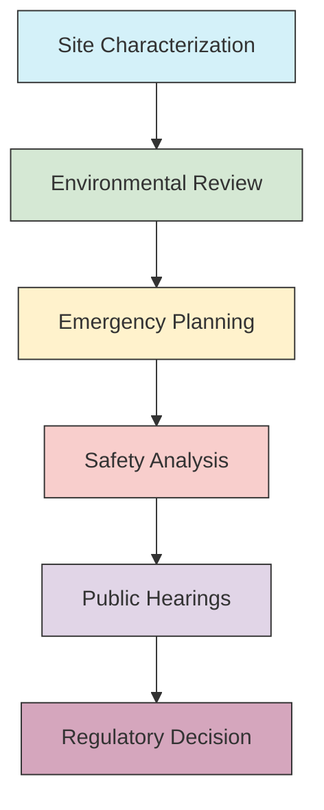

*Figure 2: ESP Process Flow*

1. **Site Characterization**
   - Seismic hazard analysis
   - Meteorological data collection
   - Hydrological studies
   - Ecological surveys
   - Demographic analysis

2. **Environmental Review**
   - Environmental Impact Statement (EIS)
   - National Environmental Policy Act (NEPA) compliance
   - Protected species assessment
   - Cultural resource surveys

3. **Emergency Planning**
   - Emergency Planning Zone (EPZ) definition
   - Evacuation route analysis
   - Emergency response capabilities assessment
   - Off-site emergency planning coordination

4. **Safety Analysis**
   - Site-specific hazards evaluation
   - Aircraft impact assessment
   - External events analysis (floods, earthquakes, etc.)
   - Security considerations

#### 2.1.3 Regulatory Submissions

| Document | Purpose | Review Timeline |
|----------|---------|-----------------|
| ESP Application | Formal request for site approval | 30-45 days for acceptance review |
| Preliminary Safety Analysis Report (PSAR) Chapter 2 | Site safety analysis | 12-18 months |
| Environmental Report | Environmental impact assessment | 24-36 months |
| Emergency Planning Information | Emergency preparedness demonstration | 6-12 months |
| Security Plan | Site security measures | 6-12 months |

#### 2.1.4 Practical Considerations
- **Stakeholder Engagement**: Early and often engagement with local communities
- **Regulatory Interface**: Pre-application meetings with regulatory body
- **Technical Support**: Use of independent experts for complex analyses
- **Schedule Buffer**: Include 20-30% time buffer for regulatory requests

#### 2.1.5 Common Challenges
- **Data Gaps**: Incomplete site characterization data
- **Regulatory Changes**: Evolving regulatory requirements
- **Public Opposition**: Local community concerns
- **Technical Issues**: Unforeseen site constraints

#### 2.1.6 Success Metrics
- Regulatory acceptance of site safety parameters
- Resolution of all safety questions
- Completion of environmental review
- Public hearing completion

#### 2.1.7 Case Study: Vogtle ESP Process
- **Timeline**: 2006-2009 (38 months)
- **Key Success Factors**:
  - Comprehensive site characterization
  - Early public engagement
  - Proactive regulatory interface
- **Lessons Learned**:
  - Importance of early environmental baseline data
  - Value of pre-application meetings
  - Need for flexible project planning

### 2.2 Design Certification

Design Certification is a process that allows for the pre-approval of standard nuclear power plant designs, separate from any specific site. This section outlines the comprehensive process and requirements for obtaining design certification.

#### 2.2.1 Purpose and Benefits
- **Standardization**: Enables consistent, repeatable designs
- **Risk Reduction**: Addresses design issues before construction
- **Schedule Efficiency**: Allows parallel processing of design and site reviews
- **Cost Certainty**: Reduces regulatory uncertainty for standardized designs

#### 2.2.2 Certification Process

```mermaid
flowchart LR
    A[Designer Submits Application] --> B[NRC Acceptance Review]
    B --> C[Technical Review]
    C --> D[Advisory Committee Review]
    D --> E[Public Comment Period]
    E --> F[Final Safety Evaluation]
    F --> G[Commission Approval]
    G --> H[Rulemaking]
    
    style A fill:#d4f1f9,stroke:#333
    style B fill:#d5e8d4,stroke:#333
    style C fill:#fff2cc,stroke:#333
    style D fill:#f8cecc,stroke:#333
    style E fill:#e1d5e7,stroke:#333
    style F fill:#d5a6bd,stroke:#333
    style G fill:#d9d2e9,stroke:#333
    style H fill:#d9ead3,stroke:#333
```

*Figure 3: Design Certification Process Flow*

#### 2.2.3 Key Components of Design Certification

1. **Design Control Document (DCD)**
   - Complete design description
   - Safety analysis reports
   - Technical specifications
   - Inspections, tests, analyses, and acceptance criteria (ITAAC)

2. **Safety Evaluation Report (SER)**
   - NRC's safety findings
   - Technical review results
   - Required design changes
   - License conditions

3. **Environmental Review**
   - Generic Environmental Impact Statement (GEIS)
   - Site parameters envelope
   - Mitigation measures

#### 2.2.4 Regulatory Framework

| Regulation | Description | Applicability |
|------------|-------------|---------------|
| 10 CFR Part 52 | Licenses, Certifications, and Approvals | Overall process |
| 10 CFR Part 50 | Domestic Licensing of Production and Utilization Facilities | Safety requirements |
| 10 CFR Part 100 | Reactor Site Criteria | Site parameters |
| 10 CFR Part 20 | Standards for Protection Against Radiation | Radiation protection |
| 10 CFR Part 50, App. A | General Design Criteria | Design requirements |

#### 2.2.5 Timeline and Milestones

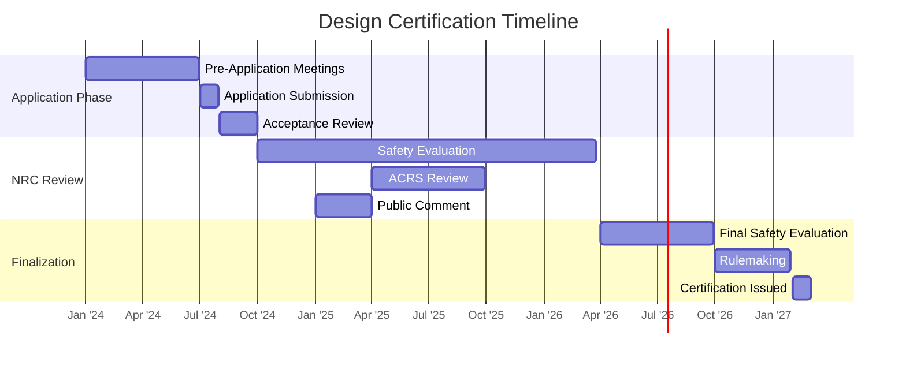

*Figure 4: Typical Design Certification Timeline (30-36 months)*

#### 2.2.6 Key Considerations

1. **Design Maturity**
   - Complete, integrated design
   - Resolved technical issues
   - Validated computer codes
   - Completed testing programs

2. **Regulatory Engagement**
   - Pre-application meetings
   - Technical exchange meetings
   - Issue resolution tracking
   - Public involvement

3. **Technical Documentation**
   - Design Basis Documents
   - Safety Analysis Reports
   - Probabilistic Risk Assessment
   - Cyber Security Plan

#### 2.2.7 Case Study: AP1000 Design Certification

- **Designer**: Westinghouse Electric Company
- **Certification Timeline**: 2002-2006 (First Certification)
- **Key Features**:
  - Passive safety systems
  - Modular construction
  - 60-year design life
- **Lessons Learned**:
  - Importance of design maturity before certification
  - Need for early resolution of technical issues
  - Value of international regulatory cooperation

#### 2.2.8 Maintaining Certification
- **Duration**: 15 years (initial certification)
- **Renewal**: Requires NRC review and approval
- **Design Changes**: Must be evaluated against certified design
- **Operating Experience**: Must be incorporated into design updates

#### 2.2.9 International Design Certification
- **EUR (European Utility Requirements)**: European certification
- **GDA (Generic Design Assessment)**: UK process
- **CNSC Vendor Design Review**: Canadian process
- **Common Safety Approach**: International harmonization efforts

#### 2.2.10 Best Practices
- Early and frequent regulatory engagement
- Comprehensive design control program
- Robust configuration management
- Proactive issue resolution
- Transparent documentation
- Stakeholder involvement

## 3. Construction Permit (3-5 years)

The Construction Permit (CP) authorizes the licensee to begin construction of a nuclear power plant. This section details the comprehensive process for obtaining a construction permit, including application requirements, regulatory review, and key considerations.

### 3.1 Overview of Construction Permitting

#### 3.1.1 Purpose and Scope
- **Authorization**: Permits site preparation and construction activities
- **Validity**: Typically 10-15 years
- **Limitations**: Does not authorize fuel loading or operation
- **Concurrent Processes**: Often runs in parallel with design certification

#### 3.1.2 Regulatory Framework

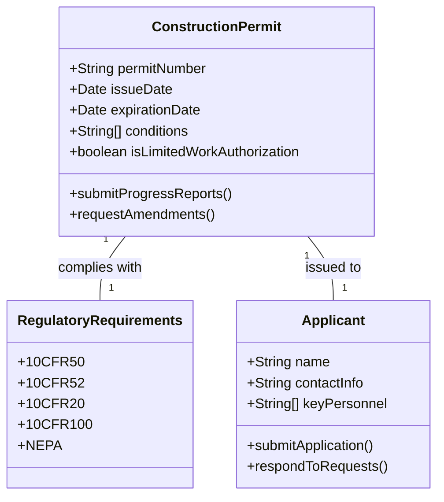

*Figure 5: Construction Permit Entities and Relationships*

### 3.2 Application Requirements

#### 3.2.1 Core Documentation

| Document | Purpose | Review Timeline |
|----------|---------|-----------------|
| Final Safety Analysis Report (FSAR) | Comprehensive safety analysis | 18-24 months |
| Environmental Impact Statement (EIS) | Environmental impact assessment | 24-36 months |
| Emergency Planning Information | Emergency preparedness demonstration | 6-12 months |
| Financial Qualifications | Proof of financial capability | 3-6 months |
| Antitrust Review | Market competition assessment | 6-12 months |
| Security Plan | Physical and cyber security measures | 6-12 months |

#### 3.2.2 FSAR Key Components
1. **Site Characteristics**
   - Seismic analysis
   - Meteorological data
   - Hydrological conditions
   - Population distribution

2. **Design Information**
   - Reactor design description
   - Safety systems
   - Containment design
   - Radiation protection

3. **Safety Analysis**
   - Design basis accidents
   - Probabilistic Risk Assessment (PRA)
   - Severe accident analysis
   - Fire protection

### 3.3 Regulatory Review Process

#### 3.3.1 Review Phases

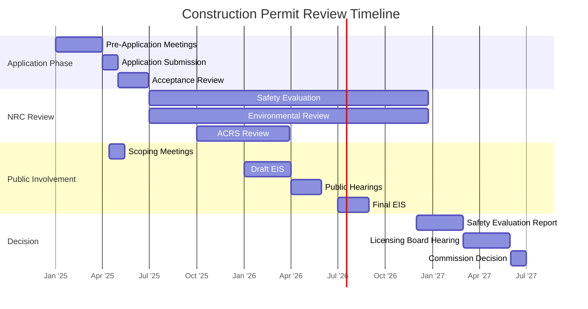

*Figure 6: Detailed Construction Permit Review Timeline*

#### 3.3.2 Key Review Activities
1. **Safety Evaluation**
   - Technical review of FSAR
   - Verification of compliance with regulations
   - Identification of technical issues
   - Development of license conditions

2. **Environmental Review**
   - Preparation of EIS
   - Public scoping process
   - Impact assessment
   - Mitigation measures

3. **Advisory Committee Review**
   - ACRS review of safety issues
   - Public meetings
   - Recommendations to NRC

### 3.4 Public Involvement and Hearings

#### 3.4.1 Public Participation Opportunities
- **Scoping Meetings**: Early public input on EIS scope
- **Draft EIS Review**: Public comment period (minimum 45 days)
- **Public Meetings**: Technical and environmental discussions
- **Contentions**: Formal challenges to the application
- **Hearings**: Mandatory public hearings

#### 3.4.2 Hearing Process
1. **Petition to Intervene**
   - Filing requirements
   - Standing requirements
   - Contentions process

2. **Pre-Hearing Conferences**
   - Schedule development
   - Issue identification
   - Settlement discussions

3. **Evidentiary Hearings**
   - Direct testimony
   - Cross-examination
   - Rebuttal

### 3.5 Construction Permit Conditions

#### 3.5.1 Standard Conditions
- Inspection and enforcement authority
- Reporting requirements
- Quality assurance program
- Environmental monitoring
- Safeguards information protection

#### 3.5.2 Technical Specifications
- Safety limits
- Operating limits
- Surveillance requirements
- Design features
- Administrative controls

### 3.6 Case Study: Vogtle Units 3&4

- **Applicant**: Southern Nuclear Operating Company
- **Reactor Type**: AP1000 (2 units)
- **Timeline**:
  - Application submitted: March 2008
  - Construction Permit issued: February 2009
  - First concrete: March 2013 (Unit 3), November 2013 (Unit 4)

**Key Success Factors**:
- Strong regulatory engagement
- Comprehensive application
- Proactive issue resolution
- Effective public involvement

**Lessons Learned**:
- Importance of design maturity before construction
- Need for robust project management
- Value of early regulatory interface
- Benefits of standardized design

### 3.7 Construction Monitoring and Oversight

#### 3.7.1 NRC Inspection Program
- Resident Inspectors
- Specialized inspection teams
- Construction inspection program
- Problem identification and resolution

#### 3.7.2 Licensee Responsibilities
- Quality assurance program
- Construction records
- Non-conformance reporting
- Corrective action program

### 3.8 Common Challenges and Mitigation

| Challenge | Potential Impact | Mitigation Strategy |
|-----------|------------------|---------------------|
| Design Changes | Schedule delays, cost overruns | Robust configuration management |
| Regulatory Changes | Compliance issues | Early and frequent NRC engagement |
| Quality Issues | Rework, delays | Comprehensive QA/QC program |
| Supply Chain Disruptions | Schedule delays | Risk-informed procurement strategy |
| Workforce Shortages | Schedule delays, quality issues | Early workforce planning and training |

### 3.9 Transition to Operating License

#### 3.9.1 Combined License (COL) Approach
- Single license for construction and operation
- ITAAC verification process
- Operational conditions
- Transition to technical specifications

#### 3.9.2 Traditional Two-Step Process
- Separate construction permit and operating license
- Operating license application after construction
- Additional safety review
- Operating license hearings

### 3.10 Best Practices

1. **Regulatory Engagement**
   - Early and frequent NRC interaction
   - Pre-application meetings
   - Issue resolution tracking

2. **Project Management**
   - Integrated schedule
   - Risk management program
   - Change control process

3. **Quality Assurance**
   - Comprehensive QA program
   - Supplier oversight
   - Non-conformance management

4. **Stakeholder Engagement**
   - Public involvement plan
   - Community outreach
   - Transparent communication

5. **Documentation**
   - Complete and accurate records
   - Configuration management
   - Regulatory correspondence log

## 4. Combined License (COL) Process

The Combined License (COL) is an integrated approach that authorizes both construction and conditional operation of a nuclear power plant. This section details the COL process, requirements, and implementation.

### 4.1 COL Overview

#### 4.1.1 Purpose and Benefits
- **Single License**: Combines construction and operating authorization
- **Regulatory Certainty**: Resolves safety and environmental issues early
- **Efficiency**: Reduces regulatory uncertainty for investors
- **Flexibility**: Allows for standardized or custom designs

#### 4.1.2 Regulatory Framework

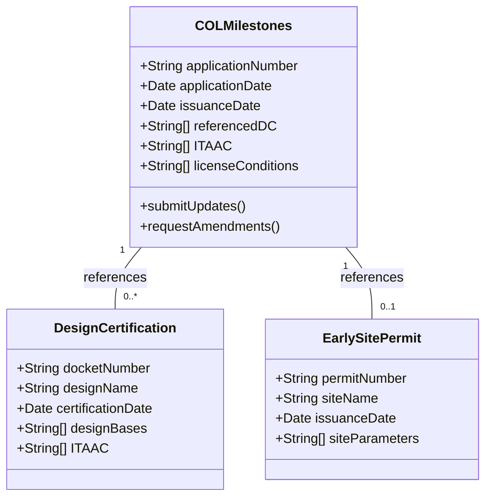

*Figure 7: COL Relationships with Other Authorizations*

### 4.2 COL Application Contents

#### 4.2.1 Core Application Documents

| Document | Purpose | Review Timeline |
|----------|---------|-----------------|
| Updated FSAR | Comprehensive safety analysis | 18-24 months |
| ITAAC | Verification of construction completion | Throughout construction |
| Emergency Planning Information | Emergency preparedness demonstration | 12-18 months |
| Environmental Report | Environmental impact assessment | 24-36 months |
| PRA | Probabilistic Risk Assessment | 12-18 months |
| Cyber Security Plan | Protection of digital systems | 6-12 months |
| Decommissioning Plan | End-of-life planning | 6-12 months |

#### 4.2.2 Key Components of FSAR Update
1. **Design-Specific Information**
   - Final design certification
   - Site-specific parameters
   - Updated safety analyses
   - Technical specifications

2. **Operational Programs**
   - Operator training and qualifications
   - Technical specifications
   - Emergency procedures
   - Security plans

### 4.3 ITAAC Process

#### 4.3.1 Purpose and Structure
- **Verification**: Ensures construction matches certified design
- **Three-Part Structure**:
  1. **Inspection**: Visual verification
  2. **Test**: Performance verification
  3. **Analysis**: Engineering evaluation

#### 4.3.2 ITAAC Implementation Timeline

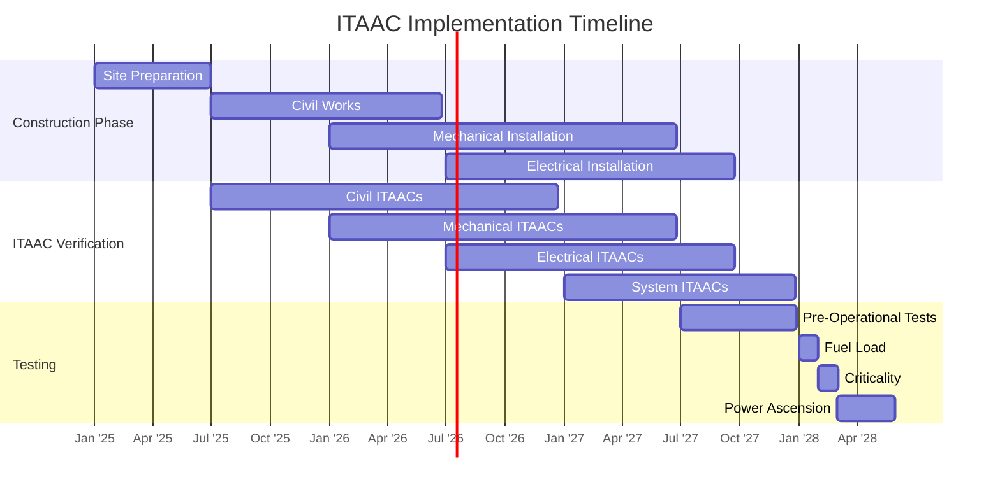

*Figure 8: ITAAC Implementation Schedule*

#### 4.3.3 ITAAC Closure Process
1. **Preparation**
   - Develop verification procedures
   - Train verification personnel
   - Prepare documentation templates

2. **Execution**
   - Perform inspections and tests
   - Document results
   - Prepare closure packages

3. **Verification**
   - Independent verification
   - Quality assurance review
   - Regulatory submittal

4. **NRC Verification**
   - Review of closure packages
   - Inspections (as needed)
   - Closure determination

### 4.4 Regulatory Review Process

#### 4.4.1 Review Phases
1. **Acceptance Review** (60-90 days)
   - Completeness check
   - Docketing
   - Federal Register notice

2. **Safety Review** (18-24 months)
   - Technical evaluation
   - Safety issues resolution
   - SER preparation

3. **Environmental Review** (24-36 months)
   - EIS preparation
   - Public comment
   - Final EIS

4. **Advisory Committee Review**
   - ACRS review
   - Public meetings
   - Recommendations

#### 4.4.2 Hearing Process
- **Mandatory Hearing**: On uncontested issues
- **Contested Hearing**: If contentions are admitted
- **Limited Work Authorizations**: May be requested during review

### 4.5 COL Conditions and Limitations

#### 4.5.1 Standard Conditions
- ITAAC verification
- Inspections, tests, and analyses
- Operational conditions
- Technical specifications

#### 4.5.2 Key License Conditions
- **Fuel Load Approval**: Required before fuel loading
- **100-Hour Test**: Initial operation at reduced power
- **Full Power Operation**: After successful testing
- **First Refueling Outage**: Special requirements

### 4.6 Case Study: Vogtle Units 3&4 COL

- **Applicant**: Southern Nuclear Operating Company
- **Reactor Type**: AP1000 (2 units)
- **Timeline**:
  - Application submitted: March 2008
  - COL issued: February 2012
  - Fuel load: Unit 3 - April 2021, Unit 4 - October 2022
  - Commercial operation: Unit 3 - July 2023, Unit 4 - April 2024

**Key Success Factors**:
- Early resolution of design issues
- Proactive regulatory engagement
- Effective ITAAC management
- Robust construction monitoring

**Lessons Learned**:
- Importance of design maturity
- Need for early regulatory interface
- Value of standardized processes
- Benefits of integrated project teams

### 4.7 Transition to Operation

#### 4.7.1 ITAAC Closure Verification
- 100% verification required
- NRC verification of selected ITAACs
- Final safety evaluation report addendum

#### 4.7.2 Operational Readiness Review (ORR)
- Pre-startup review
- Emergency preparedness verification
- Staff qualifications
- Procedures validation

### 4.8 Best Practices for COL Implementation

#### 4.8.1 Project Management
- Integrated schedule
- Risk management program
- Change control process
- Interface management

#### 4.8.2 Quality Assurance
- Comprehensive QA program
- Supplier oversight
- Non-conformance management
- Corrective action program

#### 4.8.3 Documentation
- Complete and accurate records
- Configuration management
- Regulatory correspondence
- Lessons learned

#### 4.8.4 Stakeholder Engagement
- Public involvement plan
- Community outreach
- Transparent communication
- Issue resolution

## 5. Operating License (1-2 years before fuel load)

The Operating License (OL) authorizes the licensee to operate a nuclear power plant and to receive, possess, and use nuclear material. This section details the OL application process, requirements, and regulatory framework.

### 5.1 Overview of Operating License

#### 5.1.1 Purpose and Scope
- **Authorization**: Permits plant operation within specified limits
- **Validity**: Typically 40 years (initial term)
- **Conditions**: Includes technical specifications and operating requirements
- **Ongoing Requirements**: Regular inspections and reporting

#### 5.1.2 Regulatory Framework

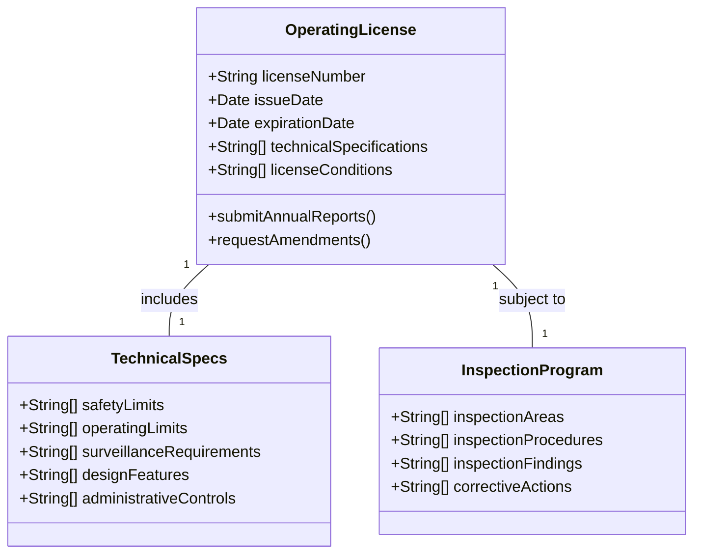

*Figure 9: Operating License Components and Relationships*

### 5.2 Operating License Application

#### 5.2.1 Core Application Documents

| Document | Purpose | Review Timeline |
|----------|---------|-----------------|
| Updated FSAR | Current safety analysis | 12-18 months |
| PRA Update | Current risk assessment | 6-12 months |
| Emergency Plan | Emergency preparedness | 6-12 months |
| Operator Training | Staff qualifications | 3-6 months |
| Technical Specifications | Operating limits and conditions | 6-12 months |
| Cyber Security Plan | Digital system protection | 6-12 months |
| Environmental Report | Current environmental impact | 12-18 months |

#### 5.2.2 Key Components of FSAR Update
1. **Plant Description**
   - Current plant configuration
   - System descriptions
   - Design bases
   - Safety analyses

2. **Operational Programs**
   - Maintenance program
   - Surveillance testing
   - Inservice inspection
   - Operator training and requalification

3. **Safety Analysis**
   - Accident analyses
   - PRA results
   - Severe accident management
   - Security analyses

### 5.3 Regulatory Review Process

#### 5.3.1 Review Phases

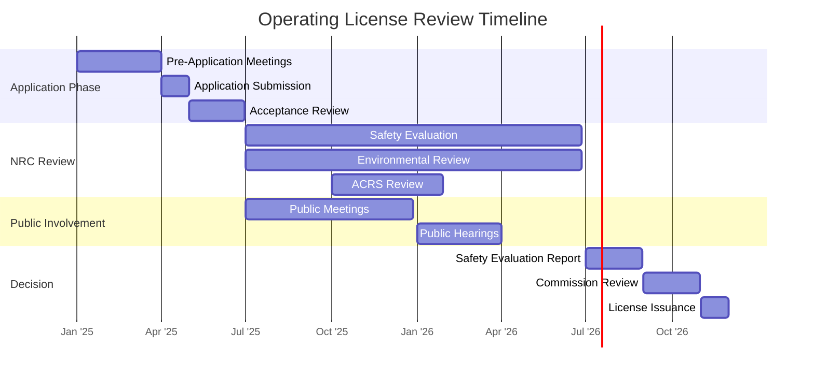

*Figure 10: Operating License Review Timeline*

#### 5.3.2 Key Review Activities
1. **Safety Evaluation**
   - Technical review of FSAR
   - Verification of compliance
   - Identification of technical issues
   - Development of license conditions

2. **Environmental Review**
   - Environmental impact assessment
   - Public comment period
   - Mitigation measures

3. **Advisory Committee Review**
   - ACRS review of safety issues
   - Public meetings
   - Recommendations to NRC

### 5.4 Operating License Conditions

#### 5.4.1 Standard Conditions
- Technical specifications
- Inspection and enforcement
- Reporting requirements
- Emergency planning
- Security requirements

#### 5.4.2 Technical Specifications
- **Safety Limits**
  - Reactor core limits
  - RCS pressure and temperature
  - Containment parameters

- **Operational Limits**
  - Power level limits
  - Equipment operability
  - Surveillance requirements

- **Surveillance Requirements**
  - Testing frequencies
  - Acceptance criteria
  - Completion times

### 5.5 Initial Test Program

#### 5.5.1 Pre-Operational Testing
- Component testing
- System testing
- Integrated system testing

#### 5.5.2 Startup Testing
- Fuel load
- Initial criticality
- Power ascension testing
- Power operation testing

### 5.6 Case Study: Vogtle Unit 3 Initial Operation

- **Licensee**: Southern Nuclear Operating Company
- **Reactor Type**: AP1000
- **Timeline**:
  - Fuel load: April 2021
  - Initial criticality: March 2023
  - Synchronization to grid: April 2023
  - Full power operation: July 2023

**Key Success Factors**:
- Comprehensive pre-operational testing
- Effective operator training
- Proactive issue resolution
- Strong regulatory interface

**Lessons Learned**:
- Importance of integrated testing
- Need for contingency planning
- Value of experienced operations staff
- Benefits of digital control systems

### 5.7 Operational Oversight

#### 5.7.1 NRC Inspection Program
- Resident inspectors
- Specialist inspectors
- Baseline inspections
- Problem identification and resolution

#### 5.7.2 Performance Indicators
- Safety system performance
- Unplanned scrams
- Safety system failures
- Radiation exposure
- Security performance

### 5.8 License Amendments

#### 5.8.1 Types of Amendments
- Administrative changes
- Technical specification changes
- License condition changes
- Physical changes requiring NRC approval

#### 5.8.2 Amendment Process
1. **Application**
   - Submit license amendment request
   - Safety analysis
   - Environmental review

2. **Review**
   - NRC technical review
   - Public comment (if required)
   - Safety evaluation

3. **Approval**
   - NRC approval
   - License amendment
   - Implementation

### 5.9 Best Practices for License Management

#### 5.9.1 Configuration Management
- Document control
- Design change control
- Design basis maintenance
- Operating experience review

#### 5.9.2 Regulatory Compliance
- Compliance monitoring
- Inspection preparation
- Finding resolution
- Performance monitoring

#### 5.9.3 Records Management
- Record retention
- Document control
- Information retrieval
- Archiving

#### 5.9.4 Staff Training
- Initial training
- Requalification training
- Continuing training
- Emergency preparedness training

## 6. License Renewal (20 years after initial license)

License renewal allows nuclear power plants to operate beyond their initial 40-year license term. This section details the license renewal process, requirements, and considerations for extending plant operation up to 80 years.

### 6.1 Overview of License Renewal

#### 6.1.1 Purpose and Benefits
- **Extended Operation**: Up to 20 additional years per renewal
- **Resource Optimization**: Maximizes return on infrastructure investment
- **Carbon-Free Energy**: Supports clean energy goals
- **Economic Benefits**: Preserves jobs and tax base

#### 6.1.2 Regulatory Framework

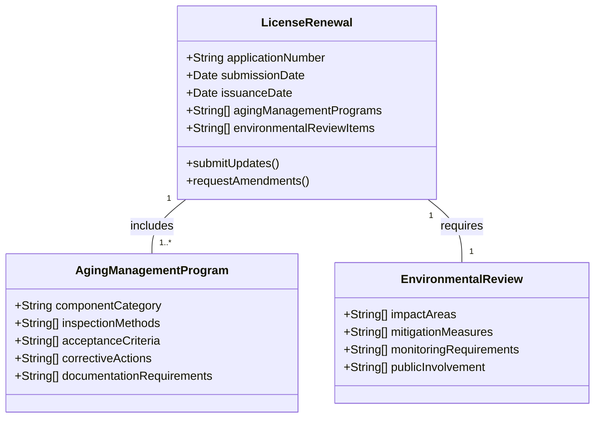

*Figure 11: License Renewal Components and Relationships*

### 6.2 Renewal Process

#### 6.2.1 Key Milestones

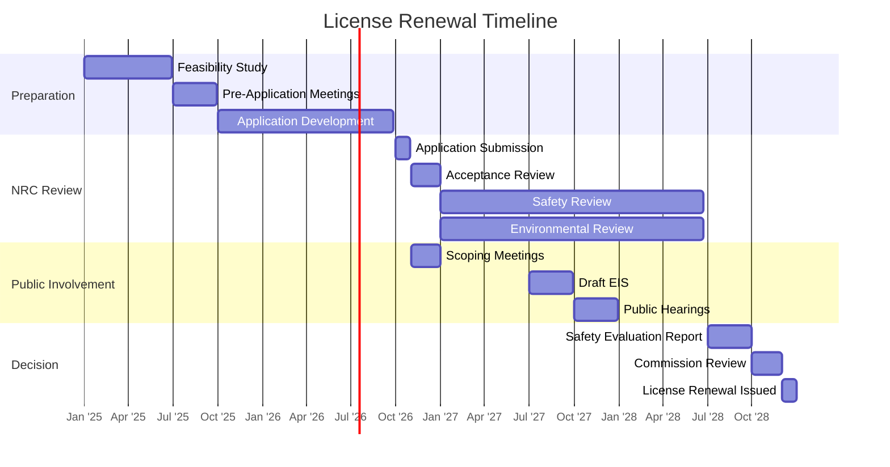

*Figure 12: Typical License Renewal Timeline (30-36 months)*

#### 6.2.2 Application Requirements

| Document | Purpose | Review Timeline |
|----------|---------|-----------------|
| License Renewal Application | Formal request for renewal | 30-60 days for acceptance |
| Updated FSAR | Current safety analysis | 12-18 months |
| Aging Management Programs | Component aging management | 12-18 months |
| Environmental Report | Environmental impact assessment | 18-24 months |
| PRA Update | Current risk assessment | 6-12 months |
| Cyber Security Plan | Digital system protection | 6-12 months |

### 6.3 Aging Management Programs (AMPs)

#### 6.3.1 Key Components
1. **Time-Limited Aging Analyses (TLAAs)**
   - Reactor pressure vessel embrittlement
   - Concrete containment degradation
   - Metal fatigue evaluations
   - Environmental qualification of equipment

2. **Aging Management Review (AMR)**
   - Identification of aging effects
   - Evaluation of current programs
   - Gap analysis
   - Program enhancements

3. **Inspection and Monitoring**
   - Non-destructive examination
   - Condition monitoring
   - Trending and analysis
   - Corrective actions

#### 6.3.2 Common AMPs
- Reactor Vessel Internals
- Reactor Coolant System Piping
- Steam Generators
- Containment Structures
- Electrical Cables
- Instrumentation and Control Systems

### 6.4 Environmental Review

#### 6.4.1 Key Considerations
- **Land Use**: Current and future land use impacts
- **Water Resources**: Thermal discharge, water usage
- **Ecology**: Protected species, habitats
- **Cultural Resources**: Historic properties, tribal concerns
- **Waste Management**: Spent fuel, low-level waste

#### 6.4.2 Mitigation Measures
- Water conservation
- Wildlife protection
- Air quality controls
- Noise reduction
- Visual impact reduction

### 6.5 Safety Review

#### 6.5.1 Scope of Review
- Current licensing basis
- Operating experience
- Design changes
- Safety analyses
- Emergency preparedness

#### 6.5.2 Key Safety Issues
- Reactor pressure vessel embrittlement
- Concrete degradation
- Cable aging
- Environmental qualification
- Fire protection

### 6.6 Subsequent License Renewal (SLR)

#### 6.6.1 Key Differences from Initial Renewal
- More comprehensive aging management
- Additional environmental considerations
- Enhanced material testing
- Updated seismic and flooding hazard analyses

#### 6.6.2 Technical Challenges
- Long-term material degradation
- Obsolescence management
- Knowledge transfer
- Regulatory changes

### 6.7 Case Study: Turkey Point Units 3 & 4

- **Facility**: Turkey Point Nuclear Generating Station
- **Reactors**: 2 x PWR (2,234 MW total)
- **Initial License**: 1972-1973
- **First Renewal**: 2002 (approved for 60 years)
- **Subsequent Renewal**: 2019 (approved for 80 years)

**Key Success Factors**:
- Comprehensive aging management programs
- Proactive component replacement
- Strong regulatory engagement
- Environmental stewardship

**Lessons Learned**:
- Importance of early planning
- Value of component monitoring
- Need for flexible programs
- Benefits of industry collaboration

### 6.8 Best Practices for License Renewal

#### 6.8.1 Project Management
- Early planning (10+ years before expiration)
- Integrated schedule
- Risk management
- Resource allocation

#### 6.8.2 Technical Excellence
- Comprehensive baseline assessments
- Proactive component replacement
- Advanced NDE techniques
- Material sampling and testing

#### 6.8.3 Regulatory Strategy
- Early and frequent NRC engagement
- Pre-application meetings
- Issue resolution
- Public involvement

#### 6.8.4 Knowledge Management
- Documentation of plant modifications
- Operating experience review
- Staff training and qualification
- Lessons learned implementation

### 6.9 Future Considerations

#### 6.9.1 Beyond 80 Years
- Research on very long-term operation
- Advanced materials testing
- Digital twin technologies
- Advanced monitoring techniques

#### 6.9.2 Regulatory Evolution
- Risk-informed regulation
- Performance-based requirements
- International harmonization
- Advanced reactor considerations

## 7. Decommissioning (Up to 60 years after shutdown)

Decommissioning is the process of safely retiring a nuclear power plant after the end of its operational life. This section details the regulatory framework, options, and processes for decommissioning nuclear facilities.

### 7.1 Overview of Decommissioning

#### 7.1.1 Purpose and Objectives
- **Safety First**: Ensure protection of workers, public, and environment
- **Regulatory Compliance**: Meet all NRC and EPA requirements
- **Site Restoration**: Return site to agreed-upon end state
- **Waste Management**: Proper handling of all radioactive materials

#### 7.1.2 Regulatory Framework

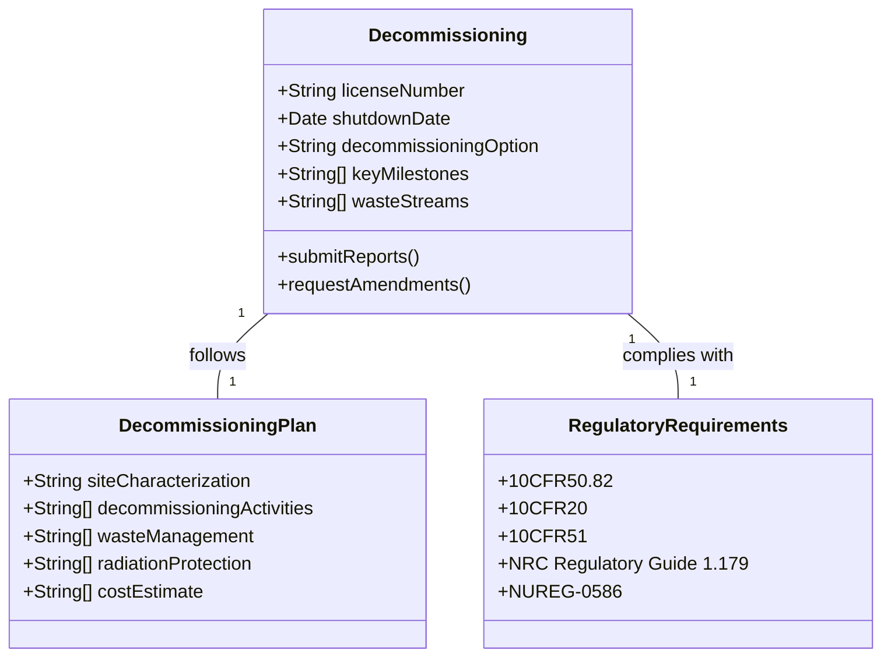

*Figure 13: Decommissioning Components and Relationships*

### 7.2 Decommissioning Options

#### 7.2.1 DECON (Immediate Dismantling)

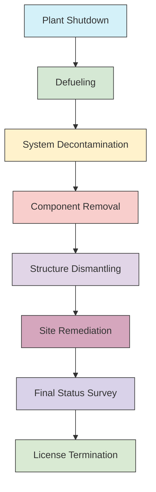

*Figure 14: DECON Process Flow*

- **Timeline**: 5-10 years
- **Key Activities**:
  - Prompt removal of all radioactive components
  - Decontamination of structures
  - Dismantlement of facilities
  - Site restoration
- **Advantages**:
  - Early site release
  - Eliminates long-term surveillance
  - Predictable costs
- **Challenges**:
  - Higher worker exposure
  - Large waste volumes
  - Significant up-front costs

#### 7.2.2 SAFSTOR (Deferred Dismantling)

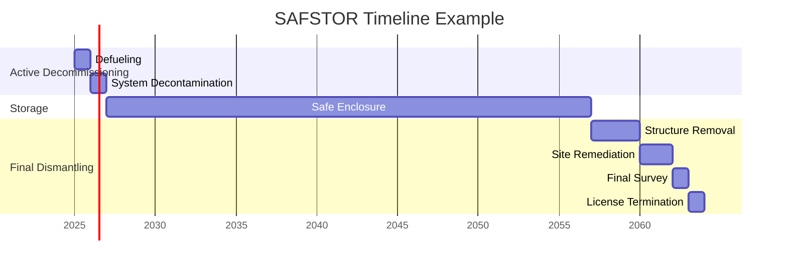

*Figure 15: SAFSTOR Timeline Example*

- **Timeline**: 30-60 years
- **Key Activities**:
  - Initial decontamination
  - Secure storage of structures
  - Reduced site staffing
  - Final dismantlement
- **Advantages**:
  - Lower initial costs
  - Reduced worker exposure
  - Radioactive decay benefits
- **Challenges**:
  - Long-term surveillance
  - Future funding assurance
  - Regulatory uncertainty

#### 7.2.3 ENTOMB (In-Place Disposal)

- **Timeline**: Permanent
- **Key Activities**:
  - Encasement of radioactive components
  - Structural reinforcement
  - Long-term monitoring
- **Advantages**:
  - Minimal immediate risk
  - Lower initial cost
  - Reduced waste transportation
- **Challenges**:
  - Regulatory acceptance
  - Long-term monitoring
  - Limited site reuse
  - Public acceptance

### 7.3 Decommissioning Process

#### 7.3.1 Planning Phase (2-5 years before shutdown)

| Activity | Description | Timeline |
|----------|-------------|----------|
| Feasibility Study | Evaluate decommissioning options | 6-12 months |
| Cost Estimate | Detailed cost projection | 6-12 months |
| Regulatory Strategy | NRC engagement plan | 6-12 months |
| Waste Management Plan | Waste characterization and disposal paths | 6-12 months |
| PSDAR | Post-Shutdown Decommissioning Activities Report | 2 years before shutdown |

#### 7.3.2 Transition Phase (0-2 years after shutdown)
1. **Defueling**
   - Move fuel to spent fuel pool
   - Transfer to dry cask storage
   - Characterize remaining structures

2. **System Decontamination**
   - Chemical decontamination
   - System flushing
   - Contamination control

3. **Waste Characterization**
   - Radiological surveys
   - Material sampling
   - Waste classification

#### 7.3.3 Active Decommissioning (2-10 years)
1. **Component Removal**
   - Non-radioactive systems
   - Contaminated components
   - Reactor vessel segmentation

2. **Structure Dismantling**
   - Contaminated concrete removal
   - Demolition techniques
   - Dust and contamination control

3. **Site Remediation**
   - Soil characterization
   - Excavation of contaminated areas
   - Backfilling and grading

#### 7.3.4 License Termination (1-2 years)
1. **Final Status Survey**
   - Confirm cleanup criteria met
   - Independent verification
   - NRC review

2. **Documentation**
   - Final radiation survey report
   - Waste disposition records
   - As-built drawings

3. **NRC Review**
   - Confirm compliance
   - Public comment period
   - License termination

### 7.4 Regulatory Requirements

#### 7.4.1 Key Regulations
- **10 CFR 50.82**: Termination of license
- **10 CFR 20.1402**: Radiological criteria for license termination
- **10 CFR 51.53**: Environmental report requirements
- **NUREG-1757**: Consolidated NMSS Decommissioning Guidance

#### 7.4.2 Key Submittals
1. **PSDAR** (Post-Shutdown Decommissioning Activities Report)
   - Decommissioning approach
   - Schedule
   - Environmental impacts
   - Cost estimate

2. **LTP** (License Termination Plan)
   - Site characterization
   - Final survey plan
   - Waste management
   - Dose assessment

3. **FSS** (Final Status Survey)
   - Survey design
   - Sampling plan
   - Data analysis
   - Compliance demonstration

### 7.5 Cost Estimation and Funding

#### 7.5.1 Cost Components
- **Pre-Decommissioning** (5-10%)
  - Planning and engineering
  - Regulatory compliance
  - Waste characterization

- **Active Decommissioning** (60-70%)
  - Labor and equipment
  - Waste packaging and disposal
  - Site remediation

- **Post-Decommissioning** (20-30%)
  - License termination
  - Site restoration
  - Contingency

#### 7.5.2 Funding Mechanisms
- **External Funds**
  - Nuclear decommissioning trust (NDT)
  - Surety bonds
  - Letters of credit

- **Financial Assurance**
  - Annual reporting
  - Independent audits
  - NRC oversight

### 7.6 Case Study: Maine Yankee Decommissioning

- **Facility**: Maine Yankee Nuclear Power Plant
- **Type**: PWR (900 MWe)
- **Operation**: 1972-1996
- **Decommissioning**: 1997-2005
- **Cost**: $635 million (actual)

**Key Success Factors**:
- Early planning
- Strong project management
- Effective waste management
- Stakeholder engagement

**Lessons Learned**:
- Importance of accurate cost estimation
- Value of early waste characterization
- Need for regulatory flexibility
- Benefits of technology innovation

### 7.7 Emerging Technologies and Approaches

#### 7.7.1 Advanced Dismantling Techniques
- Robotic demolition
- Laser cutting
- High-pressure water jetting
- Diamond wire sawing

#### 7.7.2 Waste Minimization
- Advanced decontamination
- Material clearance
- Recycling and reuse
- Volume reduction

#### 7.7.3 Regulatory Innovations
- Risk-informed regulation
- Alternative cleanup criteria
- License termination options
- Stakeholder involvement

### 7.8 Best Practices

#### 7.8.1 Project Management
- Integrated project controls
- Risk management
- Change control
- Performance metrics

#### 7.8.2 Stakeholder Engagement
- Public involvement
- Regulatory interface
- Community outreach
- Transparency

#### 7.8.3 Knowledge Management
- Document control
- Lessons learned
- Knowledge transfer
- Historical records

#### 7.8.4 Safety Culture
- Worker protection
- Radiation safety
- Industrial safety
- Emergency preparedness

## 8. International Licensing Approaches

This section provides a comparative analysis of nuclear licensing frameworks across different countries, highlighting key similarities, differences, and emerging trends in international nuclear regulation.

### 8.1 Comparative Framework

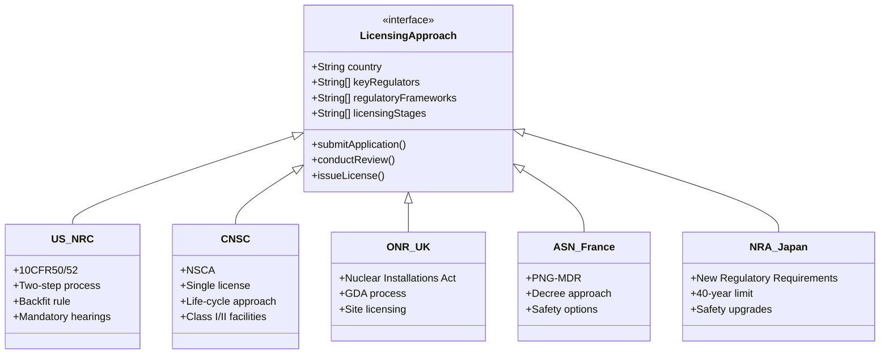

*Figure 21: International Licensing Approach Class Diagram*

### 8.2 United States (NRC)

#### 8.2.1 Regulatory Framework
- **Primary Laws**: Atomic Energy Act, Energy Reorganization Act
- **Key Regulations**: 10 CFR 50, 10 CFR 52, 10 CFR 100
- **Governing Body**: Nuclear Regulatory Commission (NRC)

#### 8.2.2 Licensing Process

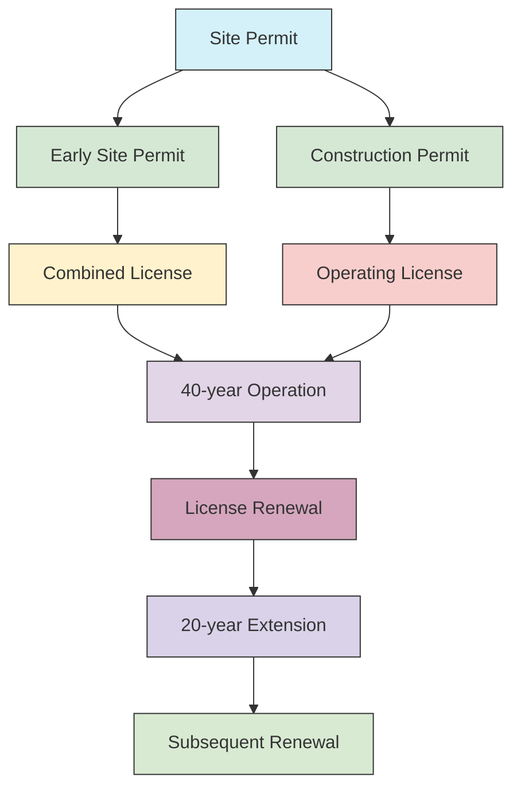

*Figure 22: US NRC Licensing Process Flow*

#### 8.2.3 Key Features
- **Two-Step Process**: Construction Permit + Operating License (CP/OL) or Combined License (COL)
- **Design Certification**: Separate certification for reactor designs (e.g., AP1000, ESBWR)
- **Backfit Rule**: Requires cost-benefit analysis for new safety requirements
- **Mandatory Hearings**: Public participation in licensing decisions
- **Influence**: Model for many other countries' regulatory frameworks

### 8.3 Canada (CNSC)

#### 8.3.1 Regulatory Framework
- **Primary Law**: Nuclear Safety and Control Act (NSCA)
- **Key Regulations**: Class I and II Nuclear Facilities Regulations
- **Governing Body**: Canadian Nuclear Safety Commission (CNSC)

#### 8.3.2 Licensing Process

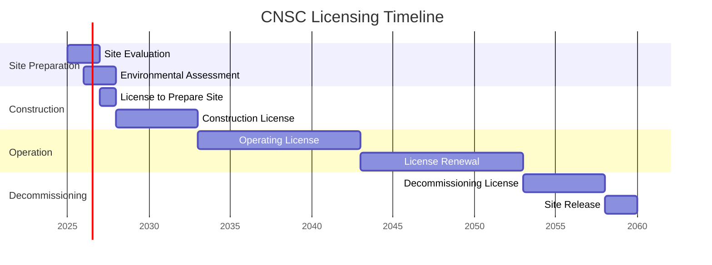

*Figure 23: Canadian Nuclear Licensing Timeline*

#### 8.3.3 Key Features
- **Single License**: Integrated approach covering all lifecycle phases
- **Life-Cycle Approach**: Single environmental assessment for all phases
- **Class I/II Facilities**: Different requirements based on hazard potential
- **Indigenous Consultation**: Strong emphasis on engagement with Indigenous communities
- **Peer Reviews**: International peer reviews of major projects

### 8.4 United Kingdom (ONR)

#### 8.4.1 Regulatory Framework
- **Primary Laws**: Energy Act 2013, Nuclear Installations Act 1965
- **Key Guidance**: Safety Assessment Principles (SAPs)
- **Governing Body**: Office for Nuclear Regulation (ONR)

#### 8.4.2 Generic Design Assessment (GDA)

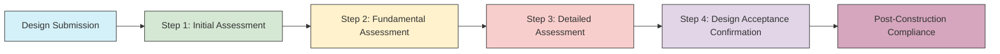

*Figure 24: UK GDA Process Flow*

#### 8.4.3 Key Features
- **GDA Process**: Separate design assessment before site-specific licensing
- **Nuclear Site Licensing**: Separate from design approval
- **Funded Regulator**: Industry funds regulatory activities
- **Security Vetting**: Stringent personnel security requirements
- **International Collaboration**: Active in MDEP and other international forums

### 8.5 France (ASN)

#### 8.5.1 Regulatory Framework
- **Primary Laws**: TSN Act, Environmental Code
- **Key Framework**: PNG-MDR (National Radioactive Materials and Waste Management Plan)
- **Governing Body**: Autorité de sûreté nucléaire (ASN)

#### 8.5.2 Key Features
- **Decree System**: Reactors authorized by government decree
- **Safety Options**: Early identification of safety options
- **Public Inquiries**: Mandatory public consultations
- **Periodic Safety Reviews**: Every 10 years for operating reactors
- **Waste Management**: Strong focus on fuel cycle facilities

### 8.6 Japan (NRA)

#### 8.6.1 Post-Fukushima Reforms
- **New Regulatory Requirements**: Enhanced safety standards
- **40-year Limit**: In principle, with possible 20-year extension
- **Safety Upgrades**: Required for continued operation
- **Emergency Preparedness**: Strengthened requirements

#### 8.6.2 Licensing Process
1. **Safety Assessment**: Against new regulatory requirements
2. **Public Comment**: Mandatory public participation
3. **Local Consent**: Required from host communities
4. **Periodic Reviews**: Every 13 months for operational safety

### 8.7 Comparative Analysis

| Country | Regulator | Key Feature | License Term | Public Participation |
|---------|-----------|-------------|--------------|----------------------|
| USA | NRC | Two-step process | 40+20+20 years | Mandatory hearings |
| Canada | CNSC | Single license | 10 years renewable | Indigenous consultation |
| UK | ONR | GDA process | Indefinite | Public inquiries |
| France | ASN | Decree system | 10 years | Public debates |
| Japan | NRA | 40-year limit | 40+20 years | Local consent |

### 8.8 Emerging Trends

#### 8.8.1 Harmonization Efforts
- **MDEP**: Multinational Design Evaluation Programme
- **WENRA**: Western European Nuclear Regulators' Association
- **INRA**: International Nuclear Regulators' Association

#### 8.8.2 New Build Challenges
- First-of-a-kind engineering (FOAKE) costs
- Supply chain constraints
- Skilled workforce availability
- Public acceptance

#### 8.8.3 Advanced Reactors
- Risk-informed regulation
- Graded approach
- Performance-based requirements
- Digital I&C considerations

### 8.9 Best Practices in International Licensing

#### 8.9.1 Regulatory Cooperation
- Information sharing
- Technical working groups
- Joint reviews
- Staff exchanges

#### 8.9.2 Industry Engagement
- Early and frequent interaction
- Pre-application meetings
- Guidance development
- Technical workshops

#### 8.9.3 Continuous Improvement
- Operating experience feedback
- Regulatory research
- International benchmarking
- Stakeholder feedback

## 9. Best Practices

### 9.1 Early Engagement
- Pre-application meetings
- Regulatory engagement plan
- Early identification of key issues

### 9.2 Documentation Management
- Document control system
- Revision tracking
- Regulatory correspondence log

### 9.3 Quality Assurance
- 10 CFR 50 Appendix B
- ASME NQA-1
- ISO 9001

## 10. Common Challenges

### 10.1 Technical Issues
- Design changes during construction
- ITAAC closure issues
- PRA modeling challenges

### 10.2 Regulatory Challenges
- Evolving requirements
- Inspection findings
- Enforcement actions

## 11. Resources
1. NUREG-1555: Standard Review Plans
2. RG 1.206: Combined License Applications
3. IAEA SSG-12: Licensing Process
4. MDEP Common Position Documents
5. WENRA Reference Levels
