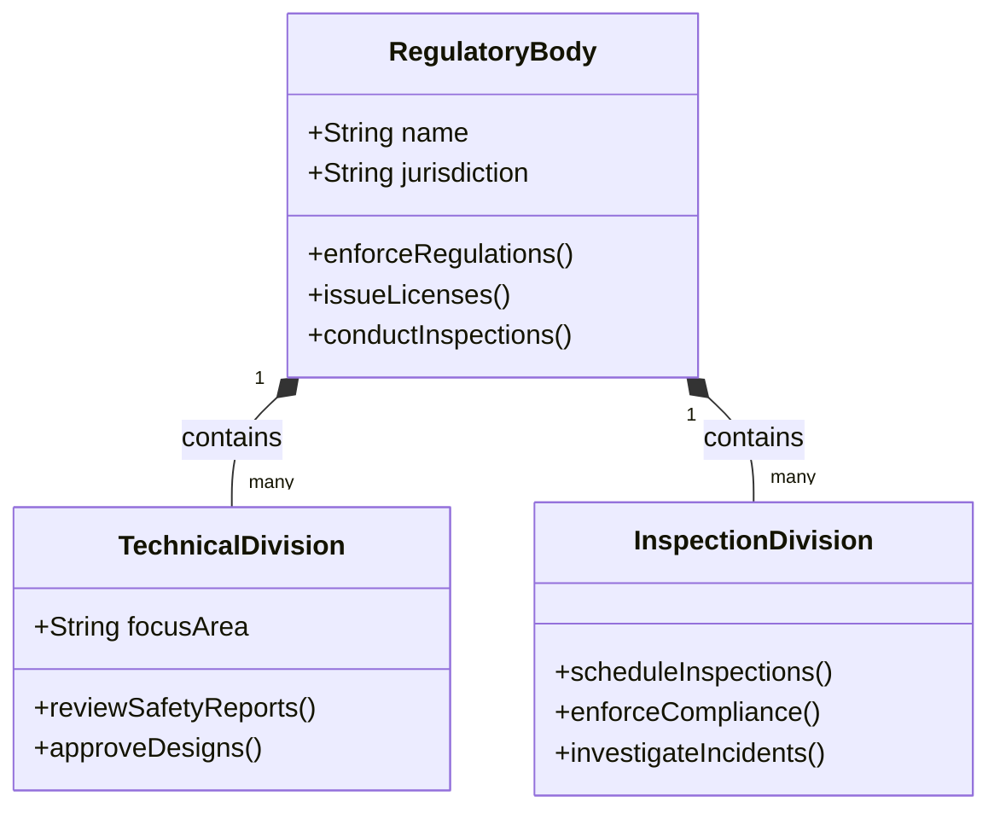
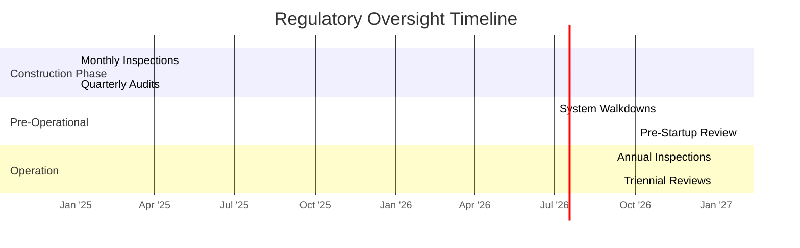

# Regulatory Framework

This document outlines the regulatory framework governing nuclear facility licensing and compliance, including national and international standards that form the basis for nuclear safety and security.

## 1. National Regulatory Framework

### 1.1 Primary Legislation
- **Atomic Energy Act** (or equivalent national legislation)
- **Energy Reorganization Act**
- **National Environmental Policy Act (NEPA)**
- **Nuclear Waste Policy Act**

### 1.2 Regulatory Body Structure

*Figure 1: Regulatory Body Organizational Structure*

## 2. International Standards

### 2.1 IAEA Safety Standards
- **Safety Fundamentals (SF-1)**: Fundamental Safety Principles
- **General Safety Requirements (GSR)**: Mandatory requirements
- **Safety Guides (GSG)**: Recommendations for meeting requirements
- **Safety Reports**: Practical examples and detailed methods

### 2.2 Key Conventions
- **Convention on Nuclear Safety**
- **Joint Convention on Safety of Spent Fuel Management**
- **Convention on Early Notification of a Nuclear Accident**
- **Convention on Assistance in Case of a Nuclear Accident**

## 3. Regulatory Process

### 3.1 Licensing Stages
1. **Site Permit**
   - Site evaluation
   - Environmental impact assessment
   - Public hearings

2. **Construction License**
   - Preliminary Safety Analysis Report (PSAR)
   - Environmental Report
   - Design certification

3. **Operating License**
   - Final Safety Analysis Report (FSAR)
   - Emergency Preparedness Plan
   - Operator training and certification

4. **Periodic Safety Reviews**
   - 10-year review cycle
   - Aging management programs
   - License renewal process

### 3.2 Regulatory Oversight Activities

*Figure 2: Regulatory Oversight Activities*

## 4. Compliance Requirements

### 4.1 Safety Analysis Reports
- Site characteristics
- Design basis analysis
- Accident analysis
- Radiological consequences

### 4.2 Technical Specifications
- Safety limits
- Operating limits
- Surveillance requirements
- Design features

### 4.3 Quality Assurance
- 10 CFR 50 Appendix B
- ASME NQA-1
- ISO 19443

## 5. International Cooperation

### 5.1 Peer Reviews
- IRRS (Integrated Regulatory Review Service)
- EPREV (Emergency Preparedness Review)
- ARTEMIS (Integrated Review Service for Radioactive Waste and Spent Fuel Management)

### 5.2 Bilateral Agreements
- Regulatory cooperation
- Technical exchanges
- Emergency response coordination

## 6. Emerging Regulatory Issues
- Advanced reactor technologies
- Digital I&C systems
- Cybersecurity requirements
- Climate change considerations

## 7. References
1. IAEA Safety Standards Series
2. NRC Regulatory Guides
3. WENRA Reference Levels
4. MDEP Common Positions
5. National Regulatory Requirements
